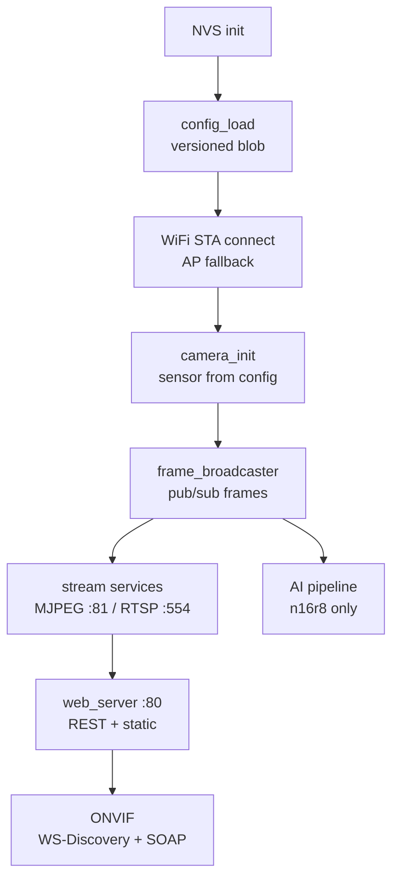
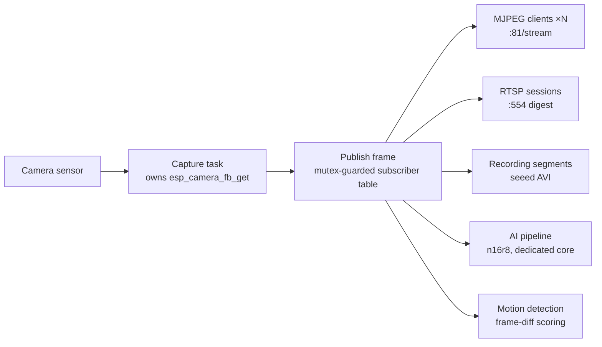

# ESP-Cam Unified Architecture: One Stack, Four Boards

The four firmwares are not one codebase with four build targets — they are **four repositories sharing one set of architectural conventions**. Every repo uses a flat `main/` layout, one `.c/.h` pair per subsystem, and `main.c` running a numbered boot sequence. This page documents the conventions; open any repo's `main/` afterwards and it should map 1:1.

## Boot Sequence

Every `app_main()` follows the same skeleton: NVS → config → WiFi → camera → frame broadcaster → stream services → web → protocol layers. The numbered boot-step log is the family-wide troubleshooting entry point.



Two board-specific wrinkles worth knowing:

- **ai-thinker (original ESP32)**: the camera must initialize *after* the STA connects — initializing it first triggers a DMA freeze (hardware constraint of that platform).
- **ai-thinker SD format**: GPIO14 is a shared camera/SD bus; formatting at runtime deadlocks, so it goes through "request → reboot → format at boot (before camera init)".

## Frame Broadcaster: The Source of Every Data Flow

The core abstraction is a **publisher/subscriber frame broadcaster** (`frame_broadcaster.c`): one capture task owns the camera and pushes JPEG frames to all subscribers. MJPEG streaming, RTSP, recording, AI detection and motion detection are all subscribers — none of them contend for the camera.



This design dictates two family behaviors:

1. **Zero-copy fan-out to N clients** — the viewer limit is purely a memory decision (1/2/2/3 per board, exposed as `stream_clients_max` in `GET /api/status`).
2. **Hot reconfiguration must be coordinated** — resolution/quality changes go through "stop subscribers → rebuild camera → restart broadcaster". PSRAM boards can do this live; no-PSRAM boards (luatos, ai-thinker) instead do "save → ack → reboot app after 1s", because with a single framebuffer a hot reinit racing concurrent frame grabs is fatal.

## Streaming Stack: Three Layers

| Layer | Implementation | Notes |
|--------|----------------|-------|
| Browser preview | `:81/stream` MJPEG | Separate TCP server (isolated from the :80 httpd), `multipart/x-mixed-replace`, 503 when full |
| Standard clients | `:554/stream` RTSP | n16r8 / seeed only; **digest auth mandatory** (401 on bad credentials) |
| NVR discovery | ONVIF WS-Discovery + SOAP | UDP 3702 multicast + `:80/onvif/*_service`; all four boards |

The separate MJPEG port is deliberate: the httpd socket table and worker pool are tiny, and long-lived video connections would starve the management UI.

## Web Service & Health Self-Heal

Port `:80` (esp_http_server) hosts the REST API + ONVIF SOAP + SPIFFS static fallback. Three defense layers keep it alive:

1. **Per-session**: every accepted connection gets `TCP_NODELAY` (small writes never wait on Nagle) + socket keepalive (zombies detected in ~11s, freeing the socket table).
2. **Probe**: the health monitor sends a real HTTP GET to `127.0.0.1:80` every 10s (a plain TCP connect is not enough — lwIP completes the handshake even when httpd workers are stuck). Six consecutive failures trigger a recovery reboot; failures while **WiFi is down do not count**, so "network gone" is never misread as "device dead".
3. **Capacity**: lwIP sockets raised to 16–24, TCP MSL cut to 15s (TIME_WAIT recycled in 30s). This defeats the EMFILE reboot loop where SPA reconnect storms exhaust the default 10-socket table — see [knowledge base PIT-001](espcam-kb.md).

## Device Identity & Config Persistence

- **Identity** (`device_id.c`): serial = factory eFuse MAC (12 hex); ONVIF UUID = fixed prefix + the same MAC. Read once, cached — eFuse does not depend on WiFi state and survives reflashes, so AP mode, early boot and NVR integrations all see the same stable ID.
- **Config** (`config_manager.c`): versioned NVS blobs (n16r8 stores per-key) with magic + version; mismatch auto-resets to factory defaults — **bump the version whenever the config struct changes**. WiFi credential changes are saved to NVS and applied on reboot.

## Core Allocation (S3 Boards)

| Core | Tasks |
|------|-------|
| Core 0 | WiFi stack, httpd, main loop, LEDs, AT commands |
| Core 1 | Frame capture, AI pipeline (n16r8: 24KB stack, 640×480 grayscale buffers in PSRAM) |

The original ESP32 (ai-thinker) has no such clean split — its DMA/camera constraints dictate the "WiFi first, camera second" order, and everything else shares a core with the WiFi stack.

## Repository Layout Conventions

```
main/
├── main.c              # numbered boot sequence
├── wifi_manager.c/.h   # STA/AP, reconnect, dual-WiFi (ai-thinker)
├── camera_driver.c/.h  # sensor init/reconfig (board pin table lives here)
├── frame_broadcaster.c/.h
├── mjpeg_streamer.c/.h # :81 standalone TCP server
├── web_server.c/.h     # :80 REST + static fallback
├── onvif_service.c/.h  # SOAP endpoints
├── onvif_discovery.c/.h# WS-Discovery
├── config_manager.c/.h # NVS versioned blob
├── device_id.c/.h      # eFuse identity
├── health_monitor.c/.h # self-heal probe
└── web_ui/             # frontend assets, packed into SPIFFS at build time
```

cJSON is vendored (do not edit). Upstream `managed_components/` changes must go through `patches/` (n16r8 pattern) or vendoring into `components/` (seeed pattern) — never hand-edit the managed copy.

Related: [Unified API design](espcam-api.md) · [Unified frontend design](espcam-webui.md) · [Knowledge base](espcam-kb.md)
