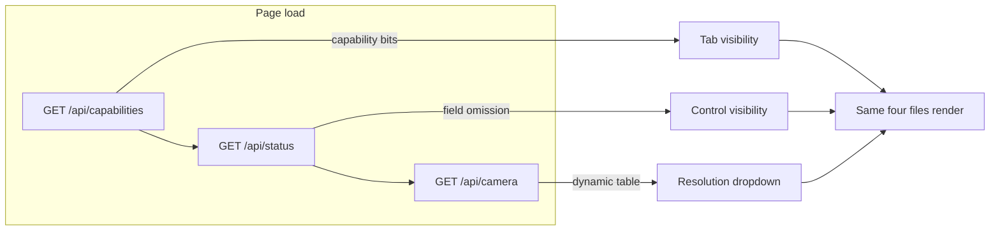
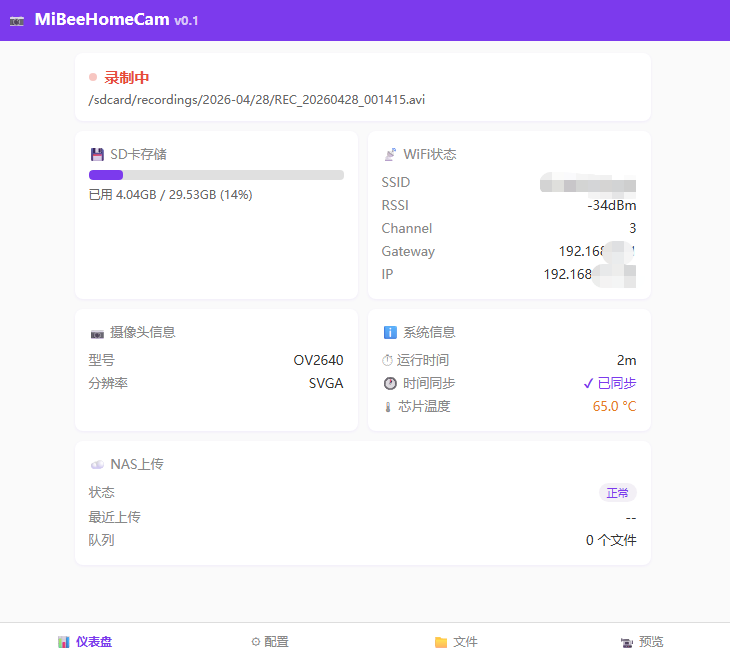
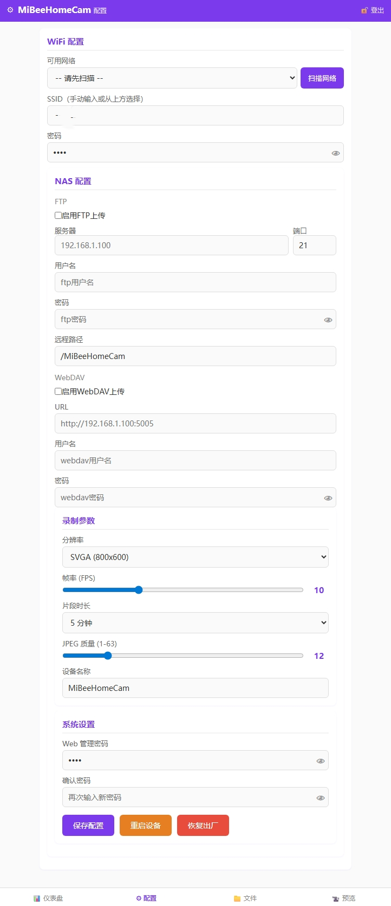
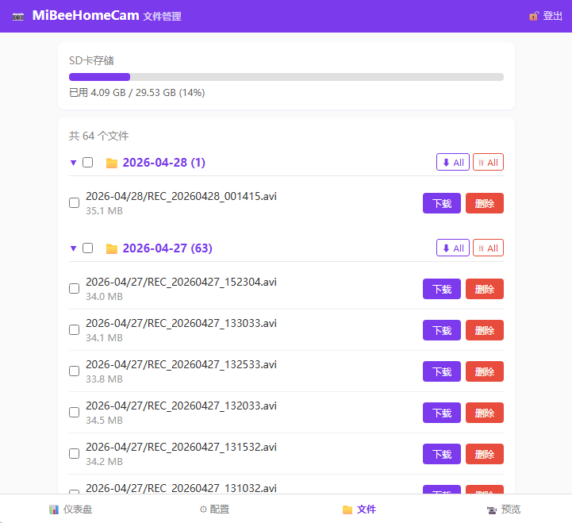

# ESP-Cam Unified Frontend Design

The four boards run two frontend shapes: the three S3 boards share **one single-page application (SPA)**, and ai-thinker keeps a **lightweight multi-page application (MPA)** — but both speak the same contract layer. The premise for any page working on any board is identical: **capability probing + field omission**, never per-board hardcoding.

## SPA: Single Source, Four-File Discipline

`main/web_ui/` — four files make up the whole frontend:

| File | Role |
|---|---|
| `index.html` | Page skeleton (preview/storage/settings tabs) |
| `app.js` | All logic: status polling, stream management, forms, batch ops |
| `i18n.js` | Bilingual (zh/en) dictionary and switching |
| `style.css` | Styling |

**The md5 of these four files must be identical across the three repos.** Single source, sync after every change, no per-board forks — this became a hard rule after one repo's solo edit silently dropped another board's feature. All board differences come from three runtime sources:

1. `GET /api/capabilities` — feature-level switches (no `sd` capability ⇒ no storage tab)
2. Field omission in `GET /api/status` / `GET /api/config` — a missing field hides its control (`wifi_ssid_2` only exists on dual-WiFi boards)
3. `supported_resolutions` from `GET /api/camera` — the sole source for the resolution dropdown

Two implementation gotchas:

- **n16r8 `POST /api/config` uses a whitelist**: never send keys that were absent from the GET response, or the save fails outright. "Hide the control" therefore also means "omit the field from the request body".
- **The MJPEG `` self-healing reconnect is deliberate**: a kicked viewer reconnects within ~7s and reclaims its slot after device reboots. A steady connect/kick cycle in the logs is normal behavior, not a leak.

## MPA: ai-thinker's Lightweight Choice

The original ESP32 has no PSRAM and often marginal WiFi — pulling the full SPA bundle on first paint is slower there. ai-thinker therefore keeps a multi-page app (`index/preview/config/files/setup`, inlined CSS), each page carrying only its own script.

The cost is contract discipline instead of shared code: the MPA follows the unified contract (v1.2-aligned: dual-WiFi form, SD batch management, format flow, storage status fields), but its layout and interactions need not match the SPA.

## Auth UX (both frontends)

- Password stored in `sessionStorage`; writes automatically attach `X-Password`
- 401 routes the user to the system page; first use pre-validates via `GET /api/auth`
- Change-password modal: old + new + confirm (the server verifies the old one implicitly)

## Build Coupling (frontend changes require a reflash)

Frontend assets are packed into the SPIFFS partition **at build time** — HTML/JS/CSS changes need a rebuild + reflash; a browser hard-refresh does nothing (the server already sends no-cache headers). Each repo's CMake declares explicit per-file `DEPENDS` for the spiffs image (directory-level dependencies do not trigger on content edits — a family-wide trap).

Remote UI updates go through the OTA spiffs endpoint (see [Unified API](espcam-api.md)); success is verified by the device's `/app.js` md5 matching the repo file.

## Screenshots

Main dashboard:

Preview (live MJPEG):

Configuration (fields shown/hidden per board):

Storage (SD browsing, batch delete, format):

Related: [Unified API design](espcam-api.md) · [Unified architecture](espcam-architecture.md)
