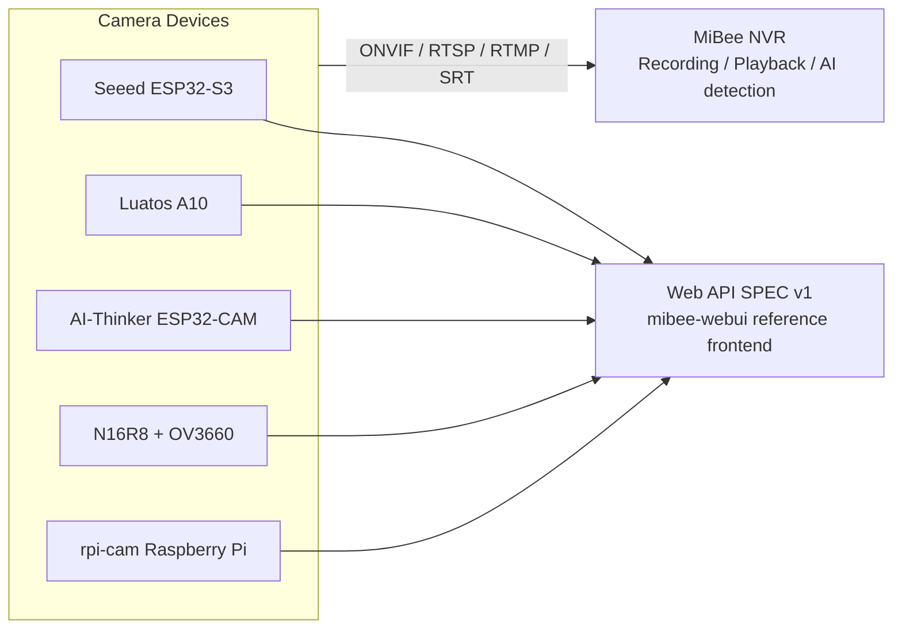

# MiBeeCam Camera Family Overview

MiBeeCam is Mi&Bee Studio's self-hosted camera product line: from a few dollars' ESP32-CAM to a Raspberry Pi software camera, covering surveillance, AI detection, and recording upload. This unified documentation hub consolidates the **user manuals and knowledge bases of every camera project** in one place.

## Family Members

| Project | Platform / Sensor | Key Capabilities | Positioning |
|---------|-------------------|------------------|-------------|
| Seeed XIAO ESP32-S3 Sense | ESP32-S3 + OV2640 | MJPEG streaming, AVI segmented recording, automatic NAS upload | Balanced surveillance cam |
| Luatos ESP32-S3 A10 | ESP32-S3 core board | MJPEG, motion detection, web config, AT commands | Compact smart cam |
| AI-Thinker ESP32-CAM | Classic ESP32-CAM | MJPEG, motion detection, file manager, OTA, REST | Low-cost entry |
| ESP32-S3-N16R8 | ESP32-S3 + OV3660 3MP | RTSP (digest), ONVIF discovery, face/motion/QR detection | HD + standard protocols |
| rpi-cam | Raspberry Pi (Go) | ONVIF Device/Media/PTZ/Imaging, RTSP, RTMP push, WS-Discovery | Raspberry Pi software camera |

## Ecosystem

All cameras share the same **unified Web API SPEC v1** and the zero-build reference frontend (mibee-webui), and feed into MiBee NVR for unified recording and management:

## Choosing a Camera

- **Lowest-cost entry**: AI-Thinker ESP32-CAM — mature ecosystem, extensive notes (including hard-won lessons).
- **Daily surveillance**: Seeed XIAO ESP32-S3 Sense — plenty of PSRAM, recording + NAS upload out of the box.
- **Standard protocols (RTSP/ONVIF)**: ESP32-S3-N16R8 — 3MP image quality, discoverable by NVR/VMS.
- **Have a Raspberry Pi**: rpi-cam turns it into a compliant ONVIF camera.
- **Recording platform**: see [Integrating with MiBee NVR](nvr-integration.md) for every model.

## Knowledge Base Highlights

Deep-dive technical articles are consolidated here as well:

- [Port Separation Design: Why MJPEG Streaming Runs on a Separate Port](seeed-port-separation-design.md)
- [ESP32-CAM / ESP-IDF: Constraints You Can't Code Around](aicam-esp32-cam-performance.md)
- [rpi-cam ONVIF Compliance](rpicam-onvif-compliance.md)
- [Camera Web API Unified SPEC v1](webui-spec.md) (Chinese)

> Going forward, each project repository maintains its documentation exclusively in this unified hub (with redacted screenshots and mermaid diagrams); this page keeps improving as contributions land.
