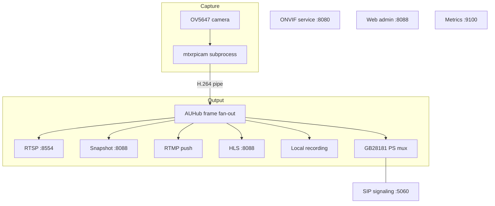

# System Architecture

[中文](https://github.com/Mi-Bee-Studio/mibee-eye-raspi-go/blob/main/docs/zh/architecture.md)

MiBee Eye is a lightweight Go application providing ONVIF-compliant camera services for single-board computers (Raspberry Pi, Banana Pi, Orange Pi). A single process hosts capture, RTSP/RTMP/HLS/GB28181 output, local recording, and the web admin UI, at roughly 20MB RAM overall (measured on a Raspberry Pi 3B).

> This page describes the **Go edition**. For the Rust edition (closed-source release), its architecture differences, and the open-source boundary, see [Rust Edition](rpicam-rs.md).
## Component Architecture

All output faces share the same H.264 access-unit stream (AUHub fan-out); ONVIF, web admin, and metrics are separate HTTP port faces; GB28181 additionally has its own SIP signaling channel beside the media face.

## Key Components

### ONVIF Server (`internal/onvif/server.go`)

The ONVIF server implements a single-endpoint SOAP framework handling multiple ONVIF services:

- **Service Routing**: All SOAP actions dispatched to `/onvif/device_service`
- **Authentication**: WS-Security UsernameToken digest authentication
- **WS-Discovery**: Supports both UDP multicast and HTTP probe requests
- **SOAP Processing**: XML envelope parsing, action routing, fault handling
- **Configuration**: Interface-based config provider for auth and media parameters

Services implemented:

- **Device**: Device information, capabilities, WS-Discovery
- **Media**: Profiles, stream URI, snapshot access
- **Imaging**: Camera parameter control (brightness, contrast, etc.)

### Camera Subsystem (`internal/camera/camera.go`)

Camera capture supports three modes (configurable via `camera.mode`):

**mtxrpicam mode (default)**: Uses MediaMTX's proven `mtxrpicam` C binary (from [mediamtx-rpicamera](https://github.com/bluenviron/mediamtx-rpicamera)) via subprocess. It bundles its own `libcamera.so.9.9` to avoid version conflicts with system libcamera.

**rpicamvid mode**: Captures with the system-installed `rpicam-vid`, suited to deployments that manage the libcamera version centrally.

**rtsp mode**: Consumes an external RTSP URL for testing without camera hardware (RTSPSource implementation in `internal/camera/`).

For mtxrpicam mode:

- **Pipe Protocol**: 4-byte LE framed protocol (config and video frames)
- **Subprocess Isolation**: Spawned with `Setpgid=true` for signal isolation
- **Parameter Control**: Real-time camera parameter updates via config pipe
- **Error Handling**: Process monitoring and graceful shutdown

Required files in `deploy/bin/`: `mtxrpicam`, `libcamera.so.9.9`, `libcamera-base.so.9.9`, `ipa_module/ipa_rpi_vc4.so`, `ipa_module/ipa_rpi_vc4.so.sign`, `libpisp/backend_default_config.json`, `ipa_conf/`. `LD_LIBRARY_PATH` must include `deploy/bin/` so mtxrpicam finds the bundled libcamera.

### H.264 AUHub (`internal/h264/hub.go`)

AUHub provides frame distribution to multiple consumers with fan-out pattern:

- **Thread Safety**: Internal mutex for concurrent subscriber management
- **Non-blocking Delivery**: Drops frames to prevent writer blocking
- **Subscriber Management**: Automatic cleanup on context cancellation
- **Access Unit Format**: H.264 access units with timestamp and keyframe detection

Consumers include: the RTSP server, snapshot handler, RTMP push, the HLS server, local recording, and GB28181 PS muxing.

### RTSP Server (`internal/rtsp/server.go`)

RTSP server built on `gortsplib v5` for H.264 streaming:

- **Protocol Support**: RTSP 1.0 with DESCRIBE, SETUP, PLAY commands
- **Authentication**: Optional digest authentication for stream access
- **On-demand Streaming**: Starts frame consumption only when clients connect
- **Media Description**: Dynamic H.264 format with SPS/PPS updates
- **Timestamp Synchronization**: NTP-adjusted timestamps for accurate playback

Digital PTZ was removed as dead code (never wired to the camera).

### GB28181 Device Side (`internal/gb28181/`)

The GB28181 device side implements SIP registration and keep-alive, Catalog / DeviceInfo / RecordInfo responses, and PS-over-RTP streaming (UDP/TCP) for live and playback/download sessions. Signaling builds on the [gb28181-go](https://github.com/mickeyzzc/gb28181-go) library; media muxing reuses the AUHub frame stream. See [GB28181 Integration](rpicam-gb28181.md).

### Local Recording (`internal/recording/`)

Continuous recording writes bare H.264 segment files into day/hour directories and maintains an append-only `index.jsonl`, which feeds GB28181 RecordInfo queries and playback/download; pruning runs by retention days and storage cap.

### HLS Server (`internal/hls/server.go`)

HLS Server provides live streaming via pure Go MPEG-TS segmenter:

- **Pure Go Implementation**: MPEG-TS segmenter in `internal/hls/muxts.go` (no subprocess)
- **In-Memory Segments**: Segments kept in memory, no .ts files written to disk
- **HTTP Serving**: Serves .m3u8 playlist and .ts segments via HTTP endpoints
- **Configuration**: Configurable `segment_duration` (default 2s) and playlist size
- **Integration**: Consumes H.264 frames directly from AUHub

### Web UI Server (`internal/web/web.go`)

Web UI Server provides browser-based camera management interface:

- **Authentication**: Session cookie + CSRF double submit (`/api/auth/*`, unified Web API spec v1)
- **i18n Support**: English/Chinese language switching
- **Themes**: Dark/light theme preferences
- **Video Player**: MSE (Media Source Extensions) for sub-second latency preview, plus HLS (hls.js) for compatibility
- **Camera Controls**: Real-time brightness, contrast, saturation, sharpness adjustment
- **Snapshot**: JPEG capture with download capability
- **Events**: SSE event channel (`/api/events`) pushing live updates such as parameter changes
- **Server Config**: Configuration viewer and editor with ONVIF credentials management

The full endpoint contract is in the [unified Web API specification](webui-spec.md).

## Data Flow Pipeline

1. **Capture**: mtxrpicam subprocess captures frames from OV5647 CSI camera
2. **Transport**: H.264 data transferred via binary pipe to Go process
3. **Processing**: Parser extracts NALUs and timestamps, detects keyframes
4. **Distribution**: AUHub fans out access units to multiple consumers
5. **Streaming**: RTSP server serves video via gortsplib to NVR clients
6. **Snapshot**: Dual-tier strategy — tries rpicam-still JPEG capture (3s timeout), falls back to raw H.264 IDR frame
7. **Control**: ONVIF services provide camera control and discovery
8. **HLS**: Pure Go MPEG-TS segmenter produces in-memory segments for browser playback
9. **Recording and GB28181**: local recording writes H.264 segments plus an `index.jsonl` index; GB28181 muxes the same frame stream into PS for the platform

## Resource Usage

Measured on Raspberry Pi 3B at 720p@15fps:

| Process | RSS Memory | Purpose |
|---------|------------|---------|
| MiBee Eye | ~9MB | Go main process (ONVIF + RTSP + pipeline) |
| mtxrpicam | ~10MB | Camera capture subprocess |
| **Total** | **~19MB** | HLS/recording add a few MB (in-memory segment buffers) |

- **CPU**: ~2% for MiBee Eye, ~12% for mtxrpicam at 720p@15fps
- **Network**: ~2Mbps for 720p@15fps H.264 stream

## Dependencies

- **gortsplib v5**: RTSP server functionality (same library as MediaMTX)
- **pion/rtp**: RTP packet handling for H.264 streaming
- **yaml.v3**: Configuration file parsing
- **onvif-go/v2**: ONVIF server implementation (self-maintained library [mickeyzzc/onvif-go/v2](https://github.com/mickeyzzc/onvif-go))
- **gb28181-go**: GB28181 device-side signaling ([mickeyzzc/gb28181-go](https://github.com/mickeyzzc/gb28181-go))
- **mtxrpicam**: Camera capture subprocess with bundled libcamera (from bluenviron/mediamtx-rpicamera v2.6.0)

## Deployment Architecture

The system runs as a single systemd service with:

- **Process Isolation**: Camera capture in subprocess, main service in Go process
- **Resource Usage**: ~20MB RAM measured on SBCs
- **Cross-compilation**: Build from x86 workstation to aarch64 RPi
- **Configuration**: YAML-based config with environment variable overrides
- **Monitoring**: Prometheus metrics for operational visibility

### Camera Capture Dependencies

| Component | Type | Size | Purpose |
|-----------|------|------|---------|
| mtxrpicam | C binary (arm64) | 1.7MB | Camera capture + H.264 encoding |
| libcamera.so.9.9 | Shared library (bundled) | 5.7MB | Camera framework (from mediamtx-rpicamera) |
| libcamera-base.so.9.9 | Shared library (bundled) | 140KB | libcamera base support |
| ipa_module/ipa_rpi_vc4.so | IPA module | 690KB | RPi VC4 image processing |
| libpisp/backend_default_config.json | Config | 11KB | PiSP backend configuration |

These dependencies are bundled from mediamtx-rpicamera releases and do NOT depend on the system-installed libcamera. This avoids version conflicts between Debian's libcamera (0.7.0) and the version mtxrpicam was compiled against.

This architecture replaces MediaMTX entirely to provide ONVIF and GB28181 compliance while maintaining the proven camera capture and RTSP streaming components. For deployment steps see the [deployment guide](rpicam-deployment.md).
