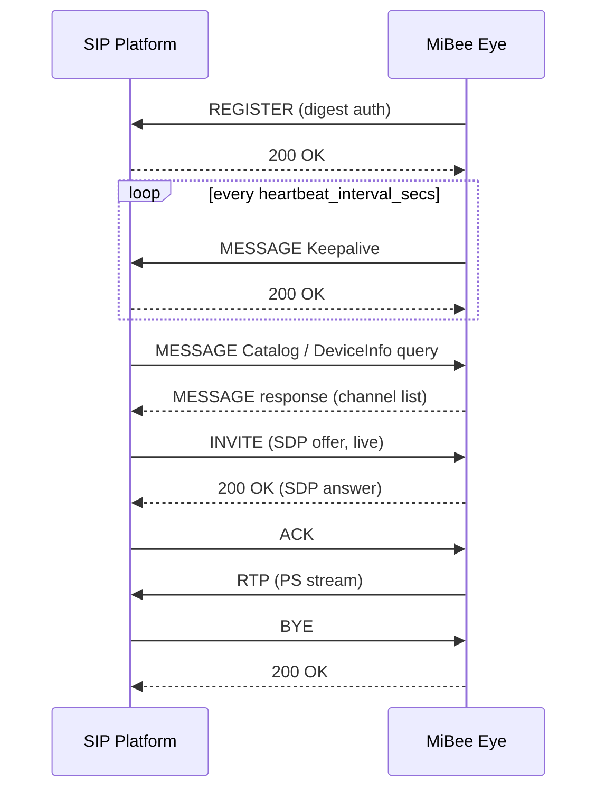

# GB28181 Integration

MiBee Eye can register as a GB/T 28181 device with a SIP platform (NVR / platform server). It supports registration and keep-alive, Catalog / DeviceInfo queries, live streaming, and playback / download of local recordings, with PS-encapsulated media over RTP (UDP or TCP). The feature is disabled by default and must be enabled explicitly in the configuration.

## How It Works

On startup the device sends a SIP REGISTER (digest authentication) to the platform, then sends MESSAGE keep-alives periodically. The platform queries Catalog / DeviceInfo / records via MANSCDP messages and starts live or playback sessions with an INVITE (SDP offer); the device streams PS-encapsulated media over RTP and the session ends with BYE.



Playback and download use the same INVITE flow with the time range carried in the SDP. During playback the platform can send SIP INFO messages with PlaybackControl commands (pause / resume / seek / speed) to control the stream position.

## Prerequisites

- The platform runs a SIP server and has assigned: a GB domain (e.g. `3402000000`), a 20-digit device ID, a 20-digit channel ID, and an access password.
- The SIP port (default 5060) is reachable both ways between device and platform; live media defaults to UDP RTP, so the platform-side receiving ports must be open.
- The local SIP listening port (`local_sip_port`, default 5060) is free — when the platform runs on the same host, this must be changed.

## Configuration

### Go implementation (YAML)

```yaml
gb28181:
  enabled: true                        # Enable GB28181 registration (default false)
  transport: udp                       # SIP transport: udp (default) or tcp
  platform_sip_address: "192.168.1.10" # Platform SIP server address
  platform_sip_port: 5060              # Platform SIP port
  sip_domain: "3402000000"             # GB domain (10 digits)
  device_id: "34020000001320000001"    # Device ID (20 digits)
  channel_id: "34020000001320000001"   # Channel ID (20 digits)
  password: "12345678"                 # Access password (must match platform)
  local_sip_port: 5060                 # Local SIP listening port
  register_interval_secs: 60           # Registration interval (seconds)
  heartbeat_interval_secs: 60          # Keep-alive interval (seconds)
  heartbeat_timeout_count: 3           # Missed heartbeats before offline
```

### Rust implementation (TOML)

The Rust edition (closed-source, see [Rust Edition](rpicam-rs.md)) uses identical keys in the `[gb28181]` section of its `config.toml`, with the same defaults:

```toml
[gb28181]
enabled = true
transport = "udp"
platform_sip_address = "192.168.1.10"
platform_sip_port = 5060
sip_domain = "3402000000"
device_id = "34020000001320000001"
channel_id = "34020000001320000001"
password = "12345678"
local_sip_port = 5060
register_interval_secs = 60
heartbeat_interval_secs = 60
heartbeat_timeout_count = 3
```

Both implementations accept `MIBEE_EYE_GB28181_*` environment variable overrides, e.g. `MIBEE_EYE_GB28181_ENABLED=true`, `MIBEE_EYE_GB28181_PASSWORD=...`. The full key reference is in the [configuration guide](rpicam-configuration.md).

## Integration With Local Recording

When [local recording](rpicam-configuration.md) is enabled, the device stores bare H.264 segment files grouped by day / hour (`recordings/YYYY-MM-DD/HH/MMSS.h264`) and maintains an append-only `recordings/index.jsonl`. RecordInfo queries and playback / download INVITEs read from this index; with recording disabled, playback and download queries return empty.

## Verification

```bash
# Watch registration and keep-alive logs
journalctl -u mibee-eye -f | grep -iE "gb28181|register|keepalive"
```

- The admin panel status view (the `gb28181` field of `/api/status`) shows the registration state.
- Once the device is online, the channel appears in the platform catalog; after a live session starts, GB28181 outgoing traffic is visible in `/metrics`.

## Common Issues

1. **Registration 401**: device ID or password mismatch with the platform — verify `sip_domain`, `device_id`, and `password` match the platform configuration exactly.
2. **Local port 5060 in use**: when the platform runs on the same host, change `local_sip_port`.
3. **Corruption / packet loss on UDP playback**: switch to `transport: tcp` on wireless or cross-subnet links.
4. **Platform receives no media**: check the firewall on the platform media ports and confirm the INVITE SDP SSRC matches the platform assignment.

See [troubleshooting](rpicam-troubleshooting.md) for more diagnostics.
