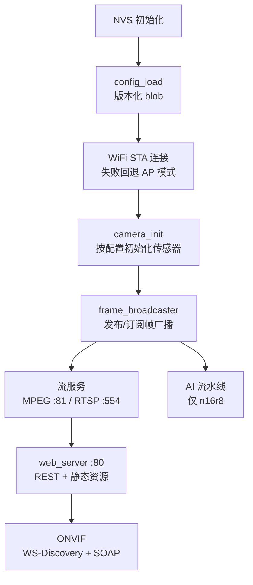
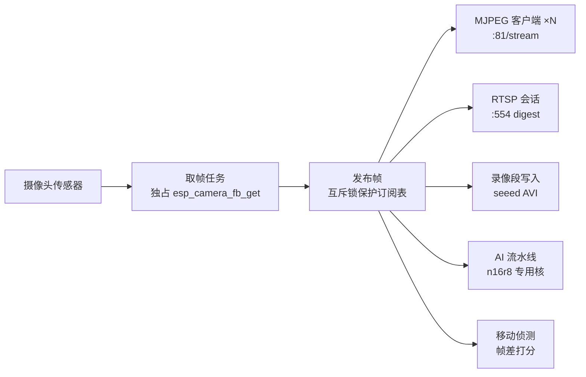

# ESP-Cam 总架构：一栈四板

四块主板的固件不是一份代码的四个编译目标，而是**四个独立仓库共享同一套架构约定**。每个仓库都是扁平的 `main/` 布局、一个子系统一对 `.c/.h`、`main.c` 按编号步骤完成自举。本文描述这套约定本身——读完后打开任何一个仓库的 `main/` 目录都应该能对号入座。

## 启动序列

所有板的 `app_main()` 都是同一个骨架：NVS → 配置 → WiFi → 相机 → 帧广播器 → 流服务 → Web → 协议层。编号日志（`boot step 4/9` 式）是四仓统一的排障入口。



两处板级差异需要知道：

- **ai-thinker（原版 ESP32）**：相机必须在 STA 连上之后才初始化——先开相机会触发 DMA freeze，这是该平台的硬件约束。
- **ai-thinker 的 SD 格式化**：GPIO14 是相机/SD 共享总线，运行中格式化必挂死，因此走"申请 → 重启 → 开机（相机初始化之前）格式化"。

## 帧广播器：一切数据流的源头

核心抽象是**发布/订阅帧广播器**（`frame_broadcaster.c`）：一个取帧任务独占摄像头，把 JPEG 帧推给所有订阅者。MJPEG 流、RTSP、录像、AI 检测、移动侦测全部是订阅者，互不争抢摄像头。



这个设计决定了两个家族行为：

1. **多客户端零复制分叉**：N 路 MJPEG 观众共享同一帧源，客户端数上限只受内存约束（1/2/2/3 按板不同，`GET /api/status` 的 `stream_clients_max` 下发）。
2. **热重配必须协调**：分辨率/质量变更要"停订阅 → 重建相机 → 重启广播"。有 PSRAM 的板可以在线协调完成；无 PSRAM 的板（luatos、ai-thinker）改用"保存 → 应答 → 1 秒后重启应用"，因为单 framebuffer 下热重配与并发取帧是致命竞态。

## 流媒体栈三层

| 层 | 实现 | 说明 |
|----|------|------|
| 浏览器预览 | `:81/stream` MJPEG | 独立 TCP 服务器（与 :80 的 httpd 隔离），`multipart/x-mixed-replace`，超限返回 503 |
| 标准客户端 | `:554/stream` RTSP | 仅 n16r8 / seeed；**强制 digest 鉴权**（401 于错误凭证） |
| NVR 发现 | ONVIF WS-Discovery + SOAP | UDP 3702 组播应答 + `:80/onvif/*_service`，四板全有 |

MJPEG 走独立端口是刻意设计：httpd 的 socket 表和 worker 池很小，视频流的长连接会把它打满，管理页面就会跟着失联。

## Web 服务与健康自愈

`:80` 是 esp_http_server，注册 REST API + ONVIF SOAP + SPIFFS 静态资源兜底。三道防线保证它长期在线：

1. **会话级**：每个新连接设 `TCP_NODELAY`（小包不等 Nagle）+ socket keepalive（约 11 秒判死僵尸连接，及时释放 socket 表）。
2. **探测级**：健康监视器每 10 秒向 `127.0.0.1:80` 发真实 HTTP GET（纯 TCP connect 不够——lwIP 在 httpd 卡死时仍会完成三次握手）。连续 6 次无响应才重启恢复；**WiFi 未连接时的探测失败不计入**，避免把"网络不在"误杀成"设备死了"。
3. **容量级**：lwIP socket 表调到 16–24、TCP MSL 缩到 15 秒（TIME_WAIT 30 秒回收）。这一条防的是 SPA 断线重连风暴把默认 10 槽 socket 表打爆的 EMFILE 重启循环，详见[知识库 PIT-001](espcam-kb.md)。

## 设备身份与配置持久化

- **身份**（`device_id.c`）：序列号 = 出厂 eFuse MAC（12 hex），ONVIF UUID = 固定前缀 + 同一 MAC。首次调用读一次并缓存——eFuse 不依赖 WiFi 状态、重烧不变，所以 AP 模式、启动早期、NVR 对接拿到的都是同一个稳定 ID。
- **配置**（`config_manager.c`）：NVS 里的版本化 blob（n16r8 为逐键存储），带魔数 + 版本号；不匹配自动回出厂默认——**改配置结构体必须 bump 版本**。WiFi 凭据变更写 NVS 后重启生效。

## 双核分工（S3 板）

| 核 | 任务 |
|----|------|
| Core 0 | WiFi 协议栈、httpd、主循环、LED、AT 指令 |
| Core 1 | 取帧任务、AI 流水线（n16r8：栈 24 KB，640×480 灰度缓冲在 PSRAM） |

原版 ESP32（ai-thinker）没有这么干净的划分：DMA/相机约束决定了"先 WiFi 后相机"的顺序，其余任务跟 WiFi 协议栈同核竞争。

## 仓库布局约定

```
main/
├── main.c              # 编号启动序列
├── wifi_manager.c/.h   # STA/AP、重连、双 WiFi 切换（ai-thinker）
├── camera_driver.c/.h  # 传感器初始化/重配（板级引脚表在这里）
├── frame_broadcaster.c/.h
├── mjpeg_streamer.c/.h # :81 独立 TCP 服务器
├── web_server.c/.h     # :80 REST + 静态兜底
├── onvif_service.c/.h  # SOAP 端点
├── onvif_discovery.c/.h# WS-Discovery
├── config_manager.c/.h # NVS 版本化 blob
├── device_id.c/.h      # eFuse 身份
├── health_monitor.c/.h # 自愈探测
└── web_ui/             # 前端资产，构建期打包进 SPIFFS
```

cJSON 供应商化内嵌（不修改）。`managed_components/` 下的上游组件改动必须走 `patches/`（n16r8 模式）或 vendor 进 `components/`（seeed 模式），绝不直接手改。

相关阅读：[统一 API 设计](espcam-api.md) · [统一前端设计](espcam-webui.md) · [开发知识库](espcam-kb.md)
