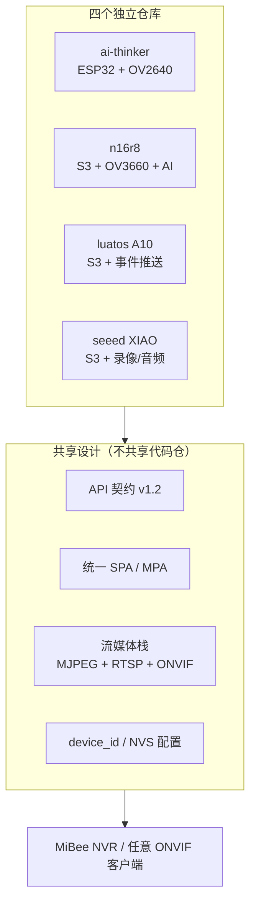

# ESP-Cam 系列：ESP32 摄像头总架构

ESP-Cam 是 MiBeeCam 家族中的 **ESP32 大集合**：四块不同主板各自独立成仓，却共享同一套固件架构、同一份 API 契约和同一个前端设计。本页给出整个系列的顶层视角——先讲统一的部分（架构、API、前端），再按主板展开各自的特性与子架构。

如果你只想回答"我该买哪块板"，直接看下方选型表；要理解四仓为什么"形散神不散"，从 [总架构](espcam-architecture.md) 读起。

## 板型矩阵

| 主板 | 芯片 / 传感器 | Flash / PSRAM | 独有能力 | 独立仓库 |
|------|-------------|---------------|----------|----------|
| AI-Thinker ESP32-CAM | ESP32（原版）+ OV2640 | 4 MB / 无 PSRAM | 双 WiFi 配置、SD 文件管理、轻量 MPA 前端 | [ai-thinker-esp32-cam](https://github.com/Mi-Bee-Studio/ai-thinker-esp32-cam) |
| ESP32-S3 N16R8 | ESP32-S3 + OV3660（3 MP） | 16 MB / 8 MB Octal | AI 流水线（人脸/移动/QR）、RTSP digest 鉴权、AT 指令 | [esp32s3-n16r8-cam](https://github.com/Mi-Bee-Studio/esp32s3-n16r8-cam) |
| Luatos ESP32-S3 A10 | ESP32-S3 + OV2640 | 16 MB / 无（设计禁用） | WebSocket 事件推送、webhook、串口 AT 配置 | [luatos-esp32s3-a10-camera](https://github.com/Mi-Bee-Studio/luatos-esp32s3-a10-camera) |
| Seeed XIAO ESP32-S3 Sense | ESP32-S3 + OV2640/OV5640* | 8 MB / 8 MB Octal | AVI 分段录像、NAS 自动上传、G.711 音频、OTA | [seeed-esp32s3-cam](https://github.com/Mi-Bee-Studio/seeed-esp32s3-cam) |

*传感器以设备实测为准（`GET /api/status` 的 `camera` 字段），部分出厂批次实际搭载 OV5640，驱动自动识别。

## 选型建议

- **最低成本入门**：AI-Thinker ESP32-CAM。生态最成熟、踩坑资料最多；无 PSRAM 所以单流上限 1 客户端，弱 WiFi 下首屏最轻。
- **需要 AI 检测**：ESP32-S3 N16R8。esp-dl 人脸检测 + 移动侦测 + QR 解码跑在专用核上，3 MP 传感器画质最好。
- **日常监控首选**：Seeed XIAO ESP32-S3 Sense。PSRAM 充裕、SD 录像 + NAS 上传 + 音频监听开箱即用，流客户端上限 3 路。
- **事件驱动集成**：Luatos A10。WebSocket 实时推送移动/录像/网络事件，适合接家庭自动化。

## 统一的设计基线

四块板不论差异多大，都遵守同四条基线，详细内容见对应页面：

1. **统一 API 契约**（[契约 v1.2 详解](espcam-api.md)）：核心端点四板 100% 一致；板间差异只允许通过"能力门控 + 动态元数据"产生，禁止字段名或语义分叉。
2. **统一前端设计**（[前端规范](espcam-webui.md)）：三块 S3 板共享同一套单页应用（四文件 md5 一致）；ai-thinker 用轻量多页应用但遵守同一契约层。
3. **统一流媒体栈**：MJPEG（`:81/stream`）+ RTSP（`:554`，digest 鉴权）+ ONVIF（WS-Discovery + SOAP），全部构建在同一个发布/订阅帧广播器上。
4. **统一身份与配置**：设备序列号/UUID 从出厂 eFuse MAC 派生（与 WiFi 状态无关）；配置存 NVS、版本化 blob、魔数/版本不匹配自动回出厂值。

## 各主板深入阅读

- [AI-Thinker ESP32-CAM：能力总览](aicam-capabilities.md)
- [N16R8：系统架构](n16r8-architecture.md)
- [Luatos A10：项目总览](luatos-overview.md)
- [Seeed XIAO：系统架构](seeed-architecture.md)

开发排障经验（EMFILE 重启循环、自愈误杀、PSRAM 约束等）统一收录在 [开发知识库](espcam-kb.md)。
