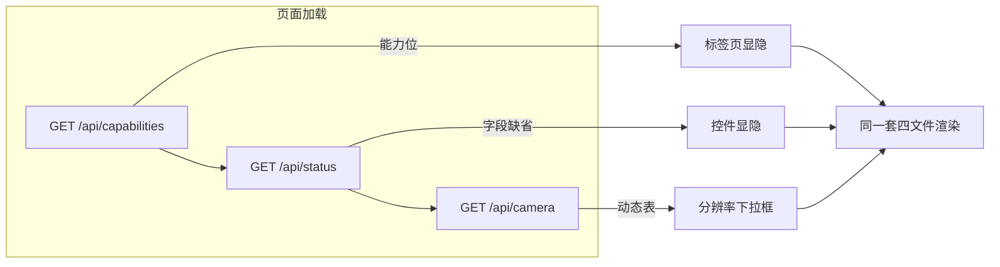

# ESP-Cam 统一前端设计

四块主板用两种形态的前端：三块 S3 板共享**同一套单页应用（SPA）**，ai-thinker 用**轻量多页应用（MPA）**——但两者遵守同一契约层，任何页面在任一板上可用的前提都一样：**能力探测 + 字段缺省**，绝不按板硬编码。

## SPA：单一源码，四文件纪律

`main/web_ui/` 下的四个文件构成完整前端：

| 文件 | 职责 |
|---|---|
| `index.html` | 页面骨架（预览/存储/设置等标签页） |
| `app.js` | 全部逻辑：状态轮询、流管理、表单、批量操作 |
| `i18n.js` | 中英双语字典与切换 |
| `style.css` | 样式 |

**这四个文件在三仓的 md5 必须一致。** 单一源码、改完同步、禁止按板分叉——历史上曾有一仓单独改动丢了另一板已有功能的事故，此后这成为硬性纪律。全部板差异在运行时来自三个数据源：

1. `GET /api/capabilities`——功能级开关（无 `sd` 能力就不出现存储页签）
2. `GET /api/status` / `GET /api/config` 的**字段缺省**——字段不存在即隐藏对应控件（`wifi_ssid_2` 只在双 WiFi 板返回）
3. `GET /api/camera` 的 `supported_resolutions`——分辨率下拉框的唯一来源

两个容易踩的实现细节：

- **n16r8 的 `POST /api/config` 是白名单校验**：没在响应里出现过的键绝不发送，否则保存直接报错。所以"字段缺省隐藏控件"同时意味着"缺省字段不进请求体"。
- **MJPEG 图像的自愈重连**是刻意的：被踢的连接约 7 秒内自动重连，设备重启后也会抢回观看槽位。日志里持续的 connect/kick 循环是正常行为，不是泄漏。

## MPA：ai-thinker 的轻量选择

原版 ESP32 无 PSRAM、WiFi 常年偏弱，SPA 首屏一次性拉全量 JS 在这个环境下反而更慢。ai-thinker 因此保留多页应用（`index/preview/config/files/setup` 各一页，CSS 内联），每页只带自己需要的脚本。

代价是功能对齐靠契约纪律：MPA 的字段名、端点语义、鉴权方式随统一契约走（v1.2 已对齐：双 WiFi 表单、SD 批量管理、格式化流程、存储状态字段），但布局与交互不必与 SPA 一致。

## 鉴权 UX（两种前端一致）

- 密码存 `sessionStorage`，写操作自动附 `X-Password` 头
- 401 时引导到系统页设置密码；首次使用经 `GET /api/auth` 预验证
- 修改密码模态：旧密码 + 新密码 + 确认（服务端隐式验证旧密码）

## 构建耦合（改前端必须重烧）

前端资产在**构建期**打包进 SPIFFS 分区烧进 flash——改 HTML/JS/CSS 后必须重新构建并烧录才生效，浏览器强刷无效（服务端已带 no-cache 头）。各仓 CMake 用显式文件级 `DEPENDS` 声明（目录级依赖不随内容编辑触发，是四仓同坑）。

远程更新 UI 走 OTA 的 spiffs 端点（见[统一 API](espcam-api.md)），成功后以设备 `/app.js` 的 md5 与仓库文件一致为准。

## 界面速览

主面板（仪表盘）：

预览页（MJPEG 实时流）：

配置页（WiFi/相机/系统，字段按板缺省显隐）：

存储页（SD 文件浏览、批量删除、格式化）：

相关阅读：[统一 API 设计](espcam-api.md) · [总架构](espcam-architecture.md)
