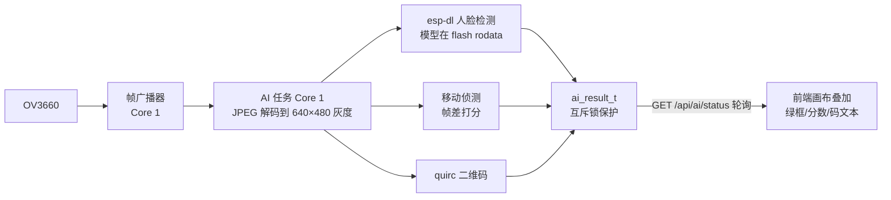

# N16R8 系统架构

N16R8 完整实现了 [ESP-Cam 总架构](espcam-architecture.md) 的约定，并在其上叠加了家族里唯一的 **AI 流水线**。本页只讲这块板的模块图、双核分工与 AI 数据流；通用机制（帧广播器、流媒体栈、自愈、device_id）见总架构页。

## 模块图

| 模块 | 文件 | 职责 |
|---|---|---|
| main | main.c | 编号启动序列编排 |
| config_manager | config_manager.c/h | NVS 逐键配置（FreeRTOS 互斥锁，16 键，u8/i8 类型） |
| camera_driver | camera_driver.c/h | OV3660 初始化、传感器微调、协调式重配 |
| frame_broadcaster | frame_broadcaster.c/h | Core 1 取帧任务 → 订阅者发布 |
| mjpeg_streamer | mjpeg_streamer.c/h | `:81` MJPEG 独立 TCP 服务器 |
| ai_pipeline | ai_pipeline.cpp/h | 人脸/移动/QR 检测（Core 1，640×480 固定缓冲） |
| web_server | web_server.c/h | `:80` REST + SPIFFS 静态兜底 |
| rtsp_server | rtsp_server.cpp/h | `:554` RTSP，MJPEG 负载，**digest 鉴权** |
| onvif_service / onvif_discovery | *.c/h | SOAP 端点 + WS-Discovery（mDNS 宣告） |
| device_id | device_id.c/h | eFuse MAC 派生的序列号/UUID |
| at_command | at_command.c/h | UART0 串口 AT 配置 |
| flash_led / status_led | *.c/h | 补光灯（PWM 0-100）与状态灯 |

## 启动序列

1. NVS 初始化（损坏则擦除重试）
2. `config_load`（命名空间 `mibee_cfg`）
3. WiFi STA 连接
4. 相机初始化（按配置；AI 开启时强制 VGA）
5. 帧广播器初始化并启动取帧任务（Core 1，优先级 5）
6. AI 流水线：从 flash rodata 加载人脸模型 → PSRAM 分配灰度缓冲 → quirc 解码器 → AI 任务上 Core 1（栈 24 KB）
7. Web 服务器 `:80`（栈 16 KB）
8. RTSP `:554` → ONVIF 发现 + SOAP → AT 指令监听
9. 主循环每 60 秒心跳日志

## AI 数据流

## 双核分工

| 核 | 任务 | 栈 |
|---|---|---|
| Core 0 | WiFi 协议栈、httpd、主循环、AT、LED | 8 KB 级 |
| Core 1 | 取帧任务（优先级 5）+ AI 流水线（优先级 5） | 4 KB / 24 KB |

## 关键设计决策

- **协调式重配**：改分辨率/质量走"停 AI + 广播器 → 相机 deinit → init → 重启"，避免访问失效相机状态的崩溃。
- **实时 vs 持久分离**：传感器微调（亮度/对比度/饱和度/锐度/镜像/翻转）经寄存器即时生效；分辨率/质量需要协调重配；AI 开关经 `ai_enable()` 即时生效并持久化；WiFi 改动保存后重启生效。
- **AI ↔ VGA 联动**：AI 缓冲固定 640×480，任何 AI 特性开启时非 VGA 档位不可用（后端 400，前端双向强制）。
- **esp32-camera 补丁**：上游组件改动走 `patches/` + 根 CMake 拷贝步骤（本仓不 vendor 到 `components/`），见 [开发指南](n16r8-development.md)。
- **RTSP 独立凭证**：`rtsp_user/rtsp_pass`（默认 admin/admin），与 Web 管理密码分离，digest 挑战强制。

## 内存布局

| 区 | 位置 |
|---|---|
| 帧缓冲 ×2（JPEG） | PSRAM |
| AI 灰度缓冲 640×480 | PSRAM |
| 人脸检测模型 | flash rodata |
| quirc 解码器 | 内部堆 |

相关阅读：[硬件手册](n16r8-hardware.md) · [Web API](n16r8-web-api.md) · [开发指南](n16r8-development.md)
