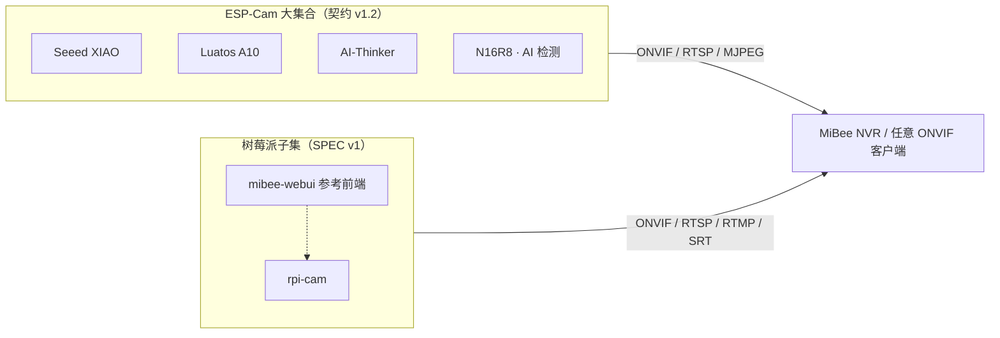

# MiBeeCam 摄像头总文档

MiBeeCam 是 Mi&Bee Studio 的自托管摄像头产品线文档中心，收录**多个合并进来的摄像头项目集合**：每个大集合先讲统一的架构、API 与前端设计，再按主板/平台分册介绍。文档始终描述**当前最新版本**，不保留旧版页面。

当前收录的大集合：

- [ESP-Cam 系列（ESP32 摄像头）](espcam-overview.md)——四块 ESP32 主板的统一总架构与分板手册
- [树莓派相机 rpi-cam](rpicam-architecture.md)——树莓派 ONVIF 软相机（Go）

> 大集合采用互斥的 slug 前缀命名空间（ESP-Cam 用 `espcam-` 统一页 + 各板前缀，树莓派用 `rpicam-`），后续新集合（如 mibee-rec）按 [CONVENTIONS](https://github.com/Mi-Bee-Studio/mibee-docs/blob/main/mibeecam/CONVENTIONS.md) 注册前缀后平行接入。

## 家族成员速览

| 项目 | 平台 / 传感器 | 关键能力 | 定位 |
|------|--------------|----------|------|
| [Seeed XIAO ESP32-S3 Sense](https://github.com/Mi-Bee-Studio/seeed-esp32s3-cam) | ESP32-S3 + OV2640/OV5640 | MJPEG、RTSP（MJPEG + G.711 音频）、AVI 分段录像、NAS 上传（WebDAV/HTTP）、动态缩时、OTA | 均衡型监控相机 |
| [Luatos ESP32-S3 A10](https://github.com/Mi-Bee-Studio/luatos-esp32s3-a10-camera) | ESP32-S3 + OV2640 | MJPEG、移动侦测、WebSocket 事件、webhook、ONVIF、AT 指令 | 事件驱动的紧凑相机（无 PSRAM） |
| [AI-Thinker ESP32-CAM](https://github.com/Mi-Bee-Studio/ai-thinker-esp32-cam) | ESP32 + OV2640 | MJPEG、移动侦测、SD 缩时/连拍、ONVIF、双 WiFi、文件管理、OTA、轻量 MPA | 低成本入门 |
| [ESP32-S3-N16R8](https://github.com/Mi-Bee-Studio/esp32s3-n16r8-cam) | ESP32-S3 + OV3660（3 MP） | MJPEG、RTSP（digest）、ONVIF、人脸/移动/QR 检测、web OTA | 高清 + 标准协议 + AI |
| [rpi-cam](https://github.com/Mi-Bee-Studio/mibee-eye-raspi-go) | 树莓派（Go） | ONVIF Device/Media/PTZ、RTSP/RTMP/SRT 转推、WS-Discovery | 树莓派软相机 |

## 生态架构

ESP-Cam 四板共享同一份 **API 契约（v1.2）** 与统一前端设计（树莓派侧则是独立的 Web API 规范 SPEC v1 + 零构建参考前端）；两类设备都能以 ONVIF/RTSP 接入任意 NVR：

## 从哪里开始读

- 想选一块板买：[ESP-Cam 板型矩阵与选型](espcam-overview.md)
- 要开发/二次开发：[ESP-Cam 总架构](espcam-architecture.md) → [统一 API 设计](espcam-api.md) → [统一前端设计](espcam-webui.md)
- 遇到故障先查：[ESP-Cam 开发知识库](espcam-kb.md)（EMFILE 重启循环、自愈误杀等家族级坑）与各板故障排除页
- 深度长文精选：[ESP32-CAM / ESP-IDF 开发中绕不开的那些坑](aicam-esp32-cam-performance.md) · [端口分离设计](seeed-port-separation-design.md) · [rpi-cam ONVIF 合规说明](rpicam-onvif-compliance.md)
- 接入录像平台：[接入 MiBee NVR](nvr-integration.md)

- test: http://192.168.63.99:9090/dav
