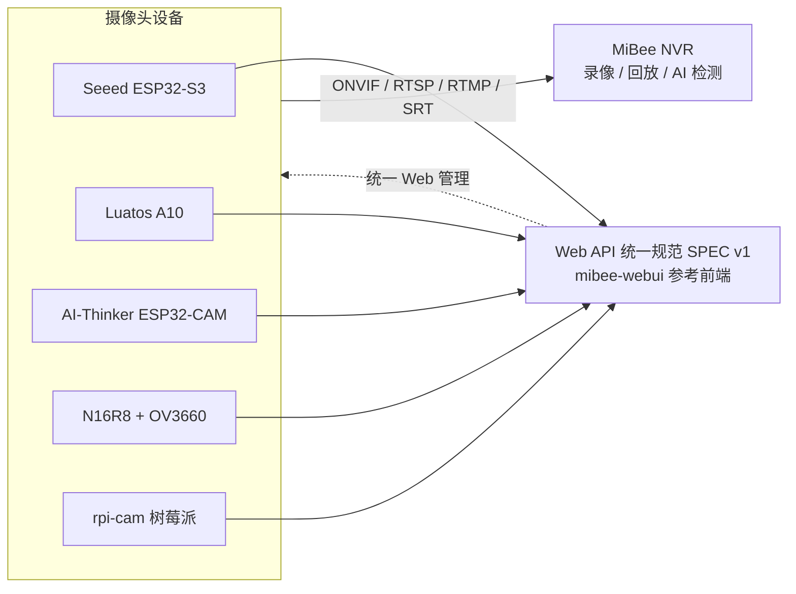

# MiBeeCam 摄像头家族总览

MiBeeCam 是 Mi&Bee Studio 的自托管摄像头产品线：从几元钱的 ESP32-CAM 到树莓派软相机，覆盖监控、AI 检测、录像上传等场景。本总文档把**全部摄像头项目的用户手册与知识库**整合在一处，统一浏览、统一检索。

## 家族成员

| 项目 | 平台 / 传感器 | 关键能力 | 定位 |
|------|--------------|----------|------|
| Seeed XIAO ESP32-S3 Sense | ESP32-S3 + OV2640 | MJPEG 实时流、AVI 分段录像、自动上传 NAS | 均衡型监控相机 |
| Luatos ESP32-S3 A10 | ESP32-S3 核心板 | MJPEG、移动侦测、Web 配置、AT 指令 | 紧凑型智能相机 |
| AI-Thinker ESP32-CAM | 经典 ESP32-CAM | MJPEG、移动侦测、文件管理、OTA、REST | 低成本入门 |
| ESP32-S3-N16R8 | ESP32-S3 + OV3660 3MP | RTSP（digest）、ONVIF 发现、人脸/移动/QR 检测 | 高清 + 标准协议 |
| rpi-cam | 树莓派（Go） | ONVIF Device/Media/PTZ/Imaging、RTSP、RTMP 转推、WS-Discovery | 树莓派软相机 |

## 生态架构

所有相机共享同一套 **Web API 统一规范（SPEC v1）** 与零构建参考前端（mibee-webui），可无缝接入 MiBee NVR 统一录像与管理：

## 选型建议

- **最低成本入门**：AI-Thinker ESP32-CAM，生态成熟、资料最多（含大量踩坑总结）。
- **日常监控首选**：Seeed XIAO ESP32-S3 Sense，PSRAM 充裕，录像 + NAS 上传开箱即用。
- **需要标准协议（RTSP/ONVIF）**：ESP32-S3-N16R8，3MP 画质，可直接被 NVR/VMS 发现。
- **手头有树莓派**：rpi-cam，把树莓派变成一台合规 ONVIF 相机。
- **接入录像平台**：全部型号见[接入 MiBee NVR](nvr-integration.md)。

## 知识库精选

深度技术文章也收录在本总文档中：

- [端口分离设计：为什么 MJPEG 流传输使用独立端口](seeed-port-separation-design.md)
- [ESP32-CAM / ESP-IDF 开发中绕不开的那些坑](aicam-esp32-cam-performance.md)
- [相机 Web API 统一规范 SPEC v1](webui-spec.md)
- [rpi-cam ONVIF 合规说明](rpicam-onvif-compliance.md)

> 各项目仓库后续将以本总文档为唯一文档源提交维护（含脱敏截图与 mermaid 架构图），本页内容随各项目贡献持续完善。
