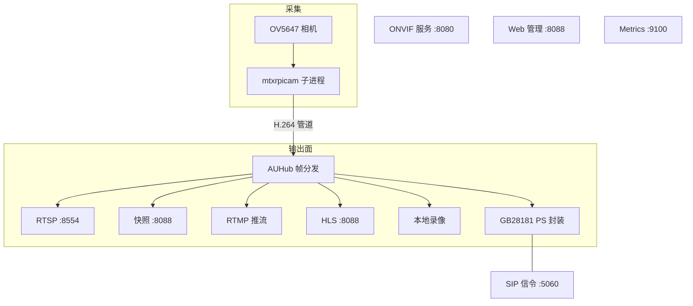

# 系统架构

[English](https://github.com/Mi-Bee-Studio/mibee-eye-raspi-go/blob/main/docs/architecture.md)

MiBee Eye 是一个轻量级的 Go 应用，为树莓派、香蕉派、香橙派等单板计算机提供 ONVIF 兼容的相机服务。单进程内承载采集、RTSP/RTMP/HLS/GB28181 出流、本地录像与 Web 管理，整机内存占用约 20MB（实测于树莓派 3B）。

> 本页描述 **Go 版**实现。Rust 版（闭源发行）的架构差异与开源边界见 [Rust 版](rpicam-rs.md)。
## 组件架构

各输出面共享同一份 H.264 访问单元流（AUHub 扇出）；ONVIF、Web 管理、Metrics 是独立的 HTTP 端口面；GB28181 除媒体面外还有独立的 SIP 信令通道。

## 关键组件

### ONVIF 服务器 (`internal/onvif/server.go`)

ONVIF 服务器实现单端点 SOAP 框架，处理多个 ONVIF 服务：

- **服务路由**：所有 SOAP 操作分发到 `/onvif/device_service`
- **身份验证**：WS-Security UsernameToken 摘要身份验证
- **WS-Discovery**：支持 UDP 组播和 HTTP 探测请求
- **SOAP 处理**：XML 信封解析、操作路由、故障处理
- **配置**：接口式的配置提供程序，用于身份验证和媒体参数

实现的服务：

- **Device**：设备信息、功能能力、WS-Discovery
- **Media**：配置文件、流 URI、快照访问
- **Imaging**：相机参数控制（亮度、对比度等）

### 相机子系统 (`internal/camera/camera.go`)

相机捕获支持三种模式（通过 `camera.mode` 配置）：

**mtxrpicam 模式（默认）**：使用 MediaMTX 经过验证的 `mtxrpicam` C 二进制文件（来自 [mediamtx-rpicamera](https://github.com/bluenviron/mediamtx-rpicamera)）通过子进程运行。它捆绑了自带的 `libcamera.so.9.9`，以避免与系统 libcamera 版本冲突。

**rpicamvid 模式**：使用系统安装的 `rpicam-vid` 采集，适合已统一管理 libcamera 版本的部署。

**rtsp 模式**：消费外部 RTSP URL，用于在没有相机硬件的情况下进行测试（`internal/camera/` 中的 RTSPSource 实现）。

对于 mtxrpicam 模式：

- **管道协议**：4 字节小端帧协议（配置和视频帧）
- **子进程隔离**：使用 `Setpgid=true` 生成，实现信号隔离
- **参数控制**：通过配置管道实时更新相机参数
- **错误处理**：进程监控和优雅关闭

`deploy/bin/` 中需要的文件：`mtxrpicam`、`libcamera.so.9.9`、`libcamera-base.so.9.9`、`ipa_module/ipa_rpi_vc4.so`、`ipa_module/ipa_rpi_vc4.so.sign`、`libpisp/backend_default_config.json`、`ipa_conf/`。`LD_LIBRARY_PATH` 必须包含 `deploy/bin/`，以便 mtxrpicam 找到捆绑的 libcamera。

### H.264 AUHub (`internal/h264/hub.go`)

AUHub 提供帧分发到多个消费者，采用扇出模式：

- **线程安全**：内部互斥锁用于并发订阅者管理
- **非阻塞传递**：丢弃帧以防止写入阻塞
- **订阅者管理**：在上下文取消时自动清理
- **访问单元格式**：H.264 访问单元，带有时间戳和关键帧检测

消费者包括：RTSP 服务器、快照处理器、RTMP 推流、HLS 服务器、本地录像与 GB28181 PS 封装。

### RTSP 服务器 (`internal/rtsp/server.go`)

RTSP 服务器基于 `gortsplib v5` 构建，用于 H.264 流媒体：

- **协议支持**：RTSP 1.0，支持 DESCRIBE、SETUP、PLAY 命令
- **身份验证**：可选的摘要身份验证，用于流访问
- **按需流媒体**：仅在客户端连接时开始帧消费
- **媒体描述**：动态 H.264 格式，带有 SPS/PPS 更新
- **时间戳同步**：NTP 调整的时间戳，用于准确播放

数字 PTZ 实现已作为死代码移除（未连接到相机）。

### GB28181 设备侧 (`internal/gb28181/`)

GB28181 设备侧实现 SIP 注册与保活、Catalog/DeviceInfo/RecordInfo 应答，以及实时点播与录像回放/下载的 PS over RTP 推流（UDP/TCP）。信令基于 [gb28181-go](https://github.com/mickeyzzc/gb28181-go) 库，媒体封装复用 AUHub 帧流。详见 [GB28181 接入](rpicam-gb28181.md)。

### 本地录像 (`internal/recording/`)

连续录像按天/小时目录落盘裸 H.264 段文件，并维护追加写的 `index.jsonl` 索引，供 GB28181 RecordInfo 查询与回放/下载取数；支持按保留天数与存储上限自动清理。

### HLS 服务器 (`internal/hls/server.go`)

HLS 服务器通过纯 Go MPEG-TS 分段器提供实时流媒体：

- **纯 Go 实现**：`internal/hls/muxts.go` 中的 MPEG-TS 分段器（无子进程）
- **内存分段**：分段保持在内存中，不在磁盘上写入 .ts 文件
- **HTTP 服务**：通过 HTTP 端点提供 .m3u8 播放列表和 .ts 段
- **配置**：可配置的 `segment_duration`（默认 2s）和播放列表大小
- **集成**：直接从 AUHub 消费 H.264 帧

### Web UI 服务器 (`internal/web/web.go`)

Web UI 服务器提供基于浏览器的相机管理界面：

- **身份验证**：会话 cookie + CSRF 双提交（`/api/auth/*`，统一 Web API 规范 v1）
- **i18n 支持**：中英文语言切换
- **主题**：明暗主题偏好
- **视频播放器**：MSE（媒体源扩展）用于亚秒延迟预览，加上 HLS（hls.js）用于兼容性
- **相机控制**：实时亮度、对比度、饱和度、锐度调整
- **快照**：JPEG 捕获和下载功能
- **事件**：SSE 事件通道（`/api/events`）推送参数变更等实时更新
- **服务器配置**：配置查看器和编辑器，支持 ONVIF 凭据管理

完整的端点契约见 [相机 Web API 统一规范](webui-spec.md)。

## 数据流管道

1. **捕获**：mtxrpicam 子进程从 OV5647 CSI 相机捕获帧
2. **传输**：H.264 数据通过二进制管道传输到 Go 进程
3. **处理**：解析器提取 NALU 和时间戳，检测关键帧
4. **分发**：AUHub 将访问单元分发给多个消费者
5. **流媒体**：RTSP 服务器通过 gortsplib 向 NVR 客户端提供视频
6. **快照**：双层策略 — 尝试 rpicam-still JPEG 捕获（3 秒超时），回退到原始 H.264 IDR 帧
7. **控制**：ONVIF 服务提供相机控制和发现功能
8. **HLS**：纯 Go MPEG-TS 分段器生成内存分段用于浏览器播放
9. **录像与国标**：本地录像落盘 H.264 段 + `index.jsonl` 索引；GB28181 将同一帧流封装为 PS 推给平台

## 资源使用

实测于 Raspberry Pi 3B 720p@15fps：

| 进程 | RSS 内存 | 用途 |
|------|----------|------|
| MiBee Eye | ~9MB | Go 主进程（ONVIF + RTSP + 管道） |
| mtxrpicam | ~10MB | 相机捕获子进程 |
| **总计** | **~19MB** | HLS/录像增加少量内存（内存分段缓冲） |

- **CPU**：MiBee Eye ~2%，mtxrpicam ~12%，720p@15fps
- **网络**：720p@15fps H.264 流 ~2Mbps

## 依赖项

- **gortsplib v5**：RTSP 服务器功能（与 MediaMTX 相同的库）
- **pion/rtp**：H.264 流媒体的 RTP 数据包处理
- **yaml.v3**：配置文件解析
- **onvif-go/v2**：ONVIF 服务器实现（自维护库 [mickeyzzc/onvif-go/v2](https://github.com/mickeyzzc/onvif-go)）
- **gb28181-go**：GB28181 设备侧信令（[mickeyzzc/gb28181-go](https://github.com/mickeyzzc/gb28181-go)）
- **mtxrpicam**：相机捕获子进程，捆绑 libcamera（来自 bluenviron/mediamtx-rpicamera v2.6.0）

## 部署架构

系统作为单个 systemd 服务运行，具有：

- **进程隔离**：相机捕获在子进程中，主服务在 Go 进程中
- **资源使用**：SBC 实测 ~20MB RAM
- **交叉编译**：从 x86 工作站编译到 aarch64 RPi
- **配置**：基于 YAML 的配置，支持环境变量覆盖
- **监控**：用于操作可见性的 Prometheus 指标

### 摄像头捕获依赖

| 组件 | 类型 | 大小 | 用途 |
|------|------|------|------|
| mtxrpicam | C 二进制 (arm64) | 1.7MB | 相机捕获 + H.264 编码 |
| libcamera.so.9.9 | 共享库 (捆绑) | 5.7MB | 相机框架（来自 mediamtx-rpicamera） |
| libcamera-base.so.9.9 | 共享库 (捆绑) | 140KB | libcamera 基础支持 |
| ipa_module/ipa_rpi_vc4.so | IPA 模块 | 690KB | RPi VC4 图像处理 |
| libpisp/backend_default_config.json | 配置 | 11KB | PiSP 后端配置 |

这些依赖从 mediamtx-rpicamera 发布版捆绑，不依赖系统安装的 libcamera。这避免了 Debian 的 libcamera (0.7.0) 与 mtxrpicam 编译版本之间的版本冲突。

此架构完全替代 MediaMTX，以提供 ONVIF 与 GB28181 合规性，同时保持经过验证的相机捕获和 RTSP 流媒体组件。部署步骤见[部署指南](rpicam-deployment.md)。
