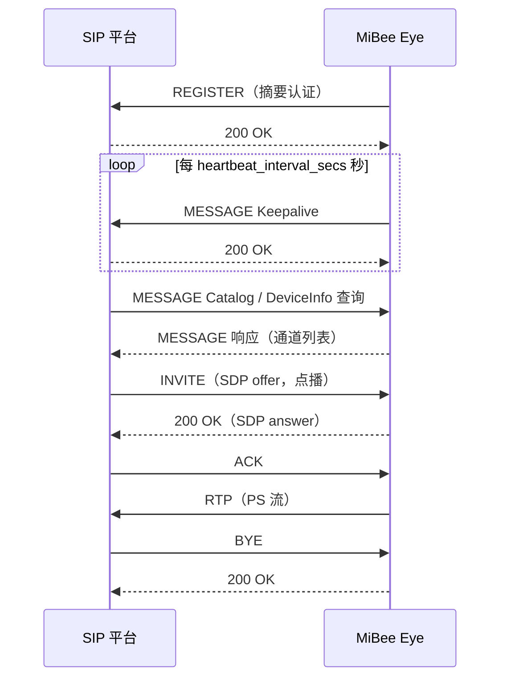

# GB28181 接入

MiBee Eye 可作为 GB/T 28181 设备端注册到国标 SIP 平台（NVR / 平台服务器），支持注册与保活、目录与设备信息查询、实时点播、历史录像回放与下载，媒体流为 PS 封装 over RTP（UDP 或 TCP）。默认关闭，需在配置中显式启用。

## 工作原理

设备启动后向平台发起 SIP REGISTER（摘要认证），成功后按周期发送 MESSAGE 保活；平台通过 MANSCDP 消息查询目录 / 设备信息 / 录像记录，并通过 INVITE（SDP offer）点播实时流或回放流，设备以 PS 封装经 RTP 推流，会话以 BYE 结束。



历史回放与下载走同样的 INVITE 流程，SDP 携带回放时间段；回放中平台可用 SIP INFO 携带 PlaybackControl 指令（暂停 / 继续 / 拖动 / 倍速）控制流进度。

## 前置条件

- 平台侧已建好 SIP 服务，并分配：国标域（如 `3402000000`）、20 位设备编码、20 位通道编码、接入密码。
- 设备与平台之间 SIP 端口（默认 5060）双向可达；点播媒体流默认走 UDP RTP，需放通平台侧接收端口。
- 设备本地 SIP 监听端口（`local_sip_port`，默认 5060）未被占用——平台与设备同机部署时必须改开其他端口。

## 配置

### Go 实现（YAML）

```yaml
gb28181:
  enabled: true                       # 启用 GB28181 注册（默认 false）
  transport: udp                      # SIP 传输层：udp（默认）或 tcp
  platform_sip_address: "192.168.1.10" # 平台 SIP 服务器地址
  platform_sip_port: 5060             # 平台 SIP 端口
  sip_domain: "3402000000"            # 国标域（10 位）
  device_id: "34020000001320000001"   # 设备编码（20 位）
  channel_id: "34020000001320000001"  # 通道编码（20 位）
  password: "12345678"                # 接入密码（与平台一致）
  local_sip_port: 5060                # 本地 SIP 监听端口
  register_interval_secs: 60          # 注册周期（秒）
  heartbeat_interval_secs: 60         # 保活周期（秒）
  heartbeat_timeout_count: 3          # 连续丢失多少次心跳判定离线
```

### Rust 实现（TOML）

Rust 版（闭源发行，见 [Rust 版](rpicam-rs.md)）的配置键与 Go 版完全同名，写在 `config.toml` 的 `[gb28181]` 节下，默认值一致：

```toml
[gb28181]
enabled = true
transport = "udp"
platform_sip_address = "192.168.1.10"
platform_sip_port = 5060
sip_domain = "3402000000"
device_id = "34020000001320000001"
channel_id = "34020000001320000001"
password = "12345678"
local_sip_port = 5060
register_interval_secs = 60
heartbeat_interval_secs = 60
heartbeat_timeout_count = 3
```

两个实现均支持 `MIBEE_EYE_GB28181_*` 环境变量覆盖，如 `MIBEE_EYE_GB28181_ENABLED=true`、`MIBEE_EYE_GB28181_PASSWORD=...`。完整键表见[配置文档](rpicam-configuration.md)。

## 与本地录像联动

开启[本地录像](rpicam-configuration.md)后，设备按天 / 小时分段落盘裸 H.264 段文件（`recordings/年-月-日/时/分秒.h264`）并维护追加写的 `recordings/index.jsonl` 索引。平台的 RecordInfo 查询与回放 / 下载 INVITE 从该索引取数据；未开启录像时，回放与下载查询返回空。

## 验证

```bash
# 观察注册与保活日志
journalctl -u mibee-eye -f | grep -iE "gb28181|register|keepalive"
```

- 管理面板状态页（`/api/status` 的 `gb28181` 字段）显示注册状态。
- 平台侧设备上线后目录中可见通道，点播后可在 `/metrics` 中观察 GB28181 出流字节增长。

## 常见问题

1. **注册 401**：设备编码或密码与平台不一致——核对 `sip_domain`、`device_id`、`password` 三项与平台配置完全一致。
2. **本地 5060 被占用**：平台与设备同机时，把 `local_sip_port` 改为其他端口。
3. **UDP 点播花屏 / 丢包**：无线或跨网段环境改 `transport: tcp`。
4. **平台收不到流**：检查平台侧媒体接收端口防火墙，确认点播 SDP 中的 SSRC 与平台分配一致。

更多排查手段见[故障排除](rpicam-troubleshooting.md)。
