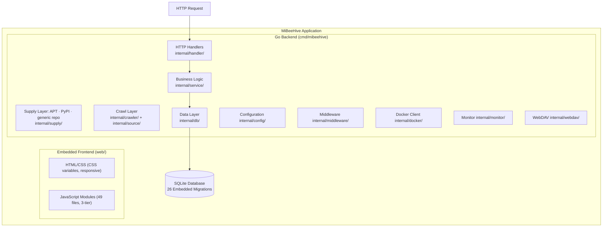
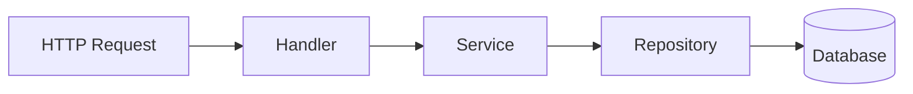
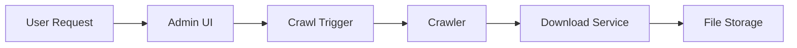
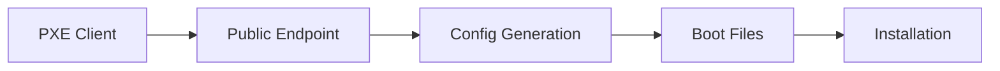

# MiBeeHive Architecture

## BeeHive Philosophy

MiBeeHive is an **operations tooling supply platform for external servers**. The bee-hive is the right metaphor: the hive does not produce honey, it **collects, ages, and distributes** it. MiBeeHive does not invent protocols — it collects ops tools from public sources, keeps them up to date, and serves them to external servers over existing standard protocols. The product is a supply chain, and the two self-sufficient provisioning capabilities below are the core differentiators that no other ops panel offers:

- **Foraging** (采蜜): The supply engine — crawl and download ops tools (binary releases) from public sources
- **Supply** (供应): Serve the collected artifacts to external servers over their **native standard protocols** (APT repository, PyPI Simple, generic repo index) so the fleet pulls with its own tooling — no agent required
- **Provisioning** (哺育): Bring new external servers online — provide unattended OS installation via PXE so bare-metal machines can be enrolled and stocked from scratch
- **Sharing** (分享): Serve collected files out — basic WebDAV capabilities, configurable via web UI

> **vs typical ops panels:** those manage the *local* machine (app store, site building). MiBeeHive targets the *other* servers — it is the supply chain that stocks the fleet.

Each module has isolated storage paths under a configurable parent: `{base_path}/{oss,os-install,webdav}`. The Supply layer generates its protocol indexes on demand over the artifacts Foraging collected in `oss/` (it adds no new storage directory of its own).

### Phase Roadmap
- Phase 1 (Complete): Foraging — Web management for crawl sources, API tokens, crawl control, password change
- Phase 2 (Complete): Provisioning — OS install config management, PXE endpoints, ISO downloading
- Phase 3 (Complete): Sharing — WebDAV server, Basic Auth, HTTPS support
- Phase 4 (Complete): Supply — native-protocol endpoints: APT repository (`/apt/`), PyPI Simple (`/simple/`), generic `/repo/index` + `/repo/files/{id}`. The crawl layer also moved to a two-track model (YAML fingerprints + Go adapters).


## System Architecture

MiBeeHive is a lightweight monolithic Go binary that acts as a **supply hub for external servers**: it crawls, downloads, and serves ops tools (GitHub, Go, HashiCorp, Grafana, NPM, PyPI) so external servers can pull their materials from it. It runs on any Linux host (amd64 or arm64) and is resource-efficient enough for a 469MB RAM NAS or mini PC, though it scales up to a full server. It embeds a **Preact + HTM** SPA frontend via `go:embed` and includes a web admin panel with dashboard overview and tabbed navigation for managing all four modules (Foraging, Supply, Provisioning, Sharing) plus containers, search, logs, tasks, and backup. The **supply layer** exposes the collected artifacts to external servers over their native standard protocols — see [Supply Layer](https://github.com/Mi-Bee-Studio/MiBeeHive/blob/main/docs/roadmap/supply-layer.md) for the protocol roadmap (APT and PyPI Simple shipped; Go proxy / YUM / Helm / OCI planned).

### Scope Boundary

- **Is**: An operations-tooling **supply chain** that collects, updates, and serves ops tools to external servers over *existing* standard protocols. It implements protocols; it does not invent them.
- **Is Not** a local-machine app store / quick site builder (that is what typical ops panels do).
- **Is Not** a TSDB / metrics aggregator. `/metrics` is only for MiBeeHive's own health — MiBeeHive supplies `node_exporter`/`prometheus` *to* external servers rather than competing with them.
- **Operations model**: supply-first (serve artifacts passively over protocols). Active remote control of external servers (SSH/agent) is a long-term direction, layered on top of a stable supply layer.

### Architecture Overview


## Frontend Module Structure

The frontend is a **Preact + HTM** SPA organized into 3 tiers (12 core files + 3 layout files + 33 module files = 49 in total).

### Core Layer (web/js/core/)
- `api.js` - HTTP client wrapper (fetch + JWT header injection + 401 refresh + AbortSignal passthrough)
- `auth.js` - Login/logout, token management, localStorage
- `cache.js` - Client-side cache helpers
- `components.js` - Reusable UI components (toast, modal, table, moduleTabs, FilterBar, ActionMenu)
- `drawer.js` - Slide-out drawer panel
- `helpers.js` - Utility functions (formatDate, formatSize, debounce, statusBadge, …)
- `hooks.js` - Composable hooks (incl. `Hooks.usePolling`, polling tied to AbortSignals and scoped timers)
- `preact.js` - **Preact bridge** (the `PreactBridge` global) providing h, html, render, Component, Fragment + all hooks
- `router.js` - Hash-based SPA routing (`:id`/`:subtab` params, per-route AbortController, route guards)
- `search.js` - Global search functionality
- `state.js` - Global App singleton with event bus and scoped timer management
- `tooltips.js` - Tooltip component
- `i18n.js` - i18n system (zh/en) with `t('key')` function and `{count}` interpolation

### Layout Layer (web/js/layout/)
- `shell.js` - App shell (AppProvider + I18nProvider wrapping sidebar/bottom-tab/main content)
- `sidebar.js` - Desktop sidebar navigation (grouped Foraging → Supply → Provisioning → Ops, with hexagon brand icon)
- `bottom-tab.js` - Mobile bottom tab navigation (same order as the sidebar)

### Module Layer (web/js/modules/)
- `overview.js` - Supply-chain overview home (default landing page)
- `foraging.js` + `files.js` / `files-crawl.js` / `files-projects.js` / `files-queue.js` - Foraging module (projects, crawl control, download queue)
- `file-center.js` / `file-detail.js` / `file-bulk.js` / `view-manager.js` - Cross-project file center and virtual-index view management
- `supply.js` - Supply-layer page (APT/PyPI client config snippets)
- `deploy.js` + `deploy-configs.js` / `deploy-iso.js` / `foraging-iso.js` - Provisioning module (OS install configs, ISO catalog and queue)
- `share.js` / `share-files.js` / `share-link-dialog.js` - Sharing module (WebDAV browsing, share links)
- `containers.js` / `containers-detail.js` / `containers-images.js` / `containers-templates.js` - Container management
- `registries.js` / `registries-repos.js` / `registries-sync.js` / `registries-cleanup.js` - Remote registries (browsing, sync, retention)
- `dashboard.js` / `system-status.js` / `logs.js` / `tasks.js` - System status (dashboard, logs, tasks)
- `settings.js` - Settings (password, theme, language, disk thresholds, storage paths)
- `external-service.js`, `search.js`, `login.js` - External services, search results, login page

## Backend Architecture

### Layer Structure


### Handler Layer (internal/handler/)
- `auth.go` - Authentication endpoints (login, JWT validation)
- `admin.go` - Admin panel endpoints (projects, tokens, crawl, security, os-install, webdav, monitor config)
- `backup.go` - Backup list and restore
- `container.go` - Container CRUD, start/stop/restart, logs, stats
- `crawl.go` - Crawl management (status, trigger, logs)
- `dashboard.go` - Aggregated dashboard summary (single API for all module stats)
- `file.go` - File operations (download, search, queue)
- `iso.go` - ISO download management, catalog CRUD, queue
- `logs.go` - System logs endpoint
- `os_install.go` - OS installation configuration, PXE serving, config preview
- `project.go` - Project CRUD operations
- `search.go` - Full-text search endpoint
- `system.go` - System information and statistics
- `tasks.go` - Background tasks endpoint
- `app_template.go` - Application template management
- `stats.go` - System stats fetching (scrapes node_exporter)

> **Supply layer handlers** (`internal/supply/`, mounted on the public/unauthenticated `mux` so external servers can reach them): `handler.go` (`/repo/index`, `/repo/files/{id}`), `apt.go` (`/apt/{rest...}` — APT repository over collected `.deb`), `pypi.go` (`/simple/{rest...}` — PyPI Simple / PEP 503 over collected wheels).

> **Crawl layer** (`internal/crawler/` + `internal/source/`): the orchestrating `CrawlManager`/`Scheduler` plus a two-track source model — `internal/source/` defines `Source`/`Fetcher`/`Registry` and ships embedded YAML fingerprints (`fingerprints/*.yaml`) for single-page sources; classic stateful sources are wrapped as Go adapters. See [crawl-two-track-design](https://github.com/Mi-Bee-Studio/MiBeeHive/blob/main/docs/roadmap/crawl-two-track-design.md).

### Service Layer (internal/service/)
- `file_service.go` - File download with retry, integrity checks
- `os_template.go` - OS template generation (preseed/kickstart/autoinstall)
- `iso_downloader.go` - ISO download with streaming and disk checks
- `iso_catalog_service.go` - ISO catalog queue processor with background goroutine
- `container_service.go` - Docker container lifecycle management
- `search_service.go` - Full-text search across files and configs
- `log_service.go` - Log aggregation and querying
- `task_service.go` - Background task management
- `app_template_service.go` - Application template processing
- `image_service.go` - Docker image pull/delete operations

### Repository Layer (internal/db/repo_*.go)
- `repo_project.go` - Project data access
- `repo_credential.go` - API token management
- `repo_file.go` - File metadata and queue operations
- `repo_os_install_config.go` - OS installation configuration
- `repo_iso_catalog.go` - ISO catalog queue management
- `repo_container.go` - Container configuration storage
- `repo_crawl_log.go` - Crawl log storage and querying

## Modules Overview

### 1. Foraging (Binary Release Management)
**Purpose**: Crawl and download binary releases from public sources
**Storage**: `{base_path}/oss/`
**Features**:
- GitHub, Go, HashiCorp, Grafana, NPM, PyPI, and Crates sources
- Two-track source model: YAML fingerprints for single-page sources (`internal/source/fingerprints/`) + Go adapters for stateful protocols
- Retry with bounded exponential backoff, per-crawl context timeout, and classified error status (`network_error` vs `rate_limited` vs `error`) so transient failures are distinguishable from genuine upstream problems
- Web UI for source management
- API token authentication
- Download scheduling and retry logic

### 2. Supply (Native-Protocol Endpoints)
**Purpose**: Serve collected artifacts to external servers over the protocols their tooling already speaks — no client to install.
**Storage**: none of its own; generates protocol indexes on demand over artifacts Foraging collected in `{base_path}/oss/`.
**Endpoints** (public, no auth, so external servers reach them unattended):
- `GET /apt/{rest...}` — APT repository over collected `.deb` files: generates `dists/.../Packages[.gz]` + `Release` on demand (mtime-invalidated cache, per-file control-metadata memoization). Client: `deb http://<host>:9090/apt stable main`.
- `GET /simple/{rest...}` — PyPI Simple repository (PEP 503) over collected wheels/sdists. Client: `pip install --index-url http://<host>:9090/simple/ <pkg>`.
- `GET /repo/index` — generic JSON manifest of all servable files; `GET /repo/files/{id}` — per-file download (the fallback for artifacts that have no native protocol yet).
**Planned** (see [Supply Layer](https://github.com/Mi-Bee-Studio/MiBeeHive/blob/main/docs/roadmap/supply-layer.md)): Go module proxy, YUM/DNF, NPM registry, Helm repo, OCI registry.

### 3. Provisioning (OS Installation)
**Purpose**: Provide unattended OS installation configuration
**Storage**: `{base_path}/os-install/`
**Features**:
- PXE configuration serving
- OS template generation (preseed/kickstart/autoinstall)
- ISO download management
- ISO catalog auto-discovery with queue management

### 2. Provisioning (OS Installation)
**Purpose**: Provide unattended OS installation configuration
**Storage**: `{base_path}/os-install/`
**Features**:
- PXE configuration serving
- OS template generation (preseed/kickstart/autoinstall)
- ISO download management
- ISO catalog auto-discovery with queue management
- Web UI for configuration management
- Public endpoints for PXE clients
- Config preview functionality
- Background queue processor for ISO downloads

### 4. Sharing (WebDAV File Sharing)
**Purpose**: Basic WebDAV capabilities for file sharing
**Storage**: `{base_path}/webdav/`
**Features**:
- WebDAV file serving
- Basic Authentication (anonymous read + admin write)
- HTTPS support with self-signed certificates
- File listing and management
- Configurable via web UI

## Dashboard Architecture

The dashboard provides an aggregated overview of all modules through a single API endpoint.

### Backend
- **Endpoint**: `GET /api/v1/admin/dashboard/summary` (JWT required)
- **Handler**: `DashboardHandler.Summary()` in `handler/dashboard.go`
- **Response**: `DashboardSummaryResponse` containing:
  - `SystemModuleStats` — version, uptime, CPU, memory, disk usage
  - `FilesModuleStats` — project count, file count, queue stats
  - `DeployModuleStats` — config count, ISO count/downloaded/pending
  - `SharedModuleStats` — WebDAV file count and total size
  - `[]ActivityEvent` — recent crawl activity with project names

### Frontend
- Single API call on init, then polls every 30s with incremental DOM updates
- Separate 10s poll for real-time system stats (CPU/mem/network charts)
- Sections: welcome banner, status cards grid, merged CPU/Mem chart, disk gauge with threshold lines, activity timeline, quick actions bar, crawl activity chart, queue sections

### Monitor Config
- **Endpoints**: `GET/PUT /api/v1/admin/config/monitor` (JWT required)
- **Handler**: `AdminHandler.GetMonitorConfig()` / `UpdateMonitorConfig()`
- **Purpose**: Disk warning/critical threshold configuration (persisted in config.yaml)

## Data Flow

### Dashboard Flow


### Crawl and Download Flow


### File Access Flow


### WebDAV Flow


### OS Installation Flow


### OS Installation Flow
```text
PXE Client → Public Endpoint → Config Generation → Boot Files → Installation
```

## Key Design Principles

- **Monolithic Architecture**: Single Go binary for deployment simplicity
- **Embedded Frontend**: No separate web server required
- **SQLite Database**: Lightweight, file-based storage (pure-Go driver)
- **Preact + HTM**: No frameworks, minimal dependencies (~950KB total)
- **Stdlib Only**: No external web frameworks or cron libraries
- **Resource Efficient**: Optimized for as little as 469MB RAM (e.g. a NAS or mini PC); multi-arch (amd64/arm64)
- **Modular Design**: Clear separation between the four functional modules
- **Queue Processing**: Background goroutines for download queue management
- **Incremental DOM Updates**: Periodic refresh uses targeted DOM patching, never innerHTML
- **Single Dashboard API**: One aggregated endpoint reduces request count on dashboard
