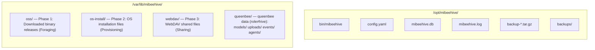

# MiBeeHive Deployment Guide

[中文](../zh-CN/deployment.md)

## Target Device: ARM64 NAS Device

### Specifications
- **SSH**: `ssh user@device-ip`
- **OS**: Linux (Debian/Ubuntu/Armbian), kernel 6.0+, aarch64
- **Hardware**: ARM64 device with ≥1GB RAM, ≥32GB storage
- **No Go toolchain on device** — cross-compile locally, SCP binary over

## Build Commands

### Local Development Build
```bash
go build -o mibeehive ./cmd/mibeehive              # Build for current architecture
```

### ARM64 Cross-Compile
```bash
GOARCH=arm64 CGO_ENABLED=0 go build -o mibeehive-arm64 ./cmd/mibeehive  # Cross-compile for ARM64
```

### Build Migration Tool
```bash
go build -o migrate ./cmd/migrate                   # Build migration tool
```

### Testing
```bash
go test ./...                                       # Run all tests
go test -v ./internal/crawler                       # Run specific package tests
go vet ./...                                        # Static analysis
```

## Deployment Layout (on device)



> The queenbee event store is a separate SQLite file (`queenbee/events/events.db`), deliberately outside the main database — the coupling boundary reserved for the later queen process split.

## Deploy & Restart

### 1. Cross-compile locally (on dev machine)
```bash
GOARCH=arm64 CGO_ENABLED=0 go build -o mibeehive-arm64 ./cmd/mibeehive
```

### 2. Upload to device
```bash
scp mibeehive-arm64 user@device-ip:/opt/mibeehive/bin/mibeehive
```

### 3. Restart via systemd
```bash
ssh user@device-ip "pkill mibeehive; sleep 1 && sudo systemctl restart mibeehive"
```

## Systemd Service

### Service File
Service file is located at `configs/mibeehive.service`. Install and enable on device:

```bash
sudo systemctl start mibeehive    # Start
sudo systemctl stop mibeehive     # Stop
sudo systemctl restart mibeehive  # Restart
sudo systemctl status mibeehive   # Status
journalctl -u mibeehive -f       # Follow logs
```

### Systemd Configuration
The service is configured with memory limits appropriate for ARM64 devices:
- `GOMEMLIMIT=256MiB` - Memory limit for Go runtime
- Auto-restart on failure
- Logging to journal

## Verification (on device)

### Service Status
```bash
sudo systemctl status mibeehive
```

### Health Checks
```bash
curl -s http://localhost:9090/ | head -5              # Health check
curl -s -X PROPFIND http://localhost:9090/webdav/     # WebDAV check
curl -sk https://localhost:9443/ | head -5            # HTTPS check
```

### Log Monitoring
```bash
journalctl -u mibeehive -f                           # Follow logs
tail -f /var/log/mibeehive/mibeehive.log           # Application logs
```

## Configuration

### Production Config File
Production config at `/etc/mibeehive/config.yaml` differs from `configs/config.yaml`:

```yaml
storage:
  base_path: /var/lib/mibeehive/     # Note: includes oss subdirectory
database:
  path: /opt/mibeehive/mibeehive.db  # Path to SQLite database
server:
  port: 9090
  https_port: 9443
auth:
  jwt_secret: your-jwt-secret-here
  password_hash: your-password-hash-here
```

### Configuration Management
- Auto-generates default config if file missing on startup
- Supports YAML format only
- Environment-specific configurations stored in YAML
- Database stores project configuration separately from infrastructure config

## Queenbee Deployment

### Role selection

```yaml
queenbee:
  role: all            # hive (default, supply only) | queen (pure queenbee) | all (both planes, single port)
  auth_token: <secret> # static token for /queen APIs (scripts/agents); the admin plane also accepts hive JWTs
  base_url: http://this-host:9090/queen   # builds download URLs for model_id commands
  mqtt:
    enabled: true
    broker: tcp://mqtt-host:1883
    client_id: mibeehive-queen
  events_backend: sqlite   # sqlite (default) | jsonl | memory
```

Environment variables override YAML (the pre-merge ops-agent-center contract is preserved): `QUEENBEE_ROLE` / `AUTH_TOKEN` / `QUEENBEE_BASE_URL` (legacy `CENTER_BASE_URL`) / `MQTT_ENABLED` / `MQTT_BROKER` / `EVENTS_BACKEND` / `SUPPLY_TOKEN`, full list in `internal/queenbee/queenbee.go`.

### Dependencies

- **MQTT broker** (required when `mqtt.enabled: true`): mosquitto or any compatible broker; credentials ride the broker username/password
- **kite agent** (edge side): see the kite-agent-rust repository; point its broker at the same address

### Channel tokens (supply-plane gating)

```bash
# Login for a JWT
JWT=$(curl -s -X POST http://host:9090/api/v1/auth/login \
  -H 'Content-Type: application/json' -d '{"username":"admin","password":"..."}' | jq -r .data.token)

# Issue a channel token
curl -s -X POST -H "Authorization: Bearer $JWT" -H 'Content-Type: application/json' \
  -d '{"name":"edge-fleet"}' http://host:9090/api/v1/admin/channels/1/tokens

# Flip the governing channel to token_read (reads require the token; revocations apply immediately)
curl -X PUT -H "Authorization: Bearer $JWT" -H 'Content-Type: application/json' \
  -d '{"auth_mode":"token_read"}' http://host:9090/api/v1/admin/channels/1
```

Client usage (the token rides in the URL):

```bash
echo "deb http://u:<token>@host:9090/apt stable main" > /etc/apt/sources.list.d/mibeehive.list
pip install --index-url http://u:<token>@host:9090/simple/ <pkg>
```

### Model distribution

Uploads (`POST /queen/api/v1/models/upload`, multipart `file=@model.gguf`) register as hive
artifacts (sha256 identity, public_token, virtual index); `model_id` commands resolve the
supply-plane URL and embed credentials automatically. Under a token_read channel, configure
the distribution channel token:

```yaml
queenbee:
  supply_token: <channel-token>   # or the SUPPLY_TOKEN environment variable
```

## Memory Management

### Target Device Constraints
- **Total RAM**: ≥1GB (recommended ≥2GB)
- **Go memory limit**: 256MB (via `GOMEMLIMIT`)
- **Available for application**: ~213MB
- Optimized for low-memory usage:
  - Single SQLite connection (`db.SetMaxOpenConns(1)`)
  - Streaming downloads (no buffering entire files)
  - Efficient logging (`log/slog` with structured output)

## Network Configuration

### Ports
- **HTTP**: 9090 (main web interface + supply endpoints + the `/queen/` control plane)
- **HTTPS**: 9443 (WebDAV and admin panel)
- **PXE**: 9090 (public endpoints, no auth)
- **MQTT**: broker deployed separately (default 1883, per broker config)

### Firewall Considerations
- Ensure ports 9090 and 9443 are accessible
- PXE endpoints must be publicly accessible (no auth)
- Admin endpoints require JWT authentication
- Supply endpoints are open by default (`anonymous_read`); switch to `token_read` + channel tokens to gate them
- kite agents must reach the MQTT broker

## Backup and Recovery

### Backup Strategy
- Database: SQLite file (`mibeehive.db`)
- Configuration: `/etc/mibeehive/config.yaml`
- Downloaded files: Automated backup to `backup-*.tar.gz`
- Systemd service state: Handled by systemctl

### Recovery Steps
1. Stop the service: `sudo systemctl stop mibeehive`
2. Backup existing files
3. Restore from backup
4. Start the service: `sudo systemctl start mibeehive`

## Monitoring and Maintenance

### Log Rotation
Configured via crontab on device:
- Weekly Sunday 01:00: Clean logs older than 30 days in `/var/log/mibeehive/`
- Monthly 1st 09:00: Generate download report via `/opt/mibeehive/bin/generate-report.sh`

### Performance Monitoring
- Monitor memory usage: `ps aux | grep mibeehive`
- Check disk space: `df -h`
- Review application logs for errors and warnings

### Common Issues
1. **Memory issues**: Monitor `GOMEMLIMIT` usage, check for memory leaks
2. **Disk space**: Monitor storage paths, especially download directories
3. **Network connectivity**: Ensure device has internet for crawling
4. **Database corruption**: Use SQLite integrity checks