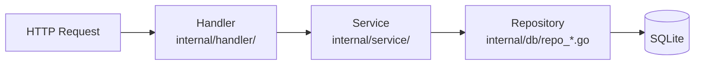

# MiBeeHive Development & Contributing

For contributors to MiBeeHive: environment setup, code layout, conventions, and tests. For the code of conduct and PR process, see [`CONTRIBUTING.md`](https://github.com/Mi-Bee-Studio/MiBeeHive/blob/main/CONTRIBUTING.md).

> Keep the product's positioning in mind: MiBeeHive is a **supply chain of ops tooling for external servers** — it collects ops tools and serves them over standard protocols. It is not a local-machine app-store ops panel; check features against that scope before proposing them.

## Setup

- **Go 1.26+** (per `go.mod`)
- **Git**
- **Node** (optional) — only needed for frontend unit tests (vitest); builds need **no** npm

```bash
git clone https://github.com/Mi-Bee-Studio/MiBeeHive.git
cd MiBeeHive
go mod download
go build -o mibeehive ./cmd/mibeehive
./mibeehive                 # UI: http://localhost:9090  default admin/admin
```

> **Platform note**: `internal/service` and friends use the Unix-only `syscall.Statfs`, so the project **only builds for Linux targets**. When developing on Windows/macOS, cross-compile (`GOOS=linux GOARCH=amd64/arm64 CGO_ENABLED=0`) or run tests inside WSL.

## Code layout

```text
cmd/mibeehive/        main entry; init.go wires dependencies and registers routes
cmd/migrate/          standalone migration tool
internal/
  handler/            HTTP handlers (domain-grouped files, co-located *_test.go)
  service/            business logic
  db/                 repository layer (repo_*.go) + migrations/ (sequential 001–0NN)
  crawler/            crawl orchestration (CrawlManager/Scheduler)
  source/             two-track source model: Source/Fetcher/Registry + YAML fingerprints
  supply/             supply layer (APT, PyPI Simple, generic repo)
  config/ middleware/ monitor/ webdav/ docker/
web/                  frontend (Preact + HTM, embedded via go:embed)
configs/              config.yaml sample and systemd service file
docs/                 bilingual docs (zh/ en/)
```

## Layer rules (backend hard constraint)

The request path is fixed at four layers — **never skip a layer**:



- **Routing**: everything registers in `buildRouter()` in `cmd/mibeehive/init.go`. Public routes (login, PXE, public ISO list/download, health, metrics, supply endpoints) go on the outer `mux`; everything else under `/api/v1/*` goes on `apiMux` wrapped by the JWT middleware. **Route path strings live as constants in `internal/model/routes.go`** — reference the constants instead of re-typing paths.
- **Migrations**: `internal/db/migrations/` are sequentially numbered. **Never modify an existing migration** — always add the next number.
- **Errors**: wrap with context, `fmt.Errorf("db query failed: %w", err)` style — never return a bare `err`; compare sentinel errors with `errors.Is`.
- **Logging**: structured `log/slog` key-value pairs (`slog.Info("file download started", "file_id", file.ID)`); no `fmt.Println`/`log.Println` in app code.
- **Tests**: table-driven; mock external dependencies.

## Frontend structure (web/js/, three tiers)

- **`core/`** — framework globals: `api.js` (HTTP client with 401 refresh), `components.js` (toast/modal/table/**moduleTabs**/FilterBar/ActionMenu exposed as `Components.*`), `state.js` (global App singleton + event bus + scoped timers), `router.js` (hash router with `:id`/`:subtab` params + per-route AbortController), `preact.js` (the `PreactBridge` global), `i18n.js`, and more.
- **`layout/`** — `shell.js`, `sidebar.js` (grouped nav: Foraging → Supply → Provisioning → Ops), `bottom-tab.js` (mobile).
- **`modules/`** — one file per page/tab. Module contract: `{ render(params, query, signal), destroy() }`.

Frontend conventions (easy to get wrong):

- Take Preact APIs from the global bridge: `var { html, useState, useEffect } = PreactBridge;`
- Always use shared utilities through their global namespace: `Components.showToast(...)`, `Helpers.escapeHtml` — never bare calls.
- CSS uses variables (`--color-*`), **never `!important`**; periodic refreshes use **targeted DOM manipulation** (`textContent`/`classList`, locate nodes via `data-id`), not `innerHTML`; update Chart.js instances **in place** (`chart.data = …; chart.update('none')`).
- **i18n**: add every new user-facing string to **both** the `zh` and `en` dictionaries and use `t('key')` — don't hardcode UI text.
- The frontend is embedded via `//go:embed web` with **no hot reload** — rebuild with `go build` after changes; when you touch a `<script>` tag, bump its `?v=` cache-buster in `web/index.html`.

## Build & test

```bash
go vet ./...                # static analysis (CI-required)
go test -race ./...         # full test suite (CI-required)
go test -v ./internal/crawler
go test -v ./internal/service

golangci-lint run           # local lint (v2, config in .golangci.yaml)

npx vitest run              # frontend unit tests (optional, needs node)

# Cross-compile
GOOS=linux GOARCH=arm64 CGO_ENABLED=0 go build -o mibeehive-arm64 ./cmd/mibeehive
```

CI (`.github/workflows/ci.yml`) runs `go vet` + `go test -race` + build on every push/PR; `v*` tags trigger the multi-arch (amd64/arm64) Docker image build and push to GHCR. The version is injected via `-ldflags "-X main.version=…"`.

## Commit & docs conventions

- **Conventional Commits**: `type(scope): description` with `type` one of `feat` / `fix` / `docs` / `style` / `refactor` / `test` / `chore`.
- **Bilingual docs**: user-facing doc changes must update both `docs/zh/` and `docs/en/` (the studio's docs center syncs these two directories per language).
- **Always tag fenced code blocks**: `bash` for shell, `yaml`/`json` for config, `go`/`typescript` for code; `text` for diagrams, directory trees, and plain output. The studio docs center syntax-highlights by tag; CI rejects bare fences.
- Releases: tag `v*`; record changes in `docs/{zh,en}/changelog.md`.
