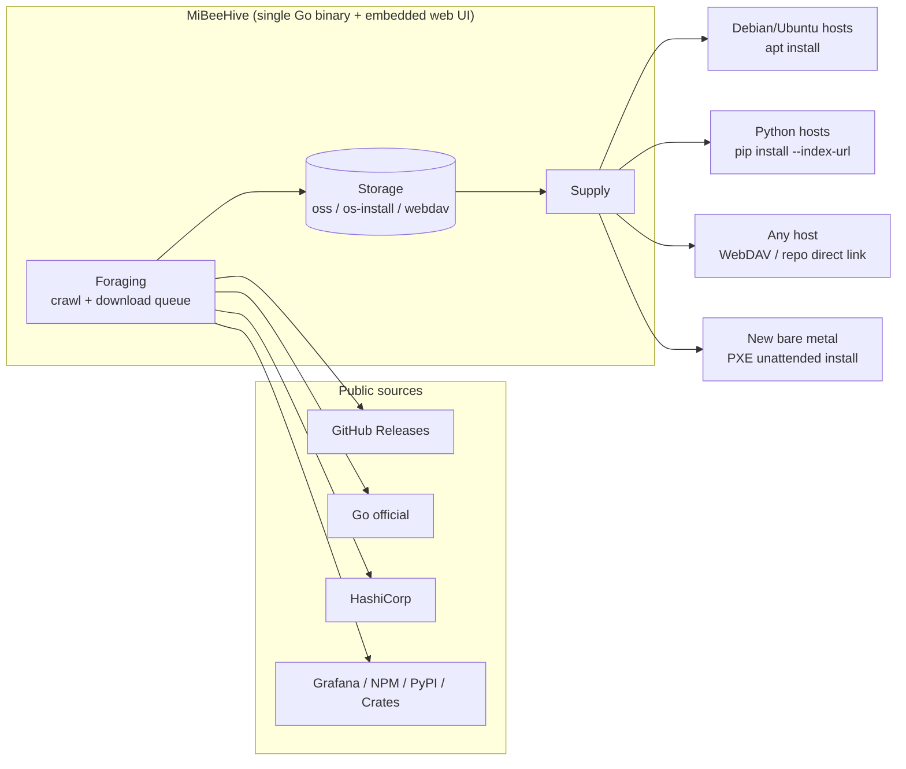

# MiBeeHive Product Introduction

MiBeeHive is a **lightweight, self-hosted supply-chain platform for ops tooling**: it continuously collects the binaries, packages, and ISOs your server fleet needs from public sources (GitHub, Go, HashiCorp, Grafana, NPM, PyPI, Crates), then serves them to external servers over their **native** standard protocols (APT, PyPI Simple, a generic repo index, WebDAV) — every machine in the fleet pulls with the tools it already has (`apt`, `pip`, any WebDAV client). **No agent to install.**

It ships as a single static Go binary with an embedded web admin panel and runs on any Linux host (amd64 / arm64) — resource-frugal enough for a 469MB-RAM NAS or mini PC, scalable up to a full server. Licensed under AGPL-3.0.

> **The hive metaphor**: a hive doesn't produce nectar — it forages, stores, and distributes it. MiBeeHive doesn't invent protocols; it *implements* them. The product is a **supply chain**: Foraging → Storage → Supply.

## The three questions it answers

1. **What tools does the fleet need?** The foraging layer crawls and downloads binary releases from public sources — GitHub Releases, official Go distributions, HashiCorp, Grafana, NPM, PyPI, Crates — refreshed on per-project intervals, with a download queue, retries, and integrity checks.
2. **How does the fleet take delivery?** The supply layer exposes collected artifacts over the protocols external servers natively speak: an APT repository (`/apt/`), a PyPI Simple index (`/simple/`, PEP 503), and a generic JSON manifest (`/repo/index`) with direct downloads (`/repo/files/{id}`). These endpoints are public and unauthenticated, designed for unattended pulls.
3. **How does new bare metal join the chain?** The provisioning layer provides unattended OS installation: an ISO catalog with a download queue, OS install template generation (preseed / kickstart / autoinstall), and public PXE endpoints — a new server is fed by MiBeeHive from its very first boot.

## The four modules

| Module | Responsibility | Storage |
|--------|----------------|---------|
| **Foraging** | The supply engine: crawl and download binary releases, manage sources and API tokens | `{base_path}/oss/` |
| **Supply** | Serve collected artifacts over native standard protocols | No separate storage; protocol indexes are generated on demand over `oss/` |
| **Provisioning** | PXE unattended OS install, template generation, ISO catalog and downloads | `{base_path}/os-install/` |
| **Sharing** | WebDAV file serving (anonymous read + admin write, self-signed HTTPS) | `{base_path}/webdav/` |

Plus cross-cutting features: an **overview home** (the supply-chain landing page), **system status** (dashboard/logs/tasks via a single aggregated API), **container management** (local Docker + remote registry sync and retention policies), global search, and backup.

## Core capabilities

### Two-track foraging engine

- **YAML fingerprints for single-page sources** (`internal/source/fingerprints/`): declarative request/extraction rules — no Go code needed per source; fingerprints can also be loaded from the database.
- **Go adapters for stateful protocols**: sources requiring sessions, pagination, or complex protocol interactions are implemented as native adapters.
- **Resilience**: bounded exponential-backoff retries, a per-source fetch timeout (one slow source can't stall a crawl cycle), and classified error statuses (`network_error` / `rate_limited` / `error`) that separate transient failures from real upstream problems.
- **API token management**: tokens for GitHub and friends are configured in the admin panel and injected into fingerprint requests automatically.

### Native-protocol supply

- **APT repository**: `dists/.../Packages[.gz]` + `Release` generated on demand over collected `.deb` files (mtime-invalidated caching). Clients just add `deb http://<host>:9090/apt stable main`.
- **PyPI Simple** (PEP 503): a project index over collected wheels/sdists with `#sha256=` fragments on file links and PEP 503 name normalization. Clients run `pip install --index-url http://<host>:9090/simple/ <pkg>`.
- **Generic repo**: `/repo/index` returns a JSON manifest of all suppliable files; `/repo/files/{id}` streams a direct download — the fallback channel for artifacts without a native protocol.
- **Protocol roadmap** (planned): Go module proxy, YUM/DNF, NPM registry, Helm repository, OCI registry.

### Supply-chain provisioning

- ISO catalog: two-level scraping (distro → version → files), version-aware sorting, and a background download queue.
- OS install templates: preseed (Debian/Ubuntu), kickstart (RHEL family), autoinstall (modern Ubuntu) generation with web preview.
- PXE endpoints are public and unauthenticated (PXE clients can't log in) — plug in a cable and the machine joins the supply chain.

### Lightweight admin panel

- Embedded **Preact + HTM** SPA (no npm build step, baked into the binary via `go:embed`), dark/light themes, Chinese and English.
- Aggregated dashboard: a single `/api/v1/admin/dashboard/summary` API consolidates all module stats; incremental DOM updates keep it smooth on low-end devices.
- Container management (local Docker lifecycle, images, app templates) and remote registries (browsing, sync tasks, retention-policy cleanup).

## How it differs from a typical ops panel

Typical ops panels manage **the local machine**: install apps, build sites, watch metrics. MiBeeHive faces **the other servers** — it is the supply chain that feeds the whole fleet:

- It is **not** a local app store or site builder;
- It is **not** a TSDB or metrics aggregator — `/metrics` is for MiBeeHive's own health; it *supplies* `node_exporter`/`prometheus` to the fleet rather than competing with them;
- Its operating model is **supply-first**: passively serve artifacts over protocols. Active remote control of external servers (SSH/agent) is a long-term direction layered on top.

## Use cases

- **Homelabs / small server rooms**: one NAS or mini PC acts as the fleet's software warehouse; internal machines pull all `apt`/`pip` packages from it — saving internet bandwidth, with caching and control.
- **Air-gapped or restricted networks**: server fleets with limited outbound access take all their ops tooling from MiBeeHive.
- **Bulk provisioning**: new bare metal installs unattended via PXE and starts pulling from the supply chain immediately.
- **Version consistency**: pin a validated set of tool versions for the fleet with a unified upgrade cadence.

## Next steps

- [Quick Start](quick-start.md) — build, launch, first crawl, first pull
- [Architecture](architecture.md) — layers, modules, and data flow
- [Deployment](deployment.md) — production install, systemd, backups
- [Configuration](configuration.md) — every `config.yaml` option
