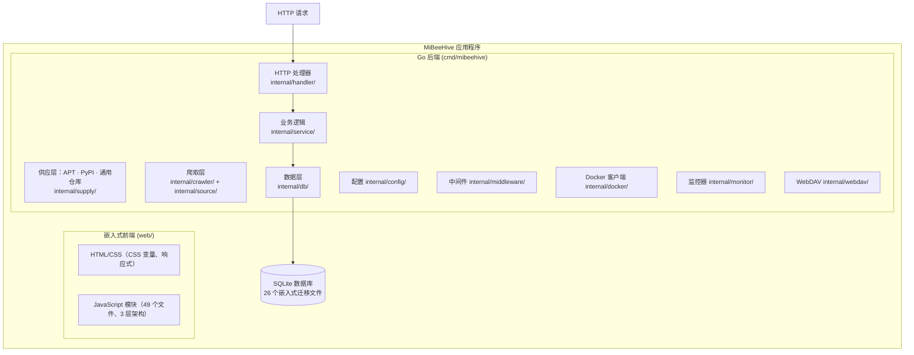
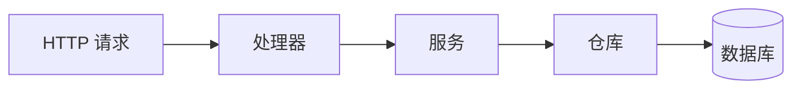

# MiBeeHive 架构文档

## 蜂巢哲学

MiBeeHive 是**面向外部服务器的运维工具供应链平台**。蜂巢是最贴切的隐喻：蜂巢不产花蜜，它**采集、酿造、分发**花蜜。MiBeeHive 不发明协议——它从公共源采集运维工具、持续更新，并按已有的标准协议对外供应给外部服务器。产品的本质是一条供应链，而下面两项自给自足的 provisioning 能力，是任何其他运维面板都没有的核心差异点：

- **采蜜 (Foraging)**: 供应引擎——从公共源抓取和下载运维工具（二进制发行版）
- **供应 (Supply)**: 把采集到的制品按外部服务器**原生**的标准协议对外供应（APT 仓库、PyPI Simple、通用仓库索引），让集群用自己现成的工具拉取——无需安装 agent
- **哺育 (Provisioning)**: 纳入新的外部服务器——通过 PXE 提供无人值守操作系统安装，让裸机能从零装机并被纳入供应
- **分享 (Sharing)**: 对外提供文件——基本的 WebDAV 能力，可通过 Web UI 配置

> **vs 一般运维面板：** 那些面板管理**本机**（应用商店、建站）。MiBeeHive 面向**外部**那些服务器——它是喂饱整个集群的供应链。

每个模块都在可配置的父路径下有独立的存储路径：`{base_path}/{oss,os-install,webdav}`。供应层不新增存储目录，而是按需在采蜜收集到 `oss/` 的制品之上生成各协议索引。

### 阶段路线图
- 第一阶段（已完成）：采蜜 — Web 管理爬取源、API 令牌、爬取控制、密码更改
- 第二阶段（已完成）：哺育 — 操作系统安装配置管理、PXE 端点、ISO 下载
- 第三阶段（已完成）：分享 — WebDAV 服务器、基础认证、HTTPS 支持
- 第四阶段（已完成）：供应 — 原生协议端点：APT 仓库（`/apt/`）、PyPI Simple（`/simple/`）、通用 `/repo/index` + `/repo/files/{id}`。爬取层也迁到了双轨模型（YAML 指纹 + Go 适配器）。

## 系统架构

MiBeeHive 是一个轻量的单体 Go 二进制文件，充当**外部服务器的供应中枢**：它爬取、下载并对外提供运维工具（GitHub、Go、HashiCorp、Grafana、NPM、PyPI），让外部服务器能从它这里取料。它可跑在任意 Linux 主机上（amd64 或 arm64），资源占用低到足以在 469MB 内存的 NAS 或迷你主机上运行，也可向上扩展到完整服务器。它通过 `go:embed` 嵌入一个 **Preact + HTM** SPA 前端，并包含一个 Web 管理面板，具有仪表板概览和标签式导航，用于管理全部四个模块（采蜜、供应、哺育、分享）以及容器、搜索、日志、任务和备份。**供应层**把采集到的制品按其原生标准协议对外暴露给外部服务器——协议路线图（APT、PyPI Simple 已上线；Go proxy / YUM / Helm / OCI 规划中）见[供应层](https://github.com/Mi-Bee-Studio/MiBeeHive/blob/main/docs/roadmap/supply-layer_zh.md)。

### 定位边界

- **是：** 一条运维工具**供应链**——采集、更新并按**已有**标准协议把运维工具供应给外部服务器。它实现协议，不发明协议。
- **不是**本机应用商店 / 快速建站（那是一般运维面板的职责）。
- **不是** TSDB / 指标聚合器。`/metrics` 仅用于 MiBeeHive 自身健康——MiBeeHive 把 `node_exporter`/`prometheus` **供应给**外部服务器，而不是与它们竞争。
- **运维模型：** 供应优先（被动地按协议供应制品）。对外部服务器的主动远程控制（SSH/agent）是远期方向，叠加在稳定的供应层之上。

### 架构概览

## 前端模块结构

前端是一个 **Preact + HTM** SPA，按 3 层架构组织（core 12 个文件 + layout 3 个 + modules 33 个，共 49 个）。

### 核心层 (web/js/core/)
- `api.js` - HTTP 客户端包装器（fetch + JWT 头注入 + 401 刷新 + AbortSignal 透传）
- `auth.js` - 登录/登出、令牌管理、localStorage
- `cache.js` - 客户端缓存工具
- `components.js` - 可重用 UI 组件（toast、modal、table、moduleTabs、FilterBar、ActionMenu）
- `drawer.js` - 滑出式抽屉面板
- `helpers.js` - 工具函数（formatDate、formatSize、debounce、statusBadge 等）
- `hooks.js` - 组合式 hooks（含绑定了 AbortSignal 与作用域定时器的 `Hooks.usePolling`）
- `preact.js` - **Preact 桥接**（`PreactBridge` 全局），提供 h、html、render、Component、Fragment + 全部 hooks
- `router.js` - 基于 SPA 的哈希路由（`:id`/`:subtab` 参数、每路由 AbortController、路由守卫）
- `search.js` - 全局搜索功能
- `state.js` - 全局 App 单例，具有事件总线和作用域定时器管理
- `tooltips.js` - 提示组件
- `i18n.js` - i18n 系统（zh/en），带有 `t('key')` 函数和 `{count}` 插值

### 布局层 (web/js/layout/)
- `shell.js` - 应用外壳（AppProvider + I18nProvider 包裹侧边栏/底部标签/主内容区）
- `sidebar.js` - 桌面侧边栏导航（按「采蜜→供应→哺育→运维」分组，带六边形品牌图标）
- `bottom-tab.js` - 移动端底部标签导航（与侧边栏同序）

### 模块层 (web/js/modules/)
- `overview.js` - 供应链总览首页（默认落地页）
- `foraging.js` + `files.js` / `files-crawl.js` / `files-projects.js` / `files-queue.js` - 采蜜模块（项目、爬取控制、下载队列）
- `file-center.js` / `file-detail.js` / `file-bulk.js` / `view-manager.js` - 跨项目文件中心与虚拟索引视图管理
- `supply.js` - 供应层页面（APT/PyPI 客户端配置片段）
- `deploy.js` + `deploy-configs.js` / `deploy-iso.js` / `foraging-iso.js` - 哺育模块（OS 安装配置、ISO 目录与队列）
- `share.js` / `share-files.js` / `share-link-dialog.js` - 分享模块（WebDAV 浏览、分享链接）
- `containers.js` / `containers-detail.js` / `containers-images.js` / `containers-templates.js` - 容器管理
- `registries.js` / `registries-repos.js` / `registries-sync.js` / `registries-cleanup.js` - 远程 registry（浏览、同步、保留策略）
- `dashboard.js` / `system-status.js` / `logs.js` / `tasks.js` - 系统状态（仪表板、日志、任务）
- `settings.js` - 设置（密码、主题、语言、磁盘阈值、存储路径）
- `external-service.js`、`search.js`、`login.js` - 外部服务、搜索结果、登录页

## 后端架构

### 层结构

### 处理器层 (internal/handler/)
- `auth.go` - 认证端点（登录、JWT 验证）
- `admin.go` - 管理面板端点（项目、令牌、爬取、安全、操作系统安装、WebDAV、监控配置）
- `backup.go` - 备份列表和恢复
- `container.go` - 容器 CRUD、启动/停止/重启、日志、统计
- `crawl.go` - 爬取管理（状态、触发、日志）
- `dashboard.go` - 聚合仪表板摘要（所有模块的单个 API）
- `file.go` - 文件操作（下载、搜索、队列）
- `iso.go` - ISO 下载管理、目录 CRUD、队列
- `logs.go` - 系统日志端点
- `os_install.go` - 操作系统安装配置、PXE 服务、配置预览
- `project.go` - 项目 CRUD 操作
- `search.go` - 全文搜索端点
- `system.go` - 系统信息和统计
- `tasks.go` - 后台任务端点
- `app_template.go` - 应用模板管理
- `stats.go` - 系统统计获取（抓取 node_exporter）

### 服务层 (internal/service/)
- `file_service.go` - 文件下载，带有重试和完整性检查
- `os_template.go` - 操作系统模板生成（preseed/kickstart/autoinstall）
- `iso_downloader.go` - ISO 下载，带有流式传输和磁盘检查
- `iso_catalog_service.go` - ISO 目录队列处理器，带有后台协程
- `container_service.go` - Docker 容器生命周期管理
- `search_service.go` - 文件和配置的全文搜索
- `log_service.go` - 日志聚合和查询
- `task_service.go` - 后台任务管理
- `app_template_service.go` - 应用模板处理
- `image_service.go` - Docker 镜像拉取/删除操作

### 仓库层 (internal/db/repo_*.go)
- `repo_project.go` - 项目数据访问
- `repo_credential.go` - API 令牌管理
- `repo_file.go` - 文件元数据和队列操作
- `repo_os_install_config.go` - 操作系统安装配置
- `repo_iso_catalog.go` - ISO 目录队列管理
- `repo_container.go` - 容器配置存储
- `repo_crawl_log.go` - 爬取日志存储和查询

## 模块概览

### 1. 采蜜（二进制发行版管理）
**用途**：从公共源爬取和下载二进制发行版
**存储**：`{base_path}/oss/`
**功能**：
- GitHub、Go、HashiCorp、Grafana、NPM、PyPI、Crates 等源
- 双轨源模型：单页源用 YAML 指纹（`internal/source/fingerprints/`），有状态协议用 Go 适配器
- 带上限的指数退避重试、单次爬取 context 超时、分类的错误状态（`network_error` / `rate_limited` / `error`），让瞬时失败与真正的上游问题可区分
- 源管理的 Web UI
- API 令牌认证
- 下载调度和重试逻辑

### 2. 供应（原生协议端点）
**用途**：把采集到的制品按外部服务器原生工具会说的协议对外供应——无需安装客户端。
**存储**：无独立存储；按需在采蜜收集到 `{base_path}/oss/` 的制品之上生成各协议索引。
**端点**（公开、无需认证，便于外部服务器无人值守拉取）：
- `GET /apt/{rest...}` —— 基于采集到的 `.deb` 构建 APT 仓库：按需生成 `dists/.../Packages[.gz]` + `Release`（按 mtime 失效的缓存、按文件缓存控制元数据）。客户端：`deb http://<host>:9090/apt stable main`。
- `GET /simple/{rest...}` —— 基于采集到的 wheel/sdist 构建 PyPI Simple 仓库（PEP 503）。客户端：`pip install --index-url http://<host>:9090/simple/ <pkg>`。
- `GET /repo/index` —— 全部可供应文件的通用 JSON 清单；`GET /repo/files/{id}` —— 单文件下载（暂无原生协议的产物的兜底）。
**规划中**（见[供应层](https://github.com/Mi-Bee-Studio/MiBeeHive/blob/main/docs/roadmap/supply-layer_zh.md)）：Go module proxy、YUM/DNF、NPM registry、Helm 仓库、OCI registry。

### 3. 哺育（操作系统安装）
**用途**：提供无人值守的操作系统安装配置
**存储**：`{base_path}/os-install/`
**功能**：
- PXE 配置服务
- 操作系统模板生成（preseed/kickstart/autoinstall）
- ISO 下载管理
- ISO 目录自动发现和队列管理
- 配置管理的 Web UI
- PXE 客户端的公共端点
- 配置预览功能
- ISO 下载的后台队列处理器

### 4. 分享（WebDAV 文件共享）
**用途**：用于文件共享的基本 WebDAV 功能
**存储**：`{base_path}/webdav/`
**功能**：
- WebDAV 文件服务
- 基础认证（匿名只读 + 管理员读写）
- 支持 HTTPS 和自签名证书
- 文件列表和管理
- 可通过 Web UI 配置

## 仪表板架构

仪表板通过单个 API 端点提供所有模块的聚合概览。

### 后端
- **端点**：`GET /api/v1/admin/dashboard/summary`（需要 JWT）
- **处理器**：`handler/dashboard.go` 中的 `DashboardHandler.Summary()`
- **响应**：`DashboardSummaryResponse`，包含：
  - `SystemModuleStats` — 版本、运行时间、CPU、内存、磁盘使用情况
  - `FilesModuleStats` — 项目数量、文件数量、队列统计
  - `DeployModuleStats` — 配置数量、ISO 数量/已下载/待处理
  - `SharedModuleStats` — WebDAV 文件数量和总大小
  - `[]ActivityEvent` — 最近的爬取活动和项目名称

### 前端
- 初始化时单个 API 调用，然后每 30 秒使用增量 DOM 更新进行轮询
- 每 10 秒单独轮询实时系统统计（CPU/内存/网络图表）
- 部分：欢迎横幅、状态卡片网格、合并的 CPU/内存图表、带阈值线的磁盘仪表板、活动时间线、快速操作栏、爬取活动图表、队列部分

### 监控配置
- **端点**：`GET/PUT /api/v1/admin/config/monitor`（需要 JWT）
- **处理器**：`AdminHandler.GetMonitorConfig()` / `UpdateMonitorConfig()`
- **用途**：磁盘警告/关键阈值配置（在 config.yaml 中持久化）

## 数据流

### 仪表板流

### 爬取和下载流

### 文件访问流

### WebDAV 流

### 操作系统安装流

## 关键设计原则

- **单体架构**：单个 Go 二进制文件，便于部署
- **嵌入式前端**：无需单独的 Web 服务器
- **SQLite 数据库**：轻量级、基于文件的存储（纯 Go 驱动程序）
- **Preact + HTM**：无框架，最小依赖（约 950KB 总量）
- **仅使用标准库**：无外部 Web 框架或 cron 库
- **资源高效**：低至 469MB 内存即可运行（如 NAS 或迷你主机）；多架构（amd64/arm64）
- **模块化设计**：四个功能模块之间的清晰分离
- **队列处理**：用于下载队列管理的后台协程
- **增量 DOM 更新**：定期刷新使用目标 DOM 补丁，从不使用 innerHTML
- **单一仪表板 API**：单个聚合端点减少仪表板上的请求数量
