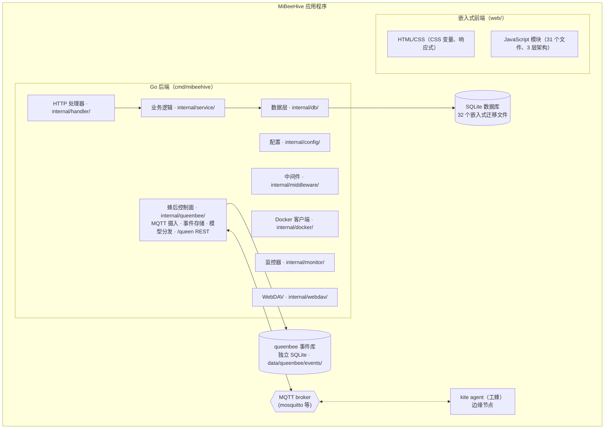
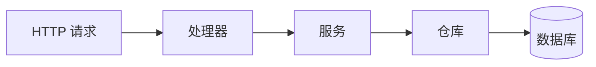
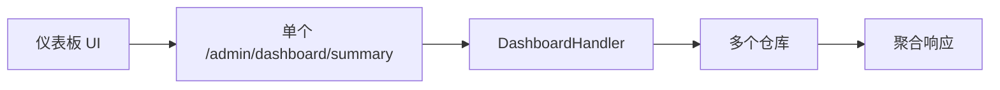
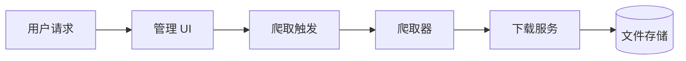
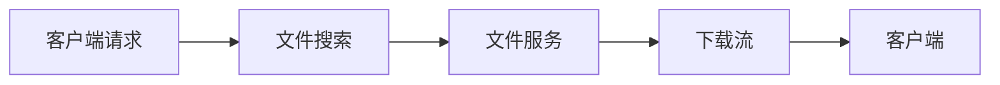
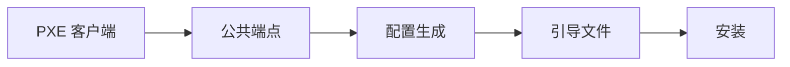
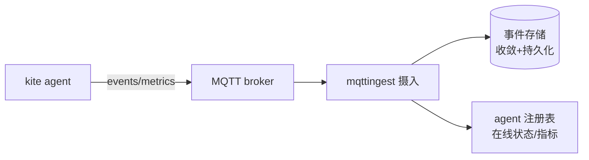

# MiBeeHive 架构文档

[English](../en-US/architecture.md)

## 蜂巢体系

MiBeeHive 是运维集群中心的**蜂巢**：一个单二进制里跑着两个面——

- **蜂巢面（hive，供应面）**：面向服务器的供应链
  - **采蜜 (Foraging)**: 从公共源抓取和下载二进制发行版用于内网使用
  - **供应 (Supply)**: 把采集到的工件按集群原生协议供出——APT 仓库（`.deb`）、PyPI Simple（PEP 503 wheel）、通用 `/repo/`、WebDAV，支持 Range 断点续传与 sha256 强 ETag
  - **哺育 (Provisioning)**: 通过 Web UI 提供无人值守的操作系统安装配置，包含特定 URL
  - **分享 (Sharing)**: 基本的 WebDAV 功能用于文件共享，可通过 Web UI 配置
- **蜂后面（queenbee，控制面）**：面向边缘 agent（kite / 工蜂）的指挥中枢——经 MQTT 收敛事件与指标、下发带回执的命令、把本地 AI 模型当作普通供应 artifact 分发

每个模块都在可配置的父路径下有独立的存储路径：`{base_path}/{oss,os-install,webdav}`；蜂后数据在 `{data_dir}/queenbee/{models,uploads,events,agents}/`（独立事件库，为后期蜂后进程分离保留耦合边界）。

### 角色模型

`queenbee.role` 选择本实例跑什么：

| 角色 | 行为 |
|---|---|
| `hive`（默认） | 仅供应面，行为与合并前一致 |
| `queen` | 纯蜂后——不启爬虫调度/下载重试/ISO 队列，供应前缀显式 404 |
| `all` | 双面单端口：供应在 `/`，控制在 `/queen/` |

### 阶段路线图
- 第一阶段（已完成）：采蜜 — Web 管理爬取源、API 令牌、爬取控制、密码更改
- 第二阶段（已完成）：哺育 — 操作系统安装配置管理、PXE 端点、ISO 下载
- 第三阶段（已完成）：分享 — WebDAV 服务器、基础认证、HTTPS 支持
- 第四阶段（已完成）：供应 — APT / PyPI Simple / 通用 repo 端点、虚拟索引、文件中心
- 第五阶段（2026-09 合并）：蜂后 — 原 ops-agent-center 吸收为 `internal/queenbee`，认证统一（JWT + 通道 token）、模型分发 artifact 化

## 系统架构

MiBeeHive 是一个单体 Go 二进制文件，用于爬取、下载和服务二进制发行版（GitHub、Go、HashiCorp、Grafana、NPM、PyPI），面向资源受限的 ARM64 NAS 设备（469MB RAM）。它通过 `go:embed` 嵌入了一个 **Preact + HTM** SPA 前端，并包含一个 Web 管理面板，具有仪表板概览和标签式导航，用于管理所有三个模块以及容器、搜索、日志、任务和备份。2026-09 合并后，同一二进制还承载**蜂后控制面**（`internal/queenbee/`）：MQTT 数据/命令面、事件收敛存储、模型分发与 fleet 面板，HTTP 面挂载在 `/queen/`。

### 架构概览

```mermaid
flowchart TB
  subgraph APP["MiBeeHive 应用程序"]
    subgraph BE["Go 后端（cmd/mibeehive）"]
      direction TB
      H["HTTP 处理器 · internal/handler/"]
      S["业务逻辑 · internal/service/"]
      D["数据层 · internal/db/"]
      C["配置 · internal/config/"]
      M["中间件 · internal/middleware/"]
      DK["Docker 客户端 · internal/docker/"]
      MO["监控器 · internal/monitor/"]
      WV["WebDAV · internal/webdav/"]
      QB["蜂后控制面 · internal/queenbee/<br/>MQTT 摄入 · 事件存储 · 模型分发 · /queen REST"]
      H --> S --> D
    end
    subgraph FE["嵌入式前端（web/）"]
      direction TB
      F1["HTML/CSS（CSS 变量、响应式）"]
      F2["JavaScript 模块（31 个文件、3 层架构）"]
    end
    DB[("SQLite 数据库<br/>32 个嵌入式迁移文件")]
    D --> DB
    QB --> EQ[("queenbee 事件库<br/>独立 SQLite · data/queenbee/events/")]
    MQ{{"MQTT broker<br/>(mosquitto 等)"}}
    QB <--> MQ
    MQ <-.-> K["kite agent（工蜂）<br/>边缘节点"]
  end
```

## 前端模块结构

前端是一个 **Preact + HTM** SPA，按 3 层架构组织成 38 个模块。详细文档请参见 `web/js/AGENTS.md`。

### 核心层 (web/js/core/)
- `api.js` - HTTP 客户端包装器（fetch + JWT 头注入）
- `auth.js` - 登录/登出、令牌管理、localStorage
- `components.js` - 可重用 UI 组件（toast、modal、table、tabs、skeletonCard）
- `drawer.js` - 滑出式抽屉面板
- `helpers.js` - 工具函数（formatDate、formatSize、debounce 等）
- `router.js` - 基于 SPA 的哈希路由，带有路由守卫
- `search.js` - 全局搜索功能
- `state.js` - 全局 App 单例，具有事件总线和定时器管理
- `preact.js` - **Preact 桥接**，提供 h、html、render、Component、Fragment + 所有 hooks
- `i18n.js` - i18n 系统（zh/en），带有 `t('key')` 函数和 `{count}` 插值

### 布局层 (web/js/layout/)
- `sidebar.js` - 桌面侧边栏导航（带有六边形品牌图标）
- `shell.js` - 应用外壳（渲染侧边栏 + 主内容区域）
- `bottom-tab.js` - 移动端底部标签导航

### 模块层 (web/js/modules/)
- `dashboard.js` - 聚合仪表板，包含欢迎横幅、状态卡片、图表、活动时间线、快速操作（727 行）
- `files.js` - 文件标签容器（子模块路由）
- `files-crawl.js` - 爬取控制子模块
- `files-projects.js` - 项目管理子模块
- `files-queue.js` - 下载队列子模块
- `deploy.js` - 部署标签容器
- `deploy-configs.js` - 操作系统安装配置管理
- `deploy-iso.js` - ISO 目录 + 下载管理
- `share.js` - 分享标签容器（WebDAV）
- `share-files.js` - WebDAV 文件浏览器
- `settings.js` - 设置（密码、主题、语言、磁盘阈值）
- `login.js` - 登录页面
- `containers.js` - 容器列表和管理
- `containers-detail.js` - 容器详情视图（日志、统计、环境变量）
- `containers-images.js` - Docker 镜像管理
- `containers-templates.js` - 应用模板
- `logs.js` - 系统日志查看器
- `search.js` - 搜索结果页面
- `tasks.js` - 后台任务查看器

## 后端架构

### 层结构

```mermaid
flowchart LR
  REQ["HTTP 请求"] --> H["处理器"] --> S["服务"] --> R["仓库"] --> DB[("数据库")]
```

### 处理器层 (internal/handler/)
- `auth.go` - 认证端点（登录、JWT 验证）
- `admin.go` - 管理面板端点（项目、令牌、爬取、安全、操作系统安装、WebDAV、监控配置）
- `backup.go` - 备份列表和恢复
- `container.go` - 容器 CRUD、启动/停止/重启、日志、统计
- `crawl.go` - 爬取管理（状态、触发、日志）
- `dashboard.go` - 聚合仪表板摘要（所有模块的单个 API）
- `file.go` - 文件操作（下载、搜索、队列）
- `iso.go` - ISO 下载管理、目录 CRUD、队列
- `logs.go` - 系统日志端点
- `os_install.go` - 操作系统安装配置、PXE 服务、配置预览
- `project.go` - 项目 CRUD 操作
- `search.go` - 全文搜索端点
- `system.go` - 系统信息和统计
- `tasks.go` - 后台任务端点
- `app_template.go` - 应用模板管理
- `stats.go` - 系统统计获取（抓取 node_exporter）

### 服务层 (internal/service/)
- `file_service.go` - 文件下载，带有重试和完整性检查
- `os_template.go` - 操作系统模板生成（preseed/kickstart/autoinstall）
- `iso_downloader.go` - ISO 下载，带有流式传输和磁盘检查
- `iso_catalog_service.go` - ISO 目录队列处理器，带有后台协程
- `container_service.go` - Docker 容器生命周期管理
- `search_service.go` - 文件和配置的全文搜索
- `log_service.go` - 日志聚合和查询
- `task_service.go` - 后台任务管理
- `app_template_service.go` - 应用模板处理
- `image_service.go` - Docker 镜像拉取/删除操作

### 仓库层 (internal/db/repo_*.go)
- `repo_project.go` - 项目数据访问
- `repo_credential.go` - API 令牌管理
- `repo_file.go` - 文件元数据和队列操作
- `repo_os_install_config.go` - 操作系统安装配置
- `repo_iso_catalog.go` - ISO 目录队列管理
- `repo_container.go` - 容器配置存储
- `repo_crawl_log.go` - 爬取日志存储和查询

## 三大模块概览

### 1. 采蜜（二进制发行版管理）
**用途**：从公共源爬取和下载二进制发行版
**存储**：`{base_path}/oss/`
**功能**：
- GitHub 发行版
- Go 二进制下载
- HashiCorp 产品发行版
- Grafana 发行版
- NPM 包下载
- PyPI 包下载
- 源管理的 Web UI
- API 令牌认证
- 下载调度和重试逻辑

### 2. 哺育（操作系统安装）
**用途**：提供无人值守的操作系统安装配置
**存储**：`{base_path}/os-install/`
**功能**：
- PXE 配置服务
- 操作系统模板生成（preseed/kickstart/autoinstall）
- ISO 下载管理
- ISO 目录自动发现和队列管理
- 配置管理的 Web UI
- PXE 客户端的公共端点
- 配置预览功能
- ISO 下载的后台队列处理器

### 3. 分享（WebDAV 文件共享）
**用途**：用于文件共享的基本 WebDAV 功能
**存储**：`{base_path}/webdav/`
**功能**：
- WebDAV 文件服务
- 基础认证（匿名只读 + 管理员读写）
- 支持 HTTPS 和自签名证书
- 文件列表和管理
- 可通过 Web UI 配置

### 4. 供应（原生协议端点）
**用途**：让集群服务器用它们现成的工具拉取采集到的工件，无需安装客户端
**端点**：
- **APT 仓库**（`/apt/`）：基于采集到的 `.deb`，按需生成 `Packages`/`Release`
- **PyPI Simple**（`/simple/`，PEP 503）：基于采集到的 wheel/sdist，sha256 fragment
- **通用 repo**（`/repo/index` + `/repo/files/{id}`）：JSON 清单 + 下载
**分发能力**：全部端点支持 Range 断点续传（206 分片、开区间续传）、HEAD、sha256 强 ETag 304 复验——多 GB 工件弱网可续传
**认证**：主管通道 `auth_mode` 门禁——`anonymous_read`（默认）开放；`token_read` 要求按通道签发的 token（Bearer / Basic 密码栏 / `?token=`，apt sources.list 与 pip `--index-url` 的 URL 可直接携带）

### 5. 蜂后（agent 控制面）
**用途**：指挥边缘 agent（kite / 工蜂）——事件/指标上行、命令下行、模型分发
**挂载**：HTTP 面在 `/queen/`（API `/queen/api/v1/*`，fleet 面板 `/queen/ui`）
**数据面（MQTT）**：
- 上行：`kite/agent/{id}/events`（收敛计数入库）与 `.../metrics`（挂到 agent 记录）
- 下行：`kite/agent/{id}/commands`（QoS 1，按命令 ID 幂等去重）；agent 回执 `command_result` 呈现在面板 "last cmd" 列
**事件存储**：SQLite 默认（去重收敛、30 天保留、node/severity/since 过滤），可切 jsonl/memory
**模型分发（artifact 化）**：上传模型自动注册为蜂巢 artifact（sha256 身份、public_token、进虚拟索引）；`model_id` 命令优先解析供应面 URL（`/repo/files/{id}`，继承通道认证与断点续传），凭据自动嵌入载荷
**命令集**：`status` / `reload_config` / `restart` / `download_model`（未知 agent 404、离线 409、未知类型 400）

## 认证模型（2026-09 统一后）

| 面 | 凭据 | 说明 |
|---|---|---|
| hive 管理 API/UI | JWT | `POST /api/v1/auth/login`；密码变更后旧 token 失效 |
| `/queen` 管理 API + fleet 面板 | **同一 JWT** 或静态 token（`AUTH_TOKEN`） | 面板沿用 hive 登录会话；脚本/agent 用静态 token |
| 供应面 + 蜂后模型下载 | **通道 token**（`auth_mode=token_read` 时） | 按通道签发/吊销（管理 API）；`anonymous_read` 开放 |
| WebDAV | Basic Auth | 匿名只读 + 管理员读写 |
| MQTT | broker 用户名/密码 | kite 配置段 |

## 仪表板架构

仪表板通过单个 API 端点提供所有模块的聚合概览。

### 后端
- **端点**：`GET /api/v1/admin/dashboard/summary`（需要 JWT）
- **处理器**：`handler/dashboard.go` 中的 `DashboardHandler.Summary()`
- **响应**：`DashboardSummaryResponse`，包含：
  - `SystemModuleStats` — 版本、运行时间、CPU、内存、磁盘使用情况
  - `FilesModuleStats` — 项目数量、文件数量、队列统计
  - `DeployModuleStats` — 配置数量、ISO 数量/已下载/待处理
  - `SharedModuleStats` — WebDAV 文件数量和总大小
  - `[]ActivityEvent` — 最近的爬取活动和项目名称

### 前端
- 初始化时单个 API 调用，然后每 30 秒使用增量 DOM 更新进行轮询
- 每 10 秒单独轮询实时系统统计（CPU/内存/网络图表）
- 部分：欢迎横幅、状态卡片网格、合并的 CPU/内存图表、带阈值线的磁盘仪表板、活动时间线、快速操作栏、爬取活动图表、队列部分

### 监控配置
- **端点**：`GET/PUT /api/v1/admin/config/monitor`（需要 JWT）
- **处理器**：`AdminHandler.GetMonitorConfig()` / `UpdateMonitorConfig()`
- **用途**：磁盘警告/关键阈值配置（在 config.yaml 中持久化）

## 数据流

### 仪表板流

```mermaid
flowchart LR
  UI["仪表板 UI"] --> API["单个 /admin/dashboard/summary"] --> H["DashboardHandler"] --> R["多个仓库"] --> RES["聚合响应"]
```

### 爬取和下载流

```mermaid
flowchart LR
  REQ["用户请求"] --> UI["管理 UI"] --> T["爬取触发"] --> CR["爬取器"] --> DS["下载服务"] --> FS[("文件存储")]
```

### 文件访问流

```mermaid
flowchart LR
  REQ["客户端请求"] --> Q["文件搜索"] --> S["文件服务"] --> DS["下载流"] --> C["客户端"]
```

### WebDAV 流

```mermaid
flowchart LR
  WC["WebDAV 客户端"] --> BA["基础认证"] --> FS["文件系统"] --> FO["文件操作"]
```

### 操作系统安装流

```mermaid
flowchart LR
  PXE["PXE 客户端"] --> PE["公共端点"] --> CG["配置生成"] --> BF["引导文件"] --> IN["安装"]
```

### 蜂后数据面流

```mermaid
flowchart LR
  K["kite agent"] -->|events/metrics| MQ["MQTT broker"] --> MI["mqttingest 摄入"] --> ES[("事件存储<br/>收敛+持久化")]
  MI --> AR["agent 注册表<br/>在线状态/指标"]
```

### 命令与模型分发流
```mermaid
flowchart LR
  OP["操作员/面板"] -->|POST /queen/api/v1/agents/{id}/commands| CP["命令发布"] --> MQ["MQTT broker"] --> K["kite agent"]
  K -->|command_result 回执| MQ --> MI["摄入"] --> AR["agent.last_command"]
  MM["模型上传"] -->|ArtifactSink<br/>sha256 身份| FC["蜂巢文件中心"] -->|model_id 解析| CP
  K -->|Range 续传下载| SP["供应面 /repo/files/{id}"]
```

## 关键设计原则

- **单体架构**：单个 Go 二进制文件，便于部署
- **双面单进程**：蜂巢供应面与蜂后控制面同端口共存（`/` 与 `/queen/`），后期蜂后分离是部署变更而非代码变更（ArtifactSink/事件库耦合边界为此预留）
- **嵌入式前端**：无需单独的 Web 服务器
- **SQLite 数据库**：轻量级、基于文件的存储（纯 Go 驱动程序）
- **Preact + HTM**：无框架，最小依赖（约 950KB 总量）
- **仅使用标准库**：无外部 Web 框架或 cron 库
- **资源高效**：针对 469MB ARM64 设备优化
- **模块化设计**：功能模块之间的清晰分离
- **队列处理**：用于下载队列管理的后台协程
- **增量 DOM 更新**：定期刷新使用目标 DOM 补丁，从不使用 innerHTML
- **单一仪表板 API**：单个聚合端点减少仪表板上的请求数量
- **sha256 即工件身份**：上传校验、强 ETag、artifact URL 解析、agent 端到端校验共用同一摘要