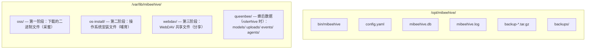

# MiBeeHive 部署指南

[English](../en-US/deployment.md)

## 目标设备：ARM64 NAS 设备

### 规格说明
- **SSH**: `ssh user@device-ip`
- **操作系统**: Linux (Debian/Ubuntu/Armbian), kernel 6.0+, aarch64
- **硬件**: ARM64 设备，≥1GB 内存，≥32GB 存储
- **设备上无 Go 工具链** — 在本地交叉编译，通过 SCP 传输二进制文件

## 构建命令

### 本地开发构建
```bash
go build -o mibeehive ./cmd/mibeehive              # 为当前架构构建
```

### ARM64 交叉编译
```bash
GOARCH=arm64 CGO_ENABLED=0 go build -o mibeehive-arm64 ./cmd/mibeehive  # 为 ARM64 交叉编译
```

### 构建迁移工具
```bash
go build -o migrate ./cmd/migrate                   # 构建迁移工具
```

### 测试
```bash
go test ./...                                       # 运行所有测试
go test -v ./internal/crawler                       # 运行特定包测试
go vet ./...                                        # 静态分析
```

## 设备上的部署布局



> 蜂后事件库是独立的 SQLite 文件（`queenbee/events/events.db`），刻意不并入主库——为后期蜂后独立成进程保留耦合边界。

## 部署与重启

### 1. 在本地交叉编译（在开发机器上）
```bash
GOARCH=arm64 CGO_ENABLED=0 go build -o mibeehive-arm64 ./cmd/mibeehive
```

### 2. 上传到设备
```bash
scp mibeehive-arm64 user@device-ip:/opt/mibeehive/bin/mibeehive
```

### 3. 通过 systemd 重启
```bash
ssh user@device-ip "pkill mibeehive; sleep 1 && sudo systemctl restart mibeehive"
```

## Systemd 服务

### 服务文件
服务文件位于 `configs/mibeehive.service`。在设备上安装并启用：

```bash
sudo systemctl start mibeehive    # 启动
sudo systemctl stop mibeehive     # 停止
sudo systemctl restart mibeehive  # 重启
sudo systemctl status mibeehive   # 状态
journalctl -u mibeehive -f       # 跟踪日志
```

### Systemd 配置
服务针对 ARM64 设备配置了内存限制：
- `GOMEMLIMIT=256MiB` - Go 运行时内存限制
- 失败时自动重启
- 日志记录到 journal

## 验证（在设备上）

### 服务状态
```bash
sudo systemctl status mibeehive
```

### 健康检查
```bash
curl -s http://localhost:9090/ | head -5              # 健康检查
curl -s -X PROPFIND http://localhost:9090/webdav/     # WebDAV 检查
curl -sk https://localhost:9443/ | head -5            # HTTPS 检查
```

### 日志监控
```bash
journalctl -u mibeehive -f                           # 跟踪日志
tail -f /var/log/mibeehive/mibeehive.log           # 应用程序日志
```

## 配置

### 生产配置文件
生产配置 `/etc/mibeehive/config.yaml` 与 `configs/config.yaml` 不同：

```yaml
storage:
  base_path: /var/lib/mibeehive/     # 注意：包含 oss 子目录
database:
  path: /opt/mibeehive/mibeehive.db  # SQLite 数据库路径
server:
  port: 9090
  https_port: 9443
auth:
  jwt_secret: your-jwt-secret-here
  password_hash: your-password-hash-here
```

### 配置管理
- 启动时如果文件缺失会自动生成默认配置
- 仅支持 YAML 格式
- 环境特定配置存储在 YAML 中
- 数据库将项目配置与基础设施配置分开存储

## 蜂后（queenbee）部署

### 角色选择

```yaml
queenbee:
  role: all            # hive（默认，仅供应）| queen（纯蜂后）| all（双面单端口）
  auth_token: <secret> # /queen API 静态 token（脚本/agent）；管理面同时接受 hive JWT
  base_url: http://this-host:9090/queen   # model_id 命令构造下载 URL 用
  mqtt:
    enabled: true
    broker: tcp://mqtt-host:1883
    client_id: mibeehive-queen
  events_backend: sqlite   # sqlite（默认）| jsonl | memory
```

环境变量优先于 YAML（沿用原 ops-agent-center 契约）：`QUEENBEE_ROLE` / `AUTH_TOKEN` / `QUEENBEE_BASE_URL`（旧名 `CENTER_BASE_URL`）/ `MQTT_ENABLED` / `MQTT_BROKER` / `EVENTS_BACKEND` / `SUPPLY_TOKEN` 等，完整清单见 `internal/queenbee/queenbee.go`。

### 依赖

- **MQTT broker**（`mqtt.enabled: true` 时必需）：mosquitto 或任意兼容 broker；内网部署可无 TLS，凭据走 broker 用户名/密码
- **kite agent**（边缘侧）：见 kite-agent-rust 仓库；broker 指向同一地址即可上线

### 通道 token（供应面门禁）

```bash
# 登录取 JWT
JWT=$(curl -s -X POST http://host:9090/api/v1/auth/login \
  -H 'Content-Type: application/json' -d '{"username":"admin","password":"..."}' | jq -r .data.token)

# 签发通道 token
curl -s -X POST -H "Authorization: Bearer $JWT" -H 'Content-Type: application/json' \
  -d '{"name":"edge-fleet"}' http://host:9090/api/v1/admin/channels/1/tokens

# 主管通道切为 token_read（读取即需 token；吊销即时生效）
curl -X PUT -H "Authorization: Bearer $JWT" -H 'Content-Type: application/json' \
  -d '{"auth_mode":"token_read"}' http://host:9090/api/v1/admin/channels/1
```

客户端用法（token 在 URL 中即可）：

```bash
echo "deb http://u:<token>@host:9090/apt stable main" > /etc/apt/sources.list.d/mibeehive.list
pip install --index-url http://u:<token>@host:9090/simple/ <pkg>
```

### 模型分发

上传（`POST /queen/api/v1/models/upload`，multipart `file=@model.gguf`）即注册为蜂巢
artifact（sha256 身份、public_token、进虚拟索引）；`model_id` 下发自动解析供应面
URL 并嵌入凭据。`token_read` 通道下，给蜂后配置分发用通道 token：

```yaml
queenbee:
  supply_token: <channel-token>   # 或环境变量 SUPPLY_TOKEN
```

## 内存管理

### 目标设备限制
- **总内存**: ≥1GB（推荐 ≥2GB）
- **Go 内存限制**: 256MB（通过 `GOMEMLIMIT`）
- **应用程序可用**: ~213MB
- 针对低内存优化的使用方式：
  - 单个 SQLite 连接（`db.SetMaxOpenConns(1)`）
  - 流式下载（不缓冲整个文件）
  - 高效日志记录（`log/slog` 结构化输出）

## 网络配置

### 端口
- **HTTP**: 9090（主要 Web 界面 + 供应端点 + `/queen/` 控制面）
- **HTTPS**: 9443（WebDAV 和管理面板）
- **PXE**: 9090（公共端点，无需认证）
- **MQTT**: broker 独立部署（默认 1883，按 broker 自身配置）

### 防火墙考虑
- 确保端口 9090 和 9443 可访问
- PXE 端点必须公开可访问（无需认证）
- 管理端点需要 JWT 认证
- 供应端点默认开放（`anonymous_read`）；需要门禁时切 `token_read` + 通道 token
- kite agent 需能到达 MQTT broker

## 备份与恢复

### 备份策略
- 数据库：SQLite 文件（`mibeehive.db`）
- 配置：`/etc/mibeehive/config.yaml`
- 下载的文件：自动备份到 `backup-*.tar.gz`
- Systemd 服务状态：由 systemctl 处理

### 恢复步骤
1. 停止服务：`sudo systemctl stop mibeehive`
2. 备份现有文件
3. 从备份恢复
4. 启动服务：`sudo systemctl start mibeehive`

## 监控与维护

### 日志轮转
通过设备上的 crontab 配置：
- 每周日凌晨 01:00：清理 30 天以上的日志文件在 `/var/log/mibeehive/`
- 每月 1 日 09:00：通过 `/opt/mibeehive/bin/generate-report.sh` 生成下载报告

### 性能监控
- 监控内存使用：`ps aux | grep mibeehive`
- 检查磁盘空间：`df -h`
- 检查应用程序日志中的错误和警告

### 常见问题
1. **内存问题**：监控 `GOMEMLIMIT` 使用情况，检查内存泄漏
2. **磁盘空间**：监控存储路径，特别是下载目录
3. **网络连接**：确保设备有互联网连接用于爬取
4. **数据库损坏**：使用 SQLite 完整性检查