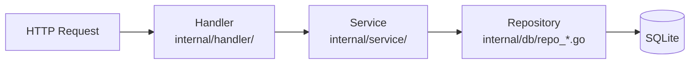

# MiBeeHive 开发与贡献

面向给 MiBeeHive 提交代码的贡献者：环境搭建、代码结构、约定与测试。行为准则与 PR 流程另见 [`CONTRIBUTING.md`](https://github.com/Mi-Bee-Studio/MiBeeHive/blob/main/CONTRIBUTING.md)。

> 请始终记住产品定位：MiBeeHive 是**面向外部服务器的运维工具供应链**——采集运维工具并按标准协议对外供应。它不是本机应用商店式的运维面板；提功能前请对照这个范围。

## 环境搭建

- **Go 1.26+**（以 `go.mod` 为准）
- **Git**
- **Node**（可选）——仅前端单元测试（vitest）需要；构建**不需要** npm

```bash
git clone https://github.com/Mi-Bee-Studio/MiBeeHive.git
cd MiBeeHive
go mod download
go build -o mibeehive ./cmd/mibeehive
./mibeehive                 # UI: http://localhost:9090  默认 admin/admin
```

> **平台注意**：`internal/service` 等包使用了 Unix-only 的 `syscall.Statfs`，因此项目**只能构建 Linux 目标**。在 Windows/macOS 上开发时，交叉编译（`GOOS=linux GOARCH=amd64/arm64 CGO_ENABLED=0`）或在 WSL 中运行测试与验证。

## 代码结构

```text
cmd/mibeehive/        主程序入口；init.go 集中装配依赖与注册路由
cmd/migrate/          独立迁移工具
internal/
  handler/            HTTP 处理器（按领域分文件，配套 *_test.go）
  service/            业务逻辑
  db/                 仓库层（repo_*.go）+ migrations/（001–0NN 顺序编号）
  crawler/            爬取编排（CrawlManager/Scheduler）
  source/             双轨源模型：Source/Fetcher/Registry + YAML 指纹
  supply/             供应层（APT、PyPI Simple、通用仓库）
  config/ middleware/ monitor/ webdav/ docker/
web/                  前端（Preact + HTM，经 go:embed 嵌入二进制）
configs/              config.yaml 样例与 systemd 服务文件
docs/                 双语文档（zh/ en/）
```

## 分层规则（后端硬约束）

请求路径固定为四层，**不得跳层**：



- **路由**：全部在 `cmd/mibeehive/init.go` 的 `buildRouter()` 注册。公开路由（login、PXE、ISO 公共列表/下载、health、metrics、供应端点）挂外层 `mux`；其余 `/api/v1/*` 挂 `apiMux` 并包 JWT 中间件。**路径字符串以常量形式定义在 `internal/model/routes.go`**——引用常量，不要重复手写。
- **迁移**：`internal/db/migrations/` 顺序编号。**绝不修改既有迁移文件**，永远新增下一个编号。
- **错误处理**：`fmt.Errorf("db query failed: %w", err)` 风格的上下文包装，不返回裸 `err`；哨兵错误用 `errors.Is` 比较。
- **日志**：`log/slog` 结构化键值对（`slog.Info("file download started", "file_id", file.ID)`）；应用代码禁止 `fmt.Println`/`log.Println`。
- **测试**：表驱动；外部依赖用 mock。

## 前端结构（web/js/，三层）

- **`core/`**——框架全局：`api.js`（带 401 刷新的 HTTP 客户端）、`components.js`（toast/modal/table/**moduleTabs**/FilterBar/ActionMenu，暴露为 `Components.*`）、`state.js`（全局 App 单例 + 事件总线 + 作用域定时器）、`router.js`（哈希路由，`:id`/`:subtab` 参数 + 每路由 AbortController）、`preact.js`（`PreactBridge` 全局桥）、`i18n.js` 等。
- **`layout/`**——`shell.js`、`sidebar.js`（按「采蜜→供应→哺育→运维」分组导航）、`bottom-tab.js`（移动端）。
- **`modules/`**——每个页面/标签一个文件。模块契约：`{ render(params, query, signal), destroy() }`。

前端约定（容易踩坑）：

- Preact API 从全局桥取：`var { html, useState, useEffect } = PreactBridge;`
- 共享工具一律走全局命名空间：`Components.showToast(...)`、`Helpers.escapeHtml`——不要裸调用。
- CSS 用变量（`--color-*`），**禁止 `!important`**；周期刷新用**目标 DOM 操作**（`textContent`/`classList`/`data-id` 定位），不用 `innerHTML`；Chart.js 实例**原地更新**（`chart.data = …; chart.update('none')`）。
- **i18n**：每个新界面字符串同时加进 `zh` 与 `en` 两本词典，用 `t('key')`，不硬编码文案。
- 前端经 `//go:embed web` 嵌入二进制，**没有热重载**——改完需重新 `go build`；改动了 `<script>` 标签时同步递增 `web/index.html` 里的 `?v=` 缓存版本号。

## 构建与测试

```bash
go vet ./...                # 静态检查（CI 必跑）
go test -race ./...         # 全量测试（CI 必跑）
go test -v ./internal/crawler
go test -v ./internal/service

golangci-lint run           # 本地 lint（v2，配置在 .golangci.yaml）

npx vitest run              # 前端单元测试（可选，需 node）

# 交叉编译
GOOS=linux GOARCH=arm64 CGO_ENABLED=0 go build -o mibeehive-arm64 ./cmd/mibeehive
```

CI（`.github/workflows/ci.yml`）在每次 push/PR 运行 `go vet` + `go test -race` + 构建；`v*` 标签触发多架构（amd64/arm64）Docker 镜像构建并推送 GHCR。版本号经 `-ldflags "-X main.version=…"` 注入。

## 提交与文档约定

- **Conventional Commits**：`type(scope): description`，type 取 `feat` / `fix` / `docs` / `style` / `refactor` / `test` / `chore`。
- **文档双语**：用户可见的文档改动需同时更新 `docs/zh/` 与 `docs/en/`（官网文档中心按语言目录同步这两处）。
- **代码块一律带语言标注**：shell 用 `bash`，配置用 `yaml`/`json`，代码用 `go`/`typescript`；图表、目录树、纯输出用 `text`。官网文档中心按标注做语法高亮，CI 会拦截裸围栏。
- 版本发布：打 `v*` 标签；变更记录写入 `docs/{zh,en}/changelog.md`。
