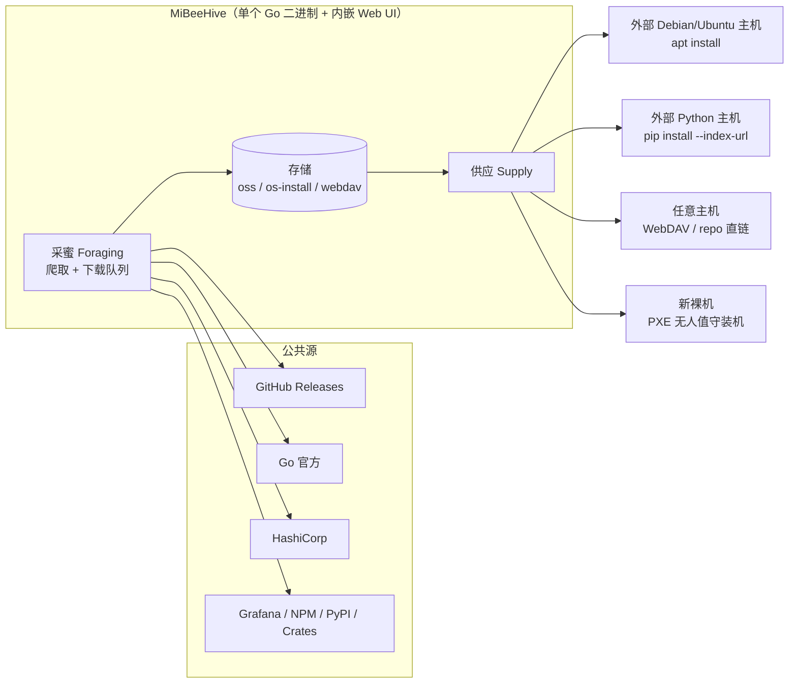

# MiBeeHive 产品介绍

MiBeeHive 是一个**轻量、自托管的运维工具供应链平台**：它从公共源（GitHub、Go、HashiCorp、Grafana、NPM、PyPI、Crates）持续采集你的服务器集群所需的二进制、安装包和 ISO，再按外部服务器**原生**的标准协议（APT、PyPI Simple、通用仓库索引、WebDAV）对外供应——集群里每台机器用它自己现成的工具（`apt`、`pip`、WebDAV 客户端）直接取料，**无需安装任何 agent**。

它是单个静态 Go 二进制 + 内嵌 Web 管理界面，可在任何 Linux 主机上运行（amd64 / arm64），资源占用低到足以跑在 469MB 内存的 NAS 或迷你主机上，也可向上扩展到完整服务器。许可证为 AGPL-3.0。

> **蜂巢隐喻**：蜂巢不产花蜜，它采集、酿造、分发花蜜。MiBeeHive 不发明协议——它实现协议。产品的本质是一条**供应链**：采集（Foraging）→ 存储 → 供应（Supply）。

## 它回答三个问题

1. **集群需要哪些工具？** 采蜜层从公共源抓取和下载二进制发行版：GitHub Releases、Go 官方发行版、HashiCorp、Grafana、NPM、PyPI、Crates 等，按项目配置的间隔持续更新，带下载队列、重试和完整性校验。
2. **集群怎么取走？** 供应层把采集到的制品按外部服务器原生工具会说的协议对外暴露：APT 仓库（`/apt/`）、PyPI Simple（`/simple/`，PEP 503）、通用 JSON 清单（`/repo/index`）+ 直链下载（`/repo/files/{id}`）。这些端点公开、无需认证，便于无人值守拉取。
3. **新的裸机怎么从零进链？** 哺育层提供无人值守操作系统安装：ISO 目录与下载队列、OS 安装模板生成（preseed / kickstart / autoinstall）、PXE 配置端点——新服务器从裸机装机那一刻起就从 MiBeeHive 取料。

## 四大模块

| 模块 | 职责 | 存储 |
|------|------|------|
| **采蜜 (Foraging)** | 供应引擎：爬取并下载二进制发行版，管理源与 API 令牌 | `{base_path}/oss/` |
| **供应 (Supply)** | 按原生标准协议对外供应采集到的制品 | 无独立存储，按需在 `oss/` 之上生成协议索引 |
| **哺育 (Provisioning)** | PXE 无人值守 OS 安装、模板生成、ISO 目录与下载 | `{base_path}/os-install/` |
| **分享 (Sharing)** | WebDAV 文件服务（匿名只读 + 管理员读写，支持自签名 HTTPS） | `{base_path}/webdav/` |

外加横切能力：**总览首页**（供应链落地页）、**系统状态**（仪表板/日志/任务，单一聚合 API）、**容器管理**（本地 Docker + 远程 registry 同步与保留策略）、全局搜索、备份。

## 核心能力

### 双轨采集引擎

- **单页源用 YAML 指纹**（`internal/source/fingerprints/`）：声明式的请求/提取规则，无需为每个源写 Go 代码；也支持从数据库加载指纹。
- **有状态协议用 Go 适配器**：需要会话、分页或复杂协议交互的源以原生适配器实现。
- **健壮性**：带上限的指数退避重试、单源抓取超时（一个慢源不会拖住整个爬取周期）、分类的错误状态（`network_error` / `rate_limited` / `error`），瞬时失败与真正的上游问题可区分。
- **API 令牌管理**：GitHub 等源的令牌经管理面板配置，自动注入指纹请求。

### 原生协议供应

- **APT 仓库**：基于采集到的 `.deb` 按需生成 `dists/.../Packages[.gz]` + `Release`（按 mtime 失效的缓存）。客户端只需 `deb http://<host>:9090/apt stable main`。
- **PyPI Simple**（PEP 503）：基于采集到的 wheel/sdist 生成项目索引，文件链接带 `#sha256=` 校验片段，项目名按 PEP 503 归一化。客户端 `pip install --index-url http://<host>:9090/simple/ <pkg>`。
- **通用仓库**：`/repo/index` 返回全部可供应文件的 JSON 清单，`/repo/files/{id}` 直链下载——没有原生协议的制品的兜底通道。
- **协议路线图**（规划中）：Go module proxy、YUM/DNF、NPM registry、Helm 仓库、OCI registry。

### 供应链式 Provisioning

- ISO 目录：两级抓取（发行版 → 版本 → 文件）、版本感知排序、后台下载队列。
- OS 安装模板：preseed（Debian/Ubuntu）、kickstart（RHEL 系）、autoinstall（Ubuntu 新版）生成，Web 预览。
- PXE 端点公开无需认证（PXE 客户端无法登录），新裸机插网线即可进入供应链。

### 轻量管理面板

- 内嵌 **Preact + HTM** SPA（无 npm 构建步骤，`go:embed` 进二进制），深色/浅色主题，中英双语。
- 聚合仪表板：单一 `/api/v1/admin/dashboard/summary` API 汇总所有模块状态，配合增量 DOM 更新，在低配设备上保持流畅。
- 容器管理（本地 Docker 生命周期、镜像、应用模板）与远程 registry（浏览、同步任务、保留策略清理）。

## 与一般运维面板的差异

一般运维面板管理**本机**：装应用、建站点、看监控。MiBeeHive 面向**外部那些服务器**——它是喂饱整个集群的供应链：

- **不是**本机应用商店或建站工具；
- **不是** TSDB / 指标聚合器——`/metrics` 仅用于 MiBeeHive 自身健康，它把 `node_exporter`/`prometheus` **供应给**集群，而不是与它们竞争；
- **运维模型**是供应优先：被动地按协议供应制品；对外部服务器的主动远程控制（SSH/agent）属于远期方向。

## 适用场景

- **homelab / 小机房**：一台 NAS 或迷你主机充当整集群的「软件仓库中枢」，内网机器 `apt`/`pip` 全走它，省外网带宽、可控可缓存。
- **离线或半离线环境**：外网受限的服务器集群从 MiBeeHive 取全部运维工具。
- **批量装机**：新裸机通过 PXE 无人值守装机，装完即从供应链取工具。
- **版本一致性**：为集群固定一批经过验证的工具版本，统一升级节奏。

## 下一步

- [快速开始](quick-start.md)——构建、启动、第一次采集与消费
- [架构文档](architecture.md)——分层、模块与数据流
- [部署指南](deployment.md)——生产部署、systemd、备份
- [配置参考](configuration.md)——`config.yaml` 全部选项
