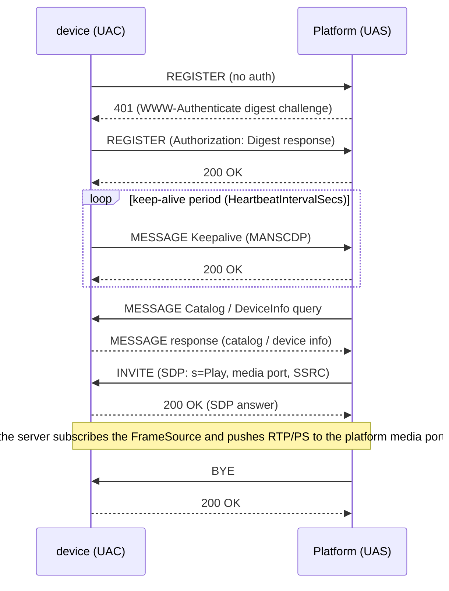

# Device (UAC): registering a camera with a platform

The `device` package turns a Go program into a GB/T 28181 camera:
REGISTER with digest auth, keepalive, catalog answering, and
INVITE-driven RTP/PS streaming — over UDP, TCP, or SIPS (TLS). Since
v0.11.0 every GB/T 28181-2022 device-side control, config, and
intercom flow has a decoded wire path plus a host seam.

## Install

```bash
go get github.com/mickeyzzc/gb28181-go@v0.11.0
```

## Config reference

```go
cfg := device.Config{
    Enabled:               true,
    PlatformSIPAddress:    "192.0.2.10",
    PlatformSIPPort:       5060,
    DeviceID:              "34020000001320000001",
    ChannelID:             "34020000001310000001",
    SIPDomain:             "3402000000",
    Password:              "secret",
    LocalSIPPort:          5060,
    RegisterIntervalSecs:   60,
    HeartbeatIntervalSecs: 60,
    HeartbeatTimeoutCount: 3,
    Transport:             "udp", // "udp" | "tcp" | "tls"
}
```

YAML tags match (`platform_sip_address`, …) — the struct can be
unmarshalled straight from your app's `gb28181:` section.

For `Transport: "tls"` (SIPS, GB/T 28181-2022 A-level), provision the
TLS fields: `TLSCAFile` (the platform's self-signed cert or CA),
optional `TLSCertFile`/`TLSKeyFile` for mutual auth, and
`TLSInsecureSkipVerify` for lab use only. The GB convention is a
self-signed CA whose serial is the device/platform ID.

## Identity

```go
srv := device.New(cfg, device.DeviceInfo{
    Name:         "Front gate",
    Manufacturer: "Acme",
    Model:        "Cam-X",
    Firmware:     "1.2.3",
    HardwareID:   "CamX-SoC",
    SerialNumber: "SN-42",
}, hub)
```

`device.UserAgent` (package var, default `GB28181-Go/1.0`) stamps the
SIP User-Agent — assign your own **before** `New`/`Start`; concurrent
mutation afterwards races the message builders.

## Live frames: FrameSource

```go
type FrameSource interface {
    Subscribe(ctx context.Context) *FrameSubscription
    Unsubscribe(id string)
}

type FrameSubscription struct {
    ID      string
    Channel <-chan AccessUnit
}
```

Push `AccessUnit` values (NALUs without Annex-B start codes,
`Timestamp`, `KeyFrame`) into your hub; the server subscribes on
INVITE and pushes RTP/PS to the platform's media port. Bounded,
drop-on-full channels are expected — never block your encoder on a
slow consumer. `device.NewFrameHub()` is a ready-made implementation;
`SIPPort()`/`SIPTCPPort()` report the bound ports.

## Recordings: RecordingIndex

```go
srv.SetRecordingIndex(myIndex) // implements Lookup(startMs, endMs) []SegmentMeta
```

With an index attached, the server answers RecordInfo queries and
serves paced playback and full-speed download, including SIP INFO
playback control (pause/resume/seek/speed). Segment files use the
reference format read by `device.OpenSegment`: bare Annex-B H.264 +
per-frame `.ts.jsonl` sidecar.

## DeviceControl: platform → device control commands

Install only the callbacks your hardware can honor — a command with no
registered callback keeps the historical explicit reject:

```go
srv.SetControlHandlers(device.ControlCallbacks{
    OnForceIFrame: func() { encoder.RequestIDR() },  // <IFrameCmd>Send</IFrameCmd>
    OnRecordCmd:   func(start bool) { recorder.SetPaused(!start) },
    OnPTZCmd:      func(cmd device.PtzCommand) { /* motor driver */ },
    OnDragZoom:    func(cmd device.DragZoom) { /* digital zoom */ },
    OnTeleBoot:    nil, // nil = control reject; no accidental remote reboots
})
```

- **PTZCmd** arrives bit-level decoded (§A.3/A.4): direction/lens bits,
  pan/tilt/zoom speeds, preset, cruise, FI, and aux switches.
  Standalone tooling can call `device.DecodePTZCommand(a505Hex)`
  directly — a total function: length/A5-start/checksum failures
  return `Kind=PtzInvalid` with `RawHex` preserving the input. The
  golden table is generated from the platform-side constructors, so
  encode and decode cannot drift.
- **DragZoom** (A.2.3.1.8/9) requires the six integer children
  `Length/Width/MidPointX/MidPointY/LengthX/LengthY` (playback-window
  pixels, origin top-left); a missing child is an explicit reject.
- **HomePosition** (A.2.3.1.10, DeviceControl family) reports `enabled`
  plus optional `resetTime`/`presetIndex` pointers.

On the platform side, `PTZController.SendIFrameCmd(channelID)` sends
the keyframe command (rejects any value other than `Send`).

## DeviceConfig and ConfigDownload

`SetConfigHandlers` installs the A.2.3.2 config callbacks — `OnBasicParam`
(all-optional children), `OnFrameMirror` (0 none … 3 both), and
`OnAlarmReport` (motion/field report switches). Unknown config
sub-commands stay explicit rejects. A `ConfigType=ConfigDownload`
query is answered with the minimal A.2.6.9 response built from the
running configuration:

```go
srv.SetConfigHandlers(device.ConfigCallbacks{
    OnFrameMirror:  func(mode uint32) { sensor.SetFlip(mode) },
    OnAlarmReport:  func(motion, field uint32) { gate.Set(motion == 1) },
})
```

## SUBSCRIBE/NOTIFY and the DeviceNotifier

The device answers SUBSCRIBE for Catalog/Alarm/MobilePosition — per-event
subscriptions with renewal, read-time expiry, and CSeq bookkeeping — and
exposes a host notifier:

```go
notifier := srv.Notifier()
if notifier.Subscribed(device.EventAlarm) {
    notifier.SendAlarm("4", "5", gbTime, "2", "yard motion")
}
notifier.SendCatalogChange(items)   // safe no-op when nobody subscribed
notifier.SendMobilePosition(&device.PositionReport{
    Time: gbTime, Longitude: "114.06", Latitude: "22.54",
})
```

`SetPositionSource` feeds a periodic MobilePosition loop (default 5 s
interval, re-armed on each new subscription).

## Voice talkback and broadcast

Three audio flows share the intercom surface:

- **Talkback receive** — the platform sends an audio-only INVITE and
  streams G.711 RTP. Install a `TalkbackSink`
  (`OnAudio(payload []byte, ssrc uint32, codec AudioCodec)`) with
  `srv.SetTalkbackSink(...)`; without a sink, or for non-G.711/TCP-media
  offers, the INVITE is refused **488**.
- **Talkback upstream** — feed `srv.SetTalkbackSource(frames)` with
  G.711 frames (20 ms pacing; PT 8/0 negotiated from the offer). A
  `recvonly` offer without a source is refused 488; goldens elsewhere
  are unchanged. `srv.TalkbackUpstreamCodec()` reports the negotiated
  PCMA/PCMU law so the host encodes with the right companding.
- **Voice broadcast** — platform notifies (A.2.5.5), the device acks
  (A.2.6.11) and answers the audio INVITE back-call; received RTP
  feeds the talkback sink. `srv.SetOnBroadcast(func(sourceID, targetID
  string))` notifies the host when a broadcast starts. The platform
  side is `sip.Server.StartBroadcast` ([platform](gb28181-go-platform.md));
  a conformance loopback test pins the full flow.

## Lifecycle

```go
err := srv.Start(ctx) // blocks? no — see below
...
srv.Deregister(ctx) // optional: REGISTER Expires: 0, then…
srv.Stop()
```

`Start` runs registration/keepalive/streaming goroutines under `ctx`
cancellation; `Stop` tears them down. Registration retries with backoff
and re-REGISTERs on expiry. Call `Deregister` first when the platform
should see the device go offline immediately (service restarts).

## SIP-Date time observation

REGISTER responses carry the platform's SIP `Date` header (2022 §9.10.2
time sync). `srv.PlatformDateUnix()` returns the last parsed value in
Unix seconds (0 when no response carried a parseable Date) — observation
only, the library never sets the clock. `device.ParseSIPDate(value)`
parses the three RFC 3261 date forms for hosts running their own drift
checks.

## Registration and streaming exchange



## Device IDs

```go
id, err := device.FormatDeviceID("34020000", 0, device.DeviceTypeIPC, 42)
parts, err := device.ParseDeviceID(id) // center/industry/type/serial
```

20-digit codes: `[8 region][2 industry][3 type][7 serial]`. Type
constants include `DeviceTypeIPC` (111), `DeviceTypeNVR` (118),
`DeviceTypeAlarm` (122).

## Reliability note: ACK snapshotting

gosip's transport layer rewrites the top Via of in-flight requests
without a lock (upstream
[ghettovoice/gosip#87](https://github.com/ghettovoice/gosip/issues/87)),
which races ACK construction once the 2xx arrives. Since v0.11.0 all
ACK paths build from a pre-send deep-clone snapshot of the INVITE —
the race detector showed 89 reports with the pass-through variant and
is clean with the snapshot.
