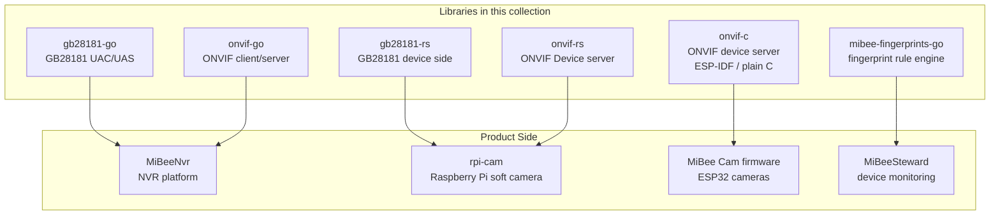

# MiBee Libraries Overview

This is the unified documentation for **open-source libraries extracted from our products**: GB28181 and ONVIF protocol libraries (Go / Rust / C implementations) and the fingerprint rule engine. They power MiBeeNvr, rpi-cam, the ESP32 camera firmware and friends, and are ready for independent use in your own projects.

## Ecosystem

## Libraries

| Library | Language | Positioning | Typical Consumers |
|---------|----------|-------------|-------------------|
| [gb28181-go](gb28181-go-platform.md) | Go | GB/T 28181 signaling: platform (UAC) & device (UAS), cascade, MANSCDP, PS muxing | MiBeeNvr |
| [gb28181-rs](gb28181-rs-server.md) | Rust | GB/T 28181 device side: register/keepalive, live streaming, playback, MANSCDP/PS, 2022 controls & intercom | rpi-cam |
| [onvif-go](onvif-go-architecture.md) | Go | ONVIF client + device server: discovery, auth, media, events — zero third-party deps | MiBeeNvr |
| [onvif-rs](onvif-rs-discovery.md) | Rust | ONVIF Device server: Media/PTZ/Imaging/Discovery/Security/Events services, optional TLS | rpi-cam |
| [onvif-c](onvif-c-quickstart.md) | C | ONVIF device server for ESP-IDF: SOAP Device/Media, Pull-Point MotionAlarm events, WS-Discovery — ~10 KB, zero third-party deps | MiBee Cam firmware |
| [mibee-fingerprints-go](fingerprints-overview.md) | Go | Reference engine for the MiBee fingerprint corpus: YAML rules → ServiceIdentity | MiBeeSteward |

## Choosing

- **GB/T 28181 interop**: use `gb28181-go` for platforms/gateways (Go); use `gb28181-rs` on the device side (Rust/embedded).
- **ONVIF interop**: need a client (discover & manage cameras) → `onvif-go`; need to expose a device as an ONVIF camera → `onvif-rs` (Linux) or `onvif-c` (ESP-IDF firmware).
- **Device fingerprinting**: classify collected evidence per the MiBeeSteward fingerprint spec → `mibee-fingerprints-go`.

> Contribution baseline and page conventions: [CONVENTIONS](https://github.com/Mi-Bee-Studio/mibee-docs/blob/main/mibeelibs/CONVENTIONS.md). This collection is independently maintained by the library team.
