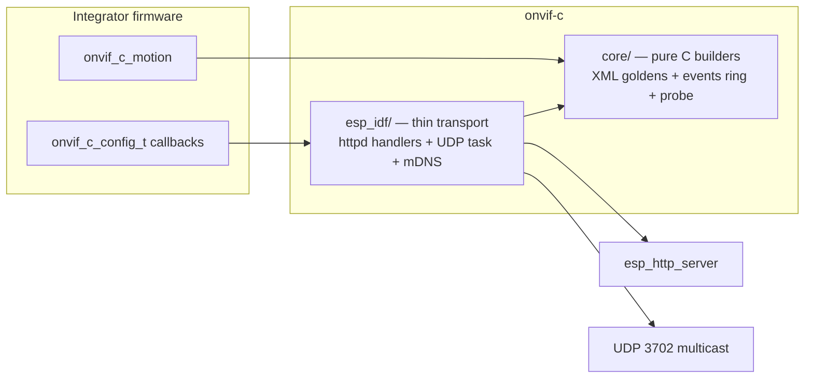
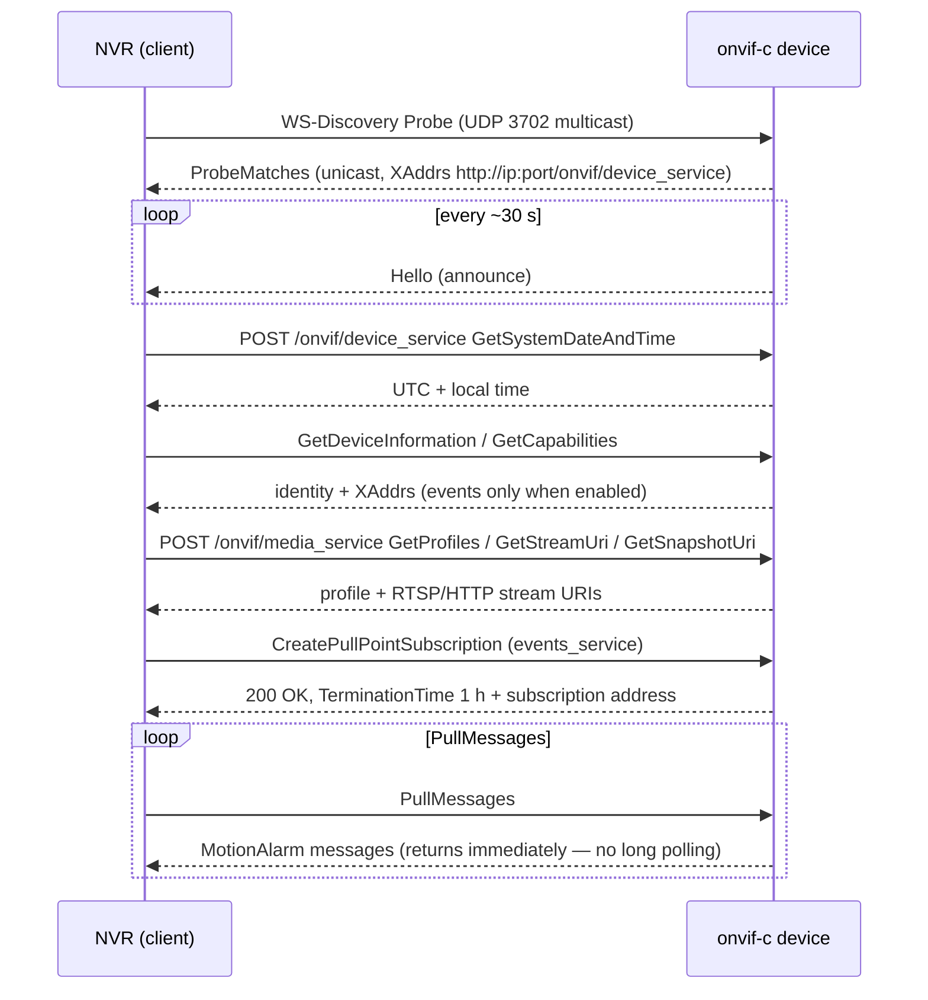

# onvif-c: ONVIF device server for ESP-IDF

A minimal ONVIF Device (server) library in plain C for ESP-IDF: expose an
ESP32 camera to NVRs over SOAP + WS-Discovery + Pull-Point events with zero
third-party dependencies and a ~10 KB code footprint. Extracted from the
production MiBee Cam firmware; response bytes are stable against real NVRs.

Sibling implementations: [onvif-rs](onvif-rs-quickstart.md) (Rust, Linux
device side) and the Go client [onvif-go](onvif-go-quickstart.md). Choose
onvif-c when the device is an ESP-IDF firmware and heap budget is tight.

## What the library serves

| Surface | Actions |
| --- | --- |
| SOAP Device service | `GetSystemDateAndTime`, `GetDeviceInformation`, `GetCapabilities` |
| SOAP Media service | `GetProfiles`, `GetStreamUri`, `GetSnapshotUri` |
| Pull-Point Events | `CreatePullPointSubscription`, `PullMessages`, `Unsubscribe` — `tns1:VideoSource/MotionAlarm` topic (`Source=CSI`, `State`, `Score 0-100`) |
| WS-Discovery | UDP 3702 / multicast 239.255.255.250 — unicast ProbeMatches, periodic Hello (~30 s) |
| Optional mDNS | `_onvif._tcp` advertisement |

No XML parser, no dynamic state beyond per-request buffers: action detection
is `strstr()`, responses are `snprintf()`. The motion producer hook is
non-blocking and safe from sensor callback context.

## Quick start

Vendor the tree at the release tag (e.g. `v0.2.0`) as
`components/onvif-c`, add `onvif-c` to main's `REQUIRES`, then:

```c
#include "onvif_c.h"

static const char *my_stream_uri(void) {
    return "rtsp://192.0.2.134:554/stream";   /* or http://ip:81/stream */
}

void app_onvif_start(httpd_handle_t httpd) {
    onvif_c_config_t cfg = {
        .manufacturer     = "MiBee",
        .model            = "MiBeeCam",
        .firmware_version = "v0.2.0",
        .serial           = my_serial,        /* stable hex string          */
        .uuid             = my_uuid,          /* no urn:uuid: prefix        */
        .ip               = my_ip,            /* NULL/"0.0.0.0" = not ready */
        .stream_uri       = my_stream_uri,
        .events_enabled   = my_events_gate,   /* NULL = no events service   */
        .http_port        = 80,               /* 0 -> 80; flows into XAddrs */
        .mdns_hostname    = "mibeecam-a1b2",  /* NULL = skip mDNS           */
    };
    onvif_c_start(httpd, &cfg);
}

/* From the motion detector (e.g. WiFi-CSI callback) — never blocks: */
onvif_c_motion(true, 87);   /* MotionAlarm State=true  Score=87 */
onvif_c_motion(false, 4);
```

`onvif_c_config_t` is the entire integration seam: identity strings, the four
required callbacks (`serial`/`uuid`/`ip`/`stream_uri`), optional overrides
(`snapshot_uri`, `frame_rate`, `scopes`), and runtime gates. Board specifics
never leak into the library. `ONVIF_C_VERSION` reports `major*10000 +
minor*100 + patch` (200 for v0.2.0).

While the IP callback returns `NULL`/`"0.0.0.0"` the library keeps serving
SOAP but stays quiet on discovery; `cfg->http_port` flows into every
advertised URI (capabilities XAddrs, ProbeMatches/Hello XAddrs, the
Pull-Point subscription address) — nothing hardcodes `:80`.

## Architecture



- **`core/`** is pure C with no ESP-IDF includes — host-testable with the
  system `cc`; it owns every response byte (XML builders, the events ring,
  the ProbeMatches/Hello builders).
- **`esp_idf/`** is a thin transport: registers the SOAP URI handlers on an
  existing `httpd` handle, runs the WS-Discovery responder task, owns the
  subscription state machine. It builds on ESP-IDF v5.5.x and v6.0.x.

## NVR onboarding, on the wire



PullMessages never blocks an httpd worker: it returns immediately with
whatever the ring holds. A subscription auto-expires after **120 s without
pulls** or at the 1 h granted termination time; a new
`CreatePullPointSubscription` replaces the previous one (single subscription
slot). `onvif_c_events_subscribed()` exposes the live state for diagnostics.

Motion events are queued only while a subscription is alive **and** the
runtime gate (`events_enabled`) returns true; if the producer cannot take
the lock it drops the event rather than block — the sensor callback always
returns promptly.

## Byte-stability contract

Response element names, prefixes, attribute order and namespace style are
load-bearing — NVR integrators may match raw substrings. Device/Media
envelopes use `soap:`/`tds:`/`trt:`/`tt:` (lowercase `utf-8` declaration);
Events envelopes use `s:`/`tev:`/`wsnt:` (uppercase `UTF-8`). Each style is
what real NVRs talk to in production; the difference is intentional, do not
"unify" it. The host golden tests pin the exact output — a diff there is a
behavior change, not a cosmetic one.

## Testing and quality gates

The host harness needs nothing but a C compiler and pthreads:

| Gate | Command | What it enforces |
| --- | --- | --- |
| Host tests | `tests/run.sh` | 212 checks: core golden bytes + the full ESP-IDF port layer driven through stubs |
| Coverage | `tests/coverage.sh` | ≥80% line coverage over `core/` + `esp_idf/` (currently 95%) |
| Style | `tools/check_style.sh` | clang-format clean (pinned `clang-format==22.1.8`) |
| Hygiene | `tools/check-repo-hygiene.sh` | no junk/secret files tracked |

The port layer is tested through `tests/host_stubs/`: a fake httpd capturing
requests/responses, a fake clock (`-Wl,--wrap=time`) making subscription
expiry deterministic, pthread tasks, and a virtual UDP network feeding
WS-Discovery probes — including socket/bind/multicast-join failure retry
paths.

`tools/onvif_probe.py <ip>` is the no-hardware smoke test against a real
device: it exercises every served action and the full Pull-Point
subscription cycle, exiting 0 on success.

## Choosing between the ONVIF implementations

- **onvif-c** — the device is ESP-IDF firmware; tightest footprint, C
  integration, MotionAlarm events included.
- [**onvif-rs**](onvif-rs-quickstart.md) — the device is a Linux host
  (Rust); full service set (Media/PTZ/Imaging/Discovery/Security/Events).
- [**onvif-go**](onvif-go-quickstart.md) — you are building the *client*
  (discover and manage cameras from an NVR/gateway in Go).
