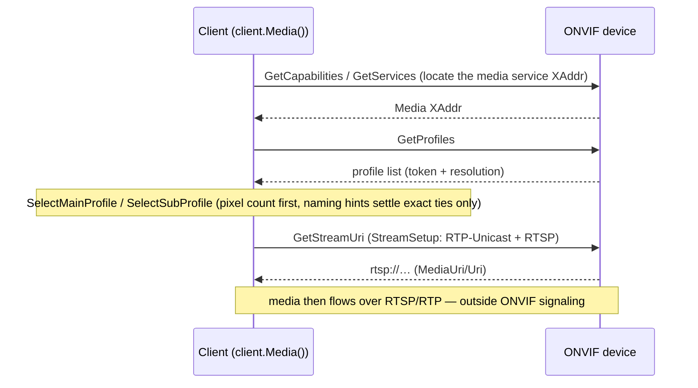

# Media and Streaming

The Media service facade (`client.Media()`) covers profiles, stream and
snapshot URIs, and encoder configuration. This document covers the parts with
field-tested semantics: profile selection, stream-setup parameterization,
and response parsing.

## Client bootstrap exchange

The typical handshake from device discovery to a streamable URI
(for the WS-Discovery probe see [discovery](onvif-go-discovery.md)):



## Install

```bash
go get github.com/mickeyzzc/onvif-go/v2@v2.1.0
```

## Choosing the right profile

Blindly using `profiles[0]` silently records a substream on devices that list
the low-resolution profile first — a failure that looks like everything works
until you notice the resolution. Two helpers encode the field-tested
heuristics:

```go
profiles, _ := client.Media().GetProfiles(ctx)

mainToken := onvif.SelectMainProfile(profiles)
subToken  := onvif.SelectSubProfile(profiles, mainToken) // "" = no substream
```

**`SelectMainProfile`** — the highest-pixel-count profile (W×H). Exact ties
are settled by naming hints only (`main`/`primary`/`主流`/`主码流`/`channel1`
win; `sub`/`secondary`/`辅流`/`辅码流`/`extra` lose), because OEM firmware
assigns arbitrary names and naming can never be the primary signal. When
nothing carries resolution information, the first profile is returned
(list-order fallback).

**`SelectSubProfile`** — the largest remaining profile that is *strictly*
smaller than main. A second profile at the *same* resolution as main is not a
substream: on some hardware (the Amcrest IP4M pattern) two tokens at the same
resolution are two handles onto the same stream. `""` means no independent
substream exists.

## Stream URIs with an explicit transport

`GetStreamURI` requests RTP-Unicast + RTSP. Some devices decide what to
return based on the requested protocol — ESP32 firmwares return an RTSP URL
with a G.711 audio track only when asked for RTSP, and an HTTP video-only
URL otherwise. `GetStreamURIWithOptions` exposes the choice:

```go
uri, err := client.Media().GetStreamURIWithOptions(ctx, profileToken,
    onvif.StreamSetup{
        Stream:    onvif.StreamRTPUnicast,   // or StreamRTPMulticast
        Transport: &onvif.Transport{Protocol: onvif.ProtocolRTSP}, // HTTP / UDP / TCP
    })
```

A nil or empty transport defaults to RTSP. `GetStreamURI(ctx, token)` is
exactly `RTP-Unicast + RTSP` — unchanged behavior.

## Response parsing guarantees

ONVIF media responses vary more than the spec suggests: namespace prefixes
(`trt:`/`tt:`/default), SOAP 1.1 vs 1.2 envelopes, and the occasional missing
`MediaUri` wrapper. Parsing is layered:

1. typed structs match by local name — any prefix, either SOAP version;
2. if the typed path yields no URI, a local-name scan extracts the first
   `Uri` element from the raw response content;
3. if there is still no URI, you get an explicit `ErrEmptyMediaURI` error
   carrying a truncated body summary — never the historical silent
   empty-string-with-nil-error;
4. a SOAP Fault is detected regardless of the HTTP status it arrived with
   (200-with-Fault included) and returned as a structured `*FaultError`.

`GetSnapshotURI` shares the response shape and the same guarantees.

## Encoder and OSD configuration

Beyond streaming, the facade covers video/audio encoder configuration
(`Get/SetVideoEncoderConfiguration`, `SetVideoEncoderConfiguration` families),
OSD management, multicast configuration (`Start/StopMulticastStreaming`), and
synchronization points. See the
[Go reference](https://pkg.go.dev/github.com/mickeyzzc/onvif-go/v2/onvif) for the full
operation list.

## Media2 (H.265/AV1)

The ver10 media model enumerates codecs as fixed schema types (H264,
MPEG4 — there is no H.265 in it). The Media2 service
(ver20/media/wsdl, `client.Media2()`, since v2.1.0) is the
codec-agnostic answer: `Encoding` is a free media-subtype name, and the
device reports one options entry per codec it supports:

```go
m2 := client.Media2()

profiles, _ := m2.GetProfiles(ctx, "", nil) // all profiles, inline configs
for _, p := range profiles {
    if p.VideoEncoder != nil {
        fmt.Println(p.Token, p.Name, p.VideoEncoder.Encoding) // "H264", "H265", …
    }
}

opts, _ := m2.GetVideoEncoderConfigurationOptions(ctx, "", "")
for _, o := range opts {
    fmt.Printf("%s: %dx%d…%dx%d, %v–%v fps\n", o.Encoding,
        o.Resolutions[0].Width, o.Resolutions[0].Height,
        o.Resolutions[len(o.Resolutions)-1].Width, o.Resolutions[len(o.Resolutions)-1].Height,
        o.FrameRateRange[0], o.FrameRateRange[len(o.FrameRateRange)-1])
}
```

Switching a profile to H.265 is a read-modify-write with the encoding
name passed through verbatim — the library never rewrites it:

```go
cfgs, _ := m2.GetVideoEncoderConfigurations(ctx)
for _, c := range cfgs {
    if c.Encoding == "H264" {
        c.Encoding = "H265" // free-name; verbatim on the wire
        _ = m2.SetVideoEncoderConfiguration(ctx, c)
    }
}
```

Requests follow the WSDL contract (tr2-wrapped, `tt:` payload children);
Media2 rides the media service endpoint unless pinned via
`SetServiceEndpoint`. `GetStreamUri(protocol, profileToken)` completes
the play path. Not implemented yet: profile create/delete and the
audio/OSD families — ver10 media (`client.Media()`) remains the
full-coverage surface for those.
