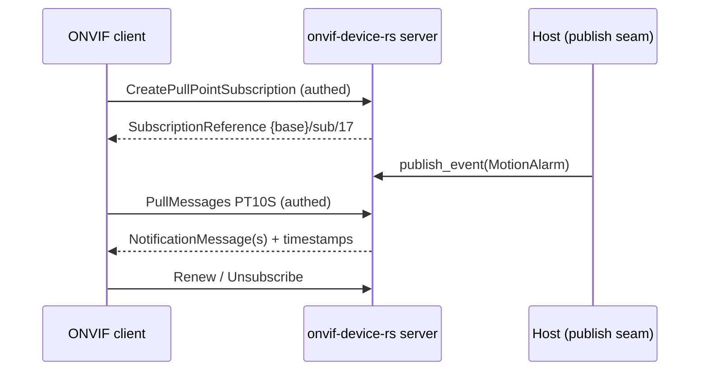

# Events (server side, pull-point)

Since v0.7.0 the server can host the ONVIF Events pull-point family —
the same service the [go twin's client](onvif-go-events.md) consumes.
One call routes everything on the listener the server already owns.

## Install

```bash
cargo add onvif-device-rs@0.7.0  # crate name differs from the repo (onvif-rs)
```

## Enabling and publishing

`enable_events()` (call it before `start()`/`start_on()`) flips the
routes on and returns the shared service handle — keep it, it is your
publish seam:

```rust
let events = server.enable_events();

// ... later, from any task:
events.publish_event(Event {
    topic: "tns1:VideoSource/MotionAlarm".into(),
    source: vec![SimpleItem::new("Source", "CSI")],
    data: vec![SimpleItem::new("State", "true")],
    ..Default::default()
});
```

Or set `config.support_events = true` and fetch the handle later via
`server.events_service()`. With events disabled the routes answer 404
and every other action's wire stays byte-identical.

## What gets routed

| Path | Actions |
|------|---------|
| `{base}/events_service` | GetServiceCapabilities, GetEventProperties, CreatePullPointSubscription |
| `{base}/events_service/sub/<id>` | PullMessages, Renew, Unsubscribe |

Semantics match the go twin: Concrete/ConcreteSet topic filters
(prefix-agnostic segments), ISO8601 `InitialTerminationTime` clamping,
a bounded lossy queue per subscription (slow consumers drop oldest,
never block the publisher), a max-pull-points bound with lazy expiry,
and long-poll `PullMessages` — `PT0S` is legal and returns
immediately; a positive timeout parks the pull until an event arrives
or the timeout lapses.



## Auth policy

`Create*` actions sit behind WS-Security (they allocate server
state); reads — `GetEventProperties`, `GetServiceCapabilities`,
`PullMessages`, `Renew`, `Unsubscribe` — are open, mirroring the go
twin's protected-prefix policy.

## Wire form

Notifications use the wsnt double layer —
`wsnt:NotificationMessage > wsnt:Topic + wsnt:Message > tt:Message`
with `SimpleItem` groups — pinned by byte goldens against the go
twin's implementation in `tests/events_pullpoint.rs`.
