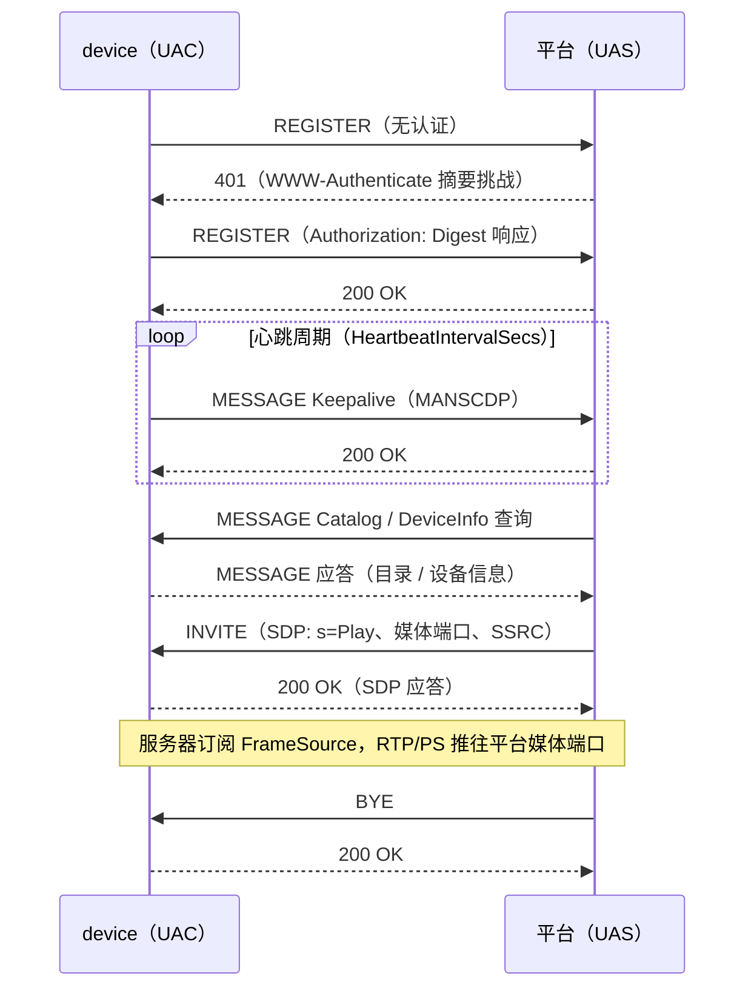

# 设备端（UAC）：把摄像头注册到平台

`device` 包把一个 Go 程序变成 GB/T 28181 摄像头：带 digest 认证的
REGISTER、保活、目录应答、INVITE 驱动的 RTP/PS 推流——走 UDP、TCP
或 SIPS（TLS）。v0.11.0 起，GB/T 28181-2022 设备侧的控制、配置与
对讲流全部具备解码线格式 + 宿主接缝。

## 安装

```bash
go get github.com/mickeyzzc/gb28181-go@v0.11.0
```

## Config 参考

```go
cfg := device.Config{
    Enabled:               true,
    PlatformSIPAddress:    "192.0.2.10",
    PlatformSIPPort:       5060,
    DeviceID:              "34020000001320000001",
    ChannelID:             "34020000001310000001",
    SIPDomain:             "3402000000",
    Password:              "secret",
    LocalSIPPort:          5060,
    RegisterIntervalSecs:   60,
    HeartbeatIntervalSecs: 60,
    HeartbeatTimeoutCount: 3,
    Transport:             "udp", // "udp" | "tcp" | "tls"
}
```

YAML tag 一致（`platform_sip_address`……）——结构体可以直接从应用的
`gb28181:` 配置节反序列化。

`Transport: "tls"`（SIPS，GB/T 28181-2022 A 级）时还要配置 TLS 字段：
`TLSCAFile`（平台自签证书或 CA）、可选 `TLSCertFile`/`TLSKeyFile`
（双向认证）、`TLSInsecureSkipVerify`（仅限实验室）。国标惯例是自签
CA、序列号即设备/平台 ID。

## 身份

```go
srv := device.New(cfg, device.DeviceInfo{
    Name:         "前门",
    Manufacturer: "Acme",
    Model:        "Cam-X",
    Firmware:     "1.2.3",
    HardwareID:   "CamX-SoC",
    SerialNumber: "SN-42",
}, hub)
```

`device.UserAgent`（包级变量，默认 `GB28181-Go/1.0`）盖 SIP
User-Agent——在 `New`/`Start` **之前**赋你自己的值；之后并发改会与
报文构造器竞态。

## 直播帧：FrameSource

```go
type FrameSource interface {
    Subscribe(ctx context.Context) *FrameSubscription
    Unsubscribe(id string)
}

type FrameSubscription struct {
    ID      string
    Channel <-chan AccessUnit
}
```

把 `AccessUnit`（不含 Annex-B 起始码的 NAL、`Timestamp`、
`KeyFrame`）推进你的 hub；服务器在 INVITE 到来时订阅、向平台媒体
端口推 RTP/PS。期望有界、写满即丢的 channel——绝不让编码器被慢消费
者阻塞。`device.NewFrameHub()` 是现成实现；`SIPPort()`/
`SIPTCPPort()` 报告实际绑定端口。

## 录像：RecordingIndex

```go
srv.SetRecordingIndex(myIndex) // 实现 Lookup(startMs, endMs) []SegmentMeta
```

挂上索引后，服务器应答 RecordInfo 查询、提供按节奏回放与全速下载，
包括 SIP INFO 回放控制（暂停/恢复/拖动/倍速）。录像段用
`device.OpenSegment` 读取的参考格式：Annex-B 裸 H.264 + 每帧
`.ts.jsonl` 边车。

## DeviceControl：平台 → 设备控制命令

只安装你的硬件真正支持的回调——未注册回调的命令保持历史行为：
显式拒绝。

```go
srv.SetControlHandlers(device.ControlCallbacks{
    OnForceIFrame: func() { encoder.RequestIDR() },  // <IFrameCmd>Send</IFrameCmd>
    OnRecordCmd:   func(start bool) { recorder.SetPaused(!start) },
    OnPTZCmd:      func(cmd device.PtzCommand) { /* 云台电机驱动 */ },
    OnDragZoom:    func(cmd device.DragZoom) { /* 电子放大 */ },
    OnTeleBoot:    nil, // nil = control 拒绝；不会误触发远程重启
})
```

- **PTZCmd** 按 §A.3/A.4 位级解码后送达：方向/镜头位、水平/垂直/
  变倍速度、预置位、巡航、FI 与辅助开关。独立工具可以直接调
  `device.DecodePTZCommand(a505Hex)`——它是全函数：长度/A5 起始/
  校验和失败返回 `Kind=PtzInvalid` 并以 `RawHex` 保留原始输入。
  golden 字节表由平台侧构造器生成，编解码不会漂移。
- **DragZoom**（A.2.3.1.8/9）要求六个整数子元素
  `Length/Width/MidPointX/MidPointY/LengthX/LengthY`（播放窗口
  像素、原点左上）；缺子元素即显式拒绝。
- **HomePosition**（A.2.3.1.10，属 DeviceControl 族）上报 `enabled`
  与可选的 `resetTime`/`presetIndex` 指针。

平台侧可用 `PTZController.SendIFrameCmd(channelID)` 下发强制 I 帧
命令（拒绝 `Send` 以外的取值）。

## DeviceConfig 与 ConfigDownload

`SetConfigHandlers` 安装 A.2.3.2 配置回调——`OnBasicParam`（子元素
全可选）、`OnFrameMirror`（0 不翻 …… 3 双翻）、`OnAlarmReport`
（移动/现场报警上报开关）。未知配置子命令保持显式拒绝。
`ConfigType=ConfigDownload` 查询按运行配置应答最小 A.2.6.9 响应：

```go
srv.SetConfigHandlers(device.ConfigCallbacks{
    OnFrameMirror:  func(mode uint32) { sensor.SetFlip(mode) },
    OnAlarmReport:  func(motion, field uint32) { gate.Set(motion == 1) },
})
```

## SUBSCRIBE/NOTIFY 与 DeviceNotifier

设备应答 Catalog/Alarm/MobilePosition 三类 SUBSCRIBE——按事件维护
订阅（续订、读时过期、CSeq 簿记），并向宿主暴露 notifier：

```go
notifier := srv.Notifier()
if notifier.Subscribed(device.EventAlarm) {
    notifier.SendAlarm("4", "5", gbTime, "2", "yard motion")
}
notifier.SendCatalogChange(items)   // 无人订阅时安全 no-op
notifier.SendMobilePosition(&device.PositionReport{
    Time: gbTime, Longitude: "114.06", Latitude: "22.54",
})
```

`SetPositionSource` 为周期 MobilePosition 上报供数（默认 5 s 一拍，
每次新订阅重新校拍）。

## 语音对讲与广播

三条音频流共用对讲面：

- **对讲接收**——平台发 audio-only INVITE 并推 G.711 RTP。用
  `srv.SetTalkbackSink(...)` 安装 `TalkbackSink`
  （`OnAudio(payload []byte, ssrc uint32, codec AudioCodec)`）；
  无 sink、或 offer 非 G.711/TCP 媒体时 INVITE 被 **488** 拒绝。
- **对讲上行**——向 `srv.SetTalkbackSource(frames)` 喂 G.711 帧
  （20 ms 节拍；PT 8/0 随 offer 协商）。无源的 `recvonly` offer
  拒 488，其余 golden 不变。`srv.TalkbackUpstreamCodec()` 报告协商
  出的 PCMA/PCMU 律，宿主据此选择压扩编码。
- **语音广播**——平台发通知（A.2.5.5），设备应答（A.2.6.11）并
  回应 audio INVITE 回呼；收到的 RTP 喂 talkback sink。
  `srv.SetOnBroadcast(func(sourceID, targetID string))` 在广播开始时
  通知宿主。平台侧是 `sip.Server.StartBroadcast`
  （见[平台](gb28181-go-platform.md)）；一致性回环测试钉住全流程。

## 生命周期

```go
err := srv.Start(ctx) // 注册/保活/推流 goroutine 都挂在 ctx 取消下
...
srv.Deregister(ctx) // 可选：REGISTER Expires: 0，然后……
srv.Stop()
```

注册失败带退避重试，到期自动重注册。需要平台即时感知设备下线时
（服务重启）先调 `Deregister`。

## SIP-Date 校时观察

REGISTER 应答携带平台 SIP `Date` 头（2022 §9.10.2 校时）。
`srv.PlatformDateUnix()` 返回最近一次解析到的 Unix 秒（无可用
Date 时为 0）——仅观察，库绝不改系统时钟。宿主要做漂移检查可用
`device.ParseSIPDate(value)` 解析 RFC 3261 三种日期形态。

## 注册与点播时序



## 设备 ID

```go
id, err := device.FormatDeviceID("34020000", 0, device.DeviceTypeIPC, 42)
parts, err := device.ParseDeviceID(id) // 中心/行业/类型/序号
```

20 位编码：`[8 位行政区划][2 位行业][3 位类型][7 位序号]`。类型常量
含 `DeviceTypeIPC`（111）、`DeviceTypeNVR`（118）、
`DeviceTypeAlarm`（122）。

## 可靠性注记：ACK 快照

gosip 传输层无锁地原地改写在途请求的 top Via（上游
[ghettovoice/gosip#87](https://github.com/ghettovoice/gosip/issues/87)，
与 2xx 到达后的 ACK 构造存在竞态。v0.11.0 起全部 ACK 路径改从发送
前的 INVITE 深拷贝快照构造——pass-through 形态下竞态检测器报 89
份报告，快照形态干净。
