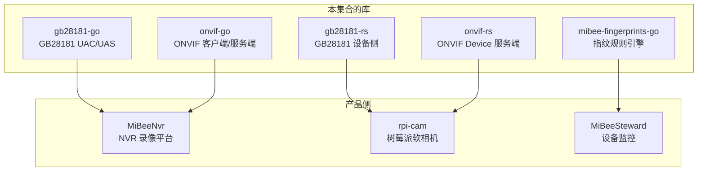

# MiBee 库总览

这里是**从产品中抽离出来的开源库**的统一文档：GB28181 与 ONVIF 协议库（Go / Rust 双语实现）和指纹规则引擎。它们驱动着 MiBeeNvr、rpi-cam 等产品，也可独立用于你自己的项目。

## 生态关系

## 库一览

| 库 | 语言 | 定位 | 典型使用方 |
|----|------|------|-----------|
| [gb28181-go](gb28181-go-platform.md) | Go | GB/T 28181 信令库：平台（UAC）与设备（UAS）、级联、MANSCDP、PS 流封装 | MiBeeNvr |
| [gb28181-rs](gb28181-rs-server.md) | Rust | GB/T 28181 设备侧实现：注册/保活、直播、录像回放、MANSCDP/PS 封装 | rpi-cam |
| [onvif-go](onvif-go-architecture.md) | Go | ONVIF 客户端 + 设备服务端：发现、鉴权、媒体、事件，零第三方依赖 | MiBeeNvr |
| [onvif-rs](onvif-rs-discovery.md) | Rust | ONVIF Device 服务端：Media/PTZ/Imaging/Discovery/Security 全服务 | rpi-cam |
| [mibee-fingerprints-go](fingerprints-overview.md) | Go | MiBee 指纹库参考引擎：加载 YAML 规则、把采集证据分类为 ServiceIdentity | MiBeeSteward |

## 选库建议

- **接国标设备/平台**：Go 侧用 `gb28181-go`（做平台或网关），Rust/嵌入式设备侧用 `gb28181-rs`
- **ONVIF 互通**：需要客户端（发现并管理相机）用 `onvif-go`；需要把设备做成 ONVIF 相机用 `onvif-rs`
- **设备指纹识别**：按 MiBeeSteward 指纹规范做证据分类，直接用 `mibee-fingerprints-go`

> 各库的提交规范、页面骨架与图表要求见 [CONVENTIONS](https://github.com/Mi-Bee-Studio/mibee-docs/blob/main/mibeelibs/CONVENTIONS.md)；本集合由库团队独立维护。
