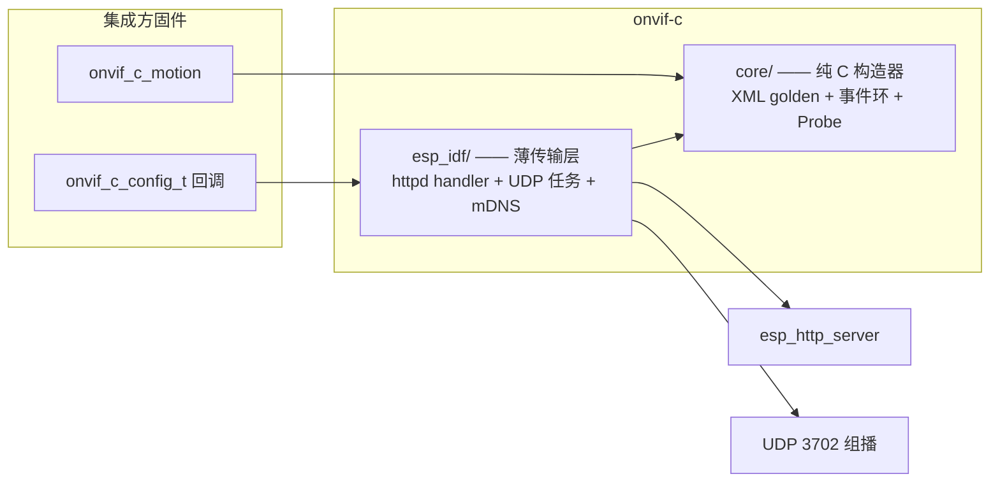
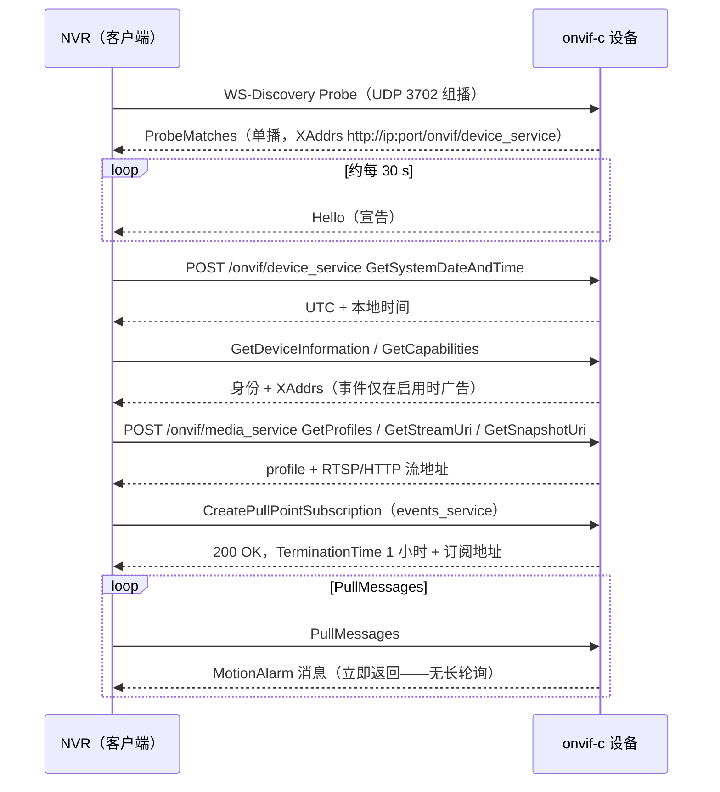

# onvif-c：面向 ESP-IDF 的 ONVIF 设备服务端

一个用纯 C 写的极简 ONVIF Device（服务端）库：让 ESP32 相机通过
SOAP + WS-Discovery + Pull-Point 事件暴露给 NVR，零第三方依赖、代码
占用约 10 KB。抽取自生产环境的 MiBee Cam 固件，响应字节对真实 NVR
保持稳定。**尚未发版**——库处于测试迭代中，vendor 时请锁定具体
commit。

兄弟实现：[onvif-rs](onvif-rs-quickstart.md)（Rust，Linux 设备端）与
Go 客户端 [onvif-go](onvif-go-quickstart.md)。设备形态是 ESP-IDF 固件、
堆预算紧张时选 onvif-c。

## 提供的服务面

| 服务面 | 动作 |
| --- | --- |
| SOAP Device 服务 | `GetSystemDateAndTime`、`GetDeviceInformation`、`GetCapabilities` |
| SOAP Media 服务 | `GetProfiles`、`GetStreamUri`、`GetSnapshotUri` |
| Pull-Point 事件 | `CreatePullPointSubscription`、`PullMessages`、`Unsubscribe` —— `tns1:VideoSource/MotionAlarm` 主题（`Source=CSI`、`State`、`Score 0-100`） |
| WS-Discovery | UDP 3702 / 组播 239.255.255.250 —— 单播 ProbeMatches、周期 Hello（约 30 s） |
| 可选 mDNS | `_onvif._tcp` 广告 |

没有 XML 解析器、没有请求缓冲之外的动态状态：动作识别靠 `strstr()`，
响应用 `snprintf()` 生成。运动生产者钩子非阻塞，可从传感器回调上下文
安全调用。

## 快速开始

按你锁定的 commit 把源码树 vendor 进 `components/onvif-c`，
在 main 的 `REQUIRES` 加 `onvif-c`，然后：

```c
#include "onvif_c.h"

static const char *my_stream_uri(void) {
    return "rtsp://192.0.2.134:554/stream";   /* 或 http://ip:81/stream */
}

void app_onvif_start(httpd_handle_t httpd) {
    onvif_c_config_t cfg = {
        .manufacturer     = "MiBee",
        .model            = "MiBeeCam",
        .firmware_version = "v0.1.0",
        .serial           = my_serial,        /* 稳定的十六进制串        */
        .uuid             = my_uuid,          /* 无 urn:uuid: 前缀       */
        .ip               = my_ip,            /* NULL/"0.0.0.0" = 未就绪 */
        .stream_uri       = my_stream_uri,
        .events_enabled   = my_events_gate,   /* NULL = 不启事件服务     */
        .http_port        = 80,               /* 0 -> 80；流入 XAddrs    */
        .mdns_hostname    = "mibeecam-a1b2",  /* NULL = 跳过 mDNS        */
    };
    onvif_c_start(httpd, &cfg);
}

/* 从运动检测器（如 WiFi-CSI 回调）喂事件 —— 永不阻塞： */
onvif_c_motion(true, 87);   /* MotionAlarm State=true  Score=87 */
onvif_c_motion(false, 4);
```

`onvif_c_config_t` 是唯一的集成接缝：身份字符串、四个必需回调
（`serial`/`uuid`/`ip`/`stream_uri`）、可选覆盖（`snapshot_uri`、
`frame_rate`、`scopes`）与运行时门控。板级细节绝不漏进库内。
`ONVIF_C_VERSION` 返回 `major*10000 + minor*100 + patch`（v0.2.0
即 200）。

IP 回调返回 `NULL`/`"0.0.0.0"` 期间，库继续应答 SOAP 但在发现面上
保持安静；`cfg->http_port` 流入所有广告 URI（capabilities XAddrs、
ProbeMatches/Hello XAddrs、Pull-Point 订阅地址）——没有任何地方硬编码
`:80`。

## 架构



- **`core/`** 是不含任何 ESP-IDF 头的纯 C——宿主机系统 `cc` 即可测试；
  每一个响应字节都归它所有（XML 构造器、事件环、ProbeMatches/Hello
  构造器）。
- **`esp_idf/`** 是薄传输层：在已启动的 `httpd` 句柄上注册 SOAP URI
  handler、跑 WS-Discovery 应答任务、持有订阅状态机。支持 ESP-IDF
  v5.5.x 与 v6.0.x。

## NVR 添加设备的线上时序



PullMessages 绝不阻塞 httpd worker：立即返回事件环里现有的内容。
订阅在 **120 s 无拉取**或到达 1 小时授予终止时间后自动过期；新的
`CreatePullPointSubscription` 会替换前一个（单订阅槽位）。
`onvif_c_events_subscribed()` 暴露存活状态供诊断。

运动事件只在订阅存活**且**运行时门控（`events_enabled`）为真时入队；
生产者拿不到锁就丢弃该事件而不是阻塞——传感器回调总能及时返回。

## 字节稳定契约

响应的元素名、前缀、属性顺序与命名空间风格都是承重结构——NVR 集成方
可能做裸子串匹配。Device/Media 信封用 `soap:`/`tds:`/`trt:`/`tt:`
（小写 `utf-8` 声明）；Events 信封用 `s:`/`tev:`/`wsnt:`（大写
`UTF-8`）。两种风格都是真实 NVR 在生产中对话过的字节，差异是有意
为之，不要"统一"。宿主 golden 测试钉住确切输出——那里的 diff 是行为
变更，不是外观变更。

## 测试与质量门禁

宿主测试只需要一个 C 编译器和 pthreads：

| 门禁 | 命令 | 约束 |
| --- | --- | --- |
| 宿主测试 | `tests/run.sh` | 212 项检查：core golden 字节 + 全部 ESP-IDF 端口层（桩驱动） |
| 覆盖率 | `tests/coverage.sh` | `core/` + `esp_idf/` 行覆盖 ≥80%（当前 95%） |
| 风格 | `tools/check_style.sh` | clang-format 干净（锁定 `clang-format==22.1.8`） |
| 卫生 | `tools/check-repo-hygiene.sh` | 无垃圾/敏感文件入库 |

端口层通过 `tests/host_stubs/` 测试：捕获请求/响应的假 httpd、
`-Wl,--wrap=time` 假时钟（订阅过期可确定复现）、pthread 任务、注入
WS-Discovery Probe 的虚拟 UDP 网络——含 socket/bind/组播加入失败的
重试路径。

`tools/onvif_probe.py <ip>` 是对真机的免硬件冒烟：走完所有已服务
动作与完整 Pull-Point 订阅周期，成功退出码 0。

## ONVIF 实现选型

- **onvif-c** —— 设备是 ESP-IDF 固件；占用最小、C 集成、自带
  MotionAlarm 事件。
- [**onvif-rs**](onvif-rs-quickstart.md) —— 设备是 Linux 主机
  （Rust）；完整服务集（Media/PTZ/Imaging/Discovery/Security/Events）。
- [**onvif-go**](onvif-go-quickstart.md) —— 你在做*客户端*（用 Go 从
  NVR/网关发现并管理相机）。
