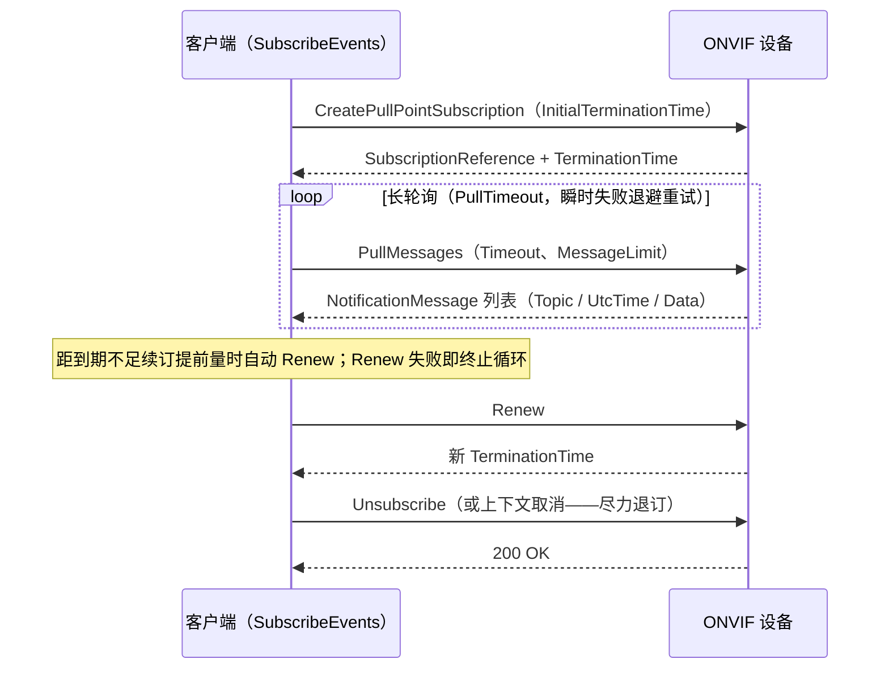

# 事件

事件服务门面（`client.Events()`）覆盖 PullPoint 订阅。原始原语都在，但通常
你要的是托管 API。

## 安装

```bash
go get github.com/mickeyzzc/onvif-go/v2@v2.2.0
```

## 托管订阅

`SubscribeEvents` 包办整个生命周期：后台 goroutine 长轮询 `PullMessages`、
把每条通知交给你的 handler、到期前自动续订、退订或上下文取消时干净收尾。



```go
sub, err := client.Events().SubscribeEvents(ctx,
    func(msg onvif.NotificationMessage) {
        fmt.Println(msg.Topic, msg.Message.UtcTime, msg.Message.Data)
    },
    nil, // *SubscribeEventsOptions；nil = 默认值（订阅 1h、续订提前 5m、
         // 拉取超时 30s、单次 10 条）
)
if err != nil { ... }

defer sub.Unsubscribe(context.Background())
```

语义（全部经真机验证）：

- **handler 契约**：在轮询 goroutine 上执行——迅速返回，慢活自己开
  goroutine。handler panic 会被隔离，不会杀死循环。
- **续订**：距到期不足续订提前量时自动 Renew。续订**失败即终止循环**——
  对已死的订阅无限重试只会骚扰设备。
- **瞬时拉取失败**（网络抖动、HTTP 500）退避重试（1s 起步、翻倍至 30s
  封顶），循环保持存活。
- **清理**：`Unsubscribe(ctx)` 停循环 + 尽力向设备退订；SOAP 退订失败不
  阻塞本地清理。循环自行退出（续订失败、调用方上下文取消）时同样触发
  尽力退订。
- **`Done()`** 返回循环完全退出后关闭的 channel——测试里用它做确定性收尾。
- 缺 `UtcTime` 的消息回退 `time.Now().UTC()`。

用选项调参：

```go
sub, err := client.Events().SubscribeEvents(ctx, handler, &onvif.SubscribeEventsOptions{
    Filter:               "tns1:VideoSource/MotionAlarm", // 主题表达式
    SubscriptionDuration: time.Hour,
    RenewMargin:          5 * time.Minute,
    PullTimeout:          30 * time.Second,
    MessageLimit:         10,
})
```

## 不支持事件的设备

部分相机在 `GetCapabilities` 里宣传了事件服务，实际 `CreatePullPointSubscription`
却返回 "Action Not Implemented" 类 Fault。没有哨兵错误的话，你会永远重试一个
不可能成功的订阅：

```go
sub, err := client.Events().SubscribeEvents(ctx, handler, nil)
if errors.Is(err, onvif.ErrEventsNotSupported) {
    // 缓存阴性结果；不要再重试这台设备
}
```

分类覆盖常见固件措辞（`NotImplemented`、`ActionNotSupported`、
"not supported by device" 等）及 SOAP 1.1/1.2 两种 Fault 形态。

## 原始原语

需要完全掌控时，原语仍然可用：`CreatePullPointSubscription`、`PullMessages`、
`RenewSubscription`、`Unsubscribe`、`Seek`、`SetEventSynchronizationPoint`、
`GetEventProperties`、事件代理（event broker）管理与
`GetEventServiceCapabilities`。

## 主题过滤说到做到（v2.1.0）

`CreatePullPointSubscription` 接受主题表达式，v2.1.0 起本库自家服务端
说到做到：**Concrete** 方言（精确局部主题路径、与前缀无关，如
`tns1:VideoSource/MotionAlarm`）与 **ConcreteSet**（`|` 备选 + `*`
段通配）的订阅收到的正是过滤所选。不支持的方言与空表达式报 Fault
——服务端不再「收下过滤条件然后静默无视」。`GetEventProperties`
应答规范完整形态（主题命名空间位置、两个强制主题表达式方言、规范
认可的空消息内容方言）；消息内容过滤未实现亦不宣告。
