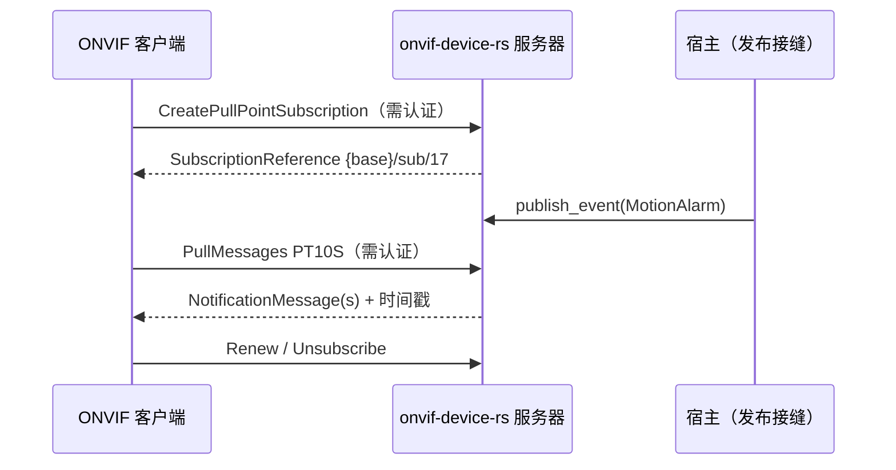

# 事件（服务端，pull-point）

自 v0.7.0 起服务器可托管 ONVIF Events pull-point 族——正是
[go 孪生客户端](onvif-go-events.md)消费的那个服务。一次调用，全部
路由落在服务器自有监听器上。

## 安装

```bash
cargo add onvif-device-rs@0.7.0  # crates.io 包名与仓库名不同（onvif-rs）
```

## 启用与发布

`enable_events()`（在 `start()`/`start_on()` 之前调用）打开路由并
返回共享的服务句柄——留住它，那是你的发布接缝：

```rust
let events = server.enable_events();

// ……稍后，任意任务里：
events.publish_event(Event {
    topic: "tns1:VideoSource/MotionAlarm".into(),
    source: vec![SimpleItem::new("Source", "CSI")],
    data: vec![SimpleItem::new("State", "true")],
    ..Default::default()
});
```

或设 `config.support_events = true`，稍后经
`server.events_service()` 取句柄。未启用时路由答 404，其余所有
动作的线格式逐字节不变。

## 路由面

| 路径 | 动作 |
|------|------|
| `{base}/events_service` | GetServiceCapabilities、GetEventProperties、CreatePullPointSubscription |
| `{base}/events_service/sub/<id>` | PullMessages、Renew、Unsubscribe |

语义与 go 孪生一致：Concrete/ConcreteSet 主题过滤（前缀无关分段
匹配）、ISO8601 `InitialTerminationTime` 钳制、每订阅有界丢失队列
（慢消费者丢最旧、绝不阻塞发布者）、最大 pull point 数与惰性过期、
长轮询 `PullMessages`——`PT0S` 合法且立即返回；正超时则挂起直到
事件到达或超时届满。



## 认证策略

`Create*` 动作在 WS-Security 之后（它们分配服务器状态）；读操作
——`GetEventProperties`、`GetServiceCapabilities`、`PullMessages`、
`Renew`、`Unsubscribe`——开放，与 go 孪生的保护前缀策略一致。

## 线格式

通知采用 wsnt 双层结构——
`wsnt:NotificationMessage > wsnt:Topic + wsnt:Message > tt:Message`
携 `SimpleItem` 组——由针对 go 孪生实现的字节级 golden 钉板，见
`tests/events_pullpoint.rs`。
