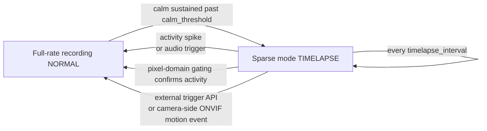

# Adaptive Recording (Motion-Aware)

> For MiBeeNvr v0.13.0

In most surveillance scenes nothing happens 95% of the time — yet continuous recording still writes every frame at full bitrate. **Adaptive recording** lets the NVR drop to "timelapse-grade" sparse keyframe writing while the scene is calm, and instantly resume full-rate recording the moment activity appears, with zero frame loss at the transition. Field-tested on static scenes: **75%–98% less disk usage**, while the first frame of every event still lands in the recording.


## How It Works



The NVR analyzes the **compressed domain** — no decoding: P-frame sizes are continuously compared against a rolling baseline (robust MAD statistics); a "calm" picture means P-frame sizes hug the baseline. In sparse mode:

- Only one keyframe per `timelapse_interval` is written (audio pauses too, unless the [ambient layer](#ambient-audio-layer) is on)
- A GOP ring pre-buffer (32MB by default) retains the most recent complete group of pictures
- **Any activity spike (a sudden P-frame size jump) immediately flushes the pre-buffer**, writing "the full GOP before the spike" to disk — so the sparse→full-rate transition loses no reference frames: no corruption, no gaps in playback

Five activity signals can pull a camera back to full rate — any one of them suffices:

| Signal | Notes |
|--------|-------|
| Video spike | P-frame size deviation above `spike_factor`× baseline (the default path; works for every H.264/H.265 camera) |
| [Audio trigger](#audio-trigger) | A loud 1-second window — breaking glass, shouting, alarms (needs G.711 audio) |
| [Pixel-domain gating](#pixel-domain-gating-pixgate) | "Real foreground movement" as judged by classic CV over a ~1fps sampled decode of the sub-stream — lets constant-bitrate smart-codec cameras tell motion from stillness |
| Camera-side motion detection | With `motion_source: camera:onvif`, subscribes to the camera's ONVIF MotionAlarm events (`reason=onvif_motion`) — see the [ONVIF guide](onvif-discovery.md) |
| External semantic trigger | `POST /api/cameras/{id}/adaptive/trigger` — called by home automation, an AI backend, etc. (e.g. "person detected") |

## Choosing a Setup

Since v0.13 this pipeline has three combinations; pick by the camera's encoder behavior:

| Scene | Recommended combination | Why |
|-------|------------------------|-----|
| Ordinary encoder (bitrate clearly rises and falls with activity) | `recording_mode: adaptive` alone | Compressed-domain detection is reliable; simplest configuration |
| Smart-codec camera (picture always static but bitrate constant — the static ~0.5fps / 5MP VBR class) | [`recording_tier: tiered`](#tiered-recording) + main stream `adaptive` (± [pixgate](#pixel-domain-gating-pixgate)) | The bitrate domain cannot see motion: the sub-stream records 24/7 as a never-miss baseline, pixel-domain detection replaces bitrate-domain detection, and the main stream records events only |
| Persistent video noise (rain / water / foliage), or "never go full-rate without a person" | `adaptive` + `video_exit: false` (resident timelapse) + pixgate / audio trigger / external semantic trigger | Video spikes no longer exit sparse mode; only conclusive signals (real foreground movement, abnormal sound, semantic events) resume full rate |

## Enabling

### Web UI (recommended)

Cameras → edit camera → **Recording mode**: choose **"Adaptive (motion-aware)"**. Parameters can be tuned in the expanded section (blank = defaults); changing the mode restarts the recorder (the UI prompts on save).

### Configuration file

```yaml
cameras:
  - id: "studio"
    name: "Studio"
    protocol: "onvif"
    # ... regular access config ...
    recording_mode: "adaptive"   # default "continuous" = full-rate recording
    adaptive:                    # all optional; defaults shown
      calm_threshold: "60s"      # how long calm must last before going sparse (10s–30m)
      timelapse_interval: "30s"  # keyframe cadence while sparse (5s–10m)
      spike_factor: 5.0          # activity sensitivity (1.5–20, see tuning)
      gop_buffer_bytes: 33554432 # GOP pre-buffer cap (1–64MB)
```

## Tuning

| Parameter | Default | What to tune |
|-----------|---------|--------------|
| `calm_threshold` | 60s | How long the scene must stay calm before dropping to sparse. Corridors with occasional passers-by benefit from 2–5 minutes |
| `timelapse_interval` | 30s | Keyframe interval while sparse. Longer = less disk, lower "framerate" during calm |
| `spike_factor` | 5.0 | **Sensitivity** — smaller is more sensitive. High-noise scenes (cloud movement, water glare, foliage) may need 10–15 before the scene ever goes sparse; too small and the camera rarely drops down (disk usage stays high); too large and faint activity is missed |
| `gop_buffer_bytes` | 32MB | The pre-buffer must hold one full camera GOP. 2K cameras with GOP near 30s overflow 16MB and lose the seamless transition — keep the 32MB default |
| `noise_floor_bytes` | 0 (off) | **Absolute per-frame byte noise floor** (0–8MB). P-frames below this size **never** count as exit spikes — the fix for cameras whose encoder starves its bitrate (night mode / rate-control collapse) down to a few hundred bytes per frame, where the relative ratio metric fires on jitter. 0 disables |
| `auto_noise_floor` | true | **Self-calibrates** the floor from timelapse dwell frames: frames written while sparse are static by construction, so their p99 size ×1.25 (capped at p50×8) becomes the camera's own noise ceiling. Only engages on bitrate-starved streams (dwell median P-frame < 2KB); healthy-bitrate streams behave exactly as before |
| `video_exit` | true | `false` = **resident timelapse**: video spikes never exit sparse mode; only the [audio trigger](#audio-trigger), [pixgate](#pixel-domain-gating-pixgate), camera-side ONVIF events or the [external semantic trigger](#external-trigger-api) resume full rate. Rain, water glare and foliage can flicker all they want — the camera stays sparse. For scenes where nothing but a conclusive signal may raise the framerate |

> The louder of the two floor paths wins: explicit `noise_floor_bytes` and the self-calibrated floor (`auto_noise_floor`) compose — the explicit value sets a hard minimum, the self-calibration raises it further on starved streams. Night-time false exits (log shows `reason=video` but playback shows nothing moving) almost always mean bitrate starvation: rely on the self-calibration first (on by default), then set `noise_floor_bytes` explicitly if that's still not enough.

```yaml
    adaptive:
      noise_floor_bytes: 0     # absolute floor in bytes; 0 = off
      auto_noise_floor: true   # self-calibrate from timelapse dwell (default on)
      video_exit: true         # false = resident timelapse (video spikes don't exit)
```

> Field data: a static 2K H.265 studio camera dropped from ~2700MB/h to ~688MB/h (including active spans); a fully unattended sparse stretch wrote 5.6MB/248s versus ~190MB full-rate (~34×).

### Offline Replay Evaluation (eval-replay)

The gating decision is a pure function of "the P-frame size series + the config", so a finished recording is enough to answer "**what would this parameter set have done**" — no camera attached, no decoding. The `eval-replay` subcommand replays historical recordings through the scorer or the gate and prints a before/after table; tune without touching production:

```bash
# Scorer replay: activity score + confidence per recording
mibee-nvr eval-replay --corpus corpus.json

# Gate replay: default parameters vs candidate side by side (sparse ratio TL% / switches / effective floor)
mibee-nvr eval-replay --corpus corpus.json --gate --videoexit=false
mibee-nvr eval-replay --corpus corpus.json --gate --spike 8 --noisefloor-bytes 600
```

The corpus is a JSON array; the `label` convention is `rain` / `lowbitrate` / `static` / `active` (per-label aggregate rows are printed):

```json
[
  {"path": "/mnt/data/nvr/cam-studio/202609/23/15/sub_studio_20260923_150001_1.mp4", "camera": "studio", "label": "rain"}
]
```

Candidate flags: `--spike` (spike_factor), `--noisefloor-bytes` (noise_floor_bytes), `--autonoise true|false`, `--videoexit true|false`; with `--fps 0` the frame interval is derived per file (frame count / duration).

## Tiered Recording

Smart-codec cameras (the static ~0.5fps / 5MP VBR class) keep their bitrate **constant regardless of activity** — compressed-domain detection breaks on such streams: `recording_mode: adaptive` either never drops to sparse, or drops but can no longer recognize activity from bitrate. **Tiered recording** (camera-level `recording_tier: "tiered"`) is the fallback for exactly these cameras:

- **The sub-stream records 24/7 as the layer=1 baseline** — never a missed frame, at the small disk cost of a low-bitrate (480p-class) stream
- **The main stream keeps whatever write density its `recording_mode` dictates** — for near-empty scenes pair it with `adaptive` + `video_exit: false` (± [pixel-domain gating](#pixel-domain-gating-pixgate)): the main stream records events only, at full quality, while the sub-stream covers every gap

```yaml
cameras:
  - id: "yard"
    recording_tier: "tiered"     # sub-stream 24/7 continuous (layer=1 baseline)
    recording_mode: "adaptive"   # main-stream write density applies as usual
    adaptive:
      video_exit: false          # recommended pairing: resident timelapse
    pixgate:                     # optional: pixel-domain motion detection (below)
      enabled: true
```

Key points:

- **Prerequisites**: an rtsp / onvif / gb28181 camera with a configured sub-stream (`sub_stream_url` or the ONVIF `sub_profile_token`, see [Sub-Stream](sub-stream.md)); H.264 / H.265 only. Validation rejects impossible combinations at save time
- **Segment shape**: sub-tier segments live in the same hour-bucket tree as main recordings, with a `sub_` filename prefix, 60s per segment; born terminal (`merge_status='sublayer'`) — **never a merge input** — and follow normal retention cleanup
- **Layer filtering end to end**: sub-tier rows are hidden by default from the recordings list, playback timeline, merge, and Vision push. The recordings list API switches tiers via the `layer` query parameter: `?layer=1` shows only sub-tier segments, `?layer=0` forces main only
- **Semantic gating**: cameras listed in `vision.tiered_cameras` have their layer=1 segments pushed to the external Vision consumer for semantic analysis — low-resolution segments cost a fraction of the main stream to decode; main-stream segments step aside and are not pushed (`vision.skip_cameras` takes precedence over the list). The semantic verdict flows back through the [External Trigger API](#external-trigger-api) to raise the main stream
- **Relation to `recording_mode: adaptive`**: the two neither conflict nor replace each other — `recording_mode` decides "how densely the main stream writes", `recording_tier` decides "whether an extra never-interrupted low-bitrate baseline exists". Ordinary cameras are fine with single-tier adaptive; only cameras whose bitrate domain cannot see motion need tiered

## Pixel-Domain Gating (pixgate)

The blind spot of the compressed domain: rain, water glare and swaying foliage are **just as much real pixel motion** as a person walking through — P-frame sizes cannot tell them apart. **Pixel-domain gating** (the camera-level `pixgate:` config block) adds the industry-standard middle layer: the sub-stream is sampled-decoded at ~1fps and run through **classic CV**, judging activity by "is there a blob-shaped, persistent foreground" — so constant-bitrate smart-codec cameras can tell motion from stillness, and persistent video noise gets filtered.

**Pipeline**: the sub-stream (prefers sampling from the shared sub-stream source — no extra camera connection; falls back to a direct RTSP/TCP pull when needed) → ffmpeg decodes and scales to a fixed 160×120 gray grid → a pure-Go CV engine judges each sample. Decode cost is bounded by design: ~1fps sampling of a 480p-class sub-stream costs ~10–20ms of software decode per frame (<2% of one core per camera).

The CV engine, in order:

1. **Background model** (slow EMA learning) — foreground pixels learn at 1/5 the background rate, so a standing person is not absorbed for the first several minutes
2. **Adaptive per-pixel difference threshold** — the sensor-noise median is tracked and the threshold rides on it; night gain grain no longer reads as foreground
3. **Illumination-step suppression** — headlight sweeps, IR-cut flips and exposure steps are treated as whole-frame events: a single step is merely suppressed, while consecutive confirmation (the light really stays on) re-primes the background model — a passing headlight never arms the gate
4. **Connected-component minimum area** — the largest foreground blob's share of the grid is compared against `min_area_pct`; rain reads as small scattered short-lived blobs, a person as one large persistent blob
5. **ROI masks** — normalized polygons exclude permanently shimmering regions: sky, water, streets
6. **Ghost absorption** — a **static** foreground blob (a light switched on, a parked car, a lens water drop) is absorbed into the background after `ghost_secs` and stops triggering; a moving object's centroid drifts, so it never qualifies
7. **Persistence hysteresis** — `persist` consecutive active samples to confirm, 3 consecutive quiet samples to release — a single noisy frame cannot trigger

Confirmed activity takes the **same exit path as the audio trigger**: exit sparse mode + GOP flush + hold for `hold` (every active sample re-arms the timer). The verdict is also published on the event bus as `pixgate.activity` (with `area_pct` / centroid / `flood` / `ghost` fields) for UIs and automations to subscribe, and the sampler exposes Prometheus telemetry (`nvr_pixgate_samples_total`, `nvr_pixgate_triggers_total`, …). The gate blinds itself during PTZ moves (no false triggers; the background model is rebuilt afterwards).

```yaml
cameras:
  - id: "yard"
    pixgate:
      enabled: true
      sample_fps: 1        # sampling rate (0.2–2, default 1)
      min_area_pct: 1.5    # largest-blob area threshold, % of grid (0.1–50, default 1.5 — a person at mid-range on a 480p sub-stream covers ~2–8%)
      persist: 2           # consecutive active samples to confirm (1–10, default 2)
      hold: "30s"          # full-rate hold per confirmation (1s–10m, default 30s)
      ghost_secs: 300      # how long a static foreground may trigger before absorption (0–3600, default 300; 0 = default)
      masks:               # exclusion polygons, normalized [0,1] coordinates (≥3 points)
        - name: "sky"
          points: [[0, 0], [1, 0], [1, 0.2], [0, 0.25]]
```

Caveats:

- **Requires ffmpeg** — an optional dependency (shared with transcoding); without it the gate turns itself off with a single warning, everything else is unaffected
- **Requires an RTSP-reachable sub-stream** (rtsp / onvif / gb28181 cameras; srt / rtmp push-in cameras are not eligible) — impossible combinations are rejected by validation
- Designed to pair with `video_exit: false`: in resident timelapse, pixgate becomes the only video-activity exit — rain can pour all it wants while staying sparse; a real person at full rate immediately
- Sampling is **low-rate decode, not relaying**: no extra bitrate burden on the camera (and no new connection at all in shared-source mode)

## Audio Trigger

Scenes that are visually static but **audibly abnormal** (intercom chatter, breaking glass) may not trip the video gate. The audio trigger decodes G.711 in pure Go and computes loudness (dBFS) over 1-second windows:

- **Entering sparse mode additionally requires** the audio to stay quiet for `calm_threshold`
- **Any loud window while sparse**: flushes the GOP and exits sparse immediately (`reason=audio`), back-filling `pre_capture_s` seconds of pre-trigger audio — the abnormal sound is recorded with its visual lead-in

```yaml
cameras:
  - id: "studio"
    recording_mode: "adaptive"
    audio_trigger:
      enabled: true
      min_dbfs: -45        # loudness threshold (-90–0 dBFS)
      pre_capture_s: 3     # seconds of pre-trigger audio (0–30)
```

Caveats:

- Only cameras with **G.711 (µ-law / A-law)** audio — AAC/Opus have no decoder in the static build (the trigger stays inactive, logged)
- **Ambient noise sets the threshold**: a camera next to a server room or a busy road may idle at -38dBFS, already above the -45 default — measure and raise per camera (e.g. -35)
- Live audio preview and the trigger are independent; `audio_enabled` must be on (the audio path needs data)

### External Trigger API

Any external system (AI backend, home automation, scripts) can pull a camera back to full rate:

```bash
curl -u admin:password -X POST \
  http://192.168.1.50:9090/api/cameras/studio/adaptive/trigger \
  -H "Content-Type: application/json" \
  -d '{"source": "mqtt", "hold": "30s", "dbfs": -30}'
```

| Field | Notes |
|-------|-------|
| `source` | Free-form trigger source label (logged, feeds health stats) |
| `hold` | How long to stay full-rate (e.g. `"30s"`, 0–10m; default hold when omitted) |
| `dbfs` | Optional loudness reference at trigger time (logged) |

The MQTT integration's trigger-based recording ([MQTT Integration](mqtt.md)) uses the same path.

## Ambient Audio Layer

By default audio is **not recorded** while sparse (disk first). With `ambient_audio` on, calm periods record continuous G.711 ambient sound (~28.8MB/h); the rolling merge renders that "quiet sound" as a low-volume **atmosphere bed** under the timelapse video — sparse playback is no longer dead silence, while event spans keep real audio.

```yaml
    adaptive:
      ambient_audio: true      # record ambient sound while sparse; merge renders the bed
      timelapse_frame_ms: 100  # merged-product timelapse cadence: 100 / 300 / 500 ms
      ambient_archive: false   # true = also keep raw G.711 as a <segment>.g711 sidecar
```

## Playback Semantics

- **Calm spans play as a compressed timeline**: the merge compresses >2s dwell samples to `timelapse_frame_ms` spacing (default 0.1s); calm and active spans auto-vary speed within one file — so a timelapse product's **file duration is far shorter than wall-clock** (e.g. a 122s sparse stretch compresses to 0.4s). This is by design, not corruption
- **Database rows keep wall-clock duration**; the playback page's daily-timeline seeks land correctly via the timeline map (`timeline_map`)
- Active spans are bit-identical to full-rate recording — frame-by-frame inspectable

## Activity Scores & Retrieval

Every recording is scored by the compressed-domain analyzer (motion score + activity flags), usable directly in the recordings library:

- **Activity filter**: filter the list by motion / static / scene-cut, or set a minimum activity score
- **Heat timeline**: one click colorizes the recording detail's timeline by activity (green = calm → red = active) to eyeball when things happened
- **Activity-aware cleanup**: Settings → Recording & Processing — at the disk threshold, **the calmest segments are deleted first**, so the same disk space keeps more "interesting" footage

Two scorer enhancements since v0.13:

- **Absolute bitrate confidence** (the `motion_confidence` column): a purely relative metric goes wrong on bitrate-starved streams — when a night-mode encoder crushes bitrate to a few hundred bytes per frame, rate-control jitter alone can ignite the activity score. Confidence is **absolutely anchored** on the segment's median P-frame size (confidence 0 below ~400B, fully trusted above ~1200B, linear ramp between); ranking or displaying "score × confidence" filters these false highs out
- **Pixel-preferred routing**: for cameras with [pixel-domain gating](#pixel-domain-gating-pixgate) on, when the foreground time series covers a segment well enough (valid sample count and coverage thresholds met), the activity score is composed from the pixel domain instead — `0.8 × foreground duty cycle + 0.2 × area magnitude`, immune to night gain noise and encoder refresh frames; the `scene_cut` flag still comes from the compressed domain (a genuine bitrate discontinuity signal)


## Limits & Reading the Telemetry

| Item | Notes |
|------|--------|
| Codec | H.264 / H.265 cameras only (MJPEG has no compressed-domain differential signal) |
| Audio-trigger codec | G.711 only; AAC/Opus cameras unaffected |
| Mode changes | Take effect on recorder restart (the UI prompts; toggle the camera or restart it) |
| Disk usage didn't drop? | Most likely `spike_factor` too small so the camera never goes sparse — check the dashboard storage trend, raise the sensitivity threshold |
| Timelapse "wrong duration" | See [Playback Semantics](#playback-semantics) — compressed timeline is by design |
| Camera restart / stream loss | Sparse state resets; the calm window re-arms after recovery |
| Tiered sub-tier segments not listed | Expected — the default list/timeline hides layer=1; use the recordings API `?layer=1` |
| pixgate not firing | First confirm ffmpeg is installed (when missing, one startup warning and the gate stays off), then that the sub-stream is reachable; sampler telemetry lives under the `nvr_pixgate_*` metrics |

## Next Steps

- [Recording & Playback](recording-playback.md) — regular recording and playback
- [Sub-Stream](sub-stream.md) — sub-stream access (prerequisite for tiered recording and pixel-domain gating)
- [Audio](audio.md) — audio recording, monitoring, and talk-back
- [Storage Management](storage-management.md) — per-camera storage roots, candidates, and migration
- [MQTT Integration](mqtt.md) — external-event triggered recording
