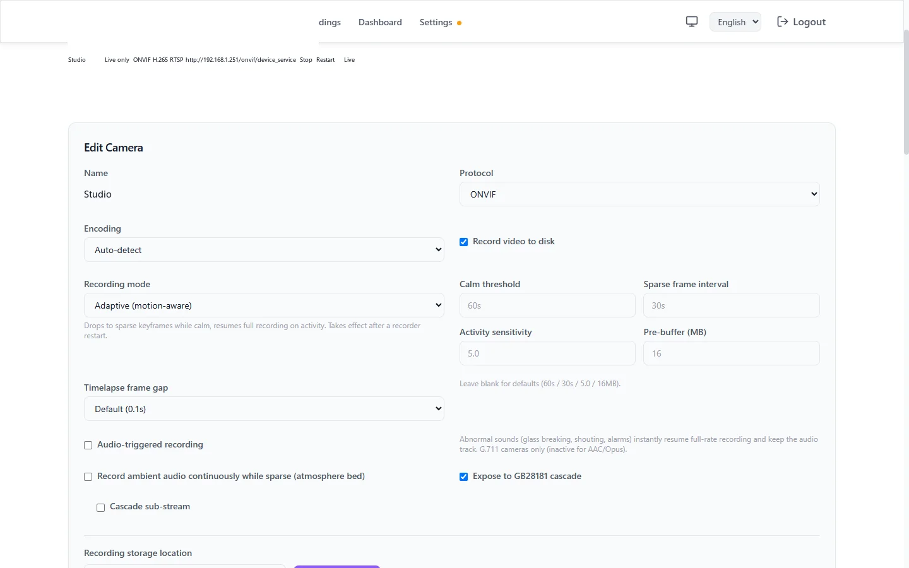
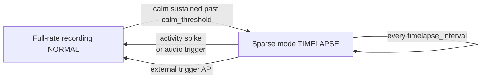
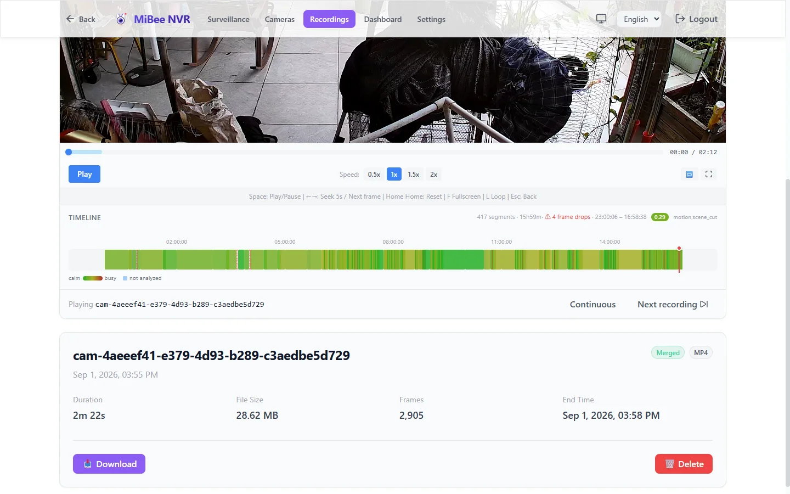

# Adaptive Recording (Motion-Aware)

> For MiBeeNvr v0.12.0

In most surveillance scenes nothing happens 95% of the time — yet continuous recording still writes every frame at full bitrate. **Adaptive recording** lets the NVR drop to "timelapse-grade" sparse keyframe writing while the scene is calm, and instantly resume full-rate recording the moment activity appears, with zero frame loss at the transition. Field-tested on static scenes: **75%–98% less disk usage**, while the first frame of every event still lands in the recording.



## How It Works



The NVR analyzes the **compressed domain** — no decoding: P-frame sizes are continuously compared against a rolling baseline (robust MAD statistics); a "calm" picture means P-frame sizes hug the baseline. In sparse mode:

- Only one keyframe per `timelapse_interval` is written (audio pauses too, unless the [ambient layer](#ambient-audio-layer) is on)
- A GOP ring pre-buffer (32MB by default) retains the most recent complete group of pictures
- **Any activity spike (a sudden P-frame size jump) immediately flushes the pre-buffer**, writing "the full GOP before the spike" to disk — so the sparse→full-rate transition loses no reference frames: no corruption, no gaps in playback

Three activity signals can pull a camera back to full rate:

| Signal | Notes |
|--------|-------|
| Video spike | P-frame size deviation above `spike_factor`× baseline (the default path; works for every H.264/H.265 camera) |
| [Audio trigger](#audio-trigger) | A loud 1-second window — breaking glass, shouting, alarms (needs G.711 audio) |
| External semantic trigger | `POST /api/cameras/{id}/adaptive/trigger` — called by home automation, an AI backend, etc. (e.g. "person detected") |

## Enabling

### Web UI (recommended)

Cameras → edit camera → **Recording mode**: choose **"Adaptive (motion-aware)"**. Parameters can be tuned in the expanded section (blank = defaults); changing the mode restarts the recorder (the UI prompts on save).

### Configuration file

```yaml
cameras:
  - id: "studio"
    name: "Studio"
    protocol: "onvif"
    # ... regular access config ...
    recording_mode: "adaptive"   # default "continuous" = full-rate recording
    adaptive:                    # all optional; defaults shown
      calm_threshold: "60s"      # how long calm must last before going sparse (10s–30m)
      timelapse_interval: "30s"  # keyframe cadence while sparse (5s–10m)
      spike_factor: 5.0          # activity sensitivity (1.5–20, see tuning)
      gop_buffer_bytes: 33554432 # GOP pre-buffer cap (1–64MB)
```

## Tuning

| Parameter | Default | What to tune |
|-----------|---------|--------------|
| `calm_threshold` | 60s | How long the scene must stay calm before dropping to sparse. Corridors with occasional passers-by benefit from 2–5 minutes |
| `timelapse_interval` | 30s | Keyframe interval while sparse. Longer = less disk, lower "framerate" during calm |
| `spike_factor` | 5.0 | **Sensitivity** — smaller is more sensitive. High-noise scenes (cloud movement, water glare, foliage) may need 10–15 before the scene ever goes sparse; too small and the camera rarely drops down (disk usage stays high); too large and faint activity is missed |
| `gop_buffer_bytes` | 32MB | The pre-buffer must hold one full camera GOP. 2K cameras with GOP near 30s overflow 16MB and lose the seamless transition — keep the 32MB default |

> Field data: a static 2K H.265 studio camera dropped from ~2700MB/h to ~688MB/h (including active spans); a fully unattended sparse stretch wrote 5.6MB/248s versus ~190MB full-rate (~34×).

## Audio Trigger

Scenes that are visually static but **audibly abnormal** (intercom chatter, breaking glass) may not trip the video gate. The audio trigger decodes G.711 in pure Go and computes loudness (dBFS) over 1-second windows:

- **Entering sparse mode additionally requires** the audio to stay quiet for `calm_threshold`
- **Any loud window while sparse**: flushes the GOP and exits sparse immediately (`reason=audio`), back-filling `pre_capture_s` seconds of pre-trigger audio — the abnormal sound is recorded with its visual lead-in

```yaml
cameras:
  - id: "studio"
    recording_mode: "adaptive"
    audio_trigger:
      enabled: true
      min_dbfs: -45        # loudness threshold (-90–0 dBFS)
      pre_capture_s: 3     # seconds of pre-trigger audio (0–30)
```

Caveats:

- Only cameras with **G.711 (µ-law / A-law)** audio — AAC/Opus have no decoder in the static build (the trigger stays inactive, logged)
- **Ambient noise sets the threshold**: a camera next to a server room or a busy road may idle at -38dBFS, already above the -45 default — measure and raise per camera (e.g. -35)
- Live audio preview and the trigger are independent; `audio_enabled` must be on (the audio path needs data)

### External Trigger API

Any external system (AI backend, home automation, scripts) can pull a camera back to full rate:

```bash
curl -u admin:password -X POST \
  http://192.168.1.50:9090/api/cameras/studio/adaptive/trigger \
  -H "Content-Type: application/json" \
  -d '{"source": "mqtt", "hold": "30s", "dbfs": -30}'
```

| Field | Notes |
|-------|-------|
| `source` | Free-form trigger source label (logged, feeds health stats) |
| `hold` | How long to stay full-rate (e.g. `"30s"`, 0–10m; default hold when omitted) |
| `dbfs` | Optional loudness reference at trigger time (logged) |

The MQTT integration's trigger-based recording ([MQTT Integration](mqtt.md)) uses the same path.

## Ambient Audio Layer

By default audio is **not recorded** while sparse (disk first). With `ambient_audio` on, calm periods record continuous G.711 ambient sound (~28.8MB/h); the rolling merge renders that "quiet sound" as a low-volume **atmosphere bed** under the timelapse video — sparse playback is no longer dead silence, while event spans keep real audio.

```yaml
    adaptive:
      ambient_audio: true      # record ambient sound while sparse; merge renders the bed
      timelapse_frame_ms: 100  # merged-product timelapse cadence: 100 / 300 / 500 ms
      ambient_archive: false   # true = also keep raw G.711 as a <segment>.g711 sidecar
```

## Playback Semantics

- **Calm spans play as a compressed timeline**: the merge compresses >2s dwell samples to `timelapse_frame_ms` spacing (default 0.1s); calm and active spans auto-vary speed within one file — so a timelapse product's **file duration is far shorter than wall-clock** (e.g. a 122s sparse stretch compresses to 0.4s). This is by design, not corruption
- **Database rows keep wall-clock duration**; the playback page's daily-timeline seeks land correctly via the timeline map (`timeline_map`)
- Active spans are bit-identical to full-rate recording — frame-by-frame inspectable

## Activity Scores & Retrieval

Every recording is scored by the compressed-domain analyzer (motion score + activity flags), usable directly in the recordings library:

- **Activity filter**: filter the list by motion / static / scene-cut, or set a minimum activity score
- **Heat timeline**: one click colorizes the recording detail's timeline by activity (green = calm → red = active) to eyeball when things happened
- **Activity-aware cleanup**: Settings → Recording & Processing — at the disk threshold, **the calmest segments are deleted first**, so the same disk space keeps more "interesting" footage



## Limits & Reading the Telemetry

| Item | Notes |
|------|--------|
| Codec | H.264 / H.265 cameras only (MJPEG has no compressed-domain differential signal) |
| Audio-trigger codec | G.711 only; AAC/Opus cameras unaffected |
| Mode changes | Take effect on recorder restart (the UI prompts; toggle the camera or restart it) |
| Disk usage didn't drop? | Most likely `spike_factor` too small so the camera never goes sparse — check the dashboard storage trend, raise the sensitivity threshold |
| Timelapse "wrong duration" | See [Playback Semantics](#playback-semantics) — compressed timeline is by design |
| Camera restart / stream loss | Sparse state resets; the calm window re-arms after recovery |

## Next Steps

- [Recording & Playback](recording-playback.md) — regular recording and playback
- [Audio](audio.md) — audio recording, monitoring, and talk-back
- [Storage Management](storage-management.md) — per-camera storage roots, candidates, and migration
- [MQTT Integration](mqtt.md) — external-event triggered recording
