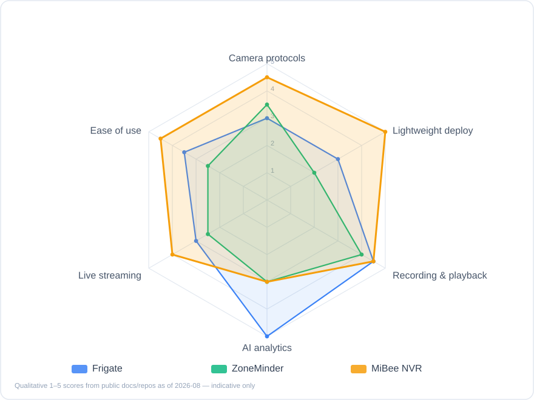
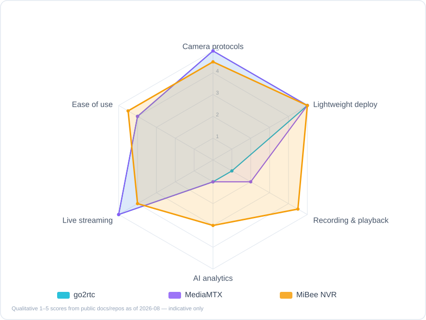

# How It Compares

> Scores are **qualitative assessments** based on public docs and repositories as of 2026-08 — indicative only. Every project compared here is respected open-source work; the goal of this page is to help you find what fits *you*.

## The Short Version

- **Want the lightest possible "one old box + a few cameras" setup**, and value a native Chinese UI, Xiaomi cameras, GB/T 28181, audio and timelapse → **MiBee NVR** was designed for exactly this
- **Want server-side realtime AI event recording** (AI-triggered clips, deep Home Assistant integration) → **Frigate** is the undisputed leader; MiBee's AI currently lives in the browser and assists viewing
- **Just want a media server** (protocol conversion, large-scale distribution, no NVR UI) → **MediaMTX** or **go2rtc** are purer tools for that
- **Need a Windows desktop app or commercial support** → **Blue Iris** (closed-source, paid) and friends fit better

## The Field

| Project | Category | Stack | Deployment | License | GitHub stars\* |
|---------|----------|-------|------------|---------|----------------|
| **MiBee NVR** | Lightweight self-hosted NVR | Go + embedded Svelte SPA | Single binary / Docker / 6 NAS app stores | AGPL-3.0 (≤v0.10.1 MIT forever) | 95 |
| [Frigate](https://github.com/blakeblackshear/frigate) | AI-first open-source NVR | Python + Docker | Docker (Coral/hw-accel recommended) | MIT | 35k |
| [ZoneMinder](https://github.com/ZoneMinder/zoneminder) | Veteran open-source NVR/CCTV | PHP + MySQL (LAMP) | Package managers / Docker | GPL-2.0 | 5.9k |
| [go2rtc](https://github.com/AlexxIT/go2rtc) | Streaming Swiss-army knife | Go | Single binary | MIT | 14k |
| [MediaMTX](https://github.com/bluenviron/mediamtx) | Media server | Go | Single binary | MIT | 19.9k |

\* Stars as of 2026-08. Other peers (Shinobi, iSpy/Agent DVR, …) are equally worth a look.

**Category note**: go2rtc and MediaMTX are strictly **media servers**, not NVRs — they answer "how do streams move", not "how is footage managed and replayed". They're included because they routinely appear in the same shortlist.

## Radar Charts

*Fig. 1: Qualitative comparison with full-featured open-source NVRs (1–5). Different strengths: Frigate goes deep on AI, ZoneMinder brings years of maturity, MiBee NVR bets on lightness and protocol breadth.*

*Fig. 2: Qualitative comparison with lightweight media servers. go2rtc / MediaMTX are the ceiling for protocol matrices and distribution — but have no recording management, playback UI or NVR semantics.*

## Capability Matrix

| Capability | MiBee NVR | Frigate | ZoneMinder | go2rtc | MediaMTX |
|------------|:---------:|:-------:|:----------:|:------:|:--------:|
| RTSP ingest | ✅ | ✅ | ✅ | ✅ | ✅ |
| ONVIF discovery / PTZ | ✅ | ⚠️ limited | ⚠️ limited | ❌ | ❌ |
| Xiaomi cameras w/o cloud | ✅ | ❌ | ❌ | ⚠️ partial | ❌ |
| GB/T 28181 | ✅ experimental | ❌ | ❌ | ❌ | ❌ |
| SRT / RTMP / WHIP push-in | ✅ | ⚠️ | ⚠️ | ✅ | ✅ |
| MP4 recording + retention | ✅ | ✅ | ✅ | ❌ | ⚠️ segments only |
| Full-day continuous playback timeline | ✅ | ✅ | ⚠️ | ❌ | ❌ |
| Audio recording (AAC/G.711/Opus) | ✅ | ⚠️ | ⚠️ | ⚠️ passthrough | ⚠️ passthrough |
| Browser-side AI detection | ✅ | ❌ (AI is server-side) | ❌ | ❌ | ❌ |
| Server-side realtime AI event recording | ❌ | ✅ best-in-class | ⚠️ plugin | ❌ | ❌ |
| Timelapse | ✅ | ❌ | ❌ | ❌ | ❌ |
| Live relay out (RTMP/RTSP) | ✅ | ⚠️ via go2rtc | ❌ | ✅ | ✅ |
| WebRTC low-latency viewing | ✅ | ✅ | ❌ | ✅ | ✅ |
| H.265 live in browser over plain HTTP | ✅ WASM | ❌ | ❌ | ⚠️ partial | ❌ |
| NAS one-click app packages | ✅ 6 stores | ⚠️ community | ⚠️ | ❌ | ❌ |
| Chinese UI / Chinese docs | ✅ | ❌ | ❌ | ❌ | ❌ |
| Runtime dependencies | None (FFmpeg optional) | Docker + Coral advised | LAMP stack | None | None |

## Dimension Notes

### Protocols & Ingest

MiBee NVR differentiates on **breadth**: RTSP / ONVIF / Xiaomi / GB/T 28181 / SRT / RTMP / WHIP push-in / HTTP-JPEG — close to every camera shape a home or small project encounters. go2rtc and MediaMTX have equally vast protocol matrices (including transports we don't offer, like QUIC), but they don't manage recording lifecycles. Frigate and ZoneMinder center on RTSP with limited ONVIF support.

### Recording & Playback

MiBee NVR offers MP4 segments + rolling merge + per-camera retention + a full-day playback timeline + timelapse — complete NVR semantics. Frigate's event clips + continuous recording + second-level review UI is one of the best experiences in class. ZoneMinder's event system is mature but the UI shows its age.

### AI

**MiBee NVR's most honest gap today**: inference runs in the browser (ONNX Runtime Web); there is no server-side "AI verdict → automatic event recording" chain. The upside: zero server load, old hardware stays usable, multiple viewers share compute. If you need unattended 24/7 server-side AI event recording, Frigate (with a Coral TPU) is the right choice.

### Footprint & Deployment

MiBee NVR's design baseline is a 1GB-RAM low-end ARM board (512MB process ceiling) — one static binary, zero external dependencies, single-file SQLite. go2rtc / MediaMTX are Go single binaries too; all three are comparably light. Frigate needs Docker and prefers hardware acceleration for inference (Coral / iGPU / Jetson), with a higher baseline. ZoneMinder's PHP + MySQL stack is the heaviest on low-end devices.

### Ecosystem & Integration

Frigate's Home Assistant integration depth is its moat; ZoneMinder has two decades of tutorials. MiBee NVR ships MQTT / WebDAV / FTP / Prometheus / REST API + API keys — a "standard interfaces, light integration" route. The native Chinese UI and documentation are another clear differentiator.

## When You Should Pick Something Else

We're happy to see you pick the right tool, even when it isn't ours:

- **Server-side 24/7 AI event recording, already on Home Assistant** → Frigate
- **A media server / large-scale distribution / WebRTC fan-out** → MediaMTX (strongest single-box distribution) or go2rtc (king of protocol conversion)
- **A Windows install-and-go app, happy to pay** → Blue Iris and other commercial options
- **Enterprise VMS (hundreds of channels, RBAC, alarm platforms)** → commercial VMS (Milestone, …) or commercial NVRs

And the profile where MiBee NVR fits:

- You have a NAS / Raspberry Pi / mini PC and want it **running today**
- You own **Xiaomi cameras** you'd like to free from the cloud, or **GB/T 28181 devices** to hook up
- You care about **audio, timelapse, a native Chinese UI**
- You'd rather not babysit databases, message queues or container orchestration — it's one binary

## Method & Updates

Radar and matrix scores are qualitative (1–5), compiled from each project's README / official docs / public repo information as of 2026-08. Open-source moves fast — if you spot a stale score or a factual error, please [open an issue](https://github.com/Mi-Bee-Studio/MiBeeNvr/issues) and we'll update promptly.
