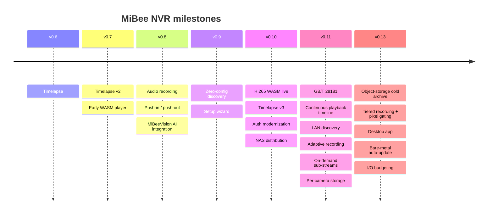

# Feature Overview

> Applies to MiBeeNvr v0.13.0 (released 2026-09)

Everything MiBee NVR can do, on one page. Each section links to its dedicated guide — treat this as the map, and dive into the spots that interest you.

## Camera Ingest

| Ingest method | Suitable devices | Highlights |
|---------------|------------------|------------|
| RTSP | Hikvision, Dahua, Uniview and most IP cameras | H.264 / H.265 / MJPEG, sub-streams, auto-reconnect |
| ONVIF | Any ONVIF-compliant camera | Auto-discovery + encoding autodetect + PTZ control + camera-side motion detection |
| Xiaomi cameras | C200 / C300 / dual-lens and more | Local recording without cloud subscription; CS2 + 7 legacy TUTK models |
| GB/T 28181 | National-standard SIP devices/platforms (experimental) | Register, catalog, PTZ, intercom, alarm subscriptions, lower-level cascade |
| SRT / RTMP push-in | Remote / cross-network cameras | Cameras push into the NVR — no reverse connection needed |
| WebRTC (WHIP) | Browser / phone / OBS | One URL turns any device into a camera source (H.264 + Opus) |
| HTTP JPEG / MJPEG | ESP32-class low-power DIY cams | Snapshot and MJPEG streams; pairs with MiBeeCam firmware |
| Raspberry Pi cameras | USB / CSI modules | Via an RTSP service (rpi-cam) |

Zero-config discovery: ONVIF WS-Discovery scanning + mDNS/DNS-SD service advertisement + UDP broadcast responder — open the web UI in your LAN and both the NVR and cameras show up.

## Live Viewing

| Protocol | Latency | Best for |
|----------|---------|----------|
| WebRTC (WHEP) | Sub-second | Phone / tablet real-time monitoring; G.711 and Opus audio pass through with zero transcoding |
| WebSocket | ~0.5s | General low latency, WASM decode pipeline |
| HTTP-FLV | 1–3s | Browser-friendly long watching |
| HLS / LL-HLS | 2–5s | Compatibility first, native iOS support |
| WASM player | ~1s | **H.265 playback over plain HTTP** — no HTTPS, no client app |
| RTSP output | Real-time | Third-party platforms (Synology Surveillance Station etc.) pull directly — one URL per camera, `rtsp://<NVR-IP>:8554/<camera_id>`; as of v0.13 MJPEG/JPEG cameras too (RTP-JPEG) |

- **End-to-end H.265**: live view (WASM software decode / WebCodecs hardware decode, auto-selected), recording, playback and timelapse all support H.265
- **[On-demand sub-streams](sub-stream.md)**: the grid's "Smooth" mode rides the low-resolution sub-stream and stops pulling when nobody watches — zero idle cost; ONVIF sub-streams auto-discovered, silent fallback to main
- The frontend picks the best protocol per device automatically (WebCodecs → WebGPU → WASM fallback chain) — nothing to configure
- MJPEG / JPEG cameras get a dedicated player (latest-frame polling with ETag 304 savings)

## Recording & Playback

- **MP4 segment recording**: IDR-aligned segment starts (no black frames), audio muxed in (AAC / G.711 / Opus), atomic writes for crash safety
- **[Adaptive recording](adaptive-recording.md)**: drop to timelapse-grade sparse writing while the scene is calm; activity, abnormal sounds or external triggers instantly restore full rate — 75%–98% less disk on static scenes, first frame of every event captured. v0.13 adds **tiered recording + pixel-domain gating**: smart-encoder cameras (static ~0.5fps / 5MP VBR) get a 24/7 sub-stream baseline with on-demand main-stream capture, refined by ~1fps classic-CV sampling — no camera-side cooperation required
- **Audio-triggered recording**: abnormal sounds (breaking glass, shouting) trigger full-rate recording with pre-trigger audio back-fill (G.711 cameras)
- **Instant snapshots**: latest-frame H.264 / H.265 snapshots (optional FFmpeg acceleration), triggerable via MQTT / webhook
- **Continuous playback timeline**: double-buffered seamless segment chaining (no black flashes) + a full-day VOD timeline — scrub across recordings and gaps in one drag
- **Rolling merge**: segments merged into larger files by policy, streaming with a 1MB buffer — memory-flat
- **Retention**: per-camera retention days + disk watermark cleanup; AI-flagged recordings are protected from cleanup; optional **activity-aware cleanup** — at the watermark, the calmest segments go first, keeping more eventful footage on the same disk
- **Activity retrieval**: every segment carries a compressed-domain motion score and flags — filter the library by motion / static / scene-cut or a minimum score, and toggle an **activity heat** timeline (green = calm → red = active)
- **AVI frame browsing**: legacy-container recordings can be scrubbed frame by frame
- **Timelapse v3**: dual-mode — standalone timelapse recording or frame extraction from recordings (MJPEG cameras supported as of v0.13); natural-day / 1h / 8h / 24h / 7d / 30d merge windows, merge history indexed and playable, `timelapse-merge` CLI for batch conversion (see [Timelapse](timelapse.md))
- **Global recording default**: `recording.default_enabled` turns recording off everywhere at once — pure live-view deployments write nothing to disk

## GB/T 28181 (Experimental)

SIP cameras/platforms REGISTER directly to the NVR and appear as regular cameras:

- Registration with Digest auth, catalog query, automatic channel enrollment
- PTZ direction / zoom / presets, voice intercom, time sync
- Alarm / catalog / mobile-position subscriptions with alarm linkage
- Device-side recording search (RecordInfo) + playback pull (speed control / seek)
- **Lower-level cascade**: the NVR registers to an upper platform, forwards catalog/alarms; the upper platform can request NVR-local recordings (as of v0.13 the main stream activates on demand at playback time — nothing is pulled while idle); per-camera catalog convergence and optional sub-stream cascading keep your uplink light
- **GB35114 pilot**: A-level secure registration (SM2 certificates, requires a `-tags gb35114` build) — an early look at the national-standard video security chain

> Off by default — enabling is opt-in. See the [GB/T 28181 guide](gb28181.md).

## Smart Features

- **Browser-side AI detection**: ONNX Runtime Web (WebGPU → WASM SIMD fallback) runs YOLO11 inference in your browser — zero server load, works even on aging NVR hardware
- **ROI zones**: draw the doorway / hallway / gate; only targets inside the zone raise events. Confidence, frame-skip and class filters all tunable (see the [AI tuning guide](ai-detection.md))
- **MiBeeVision integration**: optional external AI backend (as of v0.13: multi-instance routing via `vision.instances` + push circuit-breaker with automatic back-off) — the NVR pushes recording segments and re-pushes missed ones after reconnects; AI event snapshot endpoint
- **Camera-side motion detection**: ONVIF MotionAlarm events serve directly as a recording trigger (`motion_source: camera:onvif`, see the [ONVIF guide](onvif-discovery.md)) — detection work is offloaded to the camera, zero decode cost on the NVR
- **Health monitoring**: multi-level camera health checks, auto-remediation, blacklisting, IP-drift self-healing (re-discovers cameras by ONVIF serial number)
- **SSE live events**: camera status, health events and segment completion stream to the UI in real time

## Relay & Distribution

- **Live relay**: forward any camera's live stream to YouTube / Twitch / SRS and other RTMP / RTSP targets — native Go implementation, FFmpeg only as a compatibility fallback
- **Push-in ingest**: SRT / RTMP / WebRTC WHIP — bring in remote cameras across networks
- One frame bus feeds recording / live view / relay simultaneously without interference

## Audio

- Recording: AAC / G.711 (μ-law, A-law) / Opus all land in the MP4 audio track
- Live monitoring: real-time G.711 and Opus playback; AAC via WebCodecs
- **Two-way intercom**: push-to-talk to the camera (Xiaomi CS2 models)

## Storage & Integrations

- **SQLite (WAL)**: every bit of metadata in one file — tuned for SD cards (NORMAL sync + busy timeout), no external database
- **[Per-camera storage & hot migration](storage-management.md)**: switch the recording root or assign per-camera disks at runtime; history migrates in a rate-limited background job (time-windowed) — no restarts; the DB stays decoupled from the recording root
- **[Object-storage cold archive](storage-offload.md)**: fully merged recordings upload asynchronously to S3-compatible storage (R2 / B2 / MinIO / OSS / COS and more); after remote verification the local copy can be safely evicted — local recording behavior unchanged, off by default
- **WebDAV server**: browse the recording library from any file manager (read-only or read-write)
- **FTP server**: remote upload + camera auto-registration (point the camera at the FTP address and it joins)
- **MQTT**: event-bus forwarding (`mqtt.status_events`) + triggered / timed forced recording + snapshot triggers for home automation
- **[Webhook triggers](webhook-integration.md)**: HMAC-SHA256-signed trigger endpoint (Stripe-style signatures + two-way replay protection) for external systems to start recording / snapshots
- **[Home Assistant](home-assistant.md)**: the official custom integration ships with the release (mDNS auto-discovery + per-camera entities / switches); a fully native RTSP-output + MQTT assembly works too
- **Prometheus**: 300+ metric families at `/api/metrics`
- **REST API**: everything scriptable; API keys (`mbv_` prefix) alongside BasicAuth

## Deployment & Distribution

| Method | Notes |
|--------|-------|
| One-line installer | `curl … install.sh \| sudo bash` — binary, system user, systemd unit, start |
| Prebuilt binaries | amd64 / arm64 / armv7 from GitHub Releases |
| Desktop app | Windows / macOS single-file installers ([desktop guide](desktop.md)): tray / menu-bar helper, localhost no-auth — feature-identical to the server |
| Bare-metal auto-update | ed25519 signature verification on release artifacts + automatic rollback on failed health gates; one-click Web upgrade with history (`update.auto_apply` off by default) |
| Docker | `ghcr.io/mi-bee-studio/mibeenvr` + Aliyun mirror (fast pulls in CN), multi-arch manifest |
| NAS app stores | fnOS (offline + online packages), Synology, QNAP, Zspace, unRAID, iStoreOS, zSpace |
| systemd / bare | One static binary + one YAML file — that's the whole footprint |

## Web UI

- Modern Svelte 5 SPA, **English / 中文**, light & dark themes, installable PWA
- Setup wizard (3 minutes to first recording), surveillance grid (header "Smooth / HD" sub-stream toggle), recording library (activity filters + heat timeline), timelapse, dashboard, health page, stats page
- **Camera groups**: drag cards into groups, reorder and rename; the camera picker filters by group and selects a whole group in one click
- **Dashboard with four tabs**: storage trend (per-camera usage + stacked daily-write chart with a clickable legend), health history, transcoding history, AI events (shown when an external AI backend is configured)
- **Per-camera flow diagnosis**: expand any camera in the dashboard's camera-status list into a flow tree (source → hub → recording / live viewing / health checks / relays / sub-stream), color-coded at a glance — green = active, gray = idle, orange = trouble (e.g. marked recording but no frames inflow), red = heavy frame drops; includes plain-language health-score factor breakdown and this camera's storage usage
- Fully responsive — the phone browser gets the complete experience, not a stripped one

## Release Timeline

## Performance & Reliability

- **[I/O budget scheduling](performance.md)**: background jobs (merge / cleanup / repair / timelapse / transcode / cold-archive uploads) share one token bucket and yield to the foreground instead of competing as equals; the gray-release switches billing recording writes / playback reads stay off by default
- **Recording write-stutter eradicated**: incremental MP4 flushing removes the full-file burst at Close, per-segment write locks stop cameras serializing each other, NALU buffers are pooled (see [Performance Tuning](performance.md))
- **Adaptive memory**: GOMEMLIMIT set automatically from physical RAM / cgroup quota (min(45% of physical RAM, 1 GiB), or 80% of a cgroup cap) — small-memory boards stop getting OOM-killed
- **Ops guardrails**: `validate-config` CLI preflight, deep orphan-directory scanning, startup config guard (last-good backup restore + crash-loop fuse)

## Resource Baseline & Constraints

The design baseline is a **low-end ARM board** (1GB RAM, Cortex-A53 class); all budgets are conservative against it:

| Item | Baseline |
|------|----------|
| Process memory ceiling | 512MB |
| Concurrent HLS streams | ≤ 4 |
| Recording segment length | ≤ 30s |
| Runtime dependencies | None (FFmpeg optional, only for H.265↔H.264 transcoding) |
| Database | Single-file SQLite (WAL) |

## Next Steps

- Get running fast: [Quick Start](quickstart.md)
- See real-world recipes: [Scenario Playbooks](scenarios.md)
- Comparing options: [How It Compares](comparison.md)
