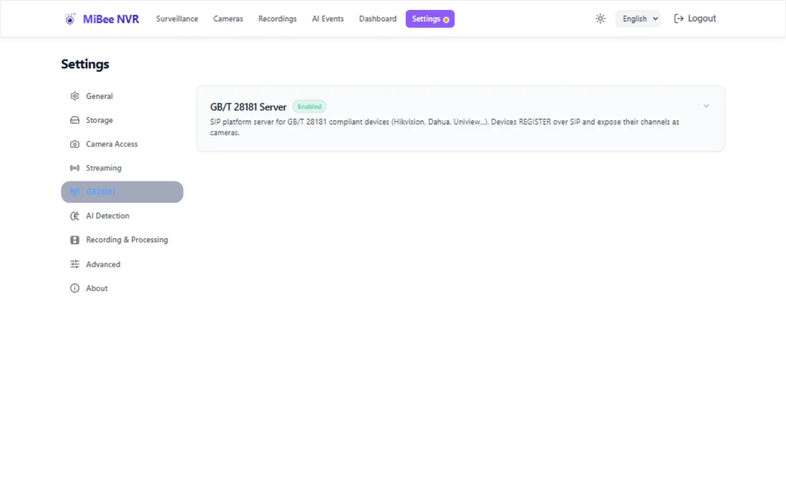

# MiBee NVR GB/T 28181 Guide

This guide covers MiBee NVR's GB/T 28181 (Chinese national video-surveillance standard) integration: SIP platform setup, device enrollment, audio, voice intercom, subscriptions, PTZ, device-side recording playback, and troubleshooting.

## What is GB/T 28181?

GB/T 28181 is China's national standard for networked video monitoring; it defines how IP cameras, NVRs, and platforms interoperate over SIP and RTP/PS. MiBee NVR implements the **platform role** (UAS):

- Devices **REGISTER** to the NVR over SIP (UDP port 5060 by default)
- Devices send **Keepalive** heartbeats to stay online
- The NVR **INVITEs** a channel to pull an RTP/PS media stream (pull model)
- The NVR demuxes MPEG-PS into H.264/H.265 NALUs plus audio frames (G.711/AAC) and feeds the standard recording/streaming pipeline

Compatibility matrix: GB/T 28181-2007/2011/2016/2022 (see `internal/gb28181/doc.go`). Supported vendors include Hikvision, Dahua, Uniview, and other GB28181-compliant manufacturers.

## Quick Start

### Step 1: Enable the GB28181 server

**Recommended: the web UI.** Open the NVR web UI → **Settings → GB28181**, flip the enable toggle, fill in the fields, and save (the password is write-only; leaving it blank keeps the current value).



Equivalent YAML (`mibee-nvr.yaml`):

```yaml
gb28181:
  enabled: true
  sip_listen: ":5060"
  server_id: "34020000002000000001"
  realm: "3402000000"
  password: "yourpassword"
  port_range: "30000-30050"
  heartbeat_interval: "60s"
  catalog_interval: "30m"
  media_transport: "tcp-passive"  # udp | tcp-passive | tcp-active (default tcp-passive, see below)
  subscribe_catalog: true       # real-time channel-change push
  subscribe_alarm: true         # alarm subscription
  subscribe_mobile_position: false
  subscribe_expires: "3600s"
  allowed_device_ids: []        # empty = allow any device
```

**Key parameters**:
- `server_id`: the NVR's 20-digit GB/T 28181 platform serial (must match the device side exactly)
- `realm`: the SIP digest-auth realm (usually your 10-digit area code)
- `password`: the SIP digest secret. **Empty = no authentication** (any device that can reach port 5060 can register — see Security)
- `media_transport`: RTP transport — `tcp-passive` (default; NVR listens, device connects — the Hikvision/Dahua NAT default), `udp`, or `tcp-active` (NVR dials the device's answer address). **Why TCP is the default (#460)**: UDP media measured ~16% frame loss on a real GB camera (IDR-sized bursts overflow the NIC/softirq path; each loss breaks the P-frame reference chain — macroblock corruption until the next IDR), while TCP measured <1% on the same LAN. Older devices without TCP media support can opt back into `udp`.

### Step 2: Configure the camera

On the camera's web UI, configure SIP platform access:

**Hikvision**: *Network → Advanced Platform Access* — server address = NVR IP, server port `5060`, device ID = the camera's 20-digit code, password matching the NVR's, enable platform access.

**Dahua**: *Network → TCP/IP → 28181* — server IP/port/device ID/domain (realm)/password matching the NVR's, enable 28181.

The device should REGISTER within seconds.

### Step 3: Auto-enrollment (zero manual setup)

**No manual camera setup is required.** Once a device registers, the NVR automatically:

1. Records it in the device list and tracks online status (heartbeat timeout → offline)
2. Queries its catalog and discovers every real video channel (organization nodes are skipped)
3. Creates one camera per channel (`gb-<channelID>`), listed alongside ONVIF/RTSP cameras
4. Auto-INVITEs each enrolled channel and starts recording
5. Backfills manufacturer/model (DeviceInfo) and subscribes to catalog changes and alarms

To bind a specific channel manually (optional), create the camera via the web form or YAML:

```yaml
cameras:
  - id: "hikvision-front-door"
    name: "Hikvision Front Door"
    protocol: "gb28181"
    gb28181:
      device_id: "34020000001320000001"
      channel_id: "34020000001320000001"
    recording_enabled: true
    enabled: true
```

### Step 4: Enable audio (per camera)

Audio is off by default. Turn on the **Audio** toggle in the camera's edit page (or `PUT /api/cameras/{id}` with `{"audio_enabled": true}`); the PS stream's audio track (G.711 A-law/μ-law, AAC) is then muxed into MP4 recordings and live streams.

## Capability Overview

| Capability | Status | Notes |
|---|---|---|
| REGISTER + Digest auth / allowlist | ✅ | 401 challenge, periodic re-register, unregister, IP-change session rebuild |
| Auto-enrollment | ✅ | Register → catalog → per-channel cameras → auto streaming, zero config |
| Live viewing (INVITE) | ✅ | UDP / TCP passive / TCP active (0x24, rfc4571, auto framing) |
| Recording | ✅ | H.264/H.265, 30s segments, IDR-aligned, rolling merge |
| Streaming out | ✅ | Via StreamHub to HLS/WebRTC/FLV/WS |
| **Audio** | ✅ | G.711 A-law/μ-law + AAC → MP4 tracks + live audio; PSM-less streams auto-resolved |
| **Voice intercom (talk)** | ✅ | Browser mic → camera speaker (one-click in LiveView) |
| Device-side recording search/playback | ✅ | RecordInfo + fetch into the recordings library + speed/seek control |
| PTZ + presets | ✅ | Direction/zoom/preset/cruise (FICommand) |
| Catalog subscription | ✅ | Real-time channel-change NOTIFY instead of polling |
| Alarm subscription | ✅ | → event bus/SSE/REST ring buffer |
| Mobile-position subscription | ✅ | Vehicle-mounted cameras; REST trajectory query |
| Time sync | ✅ | Device Query answered with platform time |
| DeviceInfo/Status automation | ✅ | Brand/model backfill; keepalive preserves metadata |
| **Cascading (lower-level role)** | ✅ | Registers to an upper platform, aggregated catalog, INVITE forwarding (see Cascading Uplink) |
| GB35114 | ⏸ | On demand (see #341) |

## Configuration Reference

### Server

| Parameter | Type | Default | Description |
|-----------|------|---------|-------------|
| `enabled` | bool | `false` | Enable the GB28181 server |
| `sip_listen` | string | `":5060"` | SIP UDP listen address |
| `server_id` | string | (required) | Platform 20-digit serial |
| `realm` | string | (required) | SIP digest realm |
| `password` | string | (recommended) | SIP digest password; empty = no auth |
| `port_range` | string | `"30000-30050"` | RTP media port pool (`"start-end"`) |
| `heartbeat_interval` | string | `"60s"` | Expected device heartbeat interval |
| `catalog_interval` | string | `"30m"` | Catalog poll interval (fallback when subscribed) |
| `media_transport` | string | `"tcp-passive"` | `tcp-passive` / `udp` / `tcp-active` (why TCP, see above — #460) |
| `sip_transport` | string | `"udp"` | Signaling transport: `udp` (add `tcp` listener optionally) |
| `tcp_framing` | string | `"auto"` | TCP framing: `rfc4571` / `0x24` / `auto` |
| `subscribe_catalog` | bool | `true` | Catalog subscription (real-time channel push) |
| `subscribe_alarm` | bool | `true` | Alarm subscription |
| `subscribe_mobile_position` | bool | `false` | Mobile-position subscription |
| `subscribe_expires` | string | `"3600s"` | Subscription lifetime (auto-renewed at 80%) |
| `allowed_device_ids` | `[]string` | `[]` | Registration allowlist (empty = allow all) |
| `allow_same_ip_enroll` | bool | `false` | Keep dual-protocol enrollment: auto-enroll a GB28181 channel even when another camera already streams from the device IP (or matches its ONVIF serial). For deliberate ONVIF + GB28181 side-by-side setups, #596 |
| `sub_channel_probe` | string | `"auto"` | Sub-channel prober mode: `auto` (probe only Hikvision/Dahua devices) / `on` (probe every device) / `off`, #560 |
| `sub_channel_probe_offset` | int | `1` | Sub-channel candidate code = main channel code + this offset (Hikvision convention is +1; 0 disables probing). Range 0–99 |

> `tcp_mode` (bool) is a legacy alias of `media_transport`, kept for YAML compatibility. It no longer influences the default (tcp-passive since v0.12.0, #460) — set `media_transport: "udp"` explicitly for UDP.

### Camera

| Parameter | Type | Description |
|-----------|------|-------------|
| `protocol` | string | Must be `"gb28181"` |
| `gb28181.device_id` | string | Device 20-digit code |
| `gb28181.channel_id` | string | Channel 20-digit code |
| `gb28181.sub_channel_id` | string | Probed sub-stream channel code (auto backfilled, fill-once; clear + restart to re-probe). When set, `?quality=sub` and sub-stream cascade forwarding work, #560 |
| `audio_enabled` | bool | Audio toggle (default false; enables MP4 audio tracks + live audio) |

## Sub-Stream (Sub-Channel Probing, #560)

GB devices usually do NOT list their sub stream in the catalog — Hikvision-family devices expose it implicitly at a channel-code offset (main code +1). Once a device has registered and its main streams settled, the NVR probes the vendor-convention sub candidate once per bound camera (one extra INVITE, at most once per process lifetime):

- **Success** (media flows on the candidate): the code is persisted to `gb28181.sub_channel_id` (fill-once), `/api/cameras/{id}/protocols` reports `sub_stream.available=true`, and `?quality=sub` (WS/FLV/HLS/WHEP grid + cascade sub forwarding) becomes usable
- **Failure** (404/timeout/486): silently dropped — the camera keeps its no-sub-stream degradation path with **zero error state**
- The offset is configurable (`sub_channel_probe_offset`, default 1); in `auto` mode only devices whose DeviceInfo manufacturer is Hikvision or Dahua are probed, leaving self-developed devices untouched
- A persisted `sub_channel_id` is never overwritten; clear the field and restart the NVR to re-arm probing
- Sibling codes already present in the catalog (e.g. channels 02/03 of a multi-channel NVR) are NEVER repurposed as sub streams

## Audio

- **Codecs**: G.711 A-law / μ-law (8 kHz), AAC (ADTS auto-converted to ASC)
- **Toggle**: per-camera `audio_enabled`; when off, demuxed audio frames are dropped
- **PSM-less streams**: some firmware muxes audio into the PS stream without ever sending a PSM (or without declaring audio in it). The NVR resolves the codec in priority order: **PSM declaration → INVITE-answer SDP `a=rtpmap` → byte-shape heuristic** (ADTS sync → AAC; μ/A-law by quiet-cluster voting — μ-law silence clusters at 0xFF/0x7F, A-law at 0x55/0xD5). The decision is logged as `codec inferred`
- **PTS-less audio**: frames without PES PTS advance the timeline by sample count, tolerating firmware that omits audio PTS
- **Device-side recommendations**: mux audio into the same PS/RTP stream (same port + SSRC), declare it in the PSM (stream_type 0x90=μ-law / 0x91=A-law / 0x0F=AAC, stream_id 0xC0-0xDF), send G.711 as raw 8 kHz mono bytes

## Voice Intercom (Talk)

The LiveView page shows a **Talk** button for GB28181 cameras: browser mic → AudioWorklet downsample to 8 kHz → A-law encode → WebSocket upstream → the NVR sends an audio-only INVITE (`m=audio ... RTP/AVP 8`, `a=sendrecv`) → RTP to the device's receive address. Half-duplex: live audio and talk coexist.

API: `GET /api/cameras/{id}/gb28181/talk` (WebSocket; binary frames = A-law bytes) and `GET /api/cameras/{id}/gb28181/talk/status`.

## Cascading Uplink (Lower-Level Role)

The NVR can register to an upper-level GB/T 28181 platform as a lower-level platform: local cameras are aggregated into one catalog, and when the upper platform INVITEs a channel its stream is forwarded as RTP/PS (pure remux, no transcode). The upper platform needs nothing cascade-specific — any standard platform works, including another MiBee NVR's platform role.

```yaml
gb28181_cascade:
  enabled: true
  server_domain: "34020000002000000001"   # upper platform 20-digit ID
  server_addr: "192.168.1.10:5060"       # upper SIP address
  local_device_id: "34020000001320000099" # this NVR's lower-level device ID
  realm: "3402000000"
  password: "..."                          # encrypted via encrypt-config
  sip_listen: ":5061"                      # cascade signaling port (coexists with 5060)
  heartbeat_interval: "60s"
  register_expires: 3600
```

Behavior:

- Channel IDs are allocated on first catalog appearance (`<ID[:10]>132` + 7-digit serial) and persisted — upper-platform bindings survive restarts
- REGISTER + Digest, re-registration at 80% of Expires, Keepalive; an upper restart (keepalive 403) triggers immediate re-registration
- The catalog aggregates every non-MJPEG camera; H.264/H.265 is sniffed from the first NAL for the PSM type
- Upper INVITE → 200 OK (sendonly) → StreamHub subscription → PS mux → RTP push; BYE/error teardown
- **Catalog convergence** (`cameras[].cascade_enabled: false`): the camera is hidden from the aggregated catalog and its channel's INVITEs answer 404, but the channel-code allocation is kept — re-enabling restores the same code, upper-platform bindings don't drift
- **Sub-stream cascading** (`cameras[].cascade_sub_stream: true`): INVITE forwarding rides the camera's on-demand [sub-stream](https://github.com/Mi-Bee-Studio/MiBeeNvr/blob/main/docs/en/sub-stream.md) — the low-resolution tier keeps your uplink bounded for preview-only platforms; falls back to main when the camera has no sub-stream or the pull fails, and cameras without one are unaffected
- v1 limits: **video only** (the hub's audio callback does not distinguish G.711 A/μ-law yet); single upper platform; no catalog-change NOTIFY pushes (the upper falls back to polling)

## Subscriptions and Events

- **Catalog**: channel-list changes arrive as NOTIFY in real time (merged into the channel table, cameras auto-enrolled)
- **Alarm**: `GET /api/gb28181/devices/{id}/alarms` reads the ring buffer (latest 200); events also hit the bus (SSE `gb28181.alarm`)
- **Mobile position**: `GET /api/gb28181/devices/{id}/positions` returns the trajectory
- Toggles + lifetime in the settings page / table above; auto-renewal at 80% of lifetime

## Device-Side Recording Search & Playback

The Recordings page can search **recordings stored on the device** (RecordInfo) and fetch them: fetched segments go through the normal recording pipeline (segments on disk, recordings rows) and play back in the Recordings page with speed/seek control (INFO).

API:
- `GET /api/gb28181/channels/{id}/records?start=&end=` — search device recordings
- `POST /api/gb28181/channels/{id}/playback` — start a fetch (body carries start/end)
- `GET /api/gb28181/channels/{id}/playback` — fetch progress
- `DELETE /api/gb28181/channels/{id}/playback` — stop
- `POST /api/gb28181/channels/{id}/playback/control` — speed/seek/pause

## PTZ Control

PTZ is sent via MANSCDP DeviceControl. Supported: directions (incl. diagonals), zoom (needs `PTZType=2`), presets/cruise (FICommand). A channel's `PTZType` comes from its catalog entry (0=none, 1=pan/tilt, 2=pan/tilt+zoom).

Web UI: the PTZ panel on the camera's LiveView page (press-and-hold movement, preset set/recall).

```bash
curl -X POST http://localhost:9090/api/gb28181/channels/34020000001320000001/ptz \
  -H "Content-Type: application/json" \
  -H "Authorization: Basic base64(username:password)" \
  -d '{"direction": "up", "speed": 128}'
```

Directions: `up/down/left/right/up-left/up-right/down-left/down-right/zoom-in/zoom-out/stop`.

## API Reference

### Devices & channels
- `GET /api/gb28181/devices` — registered devices (ETag supported)
- `GET /api/gb28181/devices/{id}/channels` — channel list
- `POST /api/gb28181/devices/{id}/catalog-refresh` — trigger a catalog refresh (202)
- `GET /api/gb28181/devices/{id}/alarms` — alarm ring buffer
- `GET /api/gb28181/devices/{id}/positions` — mobile-position trajectory

### Media sessions
- `POST /api/gb28181/channels/{id}/invite` / `bye` — manual stream start/stop
- `POST /api/gb28181/channels/{id}/ptz` — PTZ control

### Device-side recordings
- See the previous section

### Talk
- `GET /api/cameras/{id}/gb28181/talk` (WebSocket), `GET .../talk/status`

### Errors

| Status | Case |
|--------|-------|
| 400 | Missing/malformed body; unsupported PTZ |
| 404 | Channel not found |
| 409 | Device offline |
| 500 | Internal error (MANSCDP encode/send failure) |

## Troubleshooting

### Device does not register

1. Verify `sip_listen` is listening (`ss -ulnp | grep 5060`) and UDP 5060 is allowed through the firewall
2. Check the five device-side fields: server IP / port 5060 / server ID (must equal `server_id` exactly) / realm / password
3. Check logs: `journalctl -u mibee-nvr -f | grep -i gb28181` — `REGISTER auth failed` = password mismatch; `not in allowlist` = allowlist
4. After changing the NVR password: the device's next re-REGISTER (within one registration cycle) fails with 403 and it goes offline; once the camera side is updated it recovers automatically, no re-enrollment needed

### Black screen / no stream

1. Check the `port_range` isn't exhausted and the UDP range is firewall-allowed
2. Behind NAT, switch to `media_transport: tcp-passive`
3. On TCP framing errors, try `tcp_framing: rfc4571 / 0x24 / auto`
4. Codec: H.264/H.265 auto-detected, no configuration needed

### Macroblock corruption / tearing (blurry bottom half)

Typical symptom: a region of the frame (often the bottom half) turns into macroblock garbage, recovers with the next keyframe seconds later, then repeats. Root cause: **UDP media packet loss** (IDR-sized bursts overflow the path; each loss breaks the P-frame reference chain — #460 measured up to 16% frame loss):

1. Confirm `media_transport` is the default `tcp-passive` (switch back if it was changed to `udp`)
2. Still corrupted on TCP → check `tcp_framing` (try `rfc4571` / `0x24` / `auto` in turn)
3. Cross-check the receiver logs' `gap_skipped` / `AU ended mid-PES` counters to locate the loss

### No audio

1. Confirm the camera's **Audio** toggle is on (`audio_enabled`, off by default)
2. Look for the `codec inferred` log line — PSM-less devices get their codec auto-resolved; if the line never appears and there is no audio track, capture the stream and confirm the device actually muxes audio into the PS stream
3. See the device-side recommendations under Audio; PSM-less audio works here (auto fallback) but other platforms (ZLMediaKit etc.) drop it — devices should ideally declare audio in the PSM

### Periodic session recycling

Logs show `recycling stale session reason=no keyframe` and recordings have a gap every minute or so: the device's keyframe interval (GOP) exceeds the NVR's 75s watchdog. This is the designed self-healing (the re-INVITE forces a fresh IDR), but the device GOP should ideally be **2-4 seconds**.

### REGISTER source-port rotation

Some SIP stacks use a fresh source port per REGISTER. The NVR compares **IP only** when detecting address changes; port rotation never recycles sessions.

### Heartbeat timeouts

If the device drops offline, align its heartbeat interval with `heartbeat_interval` (default 60s) on either side.

### Mojibake (GBK vs UTF-8)

The MANSCDP codec strips the XML declaration, validates UTF-8, and falls back to GB18030/GBK automatically. If names still look garbled, check the device's encoding setting.

### Clock sync

If authentication or recording searches misbehave due to clock drift: the NVR answers TimeSync queries automatically; keep both sides NTP-synced.

## Limitations & Known Issues

- **Device-self pseudo-channel**: after an NVR restart, catalog-capable multi-channel devices briefly get a "device-self" camera that never streams. Known issue; archive it manually after restart. Tracked in #352
- **Talk real-device coverage**: voice intercom is E2E-verified against a simulator; the real-device loopback is tracked in #353
- **TCP 0x24 framing**: a vendor extension (GB/T 28181-2016/2022 specify RFC4571); use `auto` for mixed fleets
- **Multi-level cascading / GB35114**: not implemented, on demand (#341)
- **Alarm-triggered streaming**: alarm events are on the bus; automated alarm → INVITE linkage is tracked in #355

## Security

- **Authentication**: always set `password` (empty = any reachable device can register). Combine with the `allowed_device_ids` allowlist for defense in depth
- **Transport**: SIP/RTP are plaintext (GB35114 TLS/SM crypto not implemented). Public deployments must sit behind a firewall/VPN — do not expose 5060 or the port pool directly
- **Port pool**: 51 ports by default; extend as needed (keep under ~200 on RPi 3B)

## Resources

- [Getting Started](https://github.com/Mi-Bee-Studio/MiBeeNvr/blob/main/docs/en/getting-started.md) · [Configuration](https://github.com/Mi-Bee-Studio/MiBeeNvr/blob/main/docs/en/configuration.md) · [API Reference](https://github.com/Mi-Bee-Studio/MiBeeNvr/blob/main/docs/en/api/README.md)
- GB/T 28181-2016 / 2022 standard texts
- [GitHub Issues](https://github.com/Mi-Bee-Studio/MiBeeNvr/issues) · [Discussions](https://github.com/Mi-Bee-Studio/MiBeeNvr/discussions)
