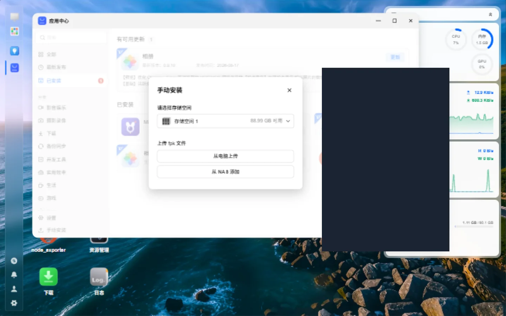

# NAS Deployment

> For MiBeeNvr v0.11.0

MiBee NVR supports 6 major NAS platforms, deployable through one-click install scripts or package managers.

## Supported NAS Platforms

| NAS Platform | Install Method | Notes |
|--------------|----------------|-------|
| **Synology DSM 7** | Package Center | Official community package |
| **QNAP QTS** | App Center | Official app |
| **unRAID** | Docker template | Community template |
| **FlyBull fnOS** | `.fpk` app package / Docker | App Center manual install, gateway SSO |
| **OpenMediaVault** | Docker | Docker Compose |
| **TrueNAS** | Apps / Docker | iX system integration |

## Synology DSM 7

### Via Package Center

1. Open "Package Center" → "Settings" → "Package Sources"
2. Add: `https://mibee-nvr.github.io/synology/`
3. Search for "MiBee NVR" and install

### Via Docker

1. Open "Container Manager" (DSM 7.2+)
2. Create a project, select `docker-compose.yml`
3. Mount the storage volume to a NAS shared folder

```yaml
services:
  mibee-nvr:
    image: ghcr.io/mi-bee-studio/mibee-nvr:latest
    ports:
      - "9090:9090"
      - "1935:1935"
      - "9000:9000/udp"
      - "2121:2121"
    volumes:
      - /volume1/docker/mibee-nvr:/data
    restart: unless-stopped
```

### Storage Recommendations

| Scenario | RAID Level | Notes |
|----------|------------|-------|
| 4 × 1080p cameras | RAID 1 | ~40 GB per day |
| 8 × 4K cameras | RAID 5 | ~200 GB per day |
| 16 × 4K cameras | RAID 6 | ~400 GB per day |

## QNAP QTS

### Via App Center

1. Open "App Center"
2. Search for "MiBee NVR" and install

### Via Container Station

1. Open "Container Station"
2. Import the Docker Compose configuration
3. Map a NAS shared folder to the container's `/data`

```yaml
services:
  mibee-nvr:
    image: ghcr.io/mi-bee-studio/mibee-nvr:latest
    ports:
      - "9090:9090"
    volumes:
      - /share/CACHEDEV1_DATA/docker/mibee-nvr:/data
    restart: unless-stopped
```

## unRAID

### Via Docker

1. Open the "Docker" page
2. Click "Add Container"
3. Select a template or configure manually

Using the community-maintained template is recommended:

```yaml
services:
  mibee-nvr:
    image: ghcr.io/mi-bee-studio/mibee-nvr:latest
    ports:
      - "9090:9090"
      - "1935:1935"
      - "9000:9000/udp"
    volumes:
      - /mnt/user/appdata/mibee-nvr:/data
      - /mnt/user/media/nvr:/recordings
    environment:
      - PUID=99
      - PGID=100
    restart: unless-stopped
```

### Storage Pool Configuration

unRAID users are advised to store recordings in a dedicated storage pool:

- **Cache Pool**: for temporary caching and the database
- **Array**: for long-term recording storage

## FlyBull fnOS

MiBee NVR ships an official `.fpk` app package for fnOS — install it manually from the App Center, no command line required. After installation, a MiBee NVR icon appears on the desktop:

> The screenshots below show the Chinese fnOS interface (fnOS is a Chinese NAS OS); the steps are identical on any fnOS install.


### Installing the .fpk Package

Every release publishes two package variants on the [releases page](https://github.com/Mi-Bee-Studio/MiBeeNvr/releases):

| | Offline `.fpk` | Online `.fpk` |
|---|---|---|
| Size | ~150 MB (bundled dual-arch images) | ~65 KB |
| Network at install | Not required (loads bundled images) | Required (pulls on first start) |
| Image source | Bundled tar | ghcr / Aliyun ACR, auto-selected by latency |
| Best for | Slow or blocked ghcr access | Good connectivity, small download |

Install steps:

1. Download the `.fpk` file from the releases page (`mibee-nvr-fnos-<ver>.fpk`, or the online `*-online-*.fpk`)
2. fnOS desktop → **App Center** → **Manual Install**, and upload the `.fpk` (or via SSH: `sudo appcenter-cli install-fpk mibee-nvr-fnos-<ver>.fpk`)
3. Follow the install wizard to choose a storage volume and start the app



Once installed, the app shows up in the "Installed" list where you can open or update it:


### Notes

- **Host network**: the packaged container runs with host networking so ONVIF WS-Discovery (UDP multicast `239.255.255.250:3702`) works. If host ports `9090` (web) or `2121` (FTP) are taken, change the web port under **Web UI → Settings → General → Web UI Port** (restart required), or set `NVR_LISTEN_PORT` before deployment
- **Desktop single sign-on (unified gateway)**: opening MiBee NVR from the fnOS desktop icon goes through the fnOS unified gateway and logs you in automatically — no second password prompt. Direct access via `http://nas-ip:9090` still uses NVR's own login
- **Persistent data**: recordings, the database, and config live in the fnOS app-data directory and survive upgrades and reinstall
- **Extra storage volumes**: authorize additional directories in the fnOS app settings to use them as secondary recording storage

### Docker Compose (without the .fpk)

If you prefer managing the container yourself:

```bash
# SSH into the FlyBull NAS
docker compose -f /path/to/docker-compose.yml up -d
```

```yaml
services:
  mibee-nvr:
    image: ghcr.io/mi-bee-studio/mibee-nvr:latest
    ports:
      - "9090:9090"
    volumes:
      - /vol1/docker/mibee-nvr:/data
    restart: unless-stopped
```

> Note: ONVIF auto-discovery does not work on Docker's bridge network (UDP multicast is blocked). Add `network_mode: host` if you need discovery.

## OpenMediaVault

### Via Docker

1. Install OMV's Docker plugin
2. Create a container on the Docker page
3. Map a shared folder to `/data`

## TrueNAS

### Via Apps

1. Open "Apps" → "Discover Apps"
2. Search for "MiBee NVR"
3. Configure the storage path and install

### Via Docker

```yaml
services:
  mibee-nvr:
    image: ghcr.io/mi-bee-studio/mibee-nvr:latest
    ports:
      - "9090:9090"
    volumes:
      - /mnt/pool/docker/mibee-nvr:/data
    restart: unless-stopped
```

## General Configuration

### Environment Variable Reference

| Variable | Default | Description |
|----------|---------|-------------|
| `NVR_LISTEN_PORT` | `9090` | Web interface port |
| `NVR_DATA_DIR` | `/data` | Data storage path |
| `NVR_PASSWORD` — | — | Admin password |
| `NVR_WEBDAV_ENABLED` | `true` | Enable WebDAV |
| `NVR_FTP_ENABLED` | `true` | Enable FTP |
| `NVR_UID` | — | Container user UID |
| `NVR_GID` | — | Container user GID |

### Resource Recommendations

| Camera Count | CPU | RAM | Storage |
|-------------|-----|-----|---------|
| 1–4 × 1080p | Dual-core | 1 GB | 500 GB |
| 4–8 × 1080p | Quad-core | 2 GB | 1 TB |
| 8–16 × 4K | Quad-core+ | 4 GB+ | 4 TB+ |

### Network Configuration

If cameras are outside the Docker default bridge:

```yaml
services:
  mibee-nvr:
    network_mode: host
```

> **Note**: When using host networking, port mappings are ignored — the container uses its internal ports directly.

## Next Steps

- [ONVIF Auto-Discovery](onvif-discovery.md) — zero-config camera onboarding
- [Recording & Playback](recording-playback.md) — managing recordings
- [WebDAV / FTP Storage](webdav-ftp.md) — accessing recording files
