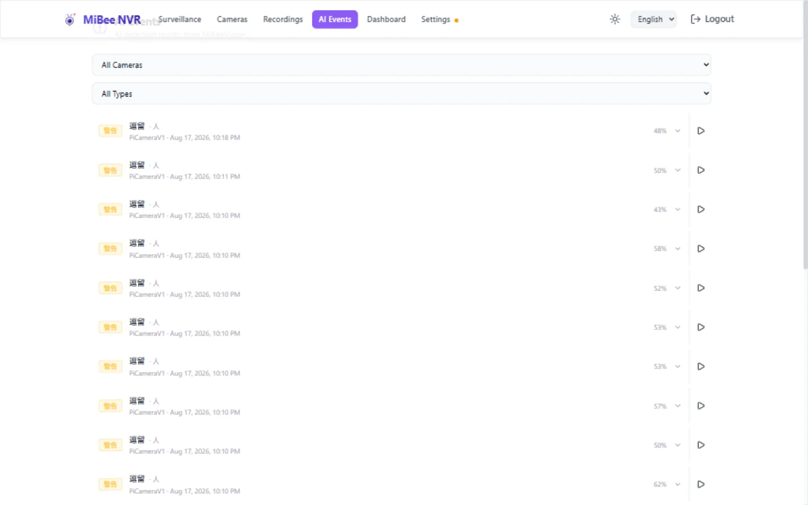
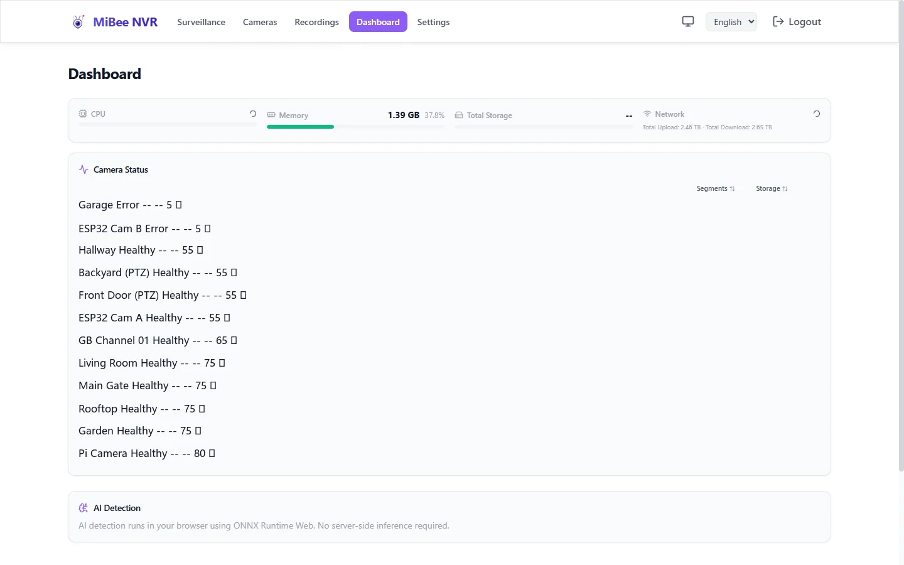
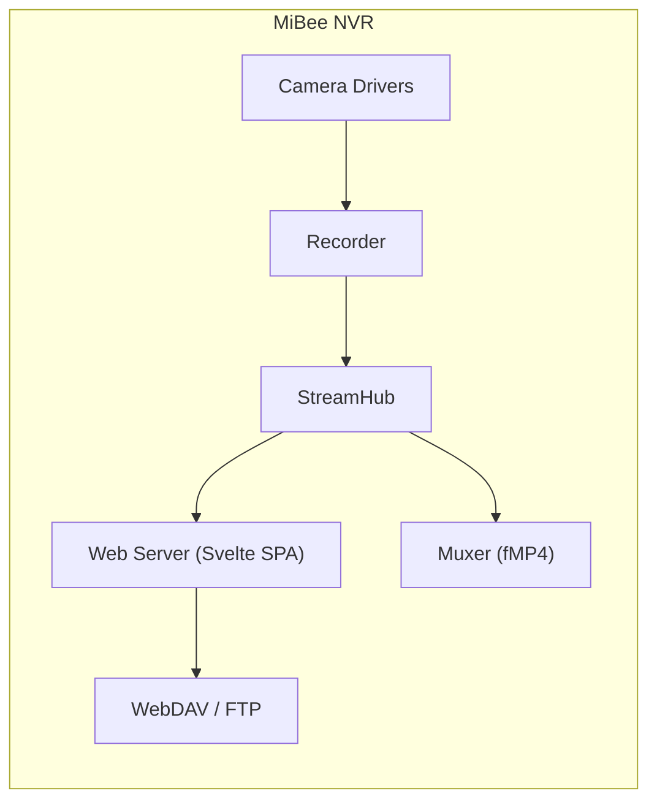

# Product Introduction

> For MiBeeNvr v0.11.0

MiBee NVR is a lightweight, self-hosted Network Video Recorder written in Go. It captures IP camera video streams as MP4 segments and saves them to disk, providing a modern web interface for live viewing, camera management, and recorded footage access.

## Core Features

| Feature | Description |
|---------|-------------|
| Single binary · zero dependencies | Cross-compiled with CGO_ENABLED=0, embeds a Svelte 5 SPA — one executable + SQLite is all you need |
| 9 streaming protocols | RTSP / ONVIF / WebRTC / HTTP-FLV / HLS / RTMP / SRT / WebSocket / GB/T 28181 |
| End-to-end H.265 | WASM software-decoded live playback, pure HTTP H.265 without HTTPS; recording, playback, and timelapse fully supported |
| Audio system | G.711 / AAC / Opus recording and live monitoring with two-way intercom |
| Smart features | Browser-based AI detection (ONNX + Web Worker), timelapse v3, hardware transcoding, MiBeeVision AI |
| Zero-config discovery | ONVIF auto-discovery + mDNS / DNS-SD LAN discovery |
| Stream ingest & relay | SRT / RTMP ingest, native Go relay to live-streaming platforms; one-click install on 6 NAS systems |
| Integration ecosystem | MQTT events, WebDAV / FTP storage, Prometheus metrics, PWA offline |

## Architecture Overview

**Core design principles:**

- **Push-In ingest**: remote publishers push streams into the NVR (SRT / RTMP) — the NVR never needs to connect to cameras
- **Push-Out relay**: the NVR forwards live camera streams to remote targets (RTMP / RTSP), implemented in pure Go
- **StreamHub frame bus**: all protocols share a single fan-out frame bus — recording / live / relay run independently
- **SQLite storage**: recording metadata, camera configs, and timelapse merge records are all stored in a single-file database

## Supported Cameras

| Type | Protocol | Notes |
|------|----------|-------|
| RTSP H.264 / H.265 | rtsp | Most IP cameras (Hikvision, Dahua, Uniview, etc.) |
| ONVIF | onvif | Zero-config discovery + auto encoding detection |
| MJPEG | rtsp | Low-resolution cameras |
| HTTP JPEG | http | Snapshot-based cameras |
| Xiaomi | xiaomi | C200 / C300 / Dual-lens TUTK P2P |
| GB/T 28181 | gb28181 | Chinese national video surveillance standard (experimental) |
| SRT / RTMP | srt / rtmp | Push ingest, cross-network cameras |
| Timelapse | timelapse | Dedicated timelapse mode |

> **Brand compatibility**: See the [Camera Brand Compatibility Guide](https://raw.githubusercontent.com/Mi-Bee-Studio/MiBeeNvr/main/docs/zh/camera-guide.md) for detailed configuration of 20+ brands including Hikvision, Dahua, Uniview, Axis, Reolink, and more.

## Why MiBee NVR

| Comparison | MiBee NVR | Commercial NVR |
|------------|-----------|----------------|
| Deployment | Single binary / Docker / NAS one-click installer | Dedicated hardware or proprietary software |
| Protocol support | 9 (including GB/T 28181) | Typically 2–3 |
| H.265 playback | Browser WASM live playback | Requires dedicated client |
| Audio | G.711 / AAC / Opus two-way intercom | Typically recording only |
| Integrations | MQTT / WebDAV / FTP / Prometheus | Limited or proprietary |
| License | AGPL-3.0 (≤v0.10.1 permanently MIT) | Commercial license |
| Source code | Fully open source | Closed source |

## License

MiBee Nvr v0.11.0 is released under the **AGPL-3.0** open-source license.

> **Important**: All versions ≤v0.10.1 are permanently licensed under **MIT**. The MIT license covers all source code published in those releases, including MIT-licensed code carried forward into AGPL versions.

## Getting Help

- **GitHub Issues**: [MiBeeNvr Issues](https://github.com/Mi-Bee-Studio/MiBeeNvr/issues)
- **Discussions**: [MiBeeNvr Discussions](https://github.com/Mi-Bee-Studio/MiBeeNvr/discussions)
- **Upgrade Guide**: [Upgrade Guide](upgrade-faq.md)
