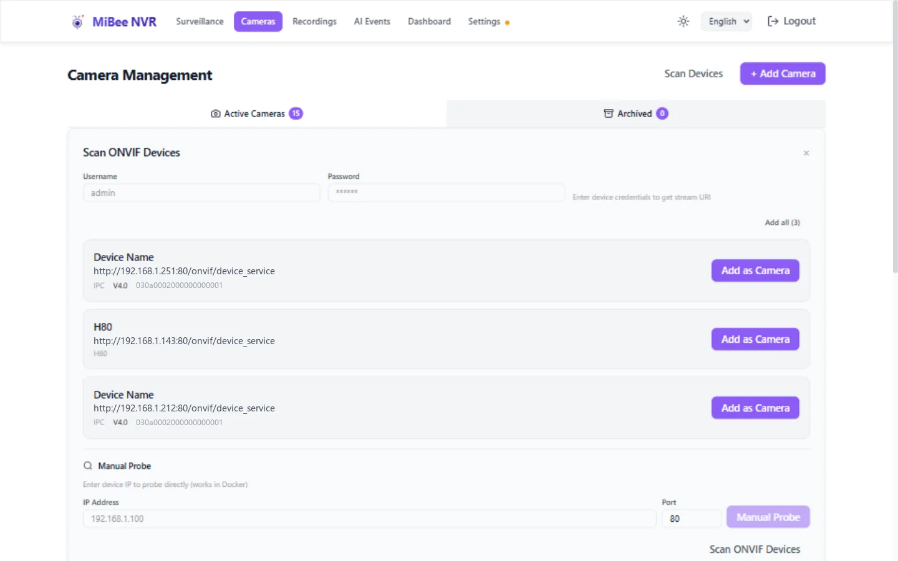

# ONVIF Auto-Discovery

> For MiBeeNvr v0.11.0

MiBee NVR automatically discovers IP cameras on your local network using the ONVIF protocol and detects their encoding format (H.264 / H.265) without manual configuration.

## How It Works

1. **Network scan**: NVR broadcasts WS-Discovery probe packets on the local network
2. **Device response**: ONVIF-capable cameras reply automatically
3. **Codec detection**: NVR retrieves each camera's media profile and identifies the encoding format
4. **Add device**: Select a discovered camera and enter its credentials

## Usage

### Web UI Discovery

1. Open the **Cameras** page
2. Click **Scan Devices** and pick **ONVIF** from the protocol menu (or **Xiaomi** to scan for Xiaomi cameras)
3. Wait for the scan to complete (usually 5–10 seconds); cameras that are already added are marked
4. Identify the target device in the results (model, serial number, and device address are shown)
5. Enter the camera's ONVIF username / password in the credential bar at the top (used to fetch stream URLs)
6. Click **Add as Camera** on a single device, or **Add All (N)** to onboard everything at once



> **Docker tip**: WS-Discovery relies on UDP multicast, which the default Docker bridge network blocks. If no cameras are found inside a container, switch to `network_mode: host`, or use the **Manual Probe** section at the bottom of the panel to probe a device IP directly.

### CLI Discovery

```bash
# Scan for ONVIF devices on the local network
./mibee-nvr-amd64 discover --protocol onvif

# Example output:
# Discovered device:
#   - Name: DS-2CD2043G2-I
#     Address: 192.168.1.100:80
#     Manufacturer: Hikvision
#     Model: DS-2CD2043G2-I
```

## Supported ONVIF Versions

| Version | Status | Description |
|---------|--------|-------------|
| ONVIF Profile S | ✅ Full support | Streaming media service |
| ONVIF Profile T | ✅ Full support | H.265 video |
| ONVIF Profile G | ⚠️ Partial support | Recording management |

## Codec Detection

ONVIF discovery automatically detects the camera's video encoding:

- **H.264**: `encoding` field set to `h264`
- **H.265**: `encoding` field set to `h265`
- **MJPEG**: `encoding` field set to `mjpeg`

> **Important**: Starting from v0.10.0, MiBee NVR no longer accepts combined format strings (e.g. `rtsp_h264`). Use separate `protocol` and `encoding` fields instead.

## Troubleshooting

### Camera Not Discovered

Check the following:

1. **Network connectivity**: NVR and camera must be on the same subnet
2. **ONVIF enabled**: Verify ONVIF is enabled in the camera's management interface
3. **Firewall**: Allow port 3702 (WS-Discovery) and the camera's ONVIF port (typically 80 or 8080)
4. **Multiple NICs**: If NVR has multiple network interfaces, ensure scanning the correct subnet

```bash
# Manually test WS-Discovery
curl http://192.168.1.100:80/onvif/device_service
```

### Discovered but Cannot Add

- **Wrong credentials**: Verify the ONVIF username and password (usually the same as the camera's web management interface)
- **Protocol incompatibility**: Some older cameras have non-standard ONVIF implementations — try adding the RTSP URL manually

### Slow Scanning

- Too many devices on the LAN will slow down the scan
- You can limit the scan range via the config file

```yaml
onvif:
  discovery:
    timeout: "5s"        # Per-device timeout
    network: "192.168.1.0/24"  # Restrict scan subnet
```

## Adding ONVIF Cameras Manually

If auto-discovery is unavailable, add the camera manually:

```yaml
cameras:
  - id: "office-camera"
    name: "Office Camera"
    protocol: "onvif"
    encoding: "h264"
    url: "http://192.168.1.100:80/onvif/device_service"
    username: "admin"
    password: "camera123"
    enabled: true
```

## Camera Brand Compatibility

See the [Camera Brand Compatibility Guide](https://raw.githubusercontent.com/Mi-Bee-Studio/MiBeeNvr/main/docs/zh/camera-guide.md) for detailed ONVIF configuration across 20+ brands including Hikvision, Dahua, Uniview, Axis, and Reolink.

## Next Steps

- [Xiaomi Camera Integration](xiaomi.md) — TUTK P2P connection
- [SRT / RTMP Push-Stream Ingest](srt-rtmp.md) — Push-stream camera configuration
- [Raspberry Pi Camera Integration](raspberrypi.md) — libcamera configuration
