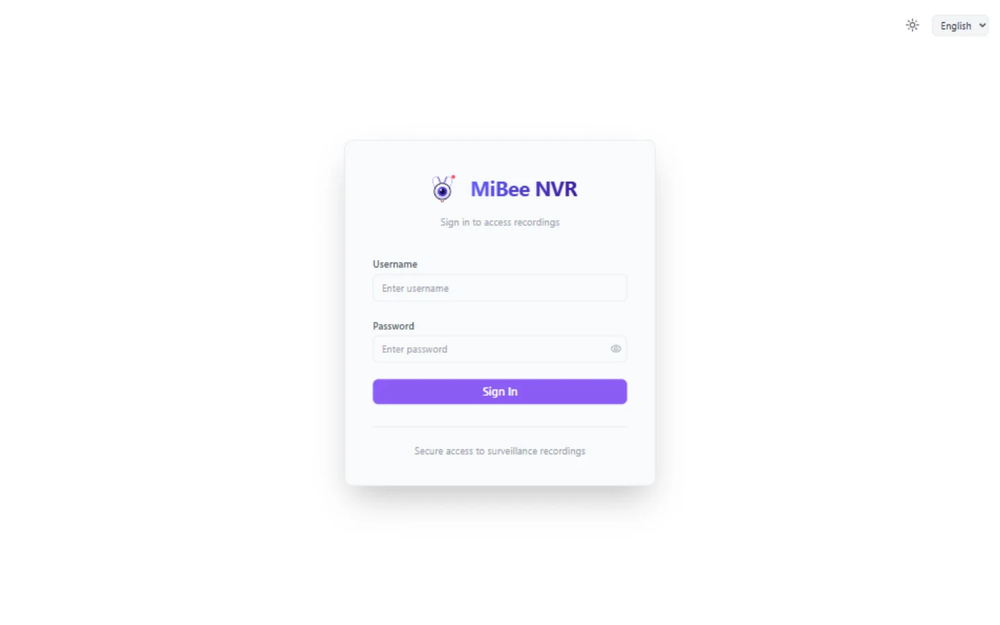
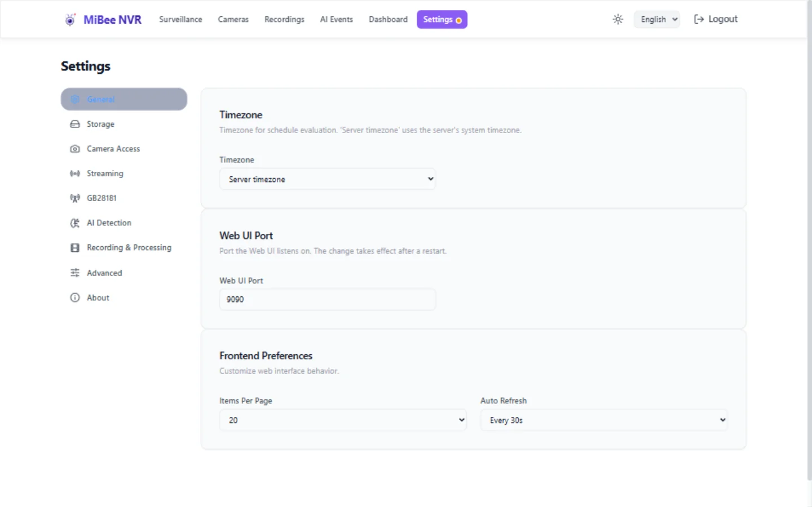

# Quick Start

> For MiBeeNvr v0.11.0

Get up and recording your first camera in 5 minutes.

## Option 1: Download a Pre-built Binary

Download the latest release for your architecture from [GitHub Releases](https://github.com/Mi-Bee-Studio/MiBeeNvr/releases):

```bash
# AMD64 (most PCs/servers)
wget https://github.com/Mi-Bee-Studio/MiBeeNvr/releases/latest/download/mibee-nvr-amd64
chmod +x mibee-nvr-amd64

# ARM64 (Raspberry Pi, etc.)
wget https://github.com/Mi-Bee-Studio/MiBeeNvr/releases/latest/download/mibee-nvr-arm64
chmod +x mibee-nvr-arm64
```

Initialize the config and start:

```bash
./mibee-nvr-amd64 init --password your-password
./mibee-nvr-amd64 -config mibee-nvr.yaml
```

Open `http://localhost:9090` in your browser.

## Option 2: Docker

```bash
docker compose --project-directory . \
  -f deploy/docker/docker-compose.yml up -d
```

Open `http://localhost:9090` in your browser.

> No config file needed! MiBee NVR auto-initializes when started without one.

### Changing the Recording Storage Location

By default, recordings are stored in `./data` on the host. To use an external drive:

```yaml
volumes:
  - /mnt/external/nvr:/data    # ← replace with your host path
environment:
  - NVR_DATA_DIR=/data          # must match the right side of the volume mount
  # - NVR_UID=1000               # match the host directory owner's UID
  # - NVR_GID=1000               # match the host directory owner's GID
```

> **Important**: The right side of the volume mount (`:data`) and `NVR_DATA_DIR` must always match. If the container fails to start, verify the host directory exists and that the configured UID/GID has write permission.

## Option 3: One-Line Install Script

```bash
curl -fsSL https://raw.githubusercontent.com/Mi-Bee-Studio/MiBeeNvr/main/install.sh | sudo bash
```

This automatically downloads the binary, creates a system user (`nvr`), generates a config, installs a systemd service, and starts it. Data directory: `/var/lib/mibee-nvr`.

Uninstall (preserving recordings):

```bash
curl -fsSL https://raw.githubusercontent.com/Mi-Bee-Studio/MiBeeNvr/main/install.sh | sudo bash -s -- --uninstall
```

## Option 4: Build from Source

Requires Go 1.26+ and Node.js:

```bash
git clone https://github.com/Mi-Bee-Studio/MiBeeNvr.git
cd MiBeeNvr
make build
./mibee-nvr init --password your-password
./mibee-nvr -config mibee-nvr.yaml
```

Cross-compile for ARM64:

```bash
make cross
```

## First-Time Configuration

### Using the init Subcommand

```bash
./mibee-nvr init --password your-password
```

| Parameter | Default | Description |
|-----------|---------|-------------|
| `--password` | (interactive prompt) | Web UI admin password |
| `--username` | `admin` | Admin username |
| `--data-dir` | `/var/lib/mibee-nvr` | Recording and database directory |
| `--listen` | `:9090` | HTTP listen address |
| `--config` | `mibee-nvr.yaml` | Config file path |
| `--force` | false | Overwrite existing config file |

### Password Setup Methods

1. **init command** (recommended): `mibee-nvr init --password <password>`
2. **Plaintext in config**: set `auth.password` in YAML — automatically hashed on first start
3. **Manual hash generation**: `mibee-nvr hash-password <password>` → paste into `auth.password_hash`

> For the full command surface (init / hash-password / health / cleanup / repair and the other subcommands) see the [CLI Reference](cli.md).

## Adding Your First Camera

MiBee NVR uses **separate transport protocol + encoding format** fields:

- **Transport protocol**: `rtsp`, `http`, `onvif`, `xiaomi`, `timelapse`
- **Encoding format**: `h264`, `h265`, `mjpeg`, `jpeg`

All cameras are managed on the Cameras page: click **Scan Devices** to auto-discover ONVIF / Xiaomi cameras on the LAN, or **+ Add Camera** to add one manually; each card supports start/stop, restart, and a live view.


### RTSP H.264 Camera

```yaml
cameras:
  - id: "front-door"
    name: "Front Door"
    protocol: "rtsp"
    encoding: "h264"
    url: "rtsp://192.168.1.100:554/stream"
    enabled: true
```

### RTSP H.265 Camera

```yaml
cameras:
  - id: "driveway"
    name: "Driveway"
    protocol: "rtsp"
    encoding: "h265"
    url: "rtsp://192.168.1.103:554/stream"
    enabled: true
```

### ONVIF Camera

```yaml
cameras:
  - id: "lobby"
    name: "Lobby"
    protocol: "onvif"
    url: "http://192.168.1.104:80/onvif/device_service"
    username: "admin"
    password: "camera123"
    enabled: true
```

> ONVIF auto-detects the encoding format, so you can omit the `encoding` field.

> **0.10.0+ no longer accepts combined formats** (e.g. `rtsp_h264`). Use separate `protocol` + `encoding` fields instead.

## Accessing MiBee NVR

### Web Management Interface

Open `http://your-server-address:9090` in your browser and log in with the configured credentials.



Features:
- **Surveillance**: live multi-camera grid (WebCodecs / MJPEG tiles; HLS, WebRTC, HTTP-FLV, and WebSocket playback)
- **Cameras**: scan, add, edit, and start/stop cameras
- **Recordings**: timeline and list views, playback and download
- **AI Events**: browse AI detection events
- **Dashboard**: storage statistics and trends
- **Settings**: storage, streaming, GB28181, AI detection, and more


### WebDAV

Enabled by default (read-only mode), accessible at `/dav/`:

```bash
curl -u admin:password http://your-server-address:9090/dav/
```

Mount in a file manager: `davs://your-server-address:9090/dav/`

### FTP

Enabled by default on port 2121:

```bash
ftp your-server-address 2121
# Username: admin
# Password: (your configured password)
```

## Troubleshooting

### Service Won't Start

```bash
# Check config file
cat mibee-nvr.yaml

# Verify data directory is writable
ls -la /var/lib/mibee-nvr/

# View logs
journalctl -u mibee-nvr -f
```

### Port Conflict

Default port is 9090. Change it (in order of priority):
1. Environment variable `NVR_LISTEN_PORT=8080`
2. `install.sh --port 8080`
3. Config file `server.listen: ":8080"`
4. Web UI settings page (Settings → General → Web UI Port; restart required to take effect)



### Can't Connect to Camera

```bash
# Verify camera URL
ffplay rtsp://192.168.1.100:554/stream

# Check network connectivity
ping 192.168.1.100
```

### High Memory Usage on Raspberry Pi

- Set `segment_duration` to `30s`
- RPi 3B uses ~900 MB total; 4 cameras at 30-second segments stabilize at ~300 MB

## Next Steps

- [Docker Deployment](install-docker.md) — production container deployment
- [CLI Reference](cli.md) — command-line administration
- [Configuration Reference](config.md) — top-level YAML key cheat sheet
- [NAS Deployment](install-nas.md) — Synology / QNAP / unRAID / FlyBull
- [ONVIF Auto-Discovery](onvif-discovery.md) — zero-config camera onboarding
- [Recording & Playback](recording-playback.md) — managing recordings
