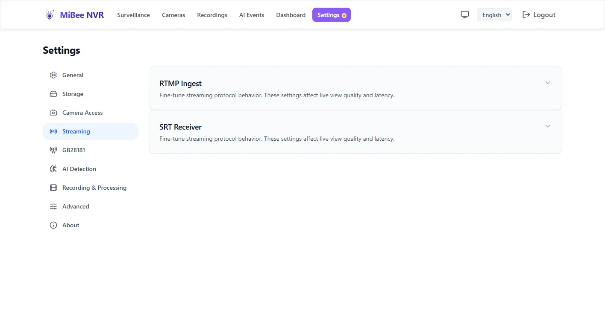

# SRT / RTMP Push-Stream Ingest

> For MiBeeNvr v0.12.0

MiBee NVR supports two push-stream protocols for ingesting camera feeds — SRT and RTMP — suitable for cross-network and cross-platform video recording scenarios.

## Protocol Comparison

| Feature | SRT | RTMP |
|---------|-----|------|
| Transport | UDP | TCP |
| Latency | Low (<1s) | Medium (1–3s) |
| NAT traversal | ✅ Good | ⚠️ Moderate |
| Encryption | ✅ AES-128/256 | ❌ None |
| Error recovery | ✅ ARQ retransmission | ❌ None |
| Use case | Cross-network, outdoor | LAN, live streaming platforms |

## SRT Push-Stream Ingest



### Enable SRT Server

```yaml
srt:
  enabled: true
  port: 9000
  passphrase: "your-secret-key"    # Optional, enables encryption
  latency: "200ms"                  # Optional, default 200ms
```

### Configure the Camera to Push

Set up the camera or encoder to push its stream to the NVR:

```text
SRT URL: srt://your-nvr-address:9000?streamid=#!:r=camera-id,m=publish
```

For example:

```bash
# FFmpeg push-stream test
ffmpeg -re -i input.mp4 -c:v libx264 -bf 0 -f mpegts \
  "srt://192.168.1.50:9000?streamid=#!:r=test-cam,m=publish"
```

### Add an SRT Camera via Web UI

1. Go to **Settings** → **Camera Management** → **Add Camera**
2. Select protocol **SRT**
3. Enter the push-stream address
4. Click **Save**

### Push-Stream Parameters

| Parameter | Default | Description |
|-----------|---------|-------------|
| `port` | `9000` | SRT listening port |
| `passphrase` | — | Encryption key (empty = no encryption) |
| `latency` | `200ms` | Latency setting |
| `maxbw` | `0` | Maximum bandwidth (0 = auto) |

### Encryption Configuration

When encryption is enabled, the push source must provide the same key:

```yaml
srt:
  enabled: true
  port: 9000
  passphrase: "my-secret-key-123"   # Minimum 10 characters
```

Push source:

```bash
ffmpeg -re -i input.mp4 -c:v libx264 -bf 0 -f mpegts \
  "srt://192.168.1.50:9000?streamid=#!:r=test-cam,m=publish&passphrase=my-secret-key-123"
```

## RTMP Push-Stream Ingest

### Enable RTMP Server

```yaml
rtmp:
  enabled: true
  port: 1935
```

### Configure the Camera to Push

Set up the camera or encoder to push via RTMP:

```text
RTMP URL: rtmp://your-nvr-address:1935/live/camera-id
```

For example:

```bash
# FFmpeg push-stream test
ffmpeg -re -i input.mp4 -c:v libx264 -bf 0 -c:a aac -f flv \
  "rtmp://192.168.1.50:1935/live/test-cam"
```

### Add an RTMP Camera via Web UI

1. Go to **Settings** → **Camera Management** → **Add Camera**
2. Select protocol **RTMP**
3. Enter the push-stream address
4. Click **Save**

### Push-Stream Parameters

| Parameter | Default | Description |
|-----------|---------|-------------|
| `port` | `1935` | RTMP listening port |
| `chunk_size` | `4096` | Chunk size |

## Encoder Recommendation: Disable B-Frames (`-bf 0`)

The recording pipeline works on a write-as-encoded, low-latency model: the recorder writes frames to MP4 in arrival order with `pts == dts` and no `ctts` composition offsets. Surveillance cameras almost universally emit baseline/main streams without B-frames, where this model is exact. **Generic encoder defaults, however, enable B-frames** (e.g. `libx264` defaults to `bframes=3`) — with B-frames the decode order ≠ presentation order, so a pts==dts write produces out-of-order playback, and remuxing (`-c copy`) makes ffmpeg report `co located POCs unavailable` (verified in the #435 long-run test).

For push-in sources (SRT/RTMP/WHIP, and externally-encoded RTSP pulls) disable B-frames at the encoder:

```bash
-c:v libx264 -bf 0        # FFmpeg
```

For surveillance, disabling B-frames costs almost no bitrate (their benefit is mainly VOD) and stays fully compatible with the NVR's streaming write path, on-demand HLS, and merge pipeline.

## Push-Out Relay

MiBee NVR can also relay live camera streams to remote destinations:

### Relay to a Live Streaming Platform

```yaml
cameras:
  - id: "outdoor-cam"
    name: "Outdoor Camera"
    protocol: "rtsp"
    encoding: "h264"
    url: "rtsp://192.168.1.100:554/stream"
    enabled: true
    push_out:
      - protocol: "rtmp"
        url: "rtmp://live.example.com/live/stream-key"
      - protocol: "srt"
        url: "srt://remote-server:9000?streamid=#!:r=live-stream,m=publish"
```

### Relay Parameters

| Parameter | Description |
|-----------|-------------|
| `protocol` | Relay protocol (`rtmp` or `srt`) |
| `url` | Relay destination address |
| `passphrase` | SRT encryption key (for SRT relay) |

## Troubleshooting

### SRT Connection Timeout

1. **Firewall**: Ensure UDP port 9000 is open
2. **NAT traversal**: SRT typically handles NAT well, but extreme network configurations may fail
3. **Latency setting**: Increase the `latency` value (e.g. `500ms`)

### RTMP Push-Stream Interruption

- RTMP is TCP-based and may disconnect on unstable networks
- Push sources typically reconnect automatically
- If interruptions are frequent, consider switching to SRT

### Video Quality Issues

- Stream quality depends on the camera's encoding settings and network bandwidth
- Recommended push-stream bitrate for 1080p: 4–8 Mbps
- Recommended push-stream bitrate for 4K: 10–20 Mbps

## Next Steps

- [Raspberry Pi Camera Integration](raspberrypi.md) — libcamera configuration
- [Recording & Playback](recording-playback.md) — Recording management
- [Timelapse](timelapse.md) — Timelapse recording feature
