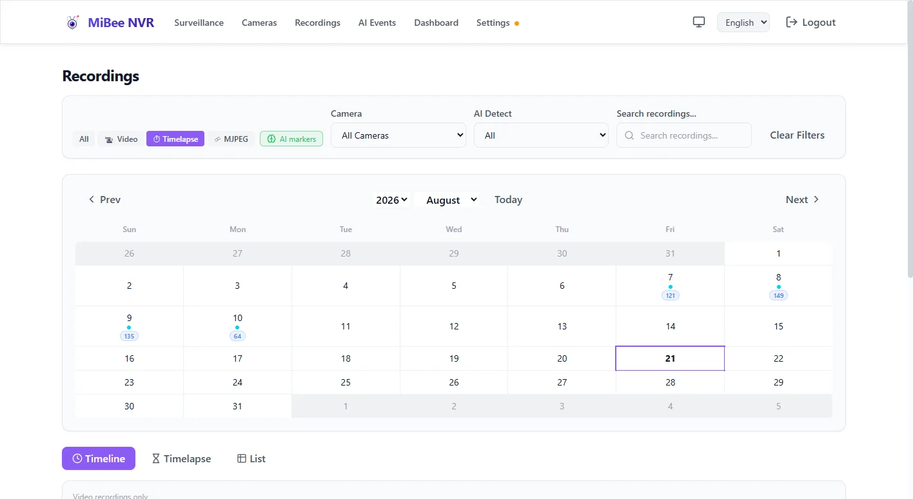

# Timelapse Recording

Timelapse functionality creates time-lapse videos from camera recordings, compressing hours or days into minutes. MiBee NVR supports flexible merge durations (1h to 30 days), H.264/H.265 dual-mode support with codec-aware periodic merge, periodic-merge DB records, and a unified recordings interface.

## Overview

The timelapse system automatically merges video segments into compressed timelapse recordings. Key features:

- **Flexible Merge Windows**: Choose from `1h`, `8h`, `12h`, `24h`, `natural-day`, `7d`, or `30d`. Default is `natural-day` (one timelapse per calendar day, midnight-aligned in the server's local timezone)
- **H.264/H.265/JPEG Codec-Aware**: The periodic merger auto-detects frame type and dispatches to the matching pure-Go codec merger (H265GoMerger, H264GoMerger, or GoMerger for JPEG)
- **Periodic-Merge DB Records**: Long-window outputs are persisted in the `timelapse_merges` table — discoverable, playable, and deletable via `/api/timelapse/merges*`
- **Unified Interface**: Integrated recordings page with table, gallery, and calendar view modes
- **Keyframe Extraction**: Zero-overhead timelapse generation using existing RTSP streams
- **Disk Reclaim**: Rolling-merge `.mp4` intermediate files are pruned after a periodic merge folds them in (configurable via `retain_intermediate_mp4`)

## Configuration

### Basic Timelapse Setup

Enable timelapse recording for a camera in the configuration:

```yaml
cameras:
  - name: "Front Door"
    protocol: "rtsp"
    encoding: "h264"
    url: "rtsp://192.168.1.100:554/stream"
    enabled: true

    # Timelapse configuration
    timelapse:
      enabled: true
      merge_duration: "natural-day"   # one timelapse per calendar day (default)
      frame_source: "auto"            # dual-mode keyframe extraction
      merge_output_fps: 30
```

### Dual-Mode Configuration (RTSP Cameras)

For existing RTSP cameras, enable dual-mode timelapse without changing the camera protocol:

```yaml
cameras:
  - name: "Living Room Camera"
    protocol: "rtsp"
    encoding: "h265"
    url: "rtsp://192.168.1.101:554/stream"
    enabled: true

    timelapse:
      enabled: true                          # Enable timelapse
      merge_duration: "24h"                  # 24-hour merge window
      frame_source: "auto"                   # Extract from RTSP stream
      merge_output_fps: 30
```

### Standalone Timelapse Configuration

Create dedicated timelapse cameras with separate RTSP sources:

```yaml
cameras:
  - name: "Timelapse-Only Camera"
    protocol: "timelapse"
    encoding: "h264"
    url: "rtsp://backup-camera.example.com:554/stream"
    enabled: true

    timelapse:
      enabled: true
      merge_duration: "natural-day"          # Daily timelapse (default)
      frame_source: "auto"                   # Extract from timelapse stream
      merge_output_fps: 15                   # Lower fps for longer durations
```

## Merge Duration Options

The `merge_duration` field controls the periodic merge window — how many hours/days of keyframes are combined into a single timelapse file.

**Supported named windows** (all aligned to midnight in the server's local timezone):

| Value | Window | Example alignment |
|-------|--------|-------------------|
| `1h` | 1 hour | 00:00-01:00, 01:00-02:00, ... |
| `8h` | 8 hours | 00:00-08:00, 08:00-16:00, 16:00-24:00 |
| `12h` | 12 hours | 00:00-12:00, 12:00-24:00 |
| `24h` | 24 hours | 00:00-24:00 (midnight to midnight) |
| `natural-day` | Calendar day (default) | 00:00 to next 00:00 local time |
| `7d` | 7 days | Monday 00:00 to next Monday 00:00 |
| `30d` | 30 days | 1st of month to 1st of next month |

- The empty string defaults to `"natural-day"`.
- Any other Go duration string (e.g. `"30m"`, `"2h"`, `"90m"`) is also accepted and aligns by wall-clock time.
- Values greater than 30 days are rejected at config validation.

### Configuration Examples

```yaml
# Daily timelapse (default — one video per calendar day)
timelapse:
  enabled: true
  merge_duration: "natural-day"
  merge_output_fps: 30

# Weekly timelapse (good for construction sites)
timelapse:
  enabled: true
  merge_duration: "7d"
  merge_output_fps: 30

# Hourly timelapse (frequent reviewable clips)
timelapse:
  enabled: true
  merge_duration: "1h"
  merge_output_fps: 10
```

### Periodic-Merge DB Records & Disk Reclaim

Each periodic merge output (for windows ≥ 1h) is recorded in the `timelapse_merges` table with: camera ID, window start/end, duration label, output path, codec (h264/h265/mjpeg), frame count, source segment IDs, and status. The frontend discovers/plays/deletes these via `/api/timelapse/merges*`.

After a periodic merge folds in the per-segment rolling-merge `.mp4` files, they are pruned by default to reclaim disk. Set `retain_intermediate_mp4: true` to keep them:

```yaml
timelapse:
  enabled: true
  merge_duration: "natural-day"
  retain_intermediate_mp4: false   # default: prune intermediate .mp4 after periodic merge
```

The raw frame directories (`frame_*.h265` / `frame_*.h264` / `frame_*.jpg`) are always preserved so you can re-merge at any time.

CLI tool for reclaiming historical accumulation:
```bash
mibee-nvr repair prune-intermediate-mp4 --camera=cam-id --before=2026-07-01 --execute
```

## Dual-Mode Timelapse

Dual-mode timelapse allows any RTSP camera to generate timelapse recordings without additional hardware requirements.

### How It Works

1. **Primary RTSP Stream**: Camera records normal video segments as usual
2. **Keyframe Extraction**: KeyframeExtractor subscribes to the RTSP StreamHub
3. **Frame Processing**: Extracts IDR frames (H.264 type 5, H.265 type 19/20) from the stream
4. **Timelapse Generation**: Extracted frames are processed into compressed timelapse videos

### Supported Camera Types

- **RTSP H.264**: Standard IP cameras with H.264 encoding
- **RTSP H.265**: Modern cameras with H.265 encoding for better efficiency
- **ONVIF**: Auto-discovered cameras, both H.264 and H.265 streams supported

### H.265 Support

The system automatically detects H.265 streams and configures the KeyframeExtractor appropriately:

```yaml
# ONVIF camera with H.265 stream
cameras:
  - name: "Security Camera 1"
    protocol: "onvif"
    encoding: "h265"                    # Primary encoding
    stream_encoding: "H265"            # ONVIF-specific field
    url: "onvif://192.168.1.102"
    enabled: true

    timelapse:
      enabled: true
      merge_duration: "1h"
      frame_source: "rtsp_keyframe"
```

## Unified Recordings Interface



MiBee NVR merges timelapse and regular recordings into a unified Library page with enhanced navigation and filtering capabilities.

### View Modes

Access different views through the URL hash parameters:

- **Table View**: `#/recordings?view=table` - Detailed list with metadata
- **Gallery View**: `#/recordings?view=gallery` - Thumbnail grid layout
- **List View**: `#/recordings?view=list` - Compact list layout

### Format Filters

Filter recordings by format using the `format` parameter:

- **All Formats**: `format=all` - Show all recording types
- **Video Only**: `format=video` - Show regular video recordings
- **Timelapse Only**: `format=timelapse` - Show timelapse recordings only
- **MJPEG Only**: `format=mjpeg` - Show MJPEG recordings only

Primary navigation format filter pills are always visible in the interface, allowing quick switching between recording formats.

### Gallery View

```bash
# URL: /#recordings?view=gallery&format=all
```

Displays recordings in a responsive grid layout with:

- Thumbnail previews
- Date/time labels
- Format badges (video/timelapse/mjpeg)
- Lazy loading for performance
- Click to view/download recordings

### List View

```bash
# URL: /#recordings?view=list&format=all
```

Provides a compact list view with:

- Recording metadata
- Duration and file size information
- Format indicators
- Quick download buttons
- Search and filter capabilities

### Calendar View

```bash
# URL: /#recordings?view=calendar&format=all
```

Provides calendar-based navigation with:

- Month/week/day views
- Recording density visualization
- Format-specific filtering
- Click dates to filter recordings
- Timeline navigation controls

### Timeline Bar

Above the view mode tabs, the timeline bar is always visible and provides:

- Horizontal timeline showing recording density
- Time range selector (week/month/3months)
- Format filter integration
- Clickable navigation between time periods
- Visual indicators for recording availability

## Migration Guide

### From the legacy `daily_merge` field

#### 1. Update Configuration

**Before:**

```yaml
timelapse:
  enabled: true
  daily_merge: true
  output_fps: 30
```

**After:**

```yaml
timelapse:
  enabled: true
  merge_duration: "natural-day"   # replaces daily_merge (default)
  frame_source: "auto"
  merge_output_fps: 30
```

#### 2. Merge Duration Options

The `merge_duration` field supports flexible windows (1h/8h/12h/24h/natural-day/7d/30d). The previous 1h cap has been lifted — multi-hour and multi-day windows are now fully supported. Old configs that had `8h`/`12h`/`24h`/`natural-day`/`7d`/`30d` values that were previously silently clamped to 1h will now produce the actual requested window.

```yaml
# Natural-day (one timelapse per calendar day — recommended)
timelapse:
  enabled: true
  merge_duration: "natural-day"
  frame_source: "auto"
  merge_output_fps: 30
```

#### 3. Dual-Mode Migration for Existing RTSP Cameras

Enable timelapse on existing RTSP cameras without changing their configuration:

```yaml
# Before: Only regular recording
cameras:
  - name: "Existing Camera"
    protocol: "rtsp"
    encoding: "h264"
    url: "rtsp://192.168.1.100:554/stream"
    enabled: true

# After: Add timelapse to existing camera
cameras:
  - name: "Existing Camera"
    protocol: "rtsp"
    encoding: "h264"
    url: "rtsp://192.168.1.100:554/stream"
    enabled: true

    timelapse:                     # Add this section
      enabled: true
      merge_duration: "natural-day"
      frame_source: "auto"           # dual-mode
      merge_output_fps: 30
```

### Backward Compatibility

- **Existing cameras continue working** without changes
- **Legacy `daily_merge` field** still works but is deprecated; use `merge_duration` instead
- **Multi-hour `merge_duration` values** (`8h`/`12h`/`24h`/`natural-day`/`7d`/`30d`) are now fully supported (previously silently clamped to 1h)
- **Existing timelapse recordings** remain accessible in the unified interface
- **API endpoints** maintain compatibility with existing integrations

### Migration Checklist

1. [ ] Review existing camera configurations
2. [ ] Add `timelapse.enabled: true` to desired RTSP cameras
3. [ ] Set appropriate `merge_duration` (default: "natural-day")
4. [ ] Test dual-mode functionality with sample cameras
5. [ ] Verify unified recordings interface works
6. [ ] Check that existing recordings are still accessible

## Troubleshooting

### Common Issues

#### 1. Keyframe Extraction Not Working

**Symptom**: Timelapse recordings empty or missing frames

**Solution**: Verify camera encoding and stream configuration:

```bash
# Check if camera supports keyframe extraction
curl -u admin:password "http://localhost:9090/api/cameras/camera-id/status"
```

Ensure H.264/H.265 encoding is correctly specified in the camera configuration.

#### 2. Merge Duration Issues

**Symptom**: Merges not running at expected intervals

**Solution**: Check merge logs and verify duration format:

```bash
# Check merge manager status
curl -u admin:password "http://localhost:9090/api/timelapse/status"

# Verify duration format in config
grep "merge_duration" /path/to/config.yaml
```

Valid values: `1h`, `8h`, `12h`, `24h`, `natural-day`, `7d`, `30d` (named windows), or any Go duration string ≤ 30 days (e.g. `30m`, `2h`). The empty string defaults to `natural-day`. Values greater than 30 days are rejected.

#### 3. Dual-Mode Camera Setup

**Symptom**: Dual-mode camera not generating timelapse recordings

**Solution**: Verify the dual-mode configuration:

```yaml
# Correct dual-mode setup
cameras:
  - name: "Dual-Mode Camera"
    protocol: "rtsp"                    # Must be rtsp/onvif
    encoding: "h264"                    or "h265"
    url: "rtsp://192.168.1.100:554/stream"
    enabled: true
    
    timelapse:
      enabled: true                      # Must be enabled
      merge_duration: "1h"              # Set duration
      frame_source: "rtsp_keyframe"       # Keyframe source
      output_fps: 30
```

#### 4. ONVIF Stream Encoding

**Symptom**: ONVIF camera H.265 timelapse not working

**Solution**: Check both `encoding` and `stream_encoding` fields:

```yaml
cameras:
  - name: "ONVIF H.265"
    protocol: "onvif"
    encoding: "h265"
    stream_encoding: "H265"  # ONVIF-specific field
    url: "onvif://192.168.1.102"
    enabled: true
    
    timelapse:
      enabled: true
      merge_duration: "1h"
      frame_source: "rtsp_keyframe"
```

### Debug Commands

```bash
# Check timelapse manager status
curl -u admin:password "http://localhost:9090/api/timelapse/status"

# List all recordings (timelapse + regular)
curl -u admin:password "http://localhost:9090/api/recordings"

# Check camera timelapse configuration  
curl -u admin:password "http://localhost:9090/api/cameras/camera-id"

# View merge logs (if available)
journalctl -u mibee-nvr -f | grep merge
```

## Performance Considerations

### Memory Usage

- **Keyframe extraction** uses minimal memory (no video decoding)
- **Merge operations** use temporary files with 1MB buffer
- **RPi 3B compatible**: Max 512MB memory budget

### Storage Requirements

- **Timelapse files** are typically 90-95% smaller than original footage
- **Merge duration** affects file sizes:
  - 1h merges: smaller, more frequent clips
  - natural-day / 24h merges: one larger file per day (~500MB-1GB for a busy camera)
  - 7d / 30d merges: very large files, use sparingly

### Network Impact

- **Dual-mode** uses no additional network bandwidth
- **Keyframe extraction** works with existing RTSP streams
- **Web interface** loads efficiently with lazy loading

## API Reference

### Timelapse Endpoints

#### Get Timelapse Status

```bash
GET /api/timelapse/status
```

Response includes global timelapse settings and merge status.

#### Trigger Manual Merge

```bash
POST /api/timelapse/merge
```

Optional query parameter `duration` for specific time windows.

#### List Recordings

```bash
GET /api/recordings?format=timelapse
```

List timelapse recordings. Use `view=gallery|list&format=timelapse` in the web interface, or access the unified Library page at `#/recordings?format=timelapse`.

### Configuration API

Update camera timelapse configuration:

```bash
PUT /api/cameras/camera-id
{
  "timelapse": {
    "enabled": true,
    "merge_duration": "1h",
    "frame_source": "rtsp_keyframe",
    "output_fps": 30
  }
}
```

## Best Practices

### Configuration Tips

1. **Choose appropriate merge durations** based on your use case:
   - Daily overview: `natural-day` (default) — one timelapse per calendar day
   - Security monitoring: `1h` for frequent reviewable clips
   - Construction / long-term: `7d` or `30d` for week/month overviews
   - Lower output FPS to keep longer-interval clips small

2. **Optimize output FPS**:
   - 30 FPS: Real-time events
   - 15 FPS: Frequent summaries
   - 5 FPS: Compact overviews

3. **For "watch a whole day" use cases**, use `merge_duration: "natural-day"` to get a single daily timelapse video. The recordings detail view also supports continuous playback that auto-advances to the next segment.

### Dual-Mode Setup

1. **Test with one camera** first before enabling on all cameras
2. **Monitor storage** usage for the increased recording volume
3. **Verify camera encoding** is correctly specified (H.264/H.265)
4. **Check stream encoding** for ONVIF cameras

### Performance Monitoring

1. **Regular maintenance**: Clean up old timelapse recordings based on retention policies
2. **Storage monitoring**: Watch for available disk space, especially with long-duration merges
3. **System resources**: Monitor memory usage during merge operations on resource-constrained devices

## Related Documentation

- [Configuration Reference](https://github.com/Mi-Bee-Studio/MiBeeNvr/blob/v0.12.0/docs/en/configuration.md)
- [Camera Guide](camera-guide.md)
- [API Reference](https://github.com/Mi-Bee-Studio/MiBeeNvr/blob/v0.12.0/docs/en/api-reference.md)
- [Troubleshooting](https://github.com/Mi-Bee-Studio/MiBeeNvr/blob/v0.12.0/docs/en/troubleshooting.md)
