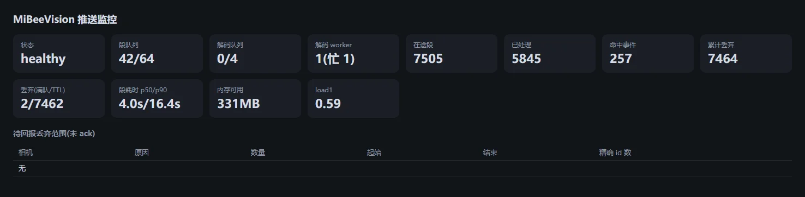

# MiBee Vision

MiBee Vision is the companion server-side AI analytics component for
MiBee NVR: it analyzes recordings after the fact (people, vehicles and
other common objects) and writes the results back to the NVR as
browsable events.

> **Closed beta**: MiBee Vision is in internal beta. It is not
> publicly available for download and is not open source at this
> time. Beta participants receive the deployment package together
> with its installation and configuration guide.

## What it does

- **Post-recording analysis** — runs object detection on finished NVR
  recordings; the NVR's own recording performance is unaffected
  because the analysis runs elsewhere.
- **Structured events** — detections become events with confidence
  scores (e.g. "dwell · person"), written back to the NVR's **AI
  events page**: grouped by day, filterable by camera and event type,
  one click away from the matching recording position.
- **Built-in monitoring page** — Vision ships with a push-monitor
  page showing queue depth, processed counts and processing time at a
  glance.



Analysis runs on a separate device or server — a low-power host is
enough to get started, and a GPU-equipped machine provides higher
throughput. Vision and the NVR can run on the same machine or on
separate hosts.

## Setup guide

Three steps: generate a key on the NVR → enable push on the NVR →
enter the key on Vision. Requires MiBee NVR **v0.12.0 or later**.

### 1. Generate an API key on the NVR

Go to **Settings → AI Detection → MiBeeVision integration** and
generate an API key. Keys look like `mbv_…` and are **shown only
once** — store it safely. The same page lets you revoke keys at any
time (revocation cuts off Vision immediately).

### 2. Enable push on the NVR

Edit the NVR configuration file and add (or update) the `vision`
section:

```yaml
vision:
  enabled: true
  url: "http://192.0.2.50:9091"   # address of the Vision host
  # skip_cameras:                  # optional: cameras to exclude
  #   - "cam-xxxx"
```

Restart the NVR service for the change to take effect.

### 3. Enter the NVR address and key on Vision

In the Vision configuration, enter the NVR's address and the API key
from step 1 (the beta deployment package includes the corresponding
instructions). Once connected, the NVR starts pushing newly finished
recording segments to Vision for analysis.

### 4. Verify

- Open **Dashboard → AI events** in the NVR web UI: detections
  appearing means the integration works; while disconnected the page
  shows a "MiBeeVision not connected" notice.
- The Vision monitor page reports `healthy` and its processed counts
  keep growing.


## Relation to browser-side AI detection

The NVR web UI also has a real-time detection overlay that runs in
your browser (tuning guide see [AI detection tuning](ai-detection.md)).
The two are independent: browser-side detection only affects the
overlay you see while watching, while Vision performs server-side
analysis of recordings and writes events back to the NVR — both can
be used at the same time.

## MiBee App

The companion mobile app **MiBee App** (in beta) connects to the NVR
directly over the LAN for live view and playback; it is not covered
in detail here.
