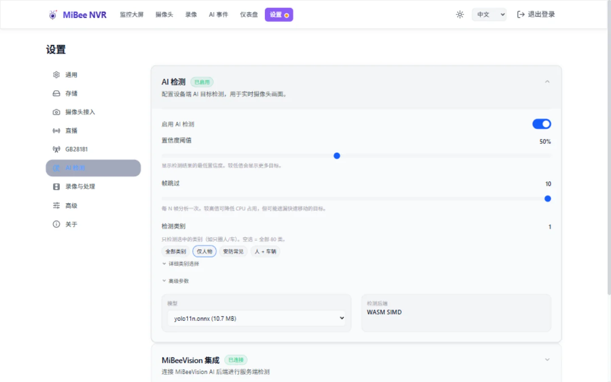

# AI 检测调参指南

> 本指南帮助你在「检测灵敏度」与「误检/性能」之间找到平衡。适用于浏览器端 YOLOv11 物体检测（ONNX Runtime Web，推理在 Web Worker 中运行，不阻塞主线程）。

## 可调参数一览

所有参数都可在 **设置 → AI 检测** 页面调整，保存后即时生效（后端 YAML 是单一真相源，前端启动时从 `/api/ai/status` 读取，localStorage 仅作离线缓存）。

| 参数 | 位置 | 范围 | 默认 | 作用 |
|------|------|------|------|------|
| **启用 AI** | 设置 → AI 检测（总开关）| 开/关 | 关 | 全局开启/关闭检测 |
| **置信度阈值** `confidence_threshold` | 设置 → AI 检测 | 0.1–0.99（步长 0.01）| 0.5 | 低于此置信度的检测框被丢弃。**越高 = 圈得越少越准** |
| **帧跳过** `frame_skip_rate` | 设置 → AI 检测 | 1–10 | 10 | 每隔 N 帧跑一次推理。**越高 = 越省 CPU 但更新越慢**。边缘设备务必用 ≥ 8 |
| **检测类别** `enabled_classes` | 设置 → AI 检测 | 预设 + 复选框 | 全部 80 类 | 只检测选中的类别（如只圈人/车）。**空选 = 全部** |
| **平滑系数** `ema_alpha` | 设置 → AI 检测 → 高级 | 0.1–0.9 | 0.3 | 检测框位置平滑。越低越平滑（框跟手慢），越高越跟手（框抖动）|
| **框滞留时长** `max_age` | 设置 → AI 检测 → 高级 | 3–30 | 15 | 目标消失后框最多保留几个检测周期。滑块旁会显示折算秒数 |
| **模型** `model_url` | 设置 → AI 检测（下拉）| `/models/*.onnx` | yolo11n.onnx | 精度/速度权衡。yolo11n 最快，yolo11s 精度更高但推理慢 |
| **ROI 区域** | 设置 → AI 检测 → 单摄像头 | 多边形 | 全画面 | 只在划定区域内检测。**最有效的降噪手段** |

此外还有 **单摄像头覆盖**：每路摄像头可单独配置置信度 + 帧跳过（展开单摄像头设置），优先级高于全局默认。



### 自适应节流（自动，无需配置）

推理在 Web Worker 中运行，当连续多次推理平均耗时 > 80ms（RPi 类 WASM SIMD 的典型值）时，系统会自动提高 frameSkip（单升不降，上限 10），保护页面不卡死。日志（仅 dev 构建）会显示 `throttling frameSkip X→Y`。

---

## 为什么会「什么都圈」？

有三种可能原因，按排查顺序：

### 1. 模型对花屏帧的 logit 爆炸（已修复，PR #193）

如果**调任何参数（置信度 0.98、类别、模型）都无效**，框全是 `person:100%`，这是 H.265 解码出错的花屏帧导致模型输出爆炸 logit（数千），sigmoid 后全是 1.0，阈值完全失效。**已在代码层修复**：logit > 15 的框视为解码异常丢弃。如果你仍然看到满屏 100% 误报，请确认运行的是 #193 之后的版本。

详见 [known-issues-ai-logit-false-positives.md](https://github.com/Mi-Bee-Studio/MiBeeNvr/blob/9f940324bfc733e9a6240868f48c68c38c21a78f/docs/known-issues-ai-logit-false-positives.md)。

### 2. 置信度阈值过低（最常见）

默认 0.5 意味着 YOLO 输出的置信度 ≥ 0.5 就显示。YOLOv11-nano 是轻量模型，对纹理/阴影/反光容易产生 0.5–0.6 的低质量检测。**提高到 0.65–0.7 可过滤掉大部分这类误检**。

### 3. EMA 平滑让误检框「赖着不走」

即使下一帧误检消失，`max_age` 会让框继续显示若干秒（取决于检测频率）：

| 帧跳过 | 检测频率（30fps 源）| 误检框最长滞留（max_age=15）|
|--------|---------------------|-----------------------------|
| 3 | 10 Hz | ~1.5 秒 |
| 5 | 6 Hz | ~2.5 秒 |
| 10 | 3 Hz | ~5 秒 |

如果误检滞留严重，在高级区把 `max_age` 降到 3–5。

---

## 分场景推荐值

### 场景 A：边缘设备（树莓派 3B/4、Banana Pi M5）— 省电流畅优先

```
confidence_threshold: 0.65
frame_skip_rate: 10
模型: yolo11n.onnx
```

- **为什么**：边缘设备 CPU 紧张，frameSkip=10 把推理压到 3Hz，页面不卡。0.65 置信度配合类别过滤，误检可控。
- **代价**：检测更新慢（每秒 3 次），快速移动的物体框会滞后。

### 场景 B：桌面/笔记本浏览器（x86，WebGPU）— 灵敏度优先

```
confidence_threshold: 0.5
frame_skip_rate: 3
模型: yolo11s.onnx（可选，精度更高）
```

- **为什么**：桌面 CPU/GPU 富裕，frameSkip=3 得到 10Hz 检测，框跟手。0.5 置信度捕捉更多目标。
- **代价**：误检较多。若画面复杂，提高到 0.6 或用类别过滤。

### 场景 C：安防布防（漏检代价高）— 高召回

```
confidence_threshold: 0.45–0.5
frame_skip_rate: 5–8
检测类别: person + 常见安防目标
ROI: 仅划入入口/通道等关键区域
```

- **为什么**：安防场景漏检比误检代价大，用低阈值保召回。但**务必用类别过滤 + ROI 限定区域**，否则全画面低阈值会圈满。

### 场景 D：降噪演示（误检代价高）— 高精度

```
confidence_threshold: 0.75–0.8
frame_skip_rate: 5
检测类别: 仅 person
```

- **为什么**：演示/截图场景，宁可少圈也要准确。0.75 以上 + 类别过滤基本只剩高置信度目标。

---

## 调参步骤（推荐顺序）

1. **选类别**（零成本降噪）：设置 → AI 检测，用预设按钮选「仅人物」或「安防常见」，立即减少无关类别的框。

2. **划 ROI 区域**（最高性价比降噪）：在 设置 → AI 检测 → 单摄像头 里为目标摄像头划定检测区域，排除天空、地面、反光墙面、晃动的树冠。

3. **提高置信度阈值**：从 0.5 提到 0.65，观察几分钟。仍误检则提到 0.7。

4. **调帧跳过**：
   - 边缘设备卡顿 → 提到 8–10。
   - 桌面流畅但框滞后 → 降到 3–5。

5. **保存**：点页面底部的「保存」，配置写入后端 + localStorage。

---

## 关于"真人不显示绿色（person）框"

在某些场景（俯视、远景、小目标），YOLO 可能把真人分类成非 person 的其它类别（显示为黄色框而非绿色），但**位置通常是准确的**。如果你的需求是"准确标出人位置"，黄色框也是有效的。

- 想只看某种颜色：用类别过滤调整。
- 想改框颜色：修改 `web/src/components/AiOverlay.svelte` 的 `getClassColor`。

---

## 验证当前生效值

```bash
# 后端配置（单一真相源）
curl -u admin:密码 http://localhost:9090/api/ai/status

# 列出可用模型
curl -u admin:密码 http://localhost:9090/api/ai/models
```

---

## 技术细节

- **推理线程**：ONNX 推理运行在共享 Web Worker 中（`inference-worker.ts`），不阻塞主线程渲染。所有摄像头共用一个 ORT session。
- **可见性门控**：后台标签页自动暂停 AI 推理（省 CPU），但不断开视频流。
- **logit 上限保护**：解码异常帧产生的爆炸 logit（>15）会被丢弃，防止满屏 100% 误报。
- **自适应节流**：推理慢时自动提高 frameSkip（单升不降）。
- **配置同步**：后端 YAML 为单一真相源，前端启动时从 API 读取并缓存到 localStorage。

## 相关

- [已知问题：logit 爆炸导致满屏 person:100% 误报](https://github.com/Mi-Bee-Studio/MiBeeNvr/blob/9f940324bfc733e9a6240868f48c68c38c21a78f/docs/known-issues-ai-logit-false-positives.md)
- [已知问题：ONNX 模型加载 gzip-trailer](https://github.com/Mi-Bee-Studio/MiBeeNvr/blob/9f940324bfc733e9a6240868f48c68c38c21a78f/docs/known-issues-ai-onnx-gzip-trailer.md)
- 架构：AI 推理完全在浏览器端（`web/src/lib/ai-detection/`），后端仅存配置与模型文件
