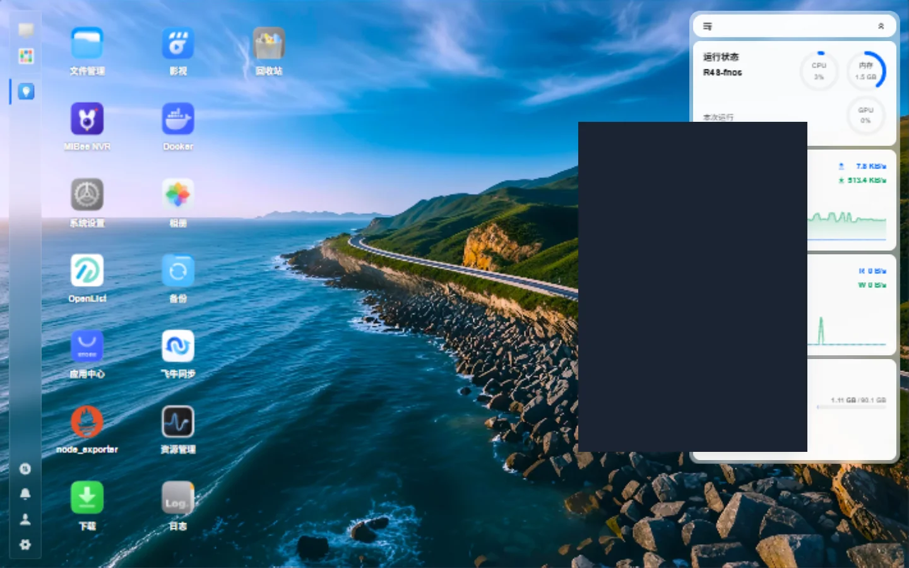
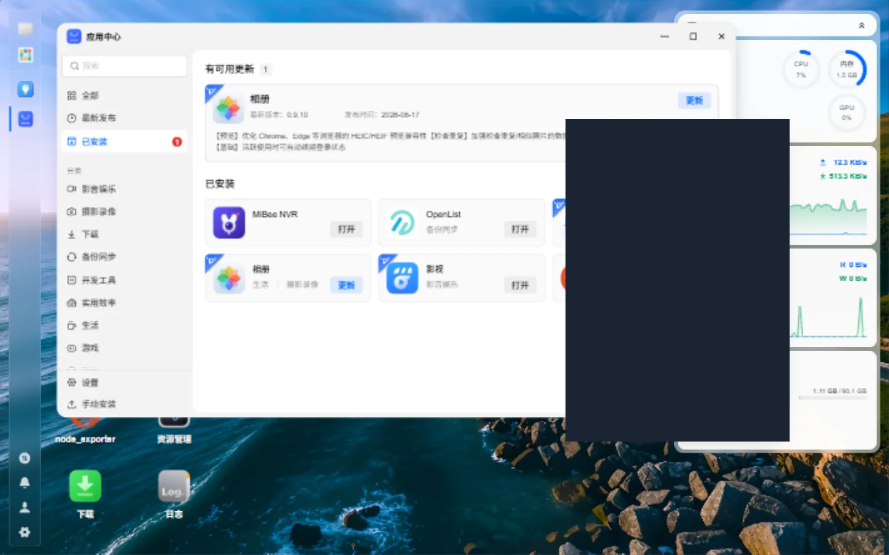

# NAS 部署

> 适用于 MiBeeNvr v0.11.0

MiBee NVR 提供 6 大 NAS 系统的安装支持，通过一键安装脚本或套件管理器完成部署。

## 支持的 NAS 系统

| NAS 系统 | 安装方式 | 说明 |
|----------|----------|------|
| **群晖 DSM 7** | 套件管理器 | 官方社区套件 |
| **威联通 QTS** | App Center | 官方应用 |
| **unRAID** | Docker 模板 | 社区模板 |
| **飞牛 fnOS** | `.fpk` 应用包 / Docker | 应用中心手动安装，支持网关免登录 |
| **OpenMediaVault** | Docker | Docker Compose |
| **TrueNAS** | Apps / Docker | iX 系统集成 |

## 群晖 DSM 7

### 通过套件管理器安装

1. 打开「套件中心」→「设置」→「套件来源」
2. 添加：`https://mibee-nvr.github.io/synology/`
3. 搜索「MiBee NVR」并安装

### 通过 Docker 安装

1. 打开「Container Manager」（DSM 7.2+）
2. 创建项目，选择 `docker-compose.yml`
3. 挂载存储卷到 NAS 共享文件夹

```yaml
services:
  mibee-nvr:
    image: ghcr.io/mi-bee-studio/mibee-nvr:latest
    ports:
      - "9090:9090"
      - "1935:1935"
      - "9000:9000/udp"
      - "2121:2121"
    volumes:
      - /volume1/docker/mibee-nvr:/data
    restart: unless-stopped
```

### 存储建议

| 场景 | RAID 级别 | 说明 |
|------|-----------|------|
| 4 个 1080p 摄像头 | RAID 1 | 每日约 40GB |
| 8 个 4K 摄像头 | RAID 5 | 每日约 200GB |
| 16 个 4K 摄像头 | RAID 6 | 每日约 400GB |

## 威联通 QTS

### 通过 App Center 安装

1. 打开「App Center」
2. 搜索「MiBee NVR」并安装

### 通过 Container Station 安装

1. 打开「Container Station」
2. 导入 Docker Compose 配置
3. 映射 NAS 共享文件夹到容器 `/data`

```yaml
services:
  mibee-nvr:
    image: ghcr.io/mi-bee-studio/mibee-nvr:latest
    ports:
      - "9090:9090"
    volumes:
      - /share/CACHEDEV1_DATA/docker/mibee-nvr:/data
    restart: unless-stopped
```

## unRAID

### 通过 Docker 安装

1. 打开「Docker」页面
2. 点击「添加容器」
3. 选择模板或手动配置

推荐使用社区维护的模板：

```yaml
services:
  mibee-nvr:
    image: ghcr.io/mi-bee-studio/mibee-nvr:latest
    ports:
      - "9090:9090"
      - "1935:1935"
      - "9000:9000/udp"
    volumes:
      - /mnt/user/appdata/mibee-nvr:/data
      - /mnt/user/media/nvr:/recordings
    environment:
      - PUID=99
      - PGID=100
    restart: unless-stopped
```

### 存储池配置

unRAID 用户建议将录像存储在独立的存储池中：

- **Cache Pool**：用于临时缓存和数据库
- **Array**：用于长期录像存储

## 飞牛 fnOS

MiBee NVR 为 fnOS 提供官方 `.fpk` 应用包，在应用中心手动安装即可，全程无需命令行。安装完成后，桌面会出现 MiBee NVR 图标：



### 安装 .fpk 包

每个版本在[发布页](https://github.com/Mi-Bee-Studio/MiBeeNvr/releases)提供两种包：

| | 离线版 `.fpk` | 在线版 `.fpk` |
|---|---|---|
| 体积 | ~150 MB（内置双架构镜像） | ~65 KB |
| 安装时联网 | 不需要（加载内置镜像） | 需要（首次启动拉取） |
| 镜像来源 | 内置 tar | ghcr / 阿里云 ACR 自动择速 |
| 适用 | ghcr 拉取慢或不可达 | 网络通畅、想要小包 |

安装步骤：

1. 从发布页下载 `.fpk` 文件（`mibee-nvr-fnos-<版本>.fpk` 或在线版 `*-online-*.fpk`）
2. fnOS 桌面 →「**应用中心**」→「**手动安装**」，上传 `.fpk`（也可 SSH 执行 `sudo appcenter-cli install-fpk mibee-nvr-fnos-<版本>.fpk`）
3. 按安装向导选择存储卷并启动


安装完成后，应用出现在「已安装」列表，可直接打开或更新：



### 特性说明

- **host 网络**：包内容器使用 host 网络，保证 ONVIF WS-Discovery（UDP 多播 `239.255.255.250:3702`）正常工作。若宿主机 `9090`（Web）或 `2121`（FTP）端口被占用，Web 端口可在 **Web UI → 设置 → 通用 → Web 界面端口** 修改（修改后重启生效），或部署前设置 `NVR_LISTEN_PORT` 环境变量
- **桌面免登录（统一网关 SSO）**：从 fnOS 桌面图标打开 MiBee NVR 时，请求经 fnOS 统一网关鉴权并自动登录，无需再次输入 NVR 密码；直接访问 `http://NAS地址:9090` 仍走 NVR 自身登录
- **数据持久化**：录像、数据库和配置保存在 fnOS 应用数据目录，升级或卸载重装后保留
- **多存储卷**：可在 fnOS 应用设置中为应用授权额外目录，作为第二录像存储位置

### Docker Compose（不使用 .fpk）

偏好自行管理容器时，也可以直接使用 Docker：

```bash
# SSH 登录飞牛 NAS
docker compose -f /path/to/docker-compose.yml up -d
```

```yaml
services:
  mibee-nvr:
    image: ghcr.io/mi-bee-studio/mibee-nvr:latest
    ports:
      - "9090:9090"
    volumes:
      - /vol1/docker/mibee-nvr:/data
    restart: unless-stopped
```

> 注意：bridge 网络下 ONVIF 自动发现不可用（UDP 多播被阻断），需要发现功能时请加 `network_mode: host`。

## OpenMediaVault

### 通过 Docker 部署

1. 安装 OMV 的 Docker 插件
2. 在 Docker 页面创建容器
3. 映射共享文件夹到 `/data`

## TrueNAS

### 通过 Apps 安装

1. 打开「Apps」→「Discover Apps」
2. 搜索「MiBee NVR」
3. 配置存储路径并安装

### 通过 Docker 部署

```yaml
services:
  mibee-nvr:
    image: ghcr.io/mi-bee-studio/mibee-nvr:latest
    ports:
      - "9090:9090"
    volumes:
      - /mnt/pool/docker/mibee-nvr:/data
    restart: unless-stopped
```

## 通用配置

### 环境变量参考

| 变量 | 默认值 | 说明 |
|------|--------|------|
| `NVR_LISTEN_PORT` | `9090` | Web 界面端口 |
| `NVR_DATA_DIR` | `/data` | 数据存储路径 |
| `NVR_PASSWORD` | — | 管理员密码 |
| `NVR_WEBDAV_ENABLED` | `true` | WebDAV 是否启用 |
| `NVR_FTP_ENABLED` | `true` | FTP 是否启用 |
| `NVR_UID` | — | 容器内用户 UID |
| `NVR_GID` | — | 容器内用户 GID |

### 资源建议

| 摄像头数量 | CPU | 内存 | 存储 |
|-----------|-----|------|------|
| 1-4 个 1080p | 双核 | 1GB | 500GB |
| 4-8 个 1080p | 四核 | 2GB | 1TB |
| 8-16 个 4K | 四核+ | 4GB+ | 4TB+ |

### 网络配置

如果摄像头在 Docker 默认网桥之外：

```yaml
services:
  mibee-nvr:
    network_mode: host
```

> **注意**：使用 host 网络模式时端口映射会忽略，直接使用容器内的端口。

## 下一步

- [ONVIF 自动发现](onvif-discovery.md) — 摄像头零配置接入
- [录制与回放](recording-playback.md) — 录像管理
- [WebDAV / FTP 存储](webdav-ftp.md) — 访问录像文件
