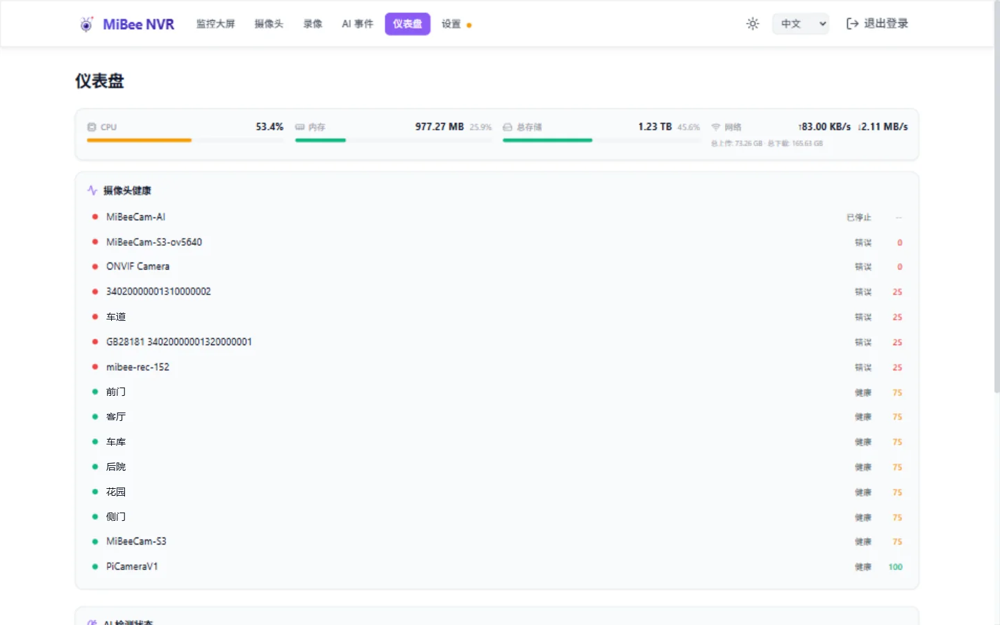
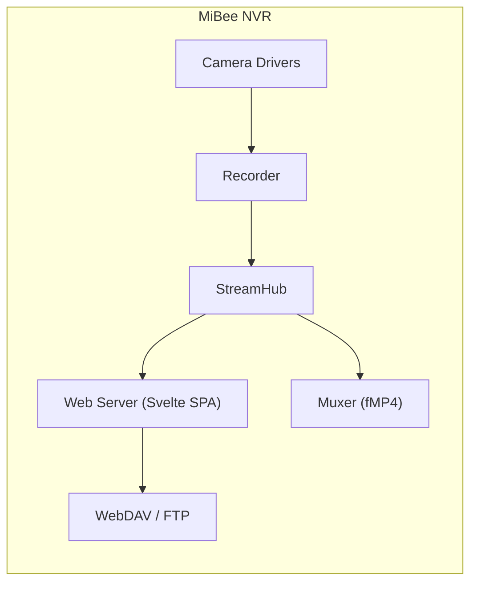

# 产品介绍

> 适用于 MiBeeNvr v0.11.0

MiBee NVR 是一个用 Go 语言编写的轻量级、自托管网络视频录像机（NVR）。它将 IP 摄像头的视频流录制为 MP4 片段并保存到磁盘，提供现代化 Web 界面用于查看录像、管理摄像头和访问录制内容。

## 核心特性

| 特性 | 说明 |
|------|------|
| 单二进制 · 零依赖 | CGO_ENABLED=0 交叉编译，内嵌 Svelte 5 SPA，一个可执行文件 + SQLite 即可运行 |
| 9 种流媒体协议 | RTSP / ONVIF / WebRTC / HTTP-FLV / HLS / RTMP / SRT / WebSocket / GB/T 28181 |
| H.265 全链路 | WASM 软解码直播，纯 HTTP 播放 H.265 无需 HTTPS；录制、回放、延时全面支持 |
| 音频系统 | G.711 / AAC / Opus 录制与实时试听，支持双向对讲 |
| 智能功能 | 浏览器端 AI 检测（ONNX + Web Worker）、延时摄影 v3、硬件转码、MiBeeVision AI |
| 零配置发现 | ONVIF 自动发现 + mDNS / DNS-SD 局域网发现 |
| 推流与分发 | SRT / RTMP 接入，原生 Go 转推直播平台；6 大 NAS 系统一键安装 |
| 集成生态 | MQTT 事件、WebDAV / FTP 存储、Prometheus 指标、PWA 离线 |

## 架构概览

**核心设计原则：**

- **推流接入（Push-In）**：远端推流者将流推入 NVR（SRT / RTMP），无需 NVR 主动连接摄像头
- **推流转发（Push-Out）**：NVR 将摄像头直播流转发到远端目标（RTMP / RTSP），纯 Go 实现
- **StreamHub 帧总线**：所有协议共享同一个帧扇出总线，录制 / 直播 / 转发互不干扰
- **SQLite 存储**：录像元数据、摄像头配置、延时摄影合并记录全部存入单文件数据库

## 支持的摄像头

| 类型 | 协议 | 说明 |
|------|------|------|
| RTSP H.264 / H.265 | rtsp | 主流 IP 摄像头（海康、大华、宇视等） |
| ONVIF | onvif | 零配置发现 + 自动编码检测 |
| MJPEG | rtsp | 低分辨率摄像头 |
| HTTP JPEG | http | 定时快照摄像头 |
| 小米 | xiaomi | C200 / C300 / 双镜头 TUTK P2P |
| GB/T 28181 | gb28181 | 国标安防协议（实验性） |
| SRT / RTMP | srt / rtmp | 推流接入，跨网络摄像头 |
| 延时摄影 | timelapse | 独立延时摄影模式 |

> **品牌兼容性**：参阅[摄像头品牌兼容指南](https://raw.githubusercontent.com/Mi-Bee-Studio/MiBeeNvr/main/docs/zh/camera-guide.md)获取海康、大华、宇视、Axis、Reolink 等 20+ 品牌的详细配置。

## 为什么选择 MiBee NVR

| 对比项 | MiBee NVR | 商业 NVR |
|--------|-----------|----------|
| 部署方式 | 单二进制 / Docker / NAS 一键包 | 专用硬件或封闭软件 |
| 协议支持 | 9 种（含 GB/T 28181） | 通常 2-3 种 |
| H.265 播放 | 浏览器 WASM 直播播放 | 需要专用客户端 |
| 音频 | G.711 / AAC / Opus 双向对讲 | 通常仅录制 |
| 集成 | MQTT / WebDAV / FTP / Prometheus | 有限或私有 |
| 授权 | AGPL-3.0（≤v0.10.1 永久 MIT） | 商业授权 |
| 源码 | 完全开源 | 闭源 |

## 许可证

MiBee Nvr v0.11.0 采用 **AGPL-3.0** 开源许可证。

> **重要**：所有 ≤v0.10.1 版本永久使用 **MIT** 许可证。MIT 许可证覆盖这些版本发布的所有源代码，包括在 AGPL 版本中沿用的 MIT 代码。

## 获取帮助

- **GitHub Issues**：[MiBeeNvr Issues](https://github.com/Mi-Bee-Studio/MiBeeNvr/issues)
- **讨论区**：[MiBeeNvr Discussions](https://github.com/Mi-Bee-Studio/MiBeeNvr/discussions)
- **升级指南**：[升级指南](upgrade-faq.md)
