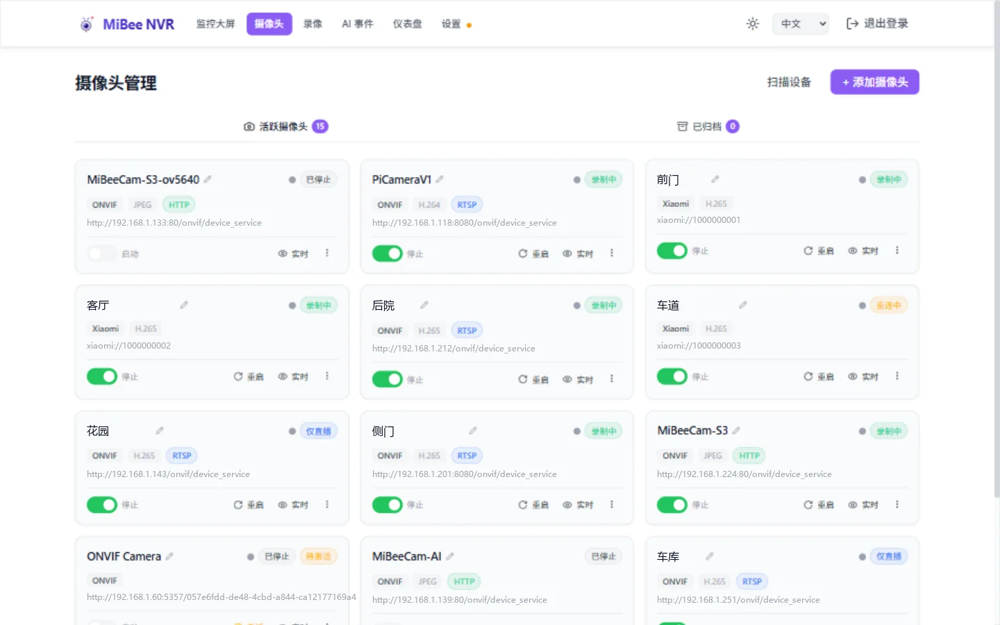
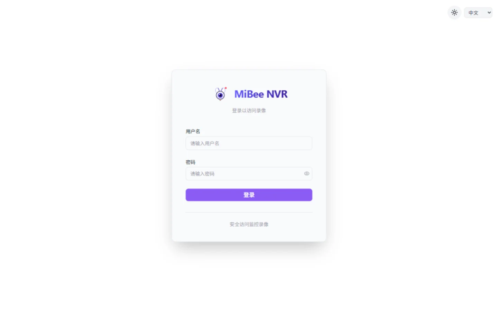

# 快速开始

> 适用于 MiBeeNvr v0.11.0

5 分钟内启动并录制第一个摄像头。

## 方式一：下载预编译二进制文件

从 [GitHub Releases](https://github.com/Mi-Bee-Studio/MiBeeNvr/releases) 下载对应架构的最新版本：

```bash
# AMD64（大多数 PC/服务器）
wget https://github.com/Mi-Bee-Studio/MiBeeNvr/releases/latest/download/mibee-nvr-amd64
chmod +x mibee-nvr-amd64

# ARM64（树莓派等）
wget https://github.com/Mi-Bee-Studio/MiBeeNvr/releases/latest/download/mibee-nvr-arm64
chmod +x mibee-nvr-arm64
```

初始化配置并启动：

```bash
./mibee-nvr-amd64 init --password 你的密码
./mibee-nvr-amd64 -config mibee-nvr.yaml
```

在浏览器打开 `http://localhost:9090`。

## 方式二：Docker

```bash
docker compose --project-directory . \
  -f deploy/docker/docker-compose.yml up -d
```

在浏览器打开 `http://localhost:9090`。

> 无需准备配置文件！MiBeeNVR 在没有配置文件的情况下启动时会自动初始化。

### 修改录像存储位置

默认录像存储在宿主机的 `./data` 目录。如需外部硬盘：

```yaml
volumes:
  - /mnt/external/nvr:/data    # ← 改为你的宿主机路径
environment:
  - NVR_DATA_DIR=/data          # 必须与卷挂载的右侧一致
  # - NVR_UID=1000               # 与宿主机目录所有者 UID 一致
  # - NVR_GID=1000               # 与宿主机目录所有者 GID 一致
```

> **重要**：卷挂载的右侧（`:data`）和 `NVR_DATA_DIR` 必须始终一致。如果容器无法启动，请检查宿主机目录是否存在，以及配置的 UID/GID 是否有写入权限。

## 方式三：一键安装脚本

```bash
curl -fsSL https://raw.githubusercontent.com/Mi-Bee-Studio/MiBeeNvr/main/install.sh | sudo bash
```

自动下载二进制文件、创建系统用户（`nvr`）、生成配置、安装 systemd 服务并启动。数据目录：`/var/lib/mibee-nvr`。

卸载（保留录像数据）：

```bash
curl -fsSL https://raw.githubusercontent.com/Mi-Bee-Studio/MiBeeNvr/main/install.sh | sudo bash -s -- --uninstall
```

## 方式四：从源码编译

需要 Go 1.26+ 和 Node.js：

```bash
git clone https://github.com/Mi-Bee-Studio/MiBeeNvr.git
cd MiBeeNvr
make build
./mibee-nvr init --password 你的密码
./mibee-nvr -config mibee-nvr.yaml
```

交叉编译到 ARM64：

```bash
make cross
```

## 首次配置

### 使用 init 子命令

```bash
./mibee-nvr init --password 你的密码
```

| 参数 | 默认值 | 说明 |
|------|--------|------|
| `--password` | （交互输入） | Web UI 管理员密码 |
| `--username` | `admin` | 管理员用户名 |
| `--data-dir` | `/var/lib/mibee-nvr` | 录像和数据库的数据目录 |
| `--listen` | `:9090` | HTTP 监听地址 |
| `--config` | `mibee-nvr.yaml` | 配置文件路径 |
| `--force` | false | 覆盖已有配置文件 |

### 密码设置方式

1. **init 命令**（推荐）：`mibee-nvr init --password <密码>`
2. **配置文件明文**：在 YAML 中设 `auth.password`，首次启动自动哈希
3. **手动生成哈希**：`mibee-nvr hash-password <密码>` → 粘贴到 `auth.password_hash`

> 完整命令行用法（init / hash-password / health / cleanup / repair 等 8 个子命令）见 [CLI 用户手册](cli.md)。

## 添加第一个摄像头

MiBee NVR 使用**独立的传输协议 + 编码格式**配置：

- **传输协议**：`rtsp`、`http`、`onvif`、`xiaomi`、`timelapse`
- **编码格式**：`h264`、`h265`、`mjpeg`、`jpeg`

所有摄像头都在「摄像头」页管理：点击「**扫描设备**」可自动发现局域网内的 ONVIF / 小米摄像头，点击「**+ 添加摄像头**」手动添加；每张卡片可以启停、重启、查看实时画面。



### RTSP H.264 摄像头

```yaml
cameras:
  - id: "front-door"
    name: "前门"
    protocol: "rtsp"
    encoding: "h264"
    url: "rtsp://192.168.1.100:554/stream"
    enabled: true
```

### RTSP H.265 摄像头

```yaml
cameras:
  - id: "driveway"
    name: "车道"
    protocol: "rtsp"
    encoding: "h265"
    url: "rtsp://192.168.1.103:554/stream"
    enabled: true
```

### ONVIF 摄像头

```yaml
cameras:
  - id: "lobby"
    name: "大厅"
    protocol: "onvif"
    url: "http://192.168.1.104:80/onvif/device_service"
    username: "admin"
    password: "camera123"
    enabled: true
```

> ONVIF 会自动检测编码格式，可以省略 `encoding` 字段。

> **0.10.0+ 不再接受组合格式**（如 `rtsp_h264`）。请拆分为独立的 `protocol` + `encoding` 字段。

## 访问 MiBee NVR

### Web 管理界面

浏览器打开 `http://你的服务器地址:9090`，使用配置的凭据登录。



功能：
- **监控大屏**：查看摄像头实时画面（WebCodecs / MJPEG 多宫格，支持 HLS、WebRTC、HTTP-FLV、WebSocket 播放）
- **摄像头**：扫描发现、添加、编辑和启停摄像头
- **录像**：时间轴 + 列表两种视图，回放和下载录像
- **AI 事件**：查看 AI 检测事件
- **仪表盘**：查看存储统计和趋势
- **设置**：存储、直播、GB28181、AI 检测等系统配置


### WebDAV

默认启用（只读模式），访问路径 `/dav/`：

```bash
curl -u admin:密码 http://你的服务器地址:9090/dav/
```

在文件管理器中挂载：`davs://你的服务器地址:9090/dav/`

### FTP

默认启用，端口 2121：

```bash
ftp 你的服务器地址 2121
# 用户名：admin
# 密码：（你设置的密码）
```

## 常见问题

### 服务无法启动

```bash
# 检查配置文件
cat mibee-nvr.yaml

# 确认数据目录可写
ls -la /var/lib/mibee-nvr/

# 查看日志
journalctl -u mibee-nvr -f
```

### 端口冲突

默认端口 9090。修改方式（按优先级）：
1. 环境变量 `NVR_LISTEN_PORT=8080`
2. `install.sh --port 8080`
3. 配置文件 `server.listen: ":8080"`
4. Web UI 设置页（设置 → 通用 → Web 界面端口，修改后需重启服务生效）


### 无法连接摄像头

```bash
# 验证摄像头 URL
ffplay rtsp://192.168.1.100:554/stream

# 检查网络连通性
ping 192.168.1.100
```

### 树莓派内存占用过高

- `segment_duration` 设为 `30s`
- RPi 3B 约 900MB 内存，4 个摄像头 30 秒片段时稳定约占 300MB

## 下一步

- [Docker 部署](install-docker.md) — 生产环境部署
- [CLI 用户手册](cli.md) — 命令行管理工具
- [配置参考](config.md) — YAML 顶层键速查
- [NAS 部署](install-nas.md) — 群晖 / 威联通 / unRAID / 飞牛
- [ONVIF 自动发现](onvif-discovery.md) — 零配置接入摄像头
- [录制与回放](recording-playback.md) — 录像管理
