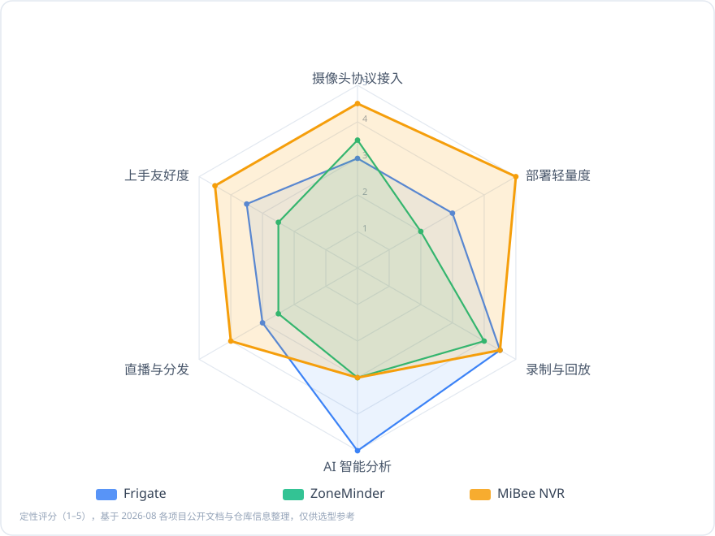
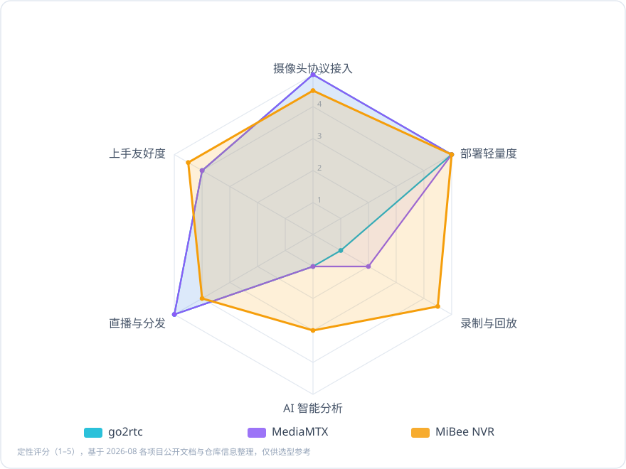

# 同类方案对比

> 评分为基于 2026-08 各项目公开文档与仓库信息的**定性评估**，仅供选型参考。所有对比项目都是值得尊敬的开源作品，本文目标是帮你找到**适合自己**的那一个。

## 先说结论

- **想要"一台旧设备 + 几个摄像头"的最轻方案**，且看重中文界面、小米摄像头、GB/T 28181、音频、延时摄影这些"非典型"能力 → **MiBee NVR** 是为这个场景设计的
- **想要服务器端实时 AI 事件录像**（AI 判定后自动保存事件片段、与 Home Assistant 深度联动）→ **Frigate** 在这个领域无可争议地最强，MiBee 的 AI 目前在浏览器端、偏辅助观看
- **只想要一个流媒体服务器**（协议转换、大规模分发、无 NVR 界面）→ **MediaMTX** 或 **go2rtc** 更纯粹
- **需要 Windows 桌面软件或商业支持** → **Blue Iris**（闭源付费）等商业方案更合适

## 对比对象与定位

| 项目 | 定位 | 技术栈 | 部署形态 | 许可证 | GitHub Stars\* |
|------|------|--------|----------|--------|---------------|
| **MiBee NVR** | 轻量自托管 NVR | Go + 内嵌 Svelte SPA | 单二进制 / Docker / 6 大 NAS 商店 | AGPL-3.0（≤v0.10.1 永久 MIT） | 95 |
| [Frigate](https://github.com/blakeblackshear/frigate) | AI 优先的开源 NVR | Python + Docker | Docker（推荐 Coral/硬解） | MIT | 35k |
| [ZoneMinder](https://github.com/ZoneMinder/zoneminder) | 老牌开源 NVR/CCTV | PHP + MySQL（LAMP） | 包管理器 / Docker | GPL-2.0 | 5.9k |
| [go2rtc](https://github.com/AlexxIT/go2rtc) | 流媒体"瑞士军刀" | Go | 单二进制 | MIT | 14k |
| [MediaMTX](https://github.com/bluenviron/mediamtx) | 流媒体服务器 | Go | 单二进制 | MIT | 19.9k |

\* Stars 为 2026-08 快照。其他同类项目（Shinobi、iSpy/Agent DVR 等）同样值得了解。

**类别说明**：go2rtc 与 MediaMTX 严格说是**流媒体服务器**而非 NVR——它们回答"流怎么转、怎么分发"，不回答"录像怎么管、怎么回放"。放在这里对比是因为选型时经常一起出现。

## 综合能力雷达图

*图 1：与全功能开源 NVR 的定性对比（1–5 分）。三个项目侧重不同：Frigate 深耕 AI，ZoneMinder 胜在多年成熟，MiBee NVR 主打轻量与协议广度。*

*图 2：与轻量级流媒体服务器的定性对比。go2rtc / MediaMTX 在协议矩阵与分发上是天花板，但没有录像管理、回放界面与 NVR 语义。*

## 能力矩阵

| 能力 | MiBee NVR | Frigate | ZoneMinder | go2rtc | MediaMTX |
|------|:---------:|:-------:|:----------:|:------:|:--------:|
| RTSP 接入 | ✅ | ✅ | ✅ | ✅ | ✅ |
| ONVIF 发现 / PTZ | ✅ | ⚠️ 有限 | ⚠️ 有限 | ❌ | ❌ |
| 小米摄像头免云接入 | ✅ | ❌ | ❌ | ⚠️ 部分 | ❌ |
| GB/T 28181 | ✅ 实验性 | ❌ | ❌ | ❌ | ❌ |
| SRT / RTMP / WHIP 推流接入 | ✅ | ⚠️ | ⚠️ | ✅ | ✅ |
| MP4 录像 + 保留策略 | ✅ | ✅ | ✅ | ❌ | ⚠️ 仅分段 |
| 全天连续回放时间轴 | ✅ | ✅ | ⚠️ | ❌ | ❌ |
| 音频录制（AAC/G.711/Opus） | ✅ | ⚠️ | ⚠️ | ⚠️ 转发 | ⚠️ 转发 |
| 浏览器端 AI 检测 | ✅ | ❌（AI 在服务端） | ❌ | ❌ | ❌ |
| 服务端实时 AI 事件录像 | ❌ | ✅ 最强 | ⚠️ 插件 | ❌ | ❌ |
| 延时摄影 | ✅ | ❌ | ❌ | ❌ | ❌ |
| 直播转推（RTMP/RTSP 出） | ✅ | ⚠️ 借助 go2rtc | ❌ | ✅ | ✅ |
| WebRTC 低延迟观看 | ✅ | ✅ | ❌ | ✅ | ✅ |
| H.265 浏览器直播（纯 HTTP） | ✅ WASM | ❌ | ❌ | ⚠️ 部分 | ❌ |
| NAS 一键商店包 | ✅ 6 家 | ⚠️ 社区 | ⚠️ | ❌ | ❌ |
| 中文界面 / 中文文档 | ✅ | ❌ | ❌ | ❌ | ❌ |
| 运行依赖 | 无（FFmpeg 可选） | Docker + 建议 Coral | LAMP 栈 | 无 | 无 |

## 逐项说明

### 协议与接入

MiBee NVR 的差异化在**广度**：RTSP / ONVIF / 小米 / GB/T 28181 / SRT / RTMP / WHIP 推流接入 / HTTP-JPEG，几乎覆盖家庭与小型项目能遇到的所有摄像头形态。go2rtc 与 MediaMTX 的协议矩阵同样极广（且含 QUIC 等我们不支持的传输），但它们不管理录像生命周期。Frigate 与 ZoneMinder 以 RTSP 为主，ONVIF 支持有限。

### 录制与回放

MiBee NVR 提供 MP4 分段 + 滚动合并 + 按摄像头保留策略 + 全天时间轴回放 + 延时摄影，录像语义完整。Frigate 的事件驱动片段 + 持续录像 + 秒级 review 界面是同类最佳体验之一。ZoneMinder 事件体系成熟但界面年代感较重。

### AI 能力

**这是 MiBee NVR 当前最诚实的短板**：AI 推理在浏览器端（ONNX Runtime Web），服务端没有"AI 判定 → 自动事件录像"链路。它的优势是不占服务器资源、旧设备也能用、多人观看多人共享算力；但如果你需要 7×24 无人值守的服务端 AI 事件录像，Frigate（配合 Coral TPU）是更对的选择。

### 资源占用与部署

MiBee NVR 的设计基准是 1GB 内存的低端 ARM 板（512MB 进程内存上限）——单静态二进制、零外部依赖、SQLite 单文件。go2rtc / MediaMTX 同样是 Go 单二进制，轻量性三者相当。Frigate 需要 Docker 且 AI 推理建议硬件加速（Coral / 核显 / Jetson），基础占用更高。ZoneMinder 的 PHP + MySQL 栈在低配设备上压力最大。

### 生态与集成

Frigate 与 Home Assistant 的集成深度是护城河；ZoneMinder 历史悠久、教程多。MiBee NVR 提供 MQTT / WebDAV / FTP / Prometheus / REST API + API Key，走的是"标准接口、轻集成"路线；中文界面与中文文档是另一个显著差异点。

## 什么时候应该选择其他方案

我们乐意看到你选对工具，即使它不是 MiBee NVR：

- **要服务端 7×24 AI 事件录像、有 Home Assistant** → Frigate
- **要做流媒体服务器 / 大规模分发 / WebRTC SFU** → MediaMTX（单机分发最强）或 go2rtc（协议转换之王）
- **要在 Windows 上装个软件就用、愿意付费** → Blue Iris 等商业软件
- **需要企业级 VMS（上百路、权限矩阵、报警联动平台）** → 商业 VMS（如 Milestone）或商业 NVR

反过来，如果你符合下面的画像，欢迎试试 MiBee NVR：

- 手头有一台 NAS / 树莓派 / 小主机，想**今天就跑起来**
- 家里有**小米摄像头**想脱离云订阅，或有**国标设备**要接
- 在意**音频、延时摄影、中文界面**这些细节
- 不想维护数据库、消息队列、容器编排——一个二进制的事

## 评分方法与更新

雷达图与矩阵为定性评分（1–5），依据 2026-08 各项目 README / 官方文档 / 仓库公开信息整理。开源项目迭代都很快，如发现评分过时或事实错误，欢迎[提交 issue](https://github.com/Mi-Bee-Studio/MiBeeNvr/issues) 指正，我们会及时更新。
