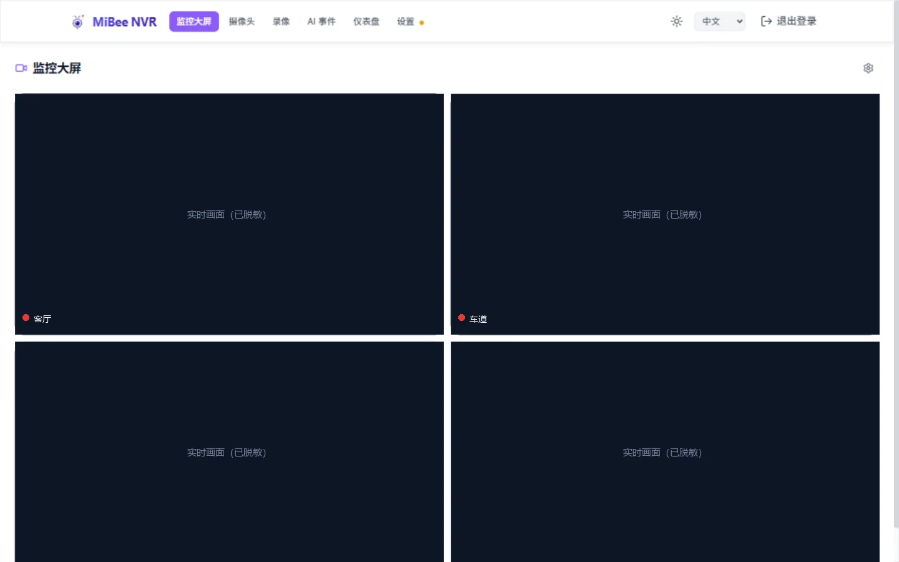
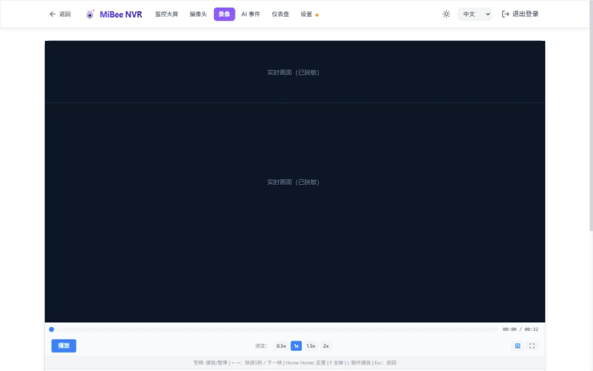
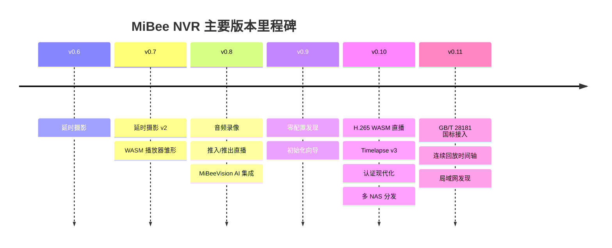

# 功能总览

> 适用于 MiBeeNvr v0.11.0（2026-08 发布）

一页看全 MiBee NVR 的全部能力。每一节都附上对应的专题文档链接——本文是地图，细节请进对应的"景点"。

## 摄像头接入

| 接入方式 | 适用设备 | 亮点 |
|----------|----------|------|
| RTSP | 海康、大华、宇视等主流 IP 摄像头 | H.264 / H.265 / MJPEG，子码流，自动重连 |
| ONVIF | 支持 ONVIF 协议的摄像头 | 自动发现 + 自动编码检测 + PTZ 云台控制 |
| 小米摄像头 | C200 / C300 / 双镜头等 | 免云订阅本地录像，CS2 + 7 款 TUTK 老型号 |
| GB/T 28181 | 国标 SIP 设备/平台（实验性） | 注册、目录、PTZ、对讲、报警订阅、下级级联 |
| SRT / RTMP 推流接入 | 异地/跨网络摄像头 | 摄像头主动推流到 NVR，无需 NVR 反向连接 |
| WebRTC (WHIP) | 浏览器 / 手机 / OBS | 一条 URL 即可把任意设备变成监控源（H.264 + Opus） |
| HTTP JPEG / MJPEG | ESP32 等低功耗自制摄像头 | 快照流与 MJPEG 流，搭配 MiBeeCam 固件 |
| 树莓派摄像头 | USB / CSI 摄像头 | 通过 RTSP 服务（rpi-cam）接入 |

零配置发现：ONVIF WS-Discovery 自动扫描 + mDNS/DNS-SD 局域网服务通告 + UDP 广播应答——同一网络内打开网页就能看到 NVR 和摄像头。

## 直播观看（9 种协议）

| 协议 | 延迟 | 适用场景 |
|------|------|----------|
| WebRTC (WHEP) | 亚秒级 | 手机 / 平板实时看家，G.711 与 Opus 音频零转码直入 |
| WebSocket | ~0.5s | 通用低延迟，WASM 解码管线 |
| HTTP-FLV | 1–3s | 浏览器友好，长观看 |
| HLS / LL-HLS | 2–5s | 兼容性优先，iOS 原生支持 |
| WASM 播放器 | ~1s | **纯 HTTP 播放 H.265**，无需 HTTPS 与专用客户端 |

- **H.265 全链路**：直播（WASM 软解 / WebCodecs 硬解自动择优）、录制、回放、延时摄影全面支持 H.265
- 前端按设备能力自动选择最优协议（WebCodecs → WebGPU → WASM 逐级回退），无需手动配置
- MJPEG / JPEG 摄像头有专属播放器（最新帧轮询 + ETag 304 省流）

## 录制与回放

- **MP4 分段录制**：IDR 对齐起段（不黑屏）、音频同步混入（AAC / G.711 / Opus）、原子写入防崩溃损坏
- **连续回放时间轴**：双缓冲无缝换段（无黑屏闪烁）+ 全天 VOD 时间轴——跨录像、跨空隙一拖到底
- **滚动合并**：录像片段按策略自动合并为大文件，流式处理（1MB 缓冲），不吃内存
- **保留策略**：按摄像头设置保留天数 + 磁盘水位自动清理，AI 标记的录像受保护不被清理
- **AVI 帧浏览**：旧容器录像可逐帧拖动查看
- **延时摄影 v3**：独立延时模式 or 从录像抽帧，自然日 / 1h / 8h / 24h / 7d / 30d 窗口自动合并，合并结果入库可检索

## GB/T 28181 国标接入（实验性）

SIP 摄像头/平台直接 REGISTER 到 NVR，以普通摄像头形式出现在界面里：

- 设备注册 + Digest 鉴权、目录查询、通道自动入册
- PTZ 方向/变倍/预置位、语音对讲、校时
- 报警 / 目录 / 移动位置订阅推送，报警联动
- 设备侧录像检索（RecordInfo）+ 回放取流（倍速/拖动）
- **下级级联**：NVR 作为下级平台注册到上级，转发目录/报警，上级可点播 NVR 本地录像

> 默认关闭，不开启无任何影响。详见 [GB/T 28181 指南](gb28181.md)。

## 智能功能

- **浏览器端 AI 检测**：ONNX Runtime Web（WebGPU → WASM SIMD 回退），YOLO11 模型在浏览器推理——服务器零负载，老旧 NVR 主机也能跑
- **ROI 区域**：划出入口/通道等关键区域，只对区域内目标报警；置信度、跳帧率、类别过滤全可调（见 [AI 调参指南](ai-detection.md)）
- **MiBeeVision 集成**：可接入外部 AI 后端，NVR 主动推送录像段、掉线自动补偿重推
- **健康监控**：多层级摄像头健康检测、自动补救、掉线黑名单、IP 漂移自愈（按 ONVIF 序列号重新发现）
- **SSE 实时事件**：摄像头状态、健康事件、录像段完成全部实时推送

## 推流与分发

- **直播转推**：把任意摄像头直播流转推到 B 站 / YouTube / 斗鱼 / SRS 等 RTMP / RTSP 目标——原生 Go 实现，FFmpeg 仅作兼容兜底
- **推流接入**：SRT / RTMP / WebRTC WHIP 三种入流方式，异地摄像头跨网络回传
- **协议转出**：同一帧总线同时供给录制 / 直播 / 转推，互不干扰

## 音频系统

- 录制：AAC / G.711（μ-law、A-law）/ Opus 全部落入 MP4 音轨
- 直播试听：G.711 与 Opus 实时解码播放，AAC 走 WebCodecs
- **双向对讲**：按住说话对摄像头喊话（小米 CS2 机型）

## 存储与集成

- **SQLite（WAL 模式）**：单文件数据库存全部元数据，为 SD 卡调优（NORMAL 同步 + 忙等待），零外部数据库依赖
- **WebDAV 服务器**：浏览器直接访问录像库（可配置只读/读写）
- **FTP 服务器**：远程上传 + 支持摄像头自动注册（摄像头填 FTP 地址即完成接入）
- **MQTT 集成**：事件发布 + 触发式录像（家庭自动化联动）
- **Prometheus 指标**：300+ 指标族，`/api/metrics` 抓取
- **REST API**：全部功能可编程，支持 API Key（`mbv_` 前缀）与 BasicAuth 双认证

## 部署与分发

| 方式 | 说明 |
|------|------|
| 一键脚本 | `curl … install.sh \| sudo bash`——装二进制、建系统用户、配 systemd、启动 |
| 预编译二进制 | amd64 / arm64 / armv7 三架构，GitHub Releases 下载 |
| Docker | `ghcr.io/mi-bee-studio/mibeenvr` + 阿里云镜像（国内拉取提速），多架构 manifest |
| NAS 商店 | 飞牛 fnOS（离线 + 在线双包）、群晖、威联通、极空间、unRAID、iStoreOS、zSpace |
| systemd / 裸跑 | 单二进制 + 一个 YAML 配置文件即是全部 |

## Web 界面

- 现代化 Svelte 5 SPA，**中文 / English 双语**，明暗双主题，PWA 可安装
- 初始化向导（首次 3 分钟配完）、仪表盘、监控大屏、录像库、延时摄影、AI 事件、健康页、统计页
- **摄像头状态链路诊断**：仪表盘逐相机展开链路树（采集源 → 分发中枢 → 录像落盘 / 直播观看 / 健康检测 / 转发），状态一目了然——绿色 = 活跃、灰色 = 空闲、橙色 = 异常（如标记录制但无帧流入）、红色 = 严重丢帧；附健康评分扣分因素（中文人话解释）与该相机存储占用
- 全功能响应式，手机浏览器体验完整（无阉割）

## 版本演进

## 资源基准与约束

设计基准是**低端 ARM 设备**（1GB 内存、Cortex-A53 级），并以此保守取值：

| 项目 | 基准 |
|------|------|
| 进程内存上限 | 512MB |
| 并发 HLS 流 | ≤ 4 路 |
| 录像分段时长 | ≤ 30s |
| 运行依赖 | 无（FFmpeg 可选，仅 H.265↔H.264 转码需要） |
| 数据库 | SQLite 单文件（WAL） |

## 下一步

- 想快速上手：[快速开始](quickstart.md)
- 想看真实使用场景：[场景玩法指引](scenarios.md)
- 正在选型对比：[同类方案对比](comparison.md)
